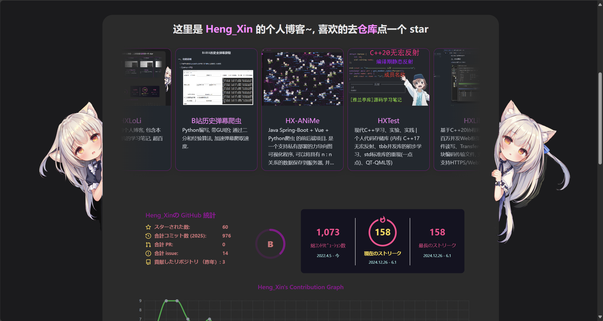

<h1 align="center">HXLoLi</h1>

<!-- HXLoLi: Heng_Xin Loli Optimizes Loli Iteratively -->

<h3 align="center">マスコット: <ruby>最后之作<rt>「Last Order」</rt></ruby></h3>

## 一、简介

这个是 Heng_Xin 的个人博客. 喜欢的可以点点 star ⭐~

## 二、功能亮点

### 2.1 Anime - 番剧追番记录

集成 [Bangumi](https://bgm.tv/) 数据, 展示个人追番记录与详细信息。

- **追番列表**: 按观看状态 (想看/在看/看过/搁置/抛弃) 分类浏览, 支持按评分、放送日期等多种排序
- **番剧详情**: 查看完整简介、角色信息、声优信息、剧集列表及关联作品
- **声优页面**: 浏览声优简介及其出演的角色列表
- **关系图谱**: 通过力导向图可视化番剧之间的角色与声优关联关系

> 数据通过 Python 脚本从 Bangumi API 抓取并存储为 JSON, 前端通过 jsDelivr CDN 加载. (更新日志: ([#17](https://github.com/HengXin666/HXLoLi/issues/17)))

### 2.2 Music - 音乐播放器

内置全局音乐播放器, 支持在浏览博客的同时享受音乐。

- **全局播放控制**: 导航栏集成播放按钮, 展开面板即可操作
- **ASS 歌词渲染**: 使用 [SubtitlesOctopus (HX)](https://github.com/HengXin666/JavascriptSubtitlesOctopus) 在 Canvas 上渲染 ASS 格式字幕歌词, 支持丰富的特效与字体; 个人 fork 二次开发, 以支持 VX
- **多种播放模式**: 支持顺序播放、单曲循环、随机播放
- **跨标签页同步**: 使用 BroadcastChannel 实现多标签页播放状态同步, 避免重复播放
- **独立资源仓库**: 音乐资源托管在 [HXLoLi-Music](https://github.com/HengXin666/HXLoLi-Music) 仓库, 通过 jsDelivr CDN 加载, CI/CD 自动生成播放列表

> 更新日志 ([#47](https://github.com/HengXin666/HXLoLi/issues/47))

## 三、联系我们

如果您有任何问题或建议, 欢迎通过 [Issues](https://github.com/HengXin666/HXLoLi/issues) 反馈.

## 四、许可证

[Apache-2.0](./LICENSE)

## 五、相关依赖
### 5.1 依赖组件

| 功能 | 描述 | 依赖 |
|:-:|:-:|:-:|
| **Docusaurus** | 利用React的静态网站生成器 | [Docusaurus-v3.7](https://github.com/facebook/docusaurus/releases/tag/v3.7.0) (**不支持**更高版本!) |
| **可编辑代码块** | 集成 Monaco Editor, 使得代码块可编辑 | [Monaco Editor (0.52.2)](https://github.com/Microsoft/monaco-editor)   [react-monaco-editor (0.58.0)](https://github.com/react-monaco-editor/react-monaco-editor)   [@monaco-editor/react (4.7.0)](https://github.com/suren-atoyan/monaco-react) |
| **OneDark-Pro 主题** | 为代码块集成 OneDark-Pro 主题 | [OneDark-Pro](https://github.com/Binaryify/OneDark-Pro) |
| **Draw.io 预览**| React 编写的 Draw.io 网页端支持 | [react-drawio (1.0.4)](https://github.com/marcveens/react-drawio) |
| **Remark Github Alert 插件** | GitHub 风格的 remark 警报 | [remark-github-alerts (0.1.1)](https://github.com/hyoban/remark-github-alerts) |
| **数学渲染 KaTeX** | 使用 KaTeX 渲染数学公式 | [rehype-katex (7.0.1)](https://github.com/remarkjs/remark-math/tree/main/packages/rehype-katex)   [remark-math (6.0.0)](https://github.com/remarkjs/remark-math) |
| **文档关系图** | 生成 Docusaurus 文档之间的关系图 | [docusaurus-graph (2.0.0)](https://github.com/Arsero/docusaurus-graph) |
| **评论功能** | 基于 Giscus 添加评论功能 | [@giscus/react (3.1.0)](https://github.com/giscus/giscus-component) |
| **文件夹和 markdown 图标** | 使用 vscode-icons 提供的文件夹和 markdown 图标   (仅使用了`文件夹`和`markdown`图标) | [vscode-icons](https://github.com/vscode-icons/vscode-icons) |
| **tailwindcss** | 只需书写 HTML 代码, 无需书写 CSS 的   一个实用程序优先的 CSS 框架   用于快速构建自定义用户界面 | [tailwindlabs (3.4)](https://github.com/tailwindlabs/tailwindcss) |
| **站内搜索** | 支持站内中文搜索 | [@easyops-cn/docusaurus-search-local (0.49.2)](https://github.com/easyops-cn/docusaurus-search-local) |

> 以上内容, 排名不分先后. 还有很多依赖, 没有列出来, **感谢所有的开源项目及项目维护者**!

### 5.2 环境依赖

| 依赖环境 | 版本 | 备注 |
|:-:|:-:|:-:|
| **Docusaurus** | 3.7 | [Docusaurus](https://github.com/facebook/docusaurus/) |
| **NodeJs** | 18 | [nodejs](https://nodejs.org/zh-cn/) |
| **npm** | 10.7.0 (本地环境) | [npm](https://www.npmjs.com/) |
| **React** | ^19.2.3 | [React](https://react.dev/) |
| **TypeScript** | ~5.6.2 | [TypeScript](https://www.typescriptlang.org/) |

## 六、本地使用

如果你需要在本地运行, 需要:

1. `npm i` 安装依赖

2. `./run.sh` (Linux) 或者 `.\run` (win)

3. 打开 http://localhost:3000/HXLoLi/

如果需要推送, 请使用 `./push.sh "msg"` (Linux) 或者 `.\push "msg"` (win)

## 七、特别感谢

感谢以下每一位赞助者, 是你们让 HXLoLi 变得更好!

|时间|渠道|名称|备注|
|:-:|:-:|:-:|:-|
|26-01-04 16:14:56|微信|`*双`|谢谢学长悉心指点🌹, 受益匪浅～|
