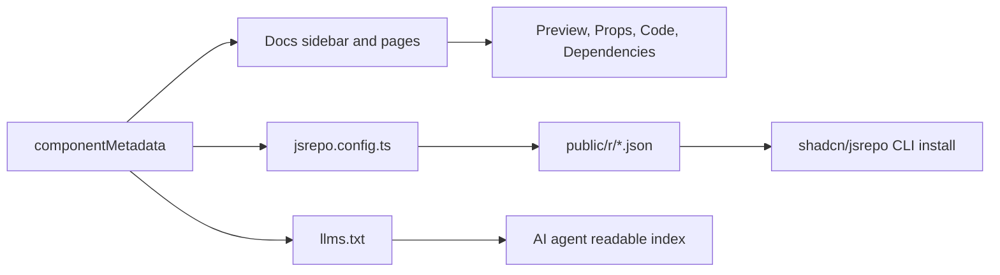

# react-bits 分门别类学习

> [!NOTE]
>
> 一个动效组件库值得学的地方, 通常不在于它提供了哪些效果, 而在于它怎么让 134 个组件各自被找得到、装得上、换得掉. 如果换成你来组织一份「可复制源码」的组件集合, 会用一份元数据表同时驱动文档、registry 和 AI 索引, 还是给四种技术栈各维护一套?

[PPT #ppt](overview-ppt.html) — react-bits 分类地图、依赖成本与落地路径总览.

## 0x00 背景

`react-bits` 是一个面向 React 的动效组件源码库, 不是传统意义上 `npm install` 后直接 import 的运行时组件库. 它的核心价值是把一批视觉表达强、可复制、可按技术栈选择的组件组织成注册表, 再通过文档站、预览、代码面板、shadcn/jsrepo CLI 和 MCP 使用流串起来.

本次学习基于 GitHub 仓库当前快照:

- 仓库: [DavidHDev/react-bits](https://github.com/DavidHDev/react-bits)
- 快照: [`f29204770d77ccc226121cc9eb2ca5775aa9d71d`](https://github.com/DavidHDev/react-bits/tree/f29204770d77ccc226121cc9eb2ca5775aa9d71d)
- 提交时间: `2026-06-24T10:06:16+03:00`
- 学习时间: `2026-07-04`

这篇笔记的目的不是把 134 个组件逐个翻译一遍, 而是建立一张可复用的分类地图:

- 想给页面标题加记忆点时, 应该先看 `TextAnimations`.
- 想增强交互反馈或进入/悬停/鼠标跟随时, 应该先看 `Animations`.
- 想直接拿一个较完整的 UI 片段时, 应该先看 `Components`.
- 想做首屏、区块底图或视觉氛围时, 应该先看 `Backgrounds`.
- 真正复用前, 必须先看依赖、移动端成本、License 边界和是否适合 Docusaurus/SSR 场景.

## 0x01 核心结论

`react-bits` 最值得学的是“源码片段注册表”的组织方式: 单一元数据源描述组件, 每个组件维护四个实现变体, 文档站负责预览和复制, `jsrepo` 生成可被 shadcn/jsrepo 拉取的 registry JSON, `llms.txt` 给 AI agent 提供机器可读索引.

它不适合被理解成一个低成本、全量引入的基础 UI 库. 更合理的用法是:

1. 只选 1 到 3 个高收益动效点缀页面.
2. 优先选择 `TS-TW` 或 `TS-CSS` 变体, 保持和本项目技术栈一致.
3. 引入前先看每个组件的 `dependencies`, 特别是 `ogl`, `three`, `gsap`, `motion`.
4. 对 shader/canvas/3D 类组件做移动端降级, 必要时用静态图或关闭动效替代.
5. 不要把组件源码二次打包成组件库出售或再分发, 因为 License 是 `MIT + Commons Clause`.

对 `HXLoLi` 的可借鉴点:

- 可以学习它的 `componentMetadata` 模式, 用一个集中清单驱动侧栏、搜索、展示卡片、registry 和 AI 索引.
- 可以学习它的 `public/llms.txt`, 为未来 AI 阅读站点提供稳定、压缩、分类好的入口.
- 可以学习它的“文档站即组件实验台”: 每个组件有 Preview, Code, Props, Dependencies.
- 不建议学习它的“四变体全量维护”作为默认策略. 对个人知识库或博客组件, 维护 `TS + Tailwind` 一个主版本通常更现实.

## 0x02 关键细节

### 2.1 产品形态

`react-bits` 的 README 把它描述为“animated React components”集合, 特点包括 `130+` 组件、四种实现变体、可手动复制、可 CLI 安装. 源码里实际统计到 `134` 个组件, 全部都在 `src/constants/Information.js` 的 `componentMetadata` 中登记.

它的产品闭环可以概括为:



重点是, 用户最终拿到的是组件源码, 而不是把 `react-bits` 当作运行时依赖. 这让它非常适合做高定制组件, 但也意味着后续升级、修补和一致性维护要由使用方负责.

### 2.2 四大分类总览

| 分类 | 数量 | 主要用途 | 优先学习场景 |
|---|---:|---|---|
| `TextAnimations` | 23 | 文字进入、滚动、打字、扰动、聚焦、计数等 | 标题、slogan、章节开场、数字指标 |
| `Animations` | 30 | 鼠标反馈、进入/离开、悬停、边框、路径、粒子等 | 小范围交互动效, 强调动作反馈 |
| `Components` | 36 | 卡片、导航、画廊、dock、stepper、profile 等完整 UI 片段 | 直接复用一个可见模块 |
| `Backgrounds` | 45 | shader, canvas, 3D, 粒子, 网格, 光效等背景 | 首屏、展示区块、视觉氛围 |

### 2.3 TextAnimations

定位: 只处理文字表达, 适合做低面积、高记忆点的视觉增强. 这类组件通常比全屏背景安全, 但仍要关注字体加载、分词、滚动触发和可访问性.

组件清单:

`ASCIIText`, `BlurText`, `CircularText`, `CountUp`, `CurvedLoop`, `DecryptedText`, `FallingText`, `FuzzyText`, `GlitchText`, `GradientText`, `RotatingText`, `ScrambledText`, `ScrollFloat`, `ScrollReveal`, `ScrollVelocity`, `ShinyText`, `Shuffle`, `SplitText`, `TextCursor`, `TextPressure`, `TextType`, `TrueFocus`, `VariableProximity`.

学习顺序建议:

1. 先看 `SplitText`, 它是典型 GSAP + ScrollTrigger + 字符/单词拆分案例.
2. 再看 `BlurText`, `CountUp`, `RotatingText`, 这些更偏组件化 props 封装.
3. 最后看 `ASCIIText`, `FallingText`, `TextPressure`, 这些更依赖 canvas/物理/交互计算.

### 2.4 Animations

定位: 给任意元素增加动作反馈或局部视觉效果. 这类组件适合“包一层”或“贴一个效果”, 比完整 UI 组件更可组合.

组件清单:

`AnimatedContent`, `Antigravity`, `BlobCursor`, `ClickSpark`, `Crosshair`, `Cubes`, `ElectricBorder`, `FadeContent`, `GhostCursor`, `GlareHover`, `GradualBlur`, `ImageTrail`, `LaserFlow`, `LogoLoop`, `MagicRings`, `Magnet`, `MagnetLines`, `MetaBalls`, `MetallicPaint`, `Noise`, `OrbitImages`, `PixelTrail`, `PixelTransition`, `Ribbons`, `ShapeBlur`, `SplashCursor`, `StarBorder`, `StickerPeel`, `Strands`, `TargetCursor`.

可复用判断:

- `AnimatedContent`, `FadeContent`: 适合作为通用 reveal wrapper.
- `GlareHover`, `StarBorder`, `ElectricBorder`: 适合强调按钮、卡片或重点 CTA.
- `BlobCursor`, `GhostCursor`, `TargetCursor`, `Crosshair`: 会改变指针体验, 使用前要谨慎.
- `Cubes`, `LaserFlow`, `MetaBalls`, `Strands`, `Antigravity`: 视觉强, 成本也高, 应按展示模块处理.

### 2.5 Components

定位: 直接提供一个相对完整的 UI 模块, 通常包含布局、状态、动画和 props. 这类组件最接近“可搬运业务片段”, 但也最容易和现有设计系统冲突.

组件清单:

`AnimatedList`, `BorderGlow`, `BounceCards`, `BubbleMenu`, `CardNav`, `CardSwap`, `Carousel`, `ChromaGrid`, `CircularGallery`, `Counter`, `DecayCard`, `Dock`, `DomeGallery`, `ElasticSlider`, `FlowingMenu`, `FluidGlass`, `FlyingPosters`, `Folder`, `GlassIcons`, `GlassSurface`, `GooeyNav`, `InfiniteMenu`, `Lanyard`, `MagicBento`, `Masonry`, `ModelViewer`, `PillNav`, `PixelCard`, `ProfileCard`, `ReflectiveCard`, `ScrollStack`, `SpotlightCard`, `Stack`, `StaggeredMenu`, `Stepper`, `TiltedCard`.

可复用判断:

- 内容展示: `Masonry`, `Carousel`, `CircularGallery`, `DomeGallery`, `ChromaGrid`.
- 导航: `CardNav`, `PillNav`, `GooeyNav`, `BubbleMenu`, `StaggeredMenu`.
- 卡片: `TiltedCard`, `PixelCard`, `SpotlightCard`, `ProfileCard`, `ReflectiveCard`, `GlassSurface`.
- 实验性或重依赖: `Lanyard`, `ModelViewer`, `FluidGlass`, `DomeGallery`, `FlyingPosters`.

### 2.6 Backgrounds

定位: 背景和氛围层. 这是数量最多的一类, 也是最需要性能边界的一类. 很多组件依赖 `ogl`, `three`, `postprocessing` 或 WebGL shader.

组件清单:

`Aurora`, `Balatro`, `Ballpit`, `Beams`, `ColorBends`, `DarkVeil`, `Dither`, `DotField`, `DotGrid`, `EvilEye`, `FaultyTerminal`, `Ferrofluid`, `FloatingLines`, `Galaxy`, `GradientBlinds`, `Grainient`, `GridDistortion`, `GridMotion`, `GridScan`, `Hyperspeed`, `Iridescence`, `LetterGlitch`, `Lightfall`, `Lightning`, `LightPillar`, `LightRays`, `LineWaves`, `LiquidChrome`, `LiquidEther`, `Orb`, `Particles`, `PixelBlast`, `PixelSnow`, `Plasma`, `PlasmaWave`, `Prism`, `PrismaticBurst`, `Radar`, `RippleGrid`, `ShapeGrid`, `SideRays`, `Silk`, `SoftAurora`, `Threads`, `Waves`.

可复用判断:

- 相对稳妥: `Aurora`, `DotGrid`, `Particles`, `Waves`, `Threads`, `Silk`.
- 更偏 shader 展示: `LiquidChrome`, `PlasmaWave`, `Iridescence`, `Prism`, `Ferrofluid`.
- 更偏 3D/重渲染: `Ballpit`, `Beams`, `Hyperspeed`, `PixelBlast`, `GridScan`.
- 如果用于博客, 背景应服务内容可读性, 不应抢正文层级.

### 2.7 四种实现变体

每个组件默认都有 4 个变体:

| 变体 | 路径 | 适用场景 |
|---|---|---|
| `JS-CSS` | `src/content/<Category>/<Name>` | 普通 React + CSS 项目 |
| `JS-TW` | `src/tailwind/<Category>/<Name>` | JavaScript + Tailwind 项目 |
| `TS-CSS` | `src/ts-default/<Category>/<Name>` | TypeScript + CSS 项目 |
| `TS-TW` | `src/ts-tailwind/<Category>/<Name>` | TypeScript + Tailwind 项目 |

`jsrepo.config.ts` 会把 `componentMetadata` 展开成 registry item. 对于普通组件, registry 文件直接指向对应变体目录. 对 `Lanyard` 这类带额外资源的组件, 配置里有特殊处理, 显式包含 `.glb`, 图片和 CSS/source 文件.

### 2.8 安装和分发方式

官方支持两条路:

1. 手动复制: 在文档页选择组件, 打开 `Code` tab, 复制源码和依赖.
2. CLI: 通过 shadcn 或 jsrepo 拉取 registry JSON.

典型命令:

```bash
npx shadcn@latest add https://reactbits.dev/r/<Component>-<LANG>-<STYLE>
npx jsrepo@latest add https://reactbits.dev/r/<Component>-<LANG>-<STYLE>
```

也可以在 `components.json` 里配置 registry:

```json
{
  "registries": {
    "@react-bits": "https://reactbits.dev/r/{name}.json"
  }
}
```

然后使用形如 `@react-bits/BlurText-TS-TW` 的组件标识.

### 2.9 依赖结构

从 `src/constants/code/**` 的 `dependencies` 字段统计:

| 依赖 | 出现次数 | 用途倾向 |
|---|---:|---|
| `ogl` | 30 | WebGL shader, 背景和高级视觉 |
| `gsap` | 24 | timeline, scroll trigger, imperative animation |
| `three` | 20 | 3D, canvas, model/background |
| `motion` | 18 | 声明式动效, enter/exit/stagger |
| `@react-three/fiber` | 6 | React 方式管理 three 场景 |
| `@react-three/drei` | 5 | R3F 常用辅助工具 |

少量组件还会使用 `postprocessing`, `@gsap/react`, `@react-three/rapier`, `@use-gesture/react`, `face-api.js`, `gl-matrix`, `lenis`, `lucide-react`, `maath`, `mathjs`, `meshline`.

因此, “minimal dependencies”不能理解成“每个组件都无依赖”. 更准确的理解是: 不引入整个库, 只为所选组件安装必要依赖.

### 2.10 文档站结构

关键路径:

| 路径 | 作用 |
|---|---|
| `src/constants/Information.js` | 组件元数据总表, 包含分类、名称、描述、文档 URL、视频地址 |
| `src/constants/Categories.js` | 文档侧栏分类和展示顺序 |
| `src/constants/Components.js` | 路由 slug 到 demo 组件的 lazy import 映射 |
| `src/demo/<Category>/<Name>Demo.jsx` | 预览页, 包含 Preview, Customize, Props, Dependencies, Code |
| `src/constants/code/<Category>/<name>Code.js` | raw 源码、依赖和 usage 示例 |
| `src/content`, `src/tailwind`, `src/ts-default`, `src/ts-tailwind` | 四套组件源码 |
| `public/r/*.json` | shadcn/jsrepo 可拉取的 registry item |
| `public/llms.txt` | 给 AI agent 读取的组件索引 |

### 2.11 Creative Tools

除了组件, 项目还有 `src/tools` 下的三个工具:

| 工具 | 作用 |
|---|---|
| `Background Studio` | 浏览、调参、导出背景效果 |
| `Shape Magic` | 生成带内圆角连接的 blob/shape, 可导出 SVG, React 或 clip-path |
| `Texture Lab` | 对图片/视频做噪声、dithering、halftone、ASCII 等纹理效果 |

这些工具说明 `react-bits` 不只是“组件清单”, 还试图变成面向视觉创作的前端工作台. 对 `HXLoLi` 来说, 可借鉴的是: 当某类内容需要反复配置参数时, 可以提供一个可视化实验台, 而不是只写静态文档.

### 2.12 风险和边界

1. 性能边界: 官方介绍页也提醒不要在一个页面堆太多动效. 对博客或文档站, 一屏 1 到 2 个主视觉动效通常已经足够.
2. 移动端边界: shader, 3D, cursor-follow 类效果在移动端要有降级方案.
3. SSR 边界: 项目本身是 Vite SPA. 如果搬到 Docusaurus/Next, 要注意 `window`, `document`, canvas, WebGL 和动态 import.
4. 维护边界: 复制源码后, 上游不会自动升级. 后续 bugfix 要人工追踪.
5. License 边界: `MIT + Commons Clause` 允许在应用、网站或产品中使用, 但限制售卖、再授权或再分发组件本身.
6. 一致性边界: 四变体策略很强, 但维护成本高. 如果本项目借鉴, 建议先只沉淀一种主技术栈版本.

### 2.13 对 HXLoLi 的落地建议

若要把 `react-bits` 思路迁移到 `HXLoLi`, 推荐分三步:

1. 先做“组件候选清单”: 只挑 `TextAnimations` 和少量稳妥 `Backgrounds`, 避免一次性引入高成本 3D/shader.
2. 再做“本地元数据表”: 记录组件名、用途、依赖、适用页面、移动端策略、来源 commit.
3. 最后做“可审计搬运”: 每个搬运组件都保留上游 commit URL, 本地改动说明, License 提醒和性能验证结果.

推荐优先试验:

- `SplitText` 或 `BlurText`: 用于文章标题或首页重点文案.
- `AnimatedContent` 或 `FadeContent`: 用于通用进入动画.
- `Aurora` 或 `DotGrid`: 用于低密度背景实验.
- `Masonry` 或 `Carousel`: 如果需要图片/项目展示.

## 0x03 拓展升华展望

把这份分类地图看完会发现, `react-bits` 最值得借鉴的并不是那 134 个效果, 而是它把"一堆可复制源码"组织成一份可查询、可安装、可被机器读取的资产的方式. 往上收一层: 当内容的体量超过一个人能记住的规模时, 决定复用效率的就不再是内容本身, 而是它的索引结构.

**事实层面** … 这个仓库的快照有明确的形态: 一个集中式 `componentMetadata` 同时驱动文档侧栏、预览页、`jsrepo.config.ts` 生成的 registry JSON 和 `public/llms.txt` 索引; 每个组件维护 JS-CSS、JS-TW、TS-CSS、TS-TW 四个变体; 依赖集中在 `ogl`(30)、`gsap`(24)、`three`(20)、`motion`(18) 四个包上. 它本身是 Vite SPA, 复制走的源码不会随上游自动升级, 而 License 是 `MIT + Commons Clause`, 限制的是售卖、再授权与再分发组件本身, 不限制在应用或网站中使用.

**个人判断** … 动效组件库接下来会从"效果集合"变成"元数据驱动的工作流", 真正稀缺的能力是让 AI agent 也能读懂这份索引 —— `llms.txt` 这类入口的出现已经在印证这一点. 但四变体全量维护对个人知识库或博客并不划算: 它把上游的兼容性成本按技术栈数量成倍放大, 而绝大多数项目只会用到其中一种. 更现实的策略是只沉淀一条主技术栈版本, 再用可审计的搬运记录保留上游 commit 与本地改动 —— 上游停更时, 这份记录才是你能自己接手的前提. 反过来, 如果只是为了"看起来更炫"而引入 shader 与 3D 背景, 那么代价会以移动端性能和可读性的形式, 从视觉层转移到阅读体验上.

## 0x04 参考来源

- [react-bits 仓库快照 (f2920477)](https://github.com/DavidHDev/react-bits/tree/f29204770d77ccc226121cc9eb2ca5775aa9d71d) —— 全文所有结构、组件数量与依赖统计的原始出处, 固定 commit 保证结论可复现.
- [react-bits README](https://github.com/DavidHDev/react-bits/blob/f29204770d77ccc226121cc9eb2ca5775aa9d71d/README.md) —— "animated React components" 的官方定位, 以及 130+ 组件、四变体、可复制可 CLI 安装的说明.
- [react-bits LICENSE](https://github.com/DavidHDev/react-bits/blob/f29204770d77ccc226121cc9eb2ca5775aa9d71d/LICENSE.md) —— `MIT + Commons Clause` 的准确边界, 界定允许使用与禁止再分发组件本身的范围.
- [jsrepo.config.ts](https://github.com/DavidHDev/react-bits/blob/f29204770d77ccc226121cc9eb2ca5775aa9d71d/jsrepo.config.ts) —— 元数据如何展开成 registry item, 以及 `Lanyard` 这类组件对 `.glb` 等额外资源的特殊处理.
- [src/constants/Information.js](https://github.com/DavidHDev/react-bits/blob/f29204770d77ccc226121cc9eb2ca5775aa9d71d/src/constants/Information.js) —— `componentMetadata` 单一元数据源, 四大分类数量与组件清单均由此统计.
- [src/docs/Installation.jsx](https://github.com/DavidHDev/react-bits/blob/f29204770d77ccc226121cc9eb2ca5775aa9d71d/src/docs/Installation.jsx) —— shadcn/jsrepo 两条安装路径与 `components.json` registry 配置的官方写法.
- [src/docs/McpServer.jsx](https://github.com/DavidHDev/react-bits/blob/f29204770d77ccc226121cc9eb2ca5775aa9d71d/src/docs/McpServer.jsx) —— MCP 使用流的官方说明, 说明组件库如何被 agent 直接消费.
- [scripts/generateLlmsText.js](https://github.com/DavidHDev/react-bits/blob/f29204770d77ccc226121cc9eb2ca5775aa9d71d/scripts/generateLlmsText.js) —— `public/llms.txt` 的生成逻辑, 判断机器可读索引是否值得在 HXLoLi 复刻.
