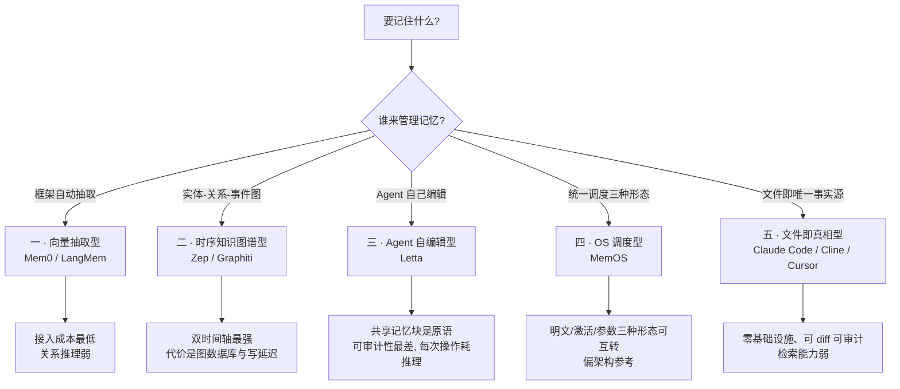
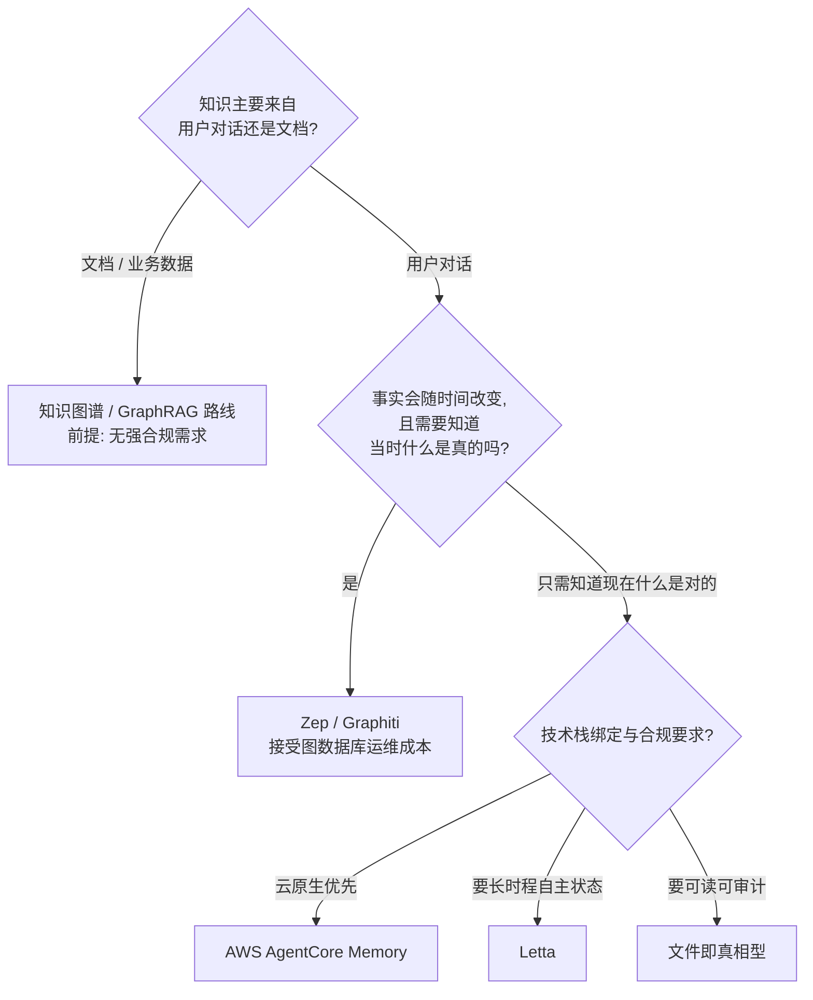

# Agent Memory 选型指南: 五大范式、评测水分与四个必补动作

> [!NOTE]
> 同一个记忆框架, 在自家 benchmark 上可以报到 94.4 分 —— 而这个数字来自厂商托管平台的自测.
> 更麻烦的是: 同一类系统换一套测试脚手架, 分数能相差几十个百分点, 变量既不是模型也不是产品, 而是**谁写的评测代码**.
> 那么问题就不是"该买哪个", 而是: 在一个连分数都不可比的领域里, 选型到底应该依据什么?

## 0x00 三个概念, 三种失效

选型失误大多始于概念混淆. **长上下文、RAG、Agent Memory 是三件不同的事**, 它们的失效方式也完全不同:

| | 长上下文 | RAG | Agent Memory |
|---|---|---|---|
| 内容来源 | 本次请求的输入 | 预先置入的静态语料 | 运行期双向产生 |
| 生命周期 | 单次请求, 用完即销毁 | 与语料同寿, 只读 | 跨会话、跨任务持久 |
| 读写路径 | 只写不读 (写进 prompt) | 只读不写 | 读-写双向 |
| 解决什么 | 容量 (装得下) | 事实召回 (查得到) | 连续性 (记得住) |
| 典型失效 | 上下文腐化 | 语料过期、切分噪声 | 幽灵记忆、遗忘失败 |

一个判据胜过一堆定义: **同一个客户第五次来访, RAG 每次都命中同一份产品文档, 而 Agent Memory 记得他上次问过什么.**

"窗口解决容量, 记忆解决连续性", 这两件事是正交的 —— 这解释了为什么把窗口从 200K 推到 1M 并不能让 Agent 记住你上周说过什么.

而且**买来的窗口本身也在打折**. 独立评测 (RULER) 显示, 有效上下文往往只有标称窗口的 50%~65%; Context Rot 测试里 18 个前沿模型全部随输入增长而退化, 200K 窗口的模型可能在 50K 处就已失稳; "Lost in the Middle" 现象则让放在中段的关键事实准确率下降超过 30%. 所以记忆评测与长上下文评测测的根本不是同一件事: 记忆评测要先写入、再跨轮检索, **写入质量本身就是被评测对象**.

### Agent 记忆的四种类型

| 类型 | 记什么 | 典型载体 |
|---|---|---|
| 语义记忆 | 事实: X 是 Y | 事实库、知识图谱 |
| 情景记忆 | 经历: 遇到 X 时发生了什么 | 轨迹、事件流 |
| 程序记忆 | 怎么做: 遇到 X 先做 Y、别做 Z | 技能包、系统提示词改写 |
| 参数记忆 | 学进权重里的偏好 | 微调、蒸馏 |

其中**情景记忆有不可替代的价值**: 事实没有褒贬, 语义记忆永远表达不出"不要先做 X"这句话. 保留失败与试错的**分支**, 而不是只留下成功路径的摘要, 才是情景记忆真正的用处.

还有个反直觉的现象叫 **Zep 悖论**: 记忆系统的失败模式往往不是"忘了", 而是"同时记住了太多版本"—— 直到其中一个错误版本被召回.

> [!WARNING]
> 把记忆层当成"更强的 RAG"是最常见的一步错棋. RAG 的语料是你控制的, 记忆的语料是用户和 Agent 自己写进去的 —— 后者的写入侧才是风险主战场 (见 [0x05 记忆投毒](#0x05-记忆投毒-从提示注入升级为独立攻击面)).

## 0x01 选型第一步: 选范式, 不是选产品

范式边界由三个问题划定:

1. **我要记住什么?** —— 事实 / 经历 / 技能
2. **谁来管理记忆?** —— 框架自动 / Agent 自编辑 / 操作系统调度
3. **如何验证与审计?** —— 人类可读可 diff, 还是只有一份不透明的向量索引

按这三问, 主流实现可以收敛成五种范式:

值得先泼一盆冷水的是: **五个范式在实践中并不互斥**. 工程侧的存储已经收敛为混合形态 ——

| 存储基质 | 擅长 |
|---|---|
| 向量库 | 语义相似匹配 |
| 图数据库 | 关系、时间与多跳推理 |
| KV / SQL | 精确查询、版本与状态 |
| 文件 | 可审计、可 diff、事件溯源 |

差别只在**谁是主基质、谁是增强层**. 所以"选范式"的真实含义是: 先确定主基质, 再决定增强层挂什么.

### 写入不是一次调用, 而是一条分层管线

写入侧同样已经收敛为四层: **事实抽取 → 实体识别与消解 → 持久化与索引构建 → 版本/时效/归档/清理**.

写入动作本身只有三个: **ADD / UPDATE / NO-OP**, 加上版本回滚与状态标记, **没有 DELETE**. 这条设计约束非常关键 —— 它意味着"删除"在记忆系统里通常是**标记失效**, 而不是物理抹除.

### 失效语义比"删除"复杂得多

失效至少有五种语义:

| 失效语义 | 含义 |
|---|---|
| 就地覆盖 | 用新值替换旧值, 旧值消失 |
| 版本化 | 保留多个版本, 标记当前有效 |
| 失效不删除 | 打 INVALID 标记, 保留历史 |
| 时间衰减 | 按半衰期降权, 医疗/法律场景可能完全不衰减 |
| Agent 自主淘汰策略 | 由模型判断保留或丢弃 |

这里有一个几乎被所有评测忽略的事实: **召回与删除是两套不同的器官**. 知识图谱式的抽象会把一次具体的经历"合成"成一条事实, 丢弃掉表层形式; 而用户的删除请求恰恰是针对那个表层形式的 —— "把我说过的那句话删掉", 指的是原句, 不是它的抽象. 图谱越擅长抽象, 这类删除就越容易失效. 这就是后面遗忘评测集体翻车的结构性根因.

### 两条铁律

- **读取同步阻塞, 直接决定首 token 延迟** (p50 约 300~800 ms), 因此**不能读图**, 图遍历要挪到写入或后台.
- **写入必须异步**, 典型做法是会话结束时异步持久化, 不阻塞实时对话路径.

为什么这两条不是实现细节而是铁律? 因为读写两条路径面对的是完全不同的约束: 读要**快**, 写要**稳**. 把它们耦合在一起, 就等于让实时对话去承担索引构建和实体消解的延迟. 下图是这两条路径的完整分工:

[Agent Memory 读写双路径: 为什么必须分离 #ppt ##w100%##](memory-pipeline.html)

## 0x02 代表实现: 差异点在哪里

先给一张总表 (价格随版本变动频繁, 仅用于建立量级直觉):

| 框架 | 范式 | 许可证 / 形态 | 差异点 | 主要短板 |
|---|---|---|---|---|
| Mem0 | 向量抽取型 | Apache-2.0, Python/TS 双 SDK | 社区规模最大, 官方集成 21+ 框架; 四层作用域 (会话→会话期→用户→组织) | 图记忆被高价档锁定; 数据落差最大 |
| Zep / Graphiti | 时序知识图谱型 | 托管平台 / Graphiti 内核 Apache-2.0 | **双时间轴**: 每条事实同时携带 valid time (何时为真) 与 transaction time (系统何时学到) | 图数据库运维成本; 写延迟最高 |
| Letta | Agent 自编辑型 | Apache-2.0 | 源自 MemGPT 的 OS 分页类比; memory blocks / archival memory / 可 git 追踪的 MemFS | 无事实级时序; 重建循环约 2~6 周; 每次记忆操作都耗推理 |
| MemOS | OS 调度型 | 学术项目 | 唯一把参数记忆纳入统一调度, 明文/激活/参数三种形态可互转 | 偏架构参考, 不是当下首选 |
| LangMem | 向量抽取型 | MIT (LangChain 系) | 语义 / 情景 / 程序三件套; hot path 与 background 双写入路径 | 与 LangGraph 生态绑定 |

### 双时间轴为什么重要

Zep / Graphiti 的核心差异是"两个时间戳同时写": 一条事实在真实世界里**何时开始为真** (valid time), 以及系统**何时学到它** (transaction time). 当旧事实被推翻时, 旧边不是被删掉, 而是被打上失效标记.

于是它能在一次查询里同时回答两个不同的问题: "现在什么是真的" 和 "当时什么是真的". 这是**审计与追责**场景的分水岭, 但也是它的代价来源: 图数据库、最高写延迟、以及比向量方案重得多的运维.

### 一个常被误读的概念

"会话内状态持续"不等于"跨会话记忆". LangGraph 的 checkpoint 是**会话内状态持久化**, 它解决的是单次运行的恢复与续跑, 不是"上次用户说过什么". 选型时把 checkpoint 当记忆层, 会得到一个能续跑但完全没有记性的 Agent.

## 0x03 评测: 分数的可信度危机

### 三大主基准

| 基准 | 规模 | 特点 | 现状 |
|---|---|---|---|
| LoCoMo | 开放域长对话记忆 (ACL 2024) | 单条/多条开放域、时间回忆 | 头部接近饱和, 生产区分度下降 |
| LongMemEval | 500 题, 每题约 11.5 万 token | 六维度: 偏好、指令遵循、信息抽取、知识更新、多会话推理、时间推理 | 当前事实标准, 时间维度区分度最好 |
| BEAM | 100 场对话 / 2,000 题, 128K~10M token 四档 | 摘要、时间推理、事件排序、弃答、矛盾消解 | 当前最难, 10M 档最高报告分仍不到七成 |

BEAM 的难点恰恰在于它**无法靠扩大窗口解决**: 10M 量级把全部历史塞进 prompt 在经济上不可行, 因此它最贴近生产规模.

另有一条从认知能力出发的路线 (MemoryAgentBench) 把记忆拆成四种正交能力: 准确检索、测试时学习、长程理解、**选择性遗忘**. 前三项都有赢家, 唯独选择性遗忘是所有方法共同表现最差的一项.

### 分数不可比的三个硬证据

1. 同一系统在同一基准上可以从 **38% 跑到 92%**, 差别只取决于 harness (测试脚手架);
2. 独立审计中, 奖励向量存储的 judge 接受了约 **63% 的刻意错误答案**, 奖励图的 judge 则拒绝得很干脆 —— 名次随基准形态反转;
3. 换一套口径 (排除不可回答题 vs 计入不可回答题), LoCoMo 上的结论直接翻转.

由此得到五条读数规则:

- **成对读数字**: 准确率必须与 token 成本一起给出, 单看准确率没有意义;
- **要求三件套**: harness 版本、judge 模型、产品档位, 缺一项就不能作为选型依据;
- **区分 [厂] 与 [独]**: 厂商报告与独立评测不可混用;
- **小规模测试不下结论**: 当模型差异小于方法论差异时, 结论属于噪声;
- **接受"模型差异 > 方法差异"**: 有时换个底层模型比换个记忆框架收益更大.

### 遗忘: 行业最大的盲区

ForgetEval (含对抗层) 测的是记忆的**控制平面** —— 衰减、清除、漂移. 结果数字差距极大: 同一组对抗性遗忘用例里, 有的方案 (LLM Hook 形态) 能到九成以上, 而 Graphiti 只有 **4.4%~7.0%**.

根因不是实现粗糙, 而是结构性的: **知识图谱的抽象会合成事实、丢弃表层形式, 而清除请求恰恰针对表层形式**. 行业把"召回"这一套评测做透了, 然后在"删除"这一套上集体翻车.

> [!WARNING]
> 如果你在受监管场景 (医疗、金融、法务) 里准备上线记忆层, "能不能删干净"是比"能不能想起来"更硬的合规问题. 现有榜单几乎不覆盖它.

### 最干净的一组对照实验

2026 年 8 月一项受控实验 ("The Shapes of Agent Memory") 把变量压到只剩一个: **完全相同的 Agent 循环、相同的开源权重答案模型、相同的 judge, 只换记忆层**.

| 形态 | LongMemEval 准确率 | token 消耗 |
|---|---|---|
| 策展文件 (Markdown) | 44.9% | 约 665,000 |
| 结构化存储 | **73.6%** | 约 27,000 |
| 训练式记忆 | 研究系统, 非同等条件 | —— |

准确率差 **28.7 分**, token 成本差约 **24.6 倍**.

根因很清晰: 策展 Markdown 迫使模型**在写入时做推理**, 而嵌入不需要. 但有一个漂亮的**反例**: 在七维度的弃答指标上, 策展文件反而赢了 **11.1 分** (88.9% vs 77.8%). 机制解释是: 检索受限时索引材料更少, 模型更容易承认"历史里没说", 而不是猜.

这条反例的工程含义很直接: **如果场景更怕幻觉而不是更怕答不出来, 文件式记忆反而更值得考虑.**

至于训练式记忆, 结论是: 弱模型有真实提升, 前沿模型已接近天花板、无可检测提升. 它在当下是**研究手段, 不是生产手段**.

### 数据口径说明: 本文数字哪些查得到, 哪些只是转述

这一节是本文对自己的一次"读物检查". 表中每一行都标明了可核验性, 而不是把所有数字并列摆放:

| 数字 / 结论 | 口径 | 可核验性 |
|---|---|---|
| Mem0 官方集成 20+ 框架、Apache-2.0 | 官方仓库与文档 | 已核 |
| Mem0 94.4 分 | **厂商对托管平台的自测**, 官方自述"开源用户不要期待同样数字" | 已核 (性质是自测) |
| 独立评测 49.0 分、harness 区间 38%~92% | 汇报口径 | **未找到公开出处** |
| 策展文件 44.9% vs 结构化 73.6%、665K vs 27K token | 第三方受控实验原文 | 已核 |
| InjecMEM 对 MemoryOS 76.6%、GhostWriter 注入率约 98% | 公开论文 | 已核 |
| OWASP 把记忆与上下文投毒单列为 ASI06 | 官方条目 | 已核 |
| CVE-2026-41713 (Spring AI 记忆投毒型提示注入) | NVD 与厂商公告 | 已核 |
| LoCoMo 题量、BEAM 10M 档 68.0%、Graphiti 遗忘 4.4%~7.0% | 汇报口径 | **未找到公开出处, 仅作方向性参考** |

> [!TIP]
> 这张表本身就是本文主张的最小实践: 引用任何记忆系统的分数时, 先说清它是**谁测的、怎么测的、测的是哪个档位**. 缺任何一项, 那个数字就不该进入选型依据.

## 0x04 决策树与四个必补动作

选型的第一步其实不是"选哪个框架", 而是回答两个问题:

无论最终选谁, 有四件事**必须补做** —— 它们不在任何框架的开箱能力里:

1. **元数据隔离** —— 防跨租户合并. 元数据不同的事件永远不应被合并, 哪怕语义高度相似;
2. **状态过滤层** —— 防幽灵记忆, 即同一实体的多个有效版本被同时召回;
3. **独立跑遗忘测试** —— 不要用召回榜单代替遗忘验证;
4. **写入侧内容安全校验** —— 记忆写入是特权操作 (见下一节).

### 三种集成模式

| 模式 | 做法 | 评价 |
|---|---|---|
| 两端挂钩 | 调用开始 `memory_load` 注入, 调用结束 `memory_save` 异步持久化 | **最推荐**: 业务逻辑不接触记忆基础设施, 记忆层可替换、可独立单测 |
| Hook 驱动 | 宿主 Agent 零侵入, 叠两层记忆 (本地 Markdown + 云端跨设备) | 适合不想改 Agent 循环的场景; 本地那层图快, 云端那层记得久、跨得开 |
| Agent 自主工具调用 | 把记忆暴露成 `memory_store` / `memory_search` 工具 | **必须与上两种并存**: 模型不会主动记住所有值得记的东西 |

### 一个反常识的结论

**记忆层不总是省钱.** 当压缩丢掉了关键细节时, 完整上下文可能反而更准. 把"上记忆层"默认等同于"降本增效"是一种想当然 —— 前面的对照实验里, 文件式记忆的 token 消耗是结构化存储的 24.6 倍, 但在弃答维度上更准. **成本与准确率在记忆这一层并不是同向的.**

## 0x05 记忆投毒: 从提示注入升级为独立攻击面

传统提示注入是**一次性**的: 会话结束就失效. 而一旦恶意内容被写进长期记忆, 攻击就变成**持久化驻留** —— 它跨会话生效, 且在之后的检索里被 Agent 当成可信的内部状态采信.

攻击分两个阶段:

1. **注入阶段**: 单次普通交互携带隐藏载荷, 或通过被投毒的文档/网页间接投递. 载荷伪装成"事实/偏好/规则", 经由常规抽取管线落库;
2. **激活阶段**: 后续某次检索召回该条目, Agent 把它当作可信内部状态, 输出被悄然改写.

四个放大因素让它比普通注入危险得多: **长期影响、高信任度、低可见性、静默漂移**. 在多 Agent 场景里还会通过共享检索层形成**数字传染** —— 一个 Agent 写入的低质量记忆会损害所有采信它的 Agent.

公开研究给出的成功率相当可观: InjecMEM 对 MemoryOS 的攻击成功率约 76.6%, GhostWriter 的注入率约 98%. 行业响应也已经跟上: OWASP 2026 把 **Memory & Context Poisoning 单列为 ASI06**.

这也不是纸面威胁. **CVE-2026-41713** 就是一个已经进入 NVD 的实例: Spring AI 的 `PromptChatMemoryAdvisor` 把用户输入存进会话记忆后被模型以非预期方式重新解释, 形成"经记忆投毒实现的提示注入", CVSS 8.2. 它的形态正是上面那条攻击链的最小样本 —— **写入时一切正常, 出事发生在下一次召回.**

### 十条防护里最有效的四条

1. **Schema 绑定记忆** —— 不允许自由文本, 用结构化 Schema 约束所有写入与修改, 杜绝自然语言绕过;
2. **写入即特权操作** —— 任何写入/修改都必须经过权限校验与上下文审核;
3. **读取以"数据"角色注入** —— 检索结果只作数据, 不作指令; 并按来源可信度、时效性、一致性综合评分;
4. **记忆来源与置信度分级** —— 给每条记忆标注来源与信任值.

### 可观测性: 盯"幽灵率", 不是盯"命中率"

核心健康指标是**幽灵率 = 同一实体同时存在多个有效版本的比率**. 它比命中率、利用率更能提前预警失败 —— 命中率告诉你"想起来了", 幽灵率告诉你"想起来的可能是错的版本".

配套需要采集的还有: 记忆命中率、利用率、写入成功率、冲突率、TTL 命中率、写入与检索延迟 (p50/p95). 多 Agent 系统还要额外追踪记忆的跨 Agent 传播路径, 构建可追溯的记忆图.

## 0x06 趋势: 记忆正在变成一层可治理的服务

**事实层面的三个方向**:

- 记忆从"功能"变成**独立可治理的服务层** (AWS 的 Episodic Memory Strategy、OWASP 把它列为独立攻击面、按操作或按条计费, 三个信号同时出现);
- 从"记住更多"转向**"控制得更好"** —— 核心难点不在存储, 而在选择;
- **程序记忆从研究概念走向产品**: Azure Foundry 是第一个把程序记忆产品化的托管服务, 让 Agent 学习"它自己是如何完成某个任务的"并复用流程; 记忆形态也可转换 (明文可蒸馏进权重, 权重也能降级回明文).

**评测侧**: 从单一榜单走向**透明聚合**, 到 2027 年标准问题会变成"请给出 harness 版本、judge 模型、产品档位与独立复现结果".

**五个尚未解决的真问题** (按难度排序): 会话身份、规模化时间抽象、陈旧性遗忘的语义化、多 Agent 记忆一致性、跨规划身份. 其中**遗忘的语义化**是当前最被低估的工程缺口.

### 我的判断 (个人观点, 非事实)

这篇素材来自一份 2026-09 的行业汇报, 数据截至发布日. 抛开具体数字, 我认为它最有价值的迁移是三句话:

1. **"选型 = 按记忆类型与失效语义做判断, 而不是按榜单分数排序."** 这条对任何有状态系统都成立 —— 一旦系统的状态会跨会话存活, 你就不再是在选一个库, 而是在设计一套治理策略;
2. **"召回与删除是两套器官."** 这条通用性最强. 任何"只优化召回、把删除当兜底"的系统, 都会在合规和长期正确性上付出代价, 而这件事在榜单上完全看不见;
3. **分数不可比的本质是"评测即设计".** harness 换了结论就换了, 说明我们比的往往不是产品, 而是实验设计. 同一条经验可以直接搬到任何 LLM 评测场景里: 报数字时必须带上脚手架版本.

我更倾向于把这次选型收敛为一条最小路径: **先用"知识来自文档还是对话"把范式定下来, 再用"要不要知道当时什么是真的"决定是否上双时间轴, 然后无论选谁, 先把那四件必补动作做完.** 这四件事的成本远低于换框架, 收益却更确定.

## 0x07 拓展升华展望

把视线从"选哪个框架"抬高一层, 会发现本文真正的对象并不是记忆, 而是**任何一个状态跨会话存活下来的系统**. 只要系统的状态会比一次请求活得久, 它就必须同时面对写入质量、失效语义、审计与删除这四件事 —— 记忆框架只是最早把这些问题暴露出来的那一类系统.

**事实层面** … 记忆正在从"一个功能"变成"一层可独立治理的服务": 托管平台按操作或按条计费, OWASP 把记忆与上下文投毒单列为 ASI06, 程序记忆也已经开始被产品化. 与此同时, 评测侧正从单一榜单走向透明聚合 —— 同一个系统换一套 harness 就能从 38% 跑到 92%, 这说明被比较的往往不是产品而是实验设计. 而"召回与删除是两套不同的器官"这一条, 在遗忘评测上有可复现的数字支撑.

**个人判断** … 我认为接下来最值得投入的不是更强的召回, 而是**可解释的写入与可验证的删除**: 一条记忆为什么被写进来、依据什么被标记失效、删除请求是否真的落到了原句上. 这三件事目前几乎没有榜单覆盖, 却恰好是任何受监管场景上线前的硬门槛. 另一个判断是, 记忆层会逐渐向"策略层"演化 —— 选型的终点不是挑一个库, 而是定下一套治理规则, 库只是规则的执行者. 在这个意义上, 本文列的四个必补动作比框架本身更长寿.

---

[Agent Memory 选型速览 ##PPT 1 sakura##](agent-memory-deck.tsx)

> 内联演示页由站点主题渲染 (可换主题、可跟随明暗). 想改回默认主题, 把链接里的主题名去掉即可.

[静态 HTML 版演示页 #ppt](overview-ppt.html)

## 0x08 参考来源

- [【Agent Memory 主流框架选型与对比 —— 窗口解决容量, 记忆解决连续性】](https://www.bilibili.com/video/BV12UYY6sEmb/) —— 本文主线素材来源, 覆盖四类记忆、五大范式、评测可信度、安全与落地清单.
- [Mem0](https://github.com/mem0ai/mem0) —— 社区规模最大的独立记忆层实现, 本文对照的向量抽取型代表.
- [Graphiti](https://github.com/getzep/graphiti) —— Zep 的时序知识图谱内核, 双时间轴设计的实现参考.
- [Letta](https://github.com/letta-ai/letta) —— 有状态 Agent 运行时, memory blocks / MemFS 与程序记忆的参考实现.
- [LangMem](https://github.com/langchain-ai/langmem) —— 语义/情景/程序三件套与双写入路径的参考实现.
- [AWS Bedrock AgentCore Memory](https://docs.aws.amazon.com/bedrock-agentcore/) —— 全托管记忆服务的三阶段异步管线与命名空间设计.
- [OWASP Top 10 for Agentic Applications](https://genai.owasp.org/resource/owasp-top-10-for-agentic-applications-for-2026/) 与 [ASI06 条目解读](https://genai.owasp.org/2026/05/13/memory-is-a-feature-it-is-also-an-attack-surface/) —— 记忆与上下文投毒被单列为独立风险条目的出处.
- [InjecMEM: 记忆投毒攻击论文](https://arxiv.org/abs/2608.23471) —— 对 MemoryOS 攻击成功率 76.6% 的原始出处.
- [When Agents Remember Too Much: Memory Poisoning Attacks on LLM Agents](https://arxiv.org/abs/2607.06595) —— GhostWriter 注入率约 98% 的原始出处.
- [CVE-2026-41713 (NVD)](https://nvd.nist.gov/vuln/detail/CVE-2026-41713) 与 [Spring AI 公告](https://spring.io/security/cve-2026-41713) —— 记忆投毒型提示注入进入生产系统的真实案例.
- [Zep: A Temporal Knowledge Graph Architecture for Agent Memory](https://arxiv.org/abs/2501.13956) —— 双时间轴设计的论文依据.
- [MemGPT: Towards LLMs as Operating Systems](https://arxiv.org/abs/2310.08560) —— Letta 的 OS 分页类比与自编辑记忆的论文依据.
- [MemOS: A Memory OS for AI System](https://arxiv.org/abs/2507.03724) —— 把参数记忆纳入统一调度的论文依据.
- [The Shapes of Agent Memory](https://www.pinglin.tw/blog/the-shapes-of-agent-memory/) —— 文件式与结构化记忆受控对照实验的原文 (含 token 账本).
- [BEAM: Beyond a Million Tokens](https://arxiv.org/abs/2510.27246) —— 十亿级 token 记忆基准的设计与分档.
- [MemoryAgentBench](https://arxiv.org/abs/2507.05257) —— 从认知能力出发的四维记忆评测.
- [ForgetEval: 遗忘控制平面评测](https://arxiv.org/abs/2606.15903) —— 遗忘作为独立评测维度的出处.
- [RULER: What's the Real Context Size of Your Long-Context Language Models?](https://arxiv.org/abs/2404.06654) —— 有效上下文远低于标称窗口的评测依据.
- [Lost in the Middle: How Language Models Use Long Contexts](https://arxiv.org/abs/2307.03172) —— 关键信息位于中段时准确率下降的证据.
- [LongMemEval](https://github.com/xiaowu0162/LongMemEval) —— 当前记忆评测事实标准的六维度设计与 500 题数据集.
- [LoCoMo](https://arxiv.org/abs/2402.17753) —— 开放域长对话记忆基准的原始论文.

### 关联阅读

- [自维护可插拔记忆层设计: 一次对比市面方案后的收敛](../002-自维护可插拔记忆层设计/index.md "hxid:hx-37f17262") —— 如果本文解决"选哪个", 这篇解决"自己造一层"时端口与存储怎么分.
- [对话记忆与知识库增量沉淀](../001-对话记忆与知识库增量沉淀/index.md "hxid:hx-462ef6c0") —— 把记忆落到知识库增量上的做法.
- [自建 Agent 检索栈与凭证治理](../../007-检索/001-自建Agent检索栈与凭证治理/index.md "hxid:hx-3a13472d") —— 检索、融合与重排这一层自建时的工程细节.
- [AI Agent 设计原理与工程实践](../../002-Agent架构/001-AI-Agent设计原理与工程实践/index.md "hxid:hx-b764ac0f") —— 记忆在 Agent 整体架构里的位置.
