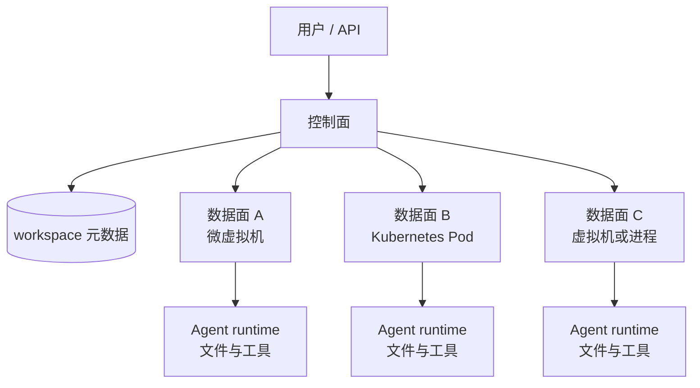
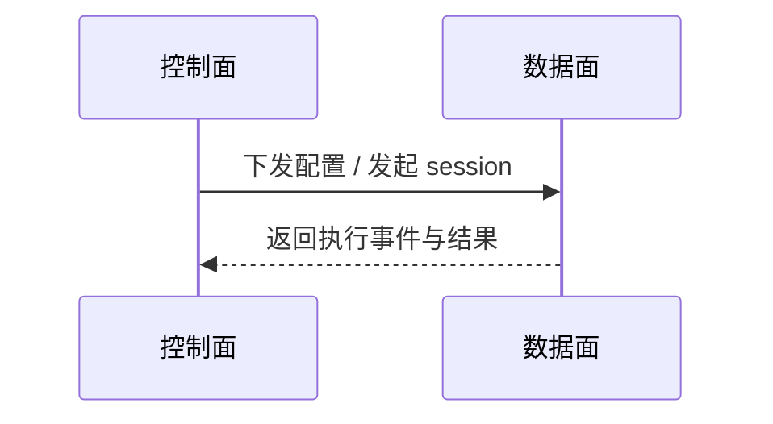
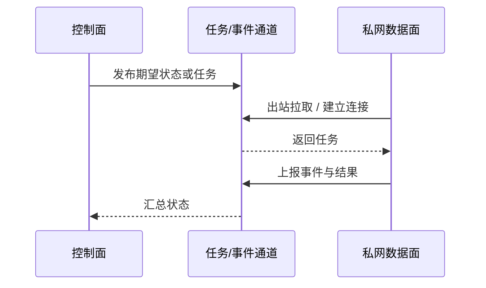

# Agent平台数据面解耦的需求与边界

> [!NOTE]
> 本文由 AI 辅助沉淀, 需要用户 review 后再提交.

## 0x00 一个 Agent 能跑起来, 为什么还要拆控制面与数据面?

一个 Agent 平台在演示阶段可以把 UI、元数据、Agent 进程和文件系统放在同一套基础设施中. 但当 workspace 数量增长、隔离等级分化, 或企业要求私网部署时, 真正消耗计算与存储资源的运行时会成为独立的扩展与安全边界.

本文沉淀视频 [Agent 平台工程实践: 数据面灵活解耦 | 录屏精简版](https://www.bilibili.com/video/BV1fqN16GEBK/) 的需求分析部分, 重点回答:

- 控制面与数据面分别拥有怎样的职责.
- 为什么一个控制面需要管理多个数据面.
- 可扩展、异构和网络隔离三个需求如何共同约束架构.
- 为什么网络隔离会推动通信从 `push` 改为 `pull`.
- 当桌面视频页被 HTTP 412 拦截时, 如何通过 Bilibili 官方 API 获取媒体并完成 ASR.

> [!WARNING]
> 视频标题和简介提到了 Anthropic CMA Self-hosted Sandbox 与 Neutree Agent Platform(NAP) BYOI 的实现对比, 但这段 20:50 的精简版在进入实现分析前结束. 本文不会根据简介补写视频未展开的生命周期、调度或通信细节.

相关背景可继续阅读 [Multica agent协作与上下文机制](../001-Multica-agent协作与上下文机制/index.md). 前者讨论任务触发和运行时上下文, 本文讨论承载这些运行时的基础设施边界.

## 0x01 核心结论

数据面解耦的核心不是把组件拆得更多, 而是让 Agent 运行时成为可独立调度、扩展和隔离的资源单元.

一个可复用的架构判断是:

| 判断维度 | 控制面 | 数据面 |
| --- | --- | --- |
| 主要内容 | 用户、workspace 元数据、模型与 skill 配置、会话入口 | Agent 进程、文件系统、工具调用、命令执行和运行时状态 |
| 主要压力 | 元数据读写、API 和数据库扩展 | CPU、内存、磁盘、执行时长与隔离成本 |
| 典型扩展 | 数据库与无状态服务横向扩展 | 增加物理机、Kubernetes 集群、云区域或云厂商 |
| 安全重点 | 身份、权限与配置一致性 | 不可信代码、凭据、文件和网络访问范围 |

由此得到四条结论:

1. **控制面与数据面的增长曲线不同.** workspace 运行时远比一条元数据记录昂贵, 两者不应被迫同步扩容.
2. **一个控制面应天然支持多个数据面.** 单个物理机、单个 Kubernetes 集群乃至单个云厂商都有容量、故障域或商业边界.
3. **数据面必须允许异构.** 微虚拟机、加固容器、普通容器、虚拟机和进程隔离对应不同的安全、性能、成本与存量基础设施约束.
4. **私网数据面要求反转连接方向.** 控制面主动调用数据面的 `push` 模型要求数据面可被寻址; 无公网入口的数据面更适合主动拉取任务或建立出站连接.

这并不意味着所有 Agent 产品都要从第一天实现多数据面. 单团队、单租户、容量稳定的内部工具可以先保持简单, 但控制面不应把某一种运行时或网络拓扑写死为不可替换的业务模型.

## 0x02 控制面与数据面的职责边界

视频以 workspace 作为用户直接交互的抽象. 一个 workspace 不只是一个 Agent 名称, 它还包含模型、上下文限制、skills、记忆、文件、自动化和会话等配置或状态.

控制面保存并暴露这些用户可见的声明. 当用户创建 workspace 时, 控制面先写入元数据, 再要求数据面准备实际运行环境. 当会话开始时, 控制面把请求转给运行时, 而 Claude Code、Codex 或其他 Agent 的工具调用发生在数据面.



视频提到的原始实现包含一层 Agent core sidecar, 其中配置加载器负责接收 workspace 配置, session API 代理负责调用真正的 Agent runtime 并收集结果. 这里的 sidecar 是视频案例中的实现形态, 不是控制面/数据面分离必须采用的唯一组件.

## 0x03 为什么需要多个数据面?

### 3.1 可独立扩展

业务增长时, 用户、session 和 skill 配置都会增长, 但最重的资源消耗来自实际运行的 workspace. 控制面数据库可以用成熟的存储扩展手段处理元数据, 数据面则需要容纳越来越多的执行环境.

单个数据面通常对应一个基础设施边界, 例如一台物理机或一个 Kubernetes 集群. 即使该边界内部能够扩容, 到达一定规模后仍需要切分. 公有云可以暂时把内部扩展隐藏起来, 但无法消除多云、故障域和异构需求. 因此合理的基线是 `1 control plane -> N data planes`.

### 3.2 支持异构

数据面的隔离单元不必统一:

| 运行形态 | 适合场景 | 主要取舍 |
| --- | --- | --- |
| 微虚拟机 | 多租户、不可信代码、高隔离要求 | 启动与资源成本通常高于容器 |
| 加固容器 | 需要容器生态, 同时提高边界强度 | 仍需理解具体 runtime 的威胁模型 |
| 普通容器 | 大量标准化 workload、成本敏感 | 内核共享带来更强的安全约束 |
| 传统虚拟机 | 企业已有 VM 基础设施或兼容性优先 | 调度密度和启动速度可能较差 |
| 进程 | 单租户、可信代码、最低隔离要求 | 不能作为不可信多租户的默认边界 |

异构可能来自业务要求, 也可能来自现实约束. 例如高敏 workspace 调度到微虚拟机, 普通 workspace 调度到 Kubernetes; 或旧集群容量耗尽后, 新资源只能由另一套基础设施提供.

异构也能降低单一云厂商绑定和故障域集中风险. 但多云本身会引入网络、身份、可观测性和运维复杂度, 不能只因“避免绑定”就无条件采用.

### 3.3 网络隔离

Agent runtime 会接触文件、模型凭据并执行命令. 与其完全依赖应用层规则阻止失控代码, 企业常通过网络边界缩小可访问对象和攻击面.

原始 `push` 模型要求控制面能够直接访问数据面:



当数据面位于没有公网 IP 的私有机房时, 入站箭头不再成立. 数据面可以主动访问外部控制面, 因而需要改成 `pull`、长连接或消息中间件驱动的模式:



> [!NOTE]
> 第二张图是对视频“从 push 改为 pull”需求的抽象, 不是 CMA 或 NAP 的具体实现图. 视频精简版没有给出消息协议、重试、租约、幂等或一致性方案.

网络隔离还有东西向边界: 不同数据面之间可以互不可见, 从而降低某个 Agent runtime 横向移动到其他 workspace 的风险.

## 0x04 工程设计时不能漏掉的问题

视频建立了需求, 但从需求走向实现还必须补齐以下契约:

- **数据面注册与身份:** 谁允许新的数据面加入, 如何签发、轮换和吊销凭据.
- **能力描述:** 数据面如何声明运行时类型、区域、容量、隔离等级和可用模型.
- **调度策略:** workspace 按容量、亲和性、成本、合规或隔离级别分配到哪里.
- **期望状态与实际状态:** 创建、启动、暂停、销毁失败时, 谁负责 reconcile.
- **任务租约与幂等:** pull worker 断线、重复领取或超时后如何避免重复副作用.
- **事件回传:** 日志、tool call、终端输出和最终结果如何流回控制面.
- **数据持久化:** workspace 文件跟随计算单元, 还是挂载独立存储; 迁移如何完成.
- **可观测性:** 如何跨多个异构数据面追踪一次 session 的完整链路.
- **版本兼容:** 控制面升级后, 旧数据面 agent 是否还能继续接单.

如果这些问题没有契约, “支持多个数据面”只会把单体复杂度变成分布式不确定性.

## 0x05 视频内容脉络

- `00:00:09`: 提出 Agent 平台数据面灵活解耦的问题.
- `00:00:58`: 介绍 NAP 对该需求使用 BYOI(Bring Your Own Infra) 这一称呼.
- `00:01:33`: 给出需求分析、CMA Self-hosted Sandbox、NAP BYOI 和方案对比的大纲.
- `00:02:18`: 汇总三个明确需求: 可扩展、异构和网络隔离.
- `00:06:42`: 开始回顾控制面、数据面和 workspace 抽象.
- `00:09:10`: 说明 Agent 需要文件系统、命令与工具调用所在的运行时环境.
- `00:10:25`: 说明控制面元数据、配置下发和 session API 的基本交互.
- `00:12:10`: 从未解耦的单数据面起点进入需求拆解.
- `00:14:17`: 论证一个控制面需要对应多个数据面.
- `00:16:00`: 展开微虚拟机、容器、进程、虚拟机与多云等异构场景.
- `00:19:12`: 进入网络隔离, 指出原始架构是控制面主动访问数据面的 `push` 模型.
- `00:20:30` 附近: 提出私网数据面通过出站访问改为 `pull` 模型, 并讨论数据面之间的东西向隔离.

ASR 在 `00:20:30` 之后把多个句子映射到了相同时间范围, 因此本文不为最后一段虚构更细的时间点.

## 0x06 Bilibili 412 下的下载与转写方法

### 6.1 问题定位

本次 `yt-dlp` 访问桌面页时收到 `HTTP 412: Precondition Failed`. 继续验证后发现:

- `https://www.bilibili.com/video/...` 桌面页返回 412.
- 官方 `x/web-interface/view` API 可匿名返回视频元数据、`aid` 和 `cid`.
- 移动页 `https://m.bilibili.com/video/...` 可匿名访问.
- 官方 `x/player/playurl` API 可根据 `bvid + cid` 返回带有效期的 HTML5 MP4 URL.

因此 412 是桌面入口的风控, 不是该视频不可访问, 也不必自动读取浏览器 cookies.

### 6.2 可复用流程

先读取元数据和 `cid`:

```bash
curl -L --fail \
  -A 'Mozilla/5.0 (Linux; Android 13; Pixel 7)' \
  -H 'Referer: https://www.bilibili.com/' \
  -o /tmp/view.json \
  'https://api.bilibili.com/x/web-interface/view?bvid=BV1fqN16GEBK'

cid=$(jq -r '.data.cid' /tmp/view.json)
```

再请求 HTML5 播放地址:

```bash
curl -L --fail \
  -A 'Mozilla/5.0 (Linux; Android 13; Pixel 7)' \
  -H 'Referer: https://m.bilibili.com/video/BV1fqN16GEBK' \
  -o /tmp/playurl.json \
  "https://api.bilibili.com/x/player/playurl?bvid=BV1fqN16GEBK&cid=${cid}&qn=64&fnval=0&platform=html5&high_quality=1"

url=$(jq -r '.data.durl[0].url' /tmp/playurl.json)
expected=$(jq -r '.data.durl[0].size' /tmp/playurl.json)
```

下载时必须带移动页 `Referer`. 播放 URL 有签名和过期时间, 不应写入笔记或长期缓存:

```bash
curl -L --fail -C - \
  -A 'Mozilla/5.0 (Linux; Android 13; Pixel 7)' \
  -H 'Referer: https://m.bilibili.com/video/BV1fqN16GEBK' \
  -o /tmp/BV1fqN16GEBK.mp4 \
  "$url"

test "$(stat -c %s /tmp/BV1fqN16GEBK.mp4)" -eq "$expected"
```

`-C -` 允许 CDN 或代理截断响应后继续 HTTP Range 下载. 本次声明大小和最终文件大小均为 `48,587,556` 字节, SHA-256 为:

```text
3a2aa02705bf64af7b8b4332a87fcc41ab205026f0a560e4b4e66f2a9e8ce83a
```

> [!WARNING]
> API 字段、清晰度权限和匿名访问策略可能变化. 应先检查响应的 `.code == 0`, 再读取 `.data`; 不要把一次成功的临时签名 URL 当作稳定接口.

### 6.3 Transcript 证据链

Bilibili `view` API 返回的 `subtitle.list` 为空, 因此没有平台字幕可用. 下载后的 MP4 通过 FFmpeg 转为 16 kHz 单声道 WAV, 再由 FunASR `paraformer-zh` 转写:

```bash
env HOME=/tmp/hx-home \
  PATH=/tmp/bin:$PATH \
  UV_CACHE_DIR=/tmp/uv-cache \
  MODELSCOPE_CACHE=/tmp/modelscope \
  uv run --python 3.12 \
    --extra-index-url https://download.pytorch.org/whl/cpu \
    --with funasr --with modelscope --with torch --with torchaudio \
    python .agents/skills/hx-look-video/scripts/hx_look_video_prepare.py \
      /tmp/BV1fqN16GEBK.mp4 --force-asr
```

可靠性限制:

- Transcript 来源是 `funasr-asr`, 不是发布方字幕.
- `Kubernetes/K8s`、`sidecar`、`Claude Code`、`Codex`、`BYOI` 等术语存在同音误识别, 本文结合视频简介和明确上下文规范化拼写.
- ASR 把 BYOI 的英文展开识别为 `Bring Your Own Info`; 本文采用视频简介明确给出的 `Bring Your Own Infra`.
- `00:20:30` 后句子时间戳重复, 该部分只用于内容脉络, 不作为精确逐句定位.

## 0x07 验证与引用

来源与验证结果:

- 视频: [Agent 平台工程实践: 数据面灵活解耦 | 录屏精简版](https://www.bilibili.com/video/BV1fqN16GEBK/)
- UP 主: `Koala聊开源`
- 发布时间: `2026-07-14 01:00:00 UTC`
- 时长: `1250` 秒
- BVID / CID: `BV1fqN16GEBK` / `39906839343`
- Transcript 来源: FunASR ASR, 因官方元数据中的 `subtitle.list` 为空
- 本文对应的 HXLoLi 基线提交: [`db4b1b866916a155350a06570d82b2cd08dc910f`](https://github.com/HengXin666/HXLoLi/commit/db4b1b866916a155350a06570d82b2cd08dc910f)

本文使用以下命令初始化模板:

```bash
env UV_CACHE_DIR=/tmp/uv-cache \
  uv run .agents/skills/hx-make-ai-docs/scripts/makeDoc.py \
  --title 'Agent平台数据面解耦的需求与边界' \
  --tag 'Agent平台' \
  --tag '平台架构' \
  --tag '数据面' \
  --tag '基础设施' \
  --model 'GPT-5 Codex' \
  --skill 'hx-make-ai-docs + hx-look-video' \
  --author 'Heng_Xin' \
  --output 'ai-docs/002-知识沉淀/002-项目学习/003-Multica/003-Agent平台数据面解耦的需求与边界/index.md'
```

## 0x08 总结

当 Agent 平台的 workspace 数量、隔离等级和部署网络开始分化时, 还能把运行时当成控制面的一个内部进程吗?

真正需要提前建立的不是某个具体 sandbox 产品依赖, 而是清晰的控制面/数据面契约: 控制面保存期望与接收结果, 多个数据面按自身能力承载运行时, 私网数据面通过出站连接获取任务. 可扩展、异构和网络隔离不是三个互不相关的功能, 它们共同要求平台把运行时从单一基础设施中解耦出来.
