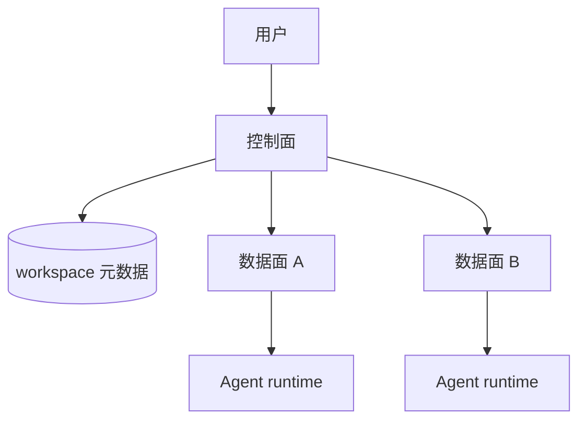
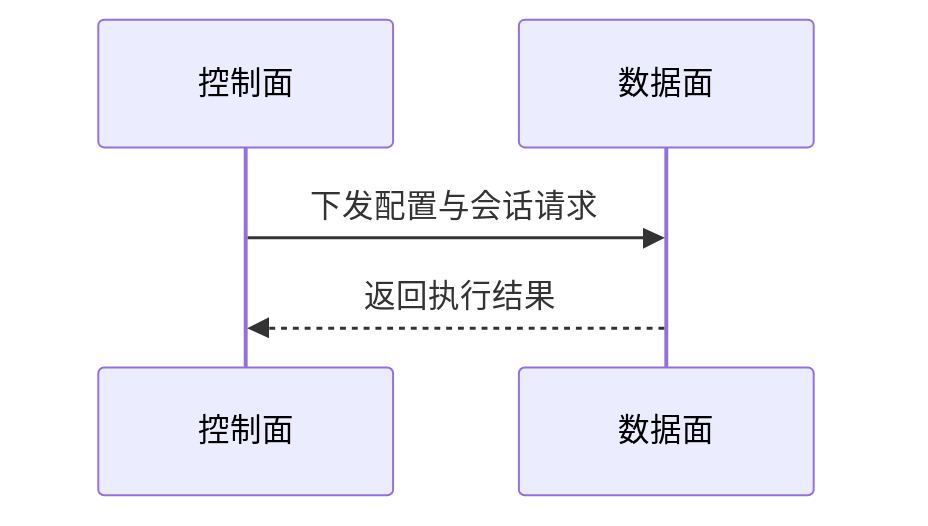
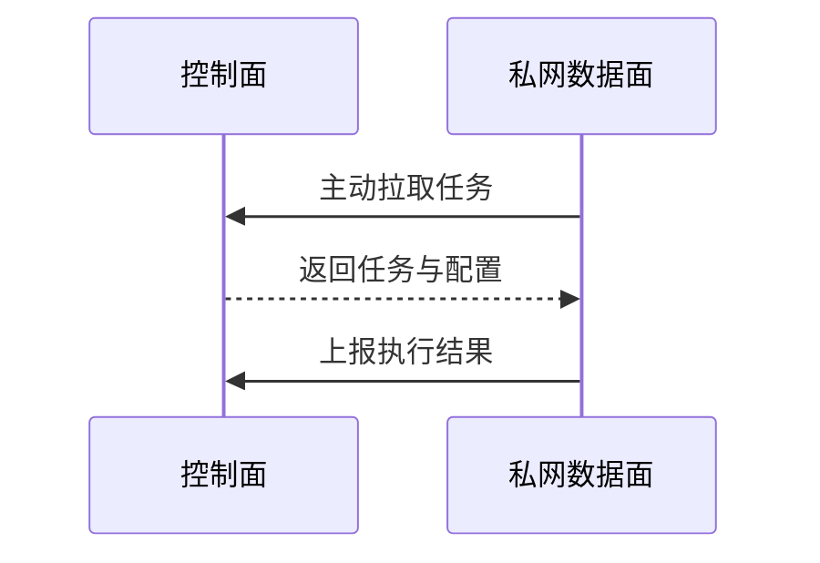

# Agent平台数据面灵活解耦

> [!NOTE]
> 本文由 AI 辅助沉淀, 需要用户 review 后再提交.

## 0x00 背景

Agent 平台通常由控制面和数据面组成. 控制面面向用户, 管理 workspace 的元数据与配置; 数据面承载 Agent 的实际运行环境, 包括文件系统、命令执行和工具调用.

随着 workspace 数量增加、运行环境分化以及企业网络隔离需求出现, 单一数据面会逐渐成为扩展和安全上的限制. 数据面需要从控制面中解耦, 并允许一个控制面同时管理多个数据面.

视频以 Anthropic CMA 的 Self-hosted Sandbox 与 Neutree Agent Platform(NAP) 的 BYOI(Bring Your Own Infra) 为背景, 讨论 Agent 平台为什么需要数据面灵活解耦.

## 0x01 控制面与数据面

workspace 是用户直接使用的单元. 它不只有一个 Agent, 还包含模型、上下文限制、skills、记忆、文件、自动化与会话等配置和状态.

控制面负责保存和展示这些用户可见的信息. 创建 workspace 时, 控制面先记录元数据, 再通知数据面准备运行环境. 会话开始后, Claude Code、Codex 或其他 Agent runtime 在数据面中访问文件、执行命令并调用工具.

| 对比项 | 控制面 | 数据面 |
| --- | --- | --- |
| 核心职责 | 管理 workspace 元数据与配置 | 运行 Agent 与工具 |
| 主要资源 | API、数据库 | CPU、内存、磁盘、运行环境 |
| 用户交互 | 直接面向用户 | 通常由控制面调度 |
| 扩展目标 | 承载更多用户与元数据 | 承载更多 workspace runtime |



## 0x02 数据面为什么需要解耦?

数据面解耦主要来自三个需求:

1. **可扩展:** workspace runtime 是 Agent 平台中最消耗资源的部分, 需要独立于控制面扩容.
2. **可异构:** 不同 workspace 对隔离性、性能、成本和基础设施的要求不同, 数据面不能被限定为同一种运行环境.
3. **网络隔离:** 数据面可能位于没有公网入口的私有网络中, 控制面不能直接访问它.

这三个需求共同推动架构从“一个控制面绑定一个数据面”转向“一个控制面管理多个数据面”.

## 0x03 可扩展

业务增长时, 用户、session、skills 和其他元数据都会增长. 但真正消耗大量资源的是 workspace 在数据面中的运行时.

控制面中的一条 workspace 记录只占用少量数据库资源, 数据面中的 workspace 却需要 CPU、内存、磁盘和隔离环境. 因此控制面与数据面的扩展速度并不一致, 数据面必须能够独立横向扩展.

单个数据面通常对应一套基础设施, 例如:

- 一台物理机.
- 一个 Kubernetes 集群.
- 一个公有云环境.

物理机和 Kubernetes 集群都有容量边界. 即使公有云能够隐藏内部扩展, 多云、故障隔离和异构部署仍然需要多个数据面. 因此一个控制面需要具备管理多个数据面的能力.

## 0x04 可异构

不同数据面可以采用不同的隔离单元:

| 运行形态 | 特点 |
| --- | --- |
| 微虚拟机 | 隔离性强, 适合运行不可信代码 |
| 容器 | 密度高, 适合标准化 workload |
| 加固容器 | 在容器生态上增强安全边界 |
| 传统虚拟机 | 适合已有 VM 基础设施 |
| 进程 | 成本低, 但隔离能力弱 |

异构需求可能来自业务差异. 高隔离要求的 workspace 可以运行在微虚拟机中, 普通 workspace 可以运行在 Kubernetes Pod 中.

异构也可能来自基础设施的现实限制. 旧集群容量耗尽后, 新资源可能来自另一套集群或云厂商. Agent 平台需要同时管理这些不同的数据面, 而不是要求所有基础设施完全一致.

## 0x05 网络隔离

数据面中保存文件、模型凭据并执行 Agent 生成的命令, 因此企业通常希望通过网络边界限制它能够访问的资源.

在简单架构中, 控制面主动向数据面下发配置和会话请求. 这是一种 `push` 模型, 要求控制面能够直接访问数据面.



当数据面部署在没有公网 IP 的私有机房中时, 控制面无法主动访问它. 数据面只能主动访问外部控制面, 通信方式需要改为 `pull` 模型:



网络隔离也可以用于分隔不同数据面. 当两个 workspace 被调度到互不可见的数据面后, Agent 即使出现异常行为, 也难以横向访问其他 workspace.

## 0x06 核心结论

Agent 平台的数据面灵活解耦可以归纳为以下结构:

```text
一个控制面
    -> 管理多个数据面
    -> 数据面独立扩展
    -> 数据面允许异构
    -> 私网数据面主动连接控制面
```

控制面负责 workspace 的声明和管理, 数据面负责 Agent 的实际执行. 将两者解耦后, 平台才能跨越单台机器、单个集群或单一云厂商的限制, 并根据隔离性、性能和成本选择合适的运行环境.

## 0x07 参考

- [Agent 平台工程实践: 数据面灵活解耦 | 录屏精简版](https://www.bilibili.com/video/BV1fqN16GEBK/)

## 0x08 总结

当 workspace 的数量、隔离等级和部署环境不断分化时, 单一数据面还能继续承载所有 Agent runtime 吗?

数据面解耦的关键不是增加组件数量, 而是让运行时能够独立扩展、按需异构并部署在受保护的网络中. 一个控制面管理多个数据面, 是 Agent 平台从单一部署走向企业级基础设施的基础.
