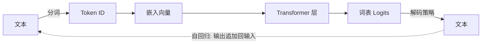
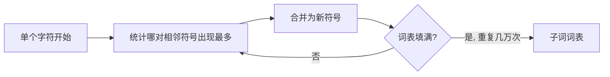
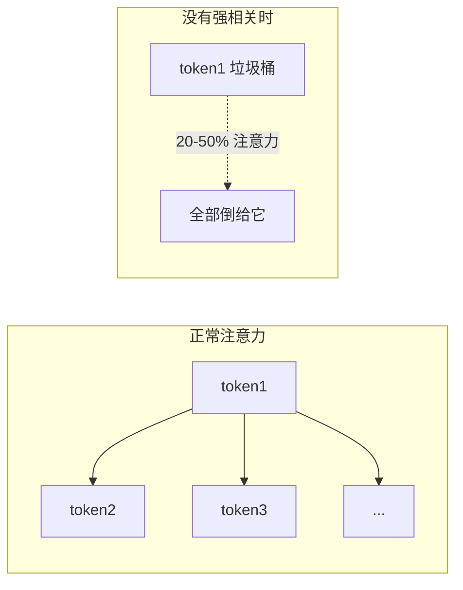
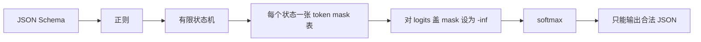
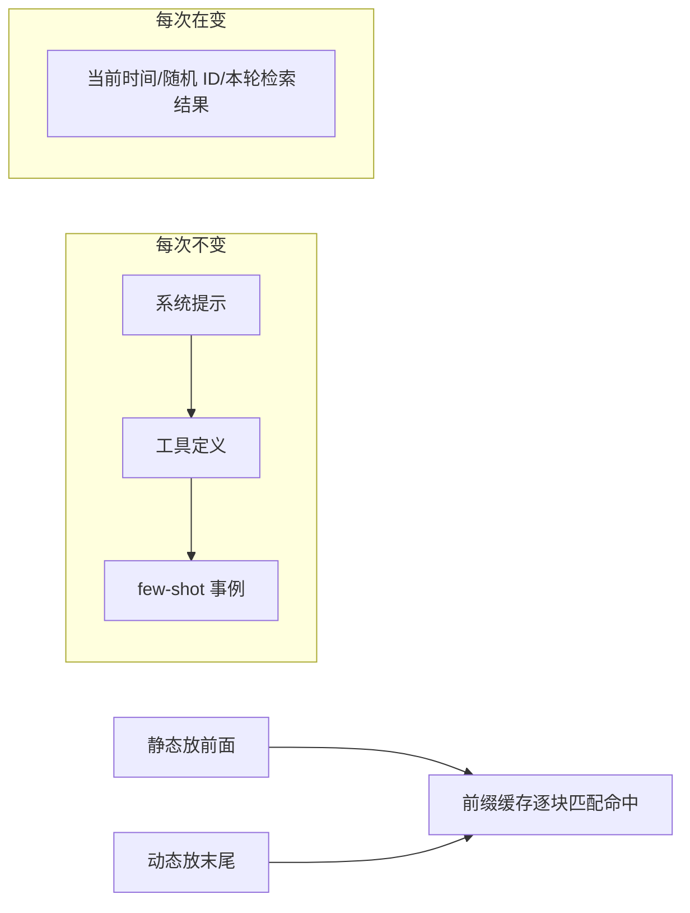
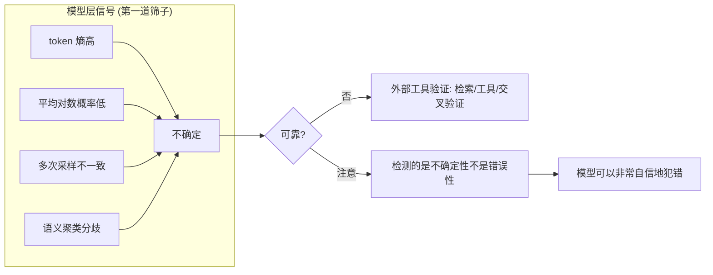

# Agent要懂的LLM基础知识

> [!NOTE]
> 本文由 AI 辅助沉淀, 需要用户 review 后再提交.

## 0x00 一句话总结

Agent 的本质是反复调用 LLM 的循环. 循环里的"玄学问题"——聊到 20-30 轮突然不守规矩、第 101 次工具调用输出坏 JSON——不是框架 bug, 而是 LLM 的性质. 从**输入(分词) → 上下文(怎么读) → 输出(怎么采样) → 成本延迟 → 能力边界**五个角度都能给出明确解法.

## 0x01 材料与可靠性

- 视频: 《Agent要懂的一些LLM基础知识》 by 假如今天可以躺平, [BV1M73U6LEM3](https://www.bilibili.com/video/BV1M73U6LEM3/), 约 33.5 分钟.
- 参考书: 《智能体AI漫游指南: 从基础到系统》(Haggai Roitman, 中文版 v1.3, [Chasing1020/agentic-ai-guide-zh](https://github.com/Chasing1020/agentic-ai-guide-zh/releases)), 视频只讲前 3 章. 另推荐 AK 老师 3 小时《听懂 LLM》.
- Transcript: funasr-asr (Bilibili 无公开字幕). 专有名词有 ASR 错字风险, 数值已与书中原文交叉核对; 结尾约 `00:33:21` 后段落时间戳被折叠, 内容完整但时间不可精确引用.

## 0x02 核心要点: 五个角度

### 一、输入: token 是怎么被切开的

**Agent 循环与 LLM 流水线** (后面全篇围绕它):



**为什么是子词** (注意力成本是序列长度的平方, 所以"切得越碎越烧钱"):

| 切法 | 词表大小 | 序列长度 | 问题 |
| --- | --- | --- | --- |
| 按字符 | ~200 | 极长 | 注意力 O(n²), 算力爆炸 |
| 按单词 | 50 万+ | 短 | 新词/拼错词直接废掉 |
| **子词** | 32K-128K | 适中 | **主流平衡点** (Llama 3 ≈ 128K) |

**BPE (字节对编码)** = 反复合并最高频相邻对:



**膨胀率 = 平均一个词被切成几个 token**, 直接等于钱:

$$膨胀率 = \frac{总 token 数}{总词数}$$

- 中文膨胀率 > 英文; 代码缩进处理不好膨胀率也高.
- 膨胀率高 30% → 账单高 30%. 同功能换模型成本差一截, 不一定是单价, 可能是它切得更碎.

**特殊 token 是"结构", 不是"语义"** —— 它们是分割符, 不是词:

| token | 作用 |
| --- | --- |
| `<BOS>` / `<EOS>` | 序列开始/结束. 模型发不出 EOS 就不会停 → 无限生成撞 max tokens |
| `<用户轮>` / `<助理轮>` / `<tool_call>` | 轮次边界. 原生工具调用 token 比自然语言"我要调用工具了"可靠得多 (训练时是硬边界) |

两条硬经验:
- **chat template 必须用模型自己的** (角色标记不同, 套错模板质量偷偷变差且不报错).
- **别自己发明工具调用格式** (作者踩过坑: 自造格式在长上下文/多轮/受干扰时产生偏离).

**数字分词**: "2026" 可能切成 1 个或 2 个 token, 取决于语料频率, 分词器不理解数字位置. Agent 里凡是计算, **交给工具不交给模型**——不是模型笨, 是它没见过数字的结构.

### 二、上下文: 是怎么被读的

**自注意力 = 每个 token 看所有 token**:

$$Attention(Q,K,V) = softmax\left(\frac{QK^T}{\sqrt{d_k}}\right)V$$

成本 O(n²): 2K 上下文注意力矩阵约 16MB, 128K 时有 **164 亿个数值**, 超单卡显存——上下文贵是物理上贵. 工业解法: FlashAttention (分块计算, 从不写出完整矩阵) / 滑动窗口 / 稀疏模式.

**Attention Sink (注意力病态)**: 第一个 token 是模型的"垃圾桶"——softmax 必须输出合法概率分布, 当没有 token 特别相关时, 注意力就往第一个 token 倒 (各层可占 20-50%).



两个与 Agent 相关的后果:
- **滑动窗口截断不能截掉开头** → 困惑度灾难性飙升. StreamingLM 解法: 永远保留前几个 token + 最近窗口.
- **注意力可视化有欺骗效应**: 第一个 token 特别亮不代表重要, 只是数学伪影 ("注意力不是解释"类工作). 热力图只能生成假设, 不能做因果解释.

**Lost in the Middle (中间迷失)** = U 型曲线, 注意力稀释 (每个 token 平均注意力 1/n) + 位置衰减叠加的结果:

```text
开头 [██████████] 可靠检索
中间 [░░░░░░░░░░] 经常被忽略  ← 关键指令放这里大概率读不到
结尾 [██████████] 可靠检索
```

- 系统提示里"绝对不要做什么"的约束, **放头部或尾部**, 别埋在背景中间.
- 这就解释了"聊 20-30 轮突然不守规矩": 系统提示还在最前面, 但和当前生成之间隔了几万 token——结构没消失, **注意力上被稀释了**. 解法: 每轮/隔几轮把关键约束重新注入到最新位置.
- RAG 召回应**宁少勿多**: 召回越多稀释越严重, 宁可少召回、召回准.

**RoPE 与"宣称长度"**: Transformer 不知道顺序 ("我坐在床上" vs "床坐在我身上" 的 token 集合相同), 需要位置编码. RoPE 按位置旋转向量, 点积只依赖相对距离. 注意: **训练长度 ≠ 宣称长度**——Llama 3 训练 8K, 部署 128K (外推 + 少量长文本补训, 分阶段 8K→64K→128K), 越靠近上限越不可靠. 标 200K 不代表塞 300K 没事.

### 三、输出: 是怎么被采样出来的

模型每一步输出的是**整个词表上的概率分布** (12.8 万候选), 解码策略决定挑哪个:

| 策略 | 机制 | 特点 |
| --- | --- | --- |
| 贪心 | 每步取概率最高 | 快、确定, 但平庸重复 |
| 温度 T | 先缩放 logits 再采样 | T<1 稳, T>1 发散, T→0 退化成贪心 |
| Top-K | 只从最高 K 个里挑 | K 固定: 确定时浪费, 不确定时太小 |
| Top-P (核采样) | 累积概率 >p 的最小集合 | **自适应, 默认选择**, 一般 0.9-0.95 |
| Min-P | 相对下限 β×最高概率 | 尖峰分布下比 Top-P 更少退化 |

**实用建议**: 代码/数学/精细工具参数 → temperature=0; 结构化输出 → 低温; 只有头脑风暴/候选方案才拉高温度. **重复惩罚**在生成 JSON 时要调小甚至关掉 (大括号、引号、逗号本该重复出现).

**约束解码 (工具调用的核心技术)**:



- 模型**物理上不可能**生成非法 JSON, 而不是"请你输出 JSON".
- 运行时查表每步 <1ms, 编译 schema 0.5-5s 可缓存; vLLM 0.7+ 默认 XGrammar, 传 `guided_json` 即可.
- **结构化 ≠ 正确**: 只保证语法有效, 不保证语义正确 (user ID 一定是整数, 但可能是错的). 它解决"解析器崩了", 解决不了"数据是错的"——**业务校验一步不能省**.
- schema 尽量扁平 (嵌套对象/数组显著提高幻觉风险); 消费者是程序就上约束解码, 是人才用自由采样.

### 四、成本与延迟: 这整套要花多少钱和时间

**KV cache**: 自回归每生成一个 token 都要与前面所有 token 做注意力, 前面的 K/V 算一次存起来:

$$KV\ cache = 2 \times L \times H \times d \times n \times bytes$$

Llama-3 70B, n=4096 → **每条序列约 1.3GB**. 长系统提示 + 几十个工具定义 + few-shot + 对话历史 + 工具返回的 JSON 全部线性占 KV cache——**Agent 越跑越慢越来越贵不是错觉**.

**两个反直觉结论**:
- 生成阶段是**内存受限** (每个 token 都要把整个 KV cache 读一遍, 算力等数据), 输入阶段是**计算受限** → 并发越高单位成本越低, 所以推理引擎拼命展批.
- 朴素分配下 GPU 显存利用率只有 **20-40%** (内部碎片: 只生成 500 token 却占 4096 的块; 外部碎片: 总量够但没连续大块).

**PagedAttention (vLLM)** = 给 KV cache 上虚拟内存分页: 切成固定大小页 (默认 16 token/页), 块表映射逻辑位置→物理页. 内部碎片最多浪费最后一页 15 个 token.

**前缀缓存** = 多请求共享同一系统提示, 就共享同一批物理块:

| 1000-token 系统提示, 128 并发用户 | KV cache |
| --- | --- |
| 不共享前缀 | **42GB** |
| 共享前缀 | **0.33GB** (约 128×) |

布局原则 (对前缀缓存友好):



前缀缓存从头逐块匹配, **开头改一个字节后面全部作废**——在系统提示开头加一行时间戳 = 前缀缓存 100% 失效, 每次重新预填整段.

### 五、边界: 什么时候该换提示词, 什么时候该微调/换模型

**SFT 教不会四件事** (完整流水线: Pretrain → SFT → RLHF/DPO):

| SFT 教不会 | 需要 |
| --- | --- |
| 偏好 (哪个回答更好) | RLHF / DPO |
| 拒绝 (何时不该回答) | 安全训练 |
| 校准 (说"我不知道") | 带真实性奖励的 RL |
| 复杂推理 (多步推理链) | 带可验证奖励的 RL |

**转微调的信号**: 已经系统迭代过提示词 (版本管理 + A/B 测试 + 像样评测集) 仍不达标 → 才谈微调. 没系统迭代过, 先别谈.

**五种提示失败模式与解法** (书中表格):

| 症状 | 解法 |
| --- | --- |
| 指令遗忘 (长提示忽略约束) | 约束放末尾/重复关键规则 |
| 格式漂移 (开头对后面崩) | 约束解码/拆短链式 prompt |
| 谄媚 (附和错误前提) | "若前提不正确请质疑" |
| 过度拒答 (拒绝无害请求) | 改写请求说明正当意图 |
| 细节幻觉 (编造不存在事实) | "若未知请说不知道"/带溯源 RAG |

**幻觉检测的两层结构**:



**奖励塑形与 reward hacking** (书 3.11): 稀疏奖励学不动 → 加中间奖励; 但设计不好会诱发投机 (导航智能体绕检查点无限转圈刷奖励; 模型因"听起来自信"得奖励就开口先说). 正确做法是**基于势函数的奖励塑形 (PBRS)**:

$$F(s,a,s') = \gamma\Phi(s') - \Phi(s)$$

数学保证: 任何绕回原点的循环净奖励恰好为零 (刷不了), 且塑形后最优策略不变.

**给 Agent 设计指标 = 设计奖励函数**:

| 指标 | Agent 学到的 |
| --- | --- |
| 回复长度当质量 | 变啰嗦 |
| 工具调用次数当勤奋度 | 疯狂调用没用的工具 |
| 用户没追问当满意度 | 把话说得让人懒得追问 |

"一个指标一旦成为目标, 就不再是一个好的指标" (Goodhart 定律).

## 0x03 关键原话

- `00:01:14` "前一百次都可以吐出比较干净的 JSON, 但是第一百零一次的时候, 他给你在前面加了三个反引号, 然后你的解释器崩了" - 这不是框架问题, 是 LLM 的性质.
- `00:05:07` "中文的膨胀率会比英文的高... 膨胀率高个百分之三十, 你的账单就会高百分之三十" - 分词直接决定成本.
- `00:14:41` "Transformer 会给序列里的第一个 token 分配一个异常高的注意力分数... 它相当于是一个空操作" - Attention Sink 通俗解释.
- `00:18:23` "系统提示词还在最前面... 结构上没有消失, 但是在注意力上被稀释了" - 长对话失稳的因果链.
- `00:24:07` "模型在物理上就不可能生成出非法的 JSON, 而不是请你输出 JSON, 是你只能输出 JSON" - 约束解码的本质.
- `00:25:44` "结构化输出并不代表正确的输出... 它解决不了你的数据是错的这一类问题" - 两个层次不要混淆.
- `00:33:21` "你给 Agent 设计的每一个评测的指标, 每一个自动化打分, 它都是一个奖励函数... 一个指标一旦成为目标, 它就不再是一个好的指标" - 指标即奖励函数.

## 0x04 可继续追问

- 数字分词器具体怎么做, 哪些模型在用, 对工具参数解析的实际收益?
- FlashAttention 2/3/4 各解决什么问题?
- vLLM 前缀缓存 + XGrammar 在长对话 Agent 场景的实测吞吐?
- 如何把业务评测指标落地为 PBRS 势函数, 避免 reward hacking?
- AK 老师 3 小时《听懂 LLM》与本书前三章的对应关系?
