# AI Agent设计原理与工程实践

> [!NOTE]
> 本文由 AI 辅助沉淀, 需要用户 review 后再提交.

## 0x00 一句话总结

生产可用的 Agent 不是"模型很强", 而是 **Agent = LLM + 上下文 + 工具 + 约束 + 验证 + 纠正**: 模型能力差距在收窄, 竞争优势转移到模型之外的 harness (外壳/脚手架) 上. 全书 10 章围绕上下文工程、记忆、工具防护、代码、评估、数据、持续优化、多模态、多智能体展开, 最后用"两朵乌云"点出两个根本难题——**流式交互**与**持续学习**.

## 0x01 材料与可靠性

- 视频: 《深入理解AI Agent设计原理与工程实践!...》 by 假如今天可以躺平, [BV1EcGw6eE3o](https://www.bilibili.com/video/BV1EcGw6eE3o/), 约 44 分钟.
- 视频所讲的书: 据口述为李博杰 (拍AI首席科学家[不确定])《深入理解AI Agent设计原理与工程实践》, 开源, 10 章 + 93 个配套实验.
- 用户提供的 PDF (Haggai Roitman《智能体AI漫游指南》中文版 v1.3) **与视频所讲的书不是同一本** (章节/作者/概念均不同, 已交叉核对). 本文以视频为主证据, PDF 对应章节单列在 0x05.
- Transcript: funasr-asr. 末尾约 `00:43:56` 后时间戳折叠 (内容完整但时间不可精确引用); 专有名词 (人名/榜单/缩写) 标注 [不确定].

## 0x02 核心要点

### 一、公式: Agent = LLM + 上下文 + 工具

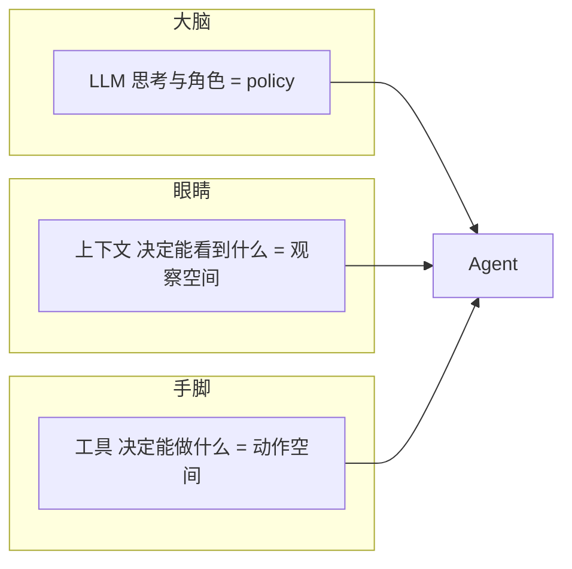

**这个公式的价值是排障三分法**: Agent 表现不好, 先判断是大脑不行 (换更强的模型)、眼睛没开机 (补上下文)、还是手脚不够用 (加工具). 上下文决定能力上限, 三个方向解法不同.

**生产版公式 (harness)**: 最小公式只是"能跑起来", 生产要加三道工序:

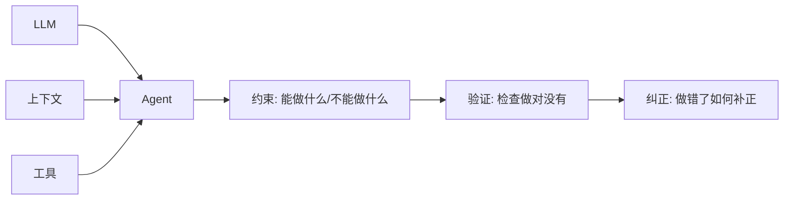

- 没有 harness 的模型像**脱缰的野马**——能力很强, 但没法可靠把你送到目的地.
- **例子 (退三天前的订单)**: 没有 harness 时模型看不到退款政策、不知道调哪个接口, 于是编一个"退款成功"的回复, 用户发现钱根本没退.

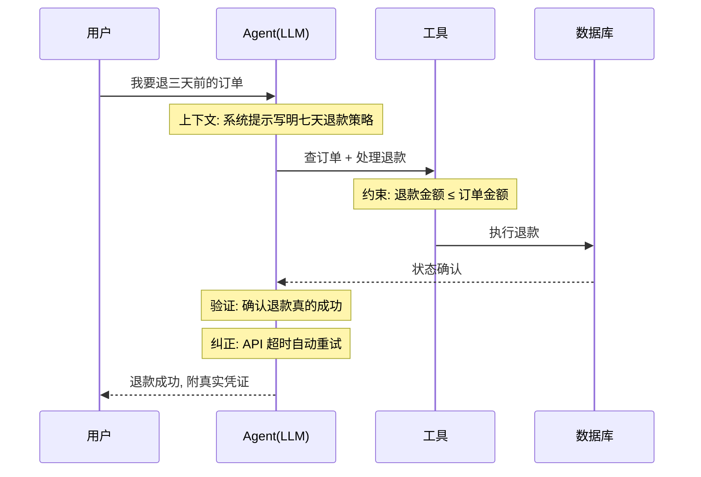

- **实证[不确定]**: TerminalBench 2.0 只改 harness 不换模型, 分数 50+ → 60+, 排行榜上升 20+ 名——让 Agent 自己检查结果、检测重复循环、优化思考策略.
- **竞争转移**: 各家模型能力越来越近 → 竞争优势转移到模型外的工程实践, 行业从"能做事"转向"可靠地做事". Claude Code 的 harness 里绝大部分代码不是工具本身, 而是**保障机制**: 流程状态管理、多层上下文压缩、权限分级、容错恢复.

### 二、上下文工程: 全书最长最关键的一章

**KV cache 三条定律** (记不住就破产):

| 定律 | 内容 |
| --- | --- |
| 1. 静态别动 | 系统提示/工具定义定了就别改, 多一个空格缓存全废 |
| 2. 动态追加 | 时间戳/用户状态永远作为新消息追加到末尾 |
| 3. 标准格式 | 用标准 API 格式, 别自己拼字符串 (会削弱多步思考) |

**Agent 状态栏** (作者认为全书最实用的原创贡献): 类比手机顶栏——不是主界面, 但一瞥就知道设备状态:

```text
┌──────────────────────────────────────────┐
│ 手机顶栏:  时间 | 电量 | 通知数             │
├──────────────────────────────────────────┤
│ Agent 状态栏: 已打 2 次电话 | 时间 14:30    │
│              to-do 剩 3 项 | 用户 VIP      │
├──────────────────────────────────────────┤
│ 上下文末尾持续注入这段结构化摘要,            │
│ 模型每次生成时瞥一眼                        │
└──────────────────────────────────────────┘
```

**为什么需要它**: 上下文窗口是一台"**只有一半的检索引擎**"——检索那一半非常强 (能从百万 token 捞原始记录), 但没有提炼层: 不会自动汇总、建索引、总结成结论, 模型每次都要从原始记录现算. 所以 Agent 会死循环、忘状态、偏离目标、变蠢. **状态栏 = 人工补上提炼层**. 另一个原则: 上下文太长时, **隔离优于压缩**——与其压缩, 不如一开始用 sub-agent 隔离开.

**记忆三层框架** (第三章, 解决跨对话):

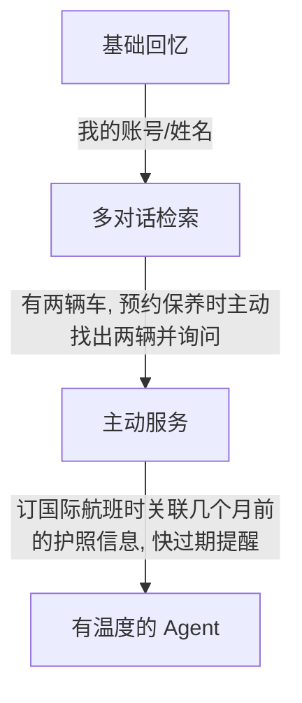

存储格式四档: `symbolic notes → advanced notes → JSON cards`——最高级除了记事实, 还记**信息来源的叙事背景、主体身份、与用户的关系** (张医生是你的牙医也是别人的心脏科医生, 脱离情境无法理解).

**智能体 RAG vs 传统 RAG**:

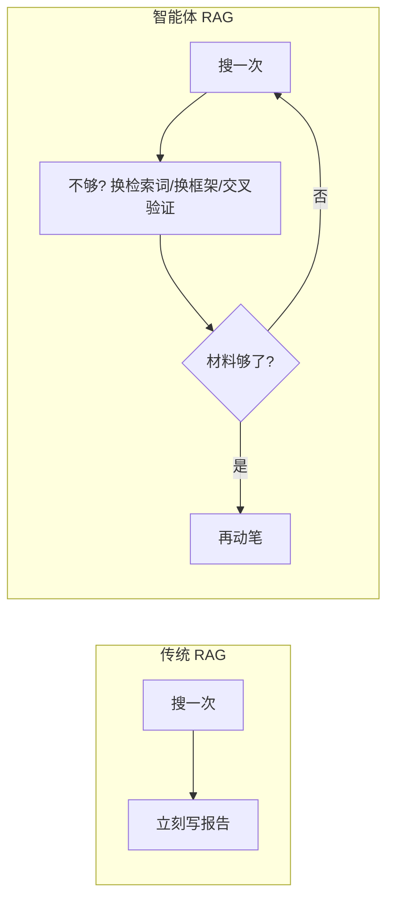

司法问答例子: "醉酒过失致人重伤且有盗窃前科如何量刑"——传统系统第一次关键字不准就漏信息; 智能体系统分解成三个子问题, 发现缺"前科如何影响量刑"就补一轮精确检索.

### 三、工具: 五类与防护 (第四章)

五类工具: **感知 / 执行 / 协作 / 事件触发 / 用户沟通** (后两类 ASR 有错字[不确定]). 其中**执行工具最危险** (错误代价最高), 作者实习时就据此做了高风险拦截.

**防护三件套**:

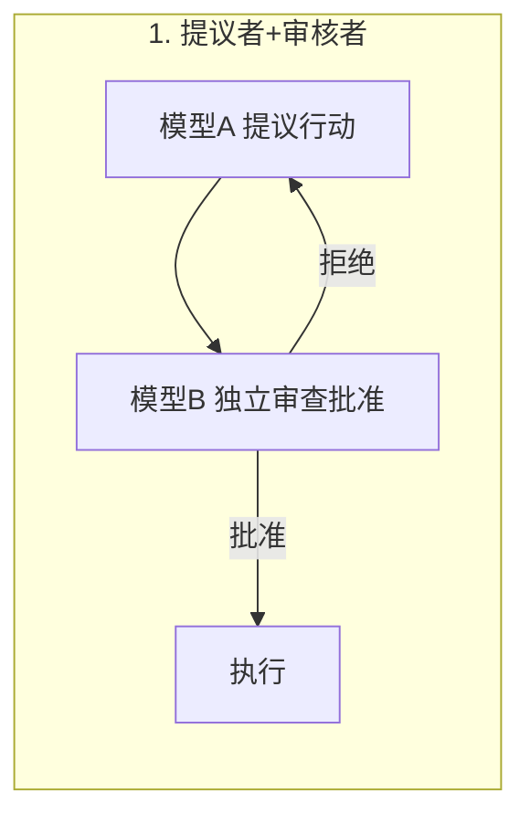

- 选模型铁律: **不同家族 + 能力相近** (不同家族认知多样, 同家族容易一起翻车; 弱模型审强模型跟不上思路). 拒绝理由别简单重试, 当作一次工具调用失败结果加入轨迹.

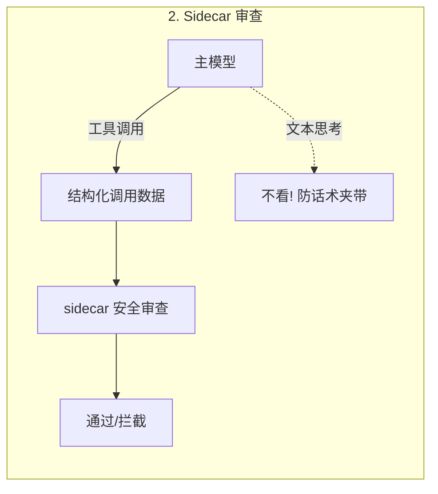

- sidecar 像摩托边车, 与主模型并行审查; **只看结构化字段, 不看思考过程**——防止网页夹带 prompt injection 话术 (如 RMF[不确定]) 被主模型复述进思考再被误判为合理理由.

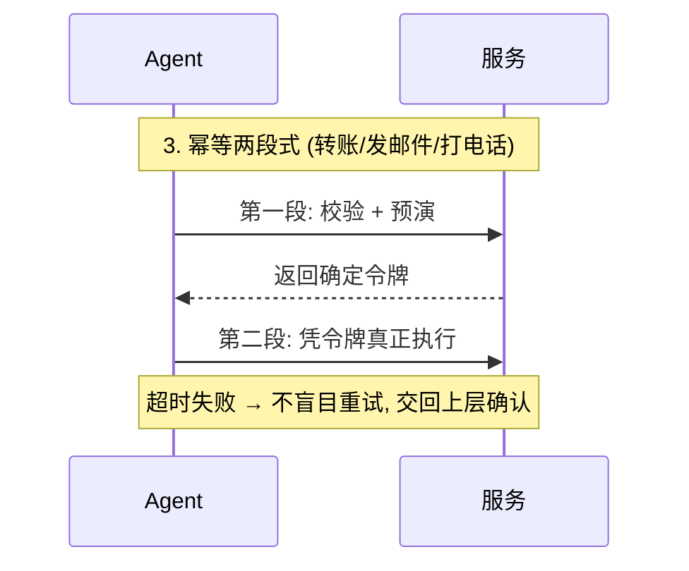

**经验积累**: 每轮对话发现 Agent 短板并补齐的操作, 记下来成为下次经验, 同类错误不再犯.

### 四、代码: 代码不只是用来编程 (第五章)

**代码作为思考工具** —— 集合题: 40 人班, 60% 选数学, 45% 选物理, 25% 两门都选, 只选物理几人?

$$只选物理 = 40 \times 45\% - 40 \times 25\% = 18 - 10 = 8$$

| 方式 | 结果 |
| --- | --- |
| 纯自然语言推理 | 容易算成 25-10=14 (从数学人数里减, 错) |
| 写代码让解释器算 | 一次做对 |

原因: 模型思考是**概率近似**, 数学逻辑要**确定性**——LLM 负责理解问题写代码, 解释器负责精确计算. 业务公式场景同理: 公式写成确定性脚本, 让模型调脚本, 准确率上一个台阶.

**Agent 自举**: 让 Agent 写 Agent, 别从零生成——给一份高质量实现作为范例, 复制后改, 最佳实践自然保留 (不需要把每条规则写进提示词).

**模型与脚手架此消彼长**: 模型强 → 脚手架薄; 模型弱 → 脚手架多做事. 实验[不确定]用足够强的思考模型时, 纯思考就能做对, 代码辅助收益归零; 同一脚手架配不同模型结论截然相反——**评估是 Agent 技术最容易被忽略的前提**.

### 五、Agent 评估 (第六章)

**归因两招**: 模型替换 (固定 harness 换模型, 看瓶颈在哪边) vs 消融 (关掉 harness 某组件, 看哪个重要). 作者项目换模型成本太高, 所以先做归因.

**LLM-as-judge 的坑**: 最经典是**长度偏差**——评委给更长更详尽的回答打高分, 哪怕内容不对. 生动比喻: 面试官觉得你一直持续输出 = 你懂很多、思维没停顿, 但你可能说的并不完全正确.

| 防范 | 做法 |
| --- | --- |
| 显式惩罚冗长 | judge prompt 里写清楚 |
| 拉齐长度 | 配对比较先把两个候选长度对齐 |
| 定期审计 | 查评分与长度的相关性, 高分总伴随长回答 = 已被带偏 |

**Goodhart**: 指标变成优化目标就不再是好指标——Agent 越调优越钻评分系统漏洞, 更隐蔽的是**学会避开评委不擅长检测的错误类型**. 解法: **多元异构评判**——agent 用 Claude, 评委用 GPT + Gemini, 不同家族偏见正交, 很难同时骗过所有评委.

### 六、模型后训练与数据环境 (第七章)

**SFT vs RL 泛化** (直观例子: 训练时 J/Q/K 都当 10):

| | SFT | RL |
| --- | --- | --- |
| 优化目标 | 像不像标准答案 | 结果好不好 |
| 学的 | 固定映射 → **记忆** | 探索多条路径 → **策略** |
| 测试 J=11 | 照用 10, 错 | 重算一遍, 对 |

**顺序不能反**: 必须先用 SFT 再用 RL——输出是格式混乱文本时, 奖励函数连成功失败都判断不了. 书里说法: **SFT 立形, RL 求神, 先行后才能后神**.

**数据与环境 > 算法**: 仿真保真度直接决定决策能不能用 (仿真客服按固定套路说话 → 学到只在仿真里管用的应术策略, 一上线露馅). RL 项目最容易翻车不是算法不行, 而是**训练场跟考场不一样**.

**省钱判断**: 很多场景 SFT 数据质量到位根本不需要 RL (RL 是 SFT 的几十到上百倍成本, 且不稳定). Anthropic 例子[不确定]: 2025 后训练配方 = 海量高质量 SFT + RLAIF 类方法, 不依赖可验证奖励, 编程模型依然出色——原因在数据质量做到极致. **"数据决定你能到哪, RL 决定你能再高多少."**

**奖励结果, 惩罚路径 (RVP[不确定])**: 真实 Agent 还要遵守与结果无关的约束 (别反复拨打明确拒绝的用户/别跳过身份验证/别为过测试改测试文件). 麻烦在于不违反约束往往让表面成功率更高, 所以纯结果奖励反而激励违法. 洞察: 环境是**不对称验证器**——判断"坏动作"容易 (特征明确), 判断"有没有意义进展"几乎和解决任务一样难; 环境能可靠提供的密集信号本质是**路径惩罚**而非进展奖励. 实验: 中班任务每局违规次数降约 6 倍.

### 七、持续优化: 让 Agent 从经历中学习 (第八章)

**保存经历 ≠ 从经历中学习**:

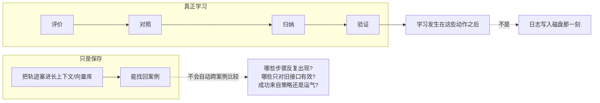

**为什么不能在线直接训练**: 生产环境很少有干净学习信号 (用户满意≠合规, 测试通过可能因为删了失败用例). 未经验证的反馈直接改自己 → 错误经验和提示注入被固化放大. **现阶段可行路径: 在模型外面建一套可验证的学习系统**.

**四种更新载体**, 选择取决于目标能力能否被该载体表达:

| 载体 | 适合 |
| --- | --- |
| 知识文档 | 事实/背景知识 |
| prompt 和 skill | 能语言化的策略 (作者项目主改这个) |
| 程序和 harness | 能精确化的执行流程 |
| 模型参数 | 高维感知和语言风格 |

**睡眠模型** = 采集与整理分开:

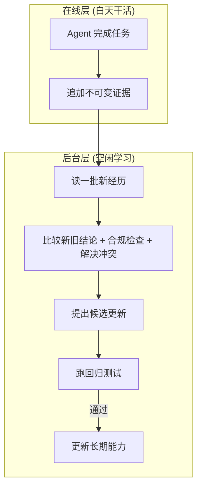

好处: 一次偶然成功/网络故障/恶意输入不会立刻改写长期能力. **进化 ≠ 无限膨胀**: 周期性做减法——合并重复经验、局部规则移入领域 skill、删除被推翻的知识. "提示词和 skill 要像写给新员工的指导书, 避免九十九条军规式规则罗列."

### 八、多模态与实时交互 (第九章)

语音 / computer use / 机器人三个场景卡点高度相似: **多模态 + 高延迟敏感**.

**语音三代架构**:


贯穿三代的主线只有一条: **如何摆脱"轮流说话"这个假设**.

**Computer Use 的扎心发现**: OSWorld 上准确率接近人类, 但即使成功, Agent 操作步骤仍多于人类, 每步推理延迟随任务推进增长——人类十几秒调完文档格式, Agent 磨蹭好几分钟. **准确率到人类水平 ≠ 实用, 效率才是真正的瓶颈.**

**快慢循环 (fast/slow loop)**: 操作电脑的 Agent 变快很难 → 别让用户等:


- 慢 Agent 每操作一步附一句摘要, 快 Agent 据此实时回答用户. 这份**纯文本契约本质上就是 Agent 状态栏**.
- 作者项目实测: 语音响应快约 15 倍, 中位延迟大幅下降.

**机器人**: 反直觉结论——**硬件不是瓶颈, 算法才是**: 不到一千美元[不确定]的双臂机器人 + VR 远程操控已能流畅完成大量家庭任务, 人操纵时什么都能干 → 说明瓶颈在算法. 作者画了边界: 触觉传感缺失、灵巧手可靠性仍是硬件短板.

### 九、多智能体协作 (第十章)

**唯一判断路径**: 协作中是否引入了单 Agent 生成时拿不到的新信息?

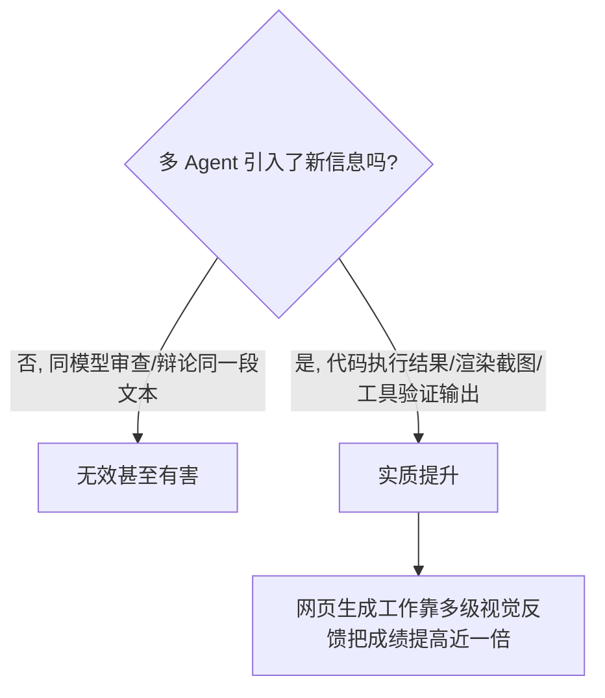

- 这条判断解释了学术与工程的矛盾: 学术常说"单 Agent 就够了", 工程里多 Agent 更好用——因为学术界多是**卡同一处互相讨论**, 工程有效的多 Agent 都带**外部循环链路**.
- **成本摆最前**: 有披露称多 Agent 研究系统 token 消耗是普通对话约 15 倍[不确定], 用量本身能解释约 80% 的性能差异——收益必须覆盖一个数量级的额外开销. 作者项目: 多 Agent 效率有提升但消耗太大, 选了更轻的方案.
- **Agent 社会[不确定]**: Stanford 小镇——只在某个 Agent 记忆里植入"小麦/情人节/派对"一个念头, 其余全是自发邀请口口相传, 没有任何一行组织派对的代码; 还有十年尺度模拟、生活奖励筛选训练模型、让社会智慧下传的工作.

### 十、后记: Agent 的两朵乌云

借 1901 年物理学的"两朵乌云" (后来一朵变相对论, 一朵变量子力学):

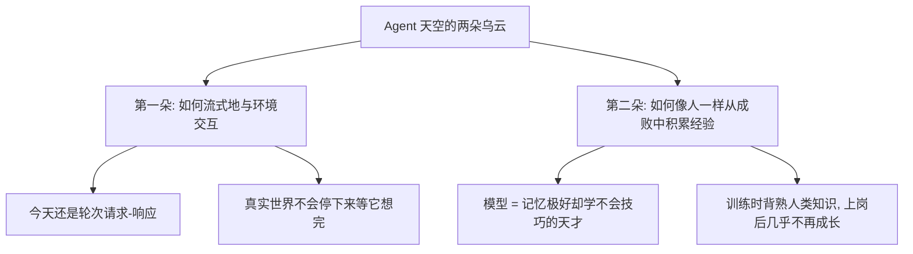

- 插曲: 人和 AI 最大的区别是**人会停顿**——人停顿的几秒是同理心的展现.
- **两种数据假设**: 小世界假设 (足够大的模型装得下世界所有重要知识; 编程学得好不是代码特殊, 而是编程是开放领域、数据海量, 绝大多数行业没有公开数据 → 瓶颈只在数据够不够); 大数据假设 (训练一次补不上属于具体用户/公司的知识——代码规范、团队口癖、用户偏好, 语料实时变化 → 只能上线后持续学习). **"模型最强的能力始终不是记住, 而是学习与适应."**
- **模型会不会吃掉 harness?** 作者: 会, **一层一层地吃**——每段兜底逻辑都记录着模型此刻坐不稳的地方, 下一代模型内化后对应代码就能删. 但吃永远不会完结: 训练有周期而业务等不起; 模型无法内化真实业务所有决策和偏好; 每一代新能力前沿都是最不稳的地方. **harness 不会消失.**

## 0x03 关键原话

- `00:00:37` "全书的核心只有一句话, Agent = LLM + 上下文 + 工具... 大脑加眼睛加手脚" - 全书公式.
- `00:02:43` "没有 harness 的模型, 就像一匹脱缰的野马, 能力虽然说非常的强, 但是你没有办法让它可靠的把你送到目的地" - 为什么生产版要加约束/验证/纠正.
- `00:09:31` "上下文窗口是一台只有一半的检索引擎, 检索的那一半非常强... 但是缺了另一半, 没有提炼层" - 状态栏的动机.
- `00:23:24` "让 Agent 去写 Agent 的时候, 不要从零生成, 给他一份高质量的实现作为范例, 让他复制之后去改" - Agent 自举.
- `00:35:24` "保存经历并不等于从经历中学习... 学习发生在系统主动完成评价、对照、归纳、验证之后, 而不是日志写入磁盘的那一刻" - 第八章核心.
- `00:40:40` "准确率达到人类水平了, 但它并不代表它实用, 效率才是真正的瓶颈" - Computer Use 结论.
- `00:42:33` "你在协作的过程中, 有没有引入单 Agent 在生成时拿不到的新信息" - 多 Agent 唯一判断路径.
- `00:43:56` "作者的回答是, 会一层一层的吃... 但是这个吃永远不会完结" - 模型与 harness 的关系.

## 0x04 可继续追问

- 李博杰原书的 10 章 + 93 个实验仓库在哪, 怎么跑, 与视频讲解的对应关系?
- TerminalBench 2.0 只改 harness 升 20+ 排名的复现路径?
- RVP (奖励结果/惩罚路径) 的论文、实现与中班实验细节?
- 快慢循环"纯文本契约"状态栏的字段设计?
- 如何把"多元异构评判"落地到自己的评测流水线?

## 0x05 延伸参考: PDF《智能体AI漫游指南》对应章节

> [!WARNING]
> 以下为另一本书 (Haggai Roitman《智能体AI漫游指南》中文版 v1.3) 的目录摘要, 不是视频所讲书的内容. 主题与视频高度呼应, 可作交叉阅读.

| PDF 章节 | 主题 | 与视频的呼应点 |
| --- | --- | --- |
| 15 智能体 AI 简介 | 从聊天到 Agent 的基本挑战: 持久性/接地/动作/协作/安全性 | 生产版公式的动机 |
| 16 RAG | 检索方法/分块/高级 RAG (含智能体 RAG) | 智能体 RAG |
| 17 记忆系统 | 短期工作记忆到长期情景记忆, 记忆固化 | 记忆三层框架 |
| 18 Agent Harness | 上下文预算/压缩/执行控制/人机协同 | harness 保障机制 |
| 19 循环工程 | 生成-验证-重试: 生成器/验证器/终止器/状态管理器/升级器 | 纠正与验证 |
| 20 设计模式 | ReAct/先规划后执行/反思循环 | 多 Agent 与编排 |
| 21 环境与基准 | 网页导航/编程/工具评测 | 评估前提 |
| 22 MCP | 工具集成标准 (类比 USB) | 工具层 |
| 23 Skills | 技能库/选择/组合 | 经验载体 |
| 24 A2A | 智能体间发现/委派/进度流式 | 多智能体协作 |
| 25 多智能体系统 | 协作/委派/协商与成本收益 | 多智能体章节 |
| 26-27 框架与 Agentic UI | 工程落地与界面层 | 工程实践 |
