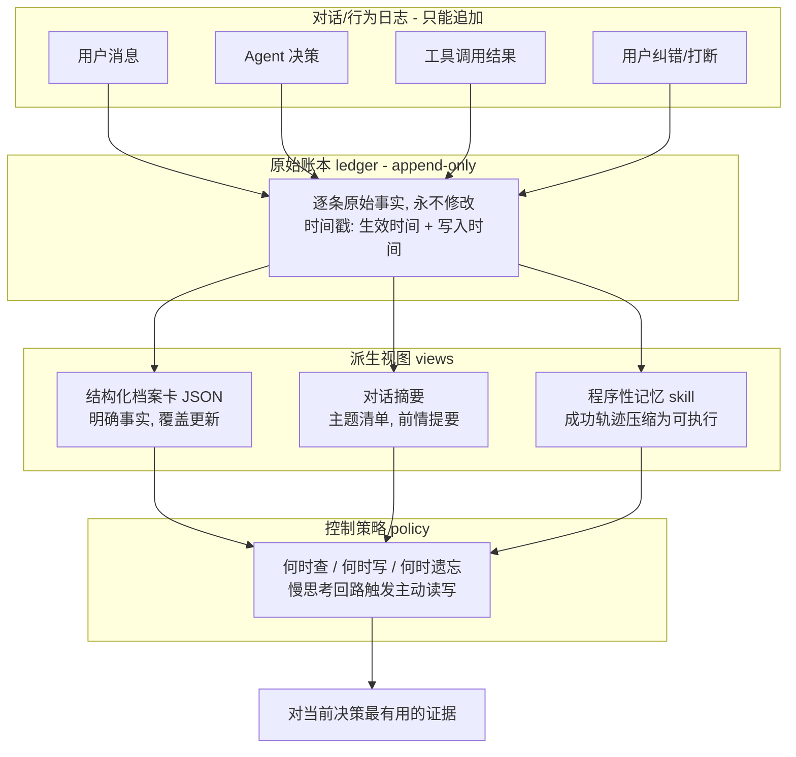
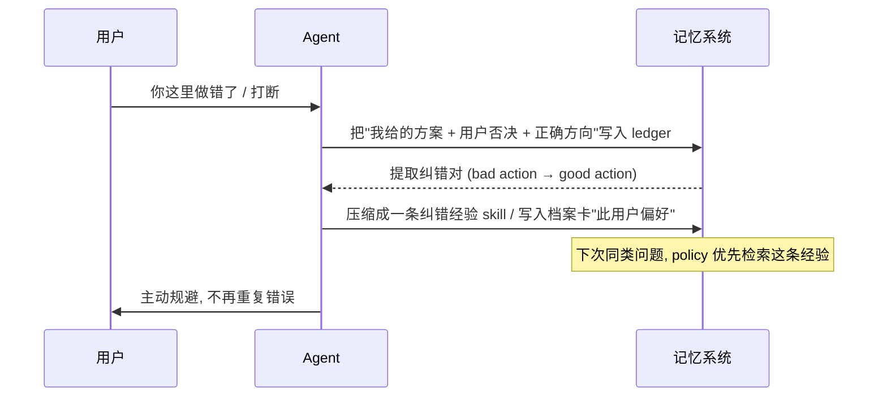

# AI Agent 对话记忆与知识库增量沉淀设计

> [!NOTE]
> 本文由 AI 辅助沉淀, 需要用户 review 后再提交.

## 0x00 背景

**要解决的问题**: 一个 Agent (如 AI 助手 / coding copilot) 与用户长期交互, 会产生海量对话日志. 日志本身不是知识. 我们真正想要的, 是把日志里**对当前决策/复用有长期价值的信息**, 增量地固化成一个"项目知识库", 并且:

1. **实时处于最新状态** —— 知识库要时刻反映最新事实, 不能越查越旧.
2. **保留历史状态** —— 最新是"现在", 但也要能回答"以前是什么", 不能被覆盖抹掉.
3. **沉淀纠错/打断经验** —— 用户中途打断、指出"你这里做的不对", 这类负反馈不能白丢, 要变成下次不再犯的经验.

本笔记以视频《面试官问你：Agent 的记忆机制应该怎么设计？》([BV1qCEu6zEqs](https://www.bilibili.com/video/BV1qCEu6zEqs/), 智泊AI-一粟, 2026-06-08) 的论点作为理论支点, 另一条主线是**把"对话日志 → 活知识库"落地成一套语言中立的机制设计**. 定位是"理论 + 通用机制", 不绑定某个具体仓库实现.

> 关联阅读: [AI Agent 设计原理与工程实践](../002-AI-Agent设计原理与工程实践/index.md) 已覆盖"记忆三层框架 / 智能体 RAG / 状态栏"; 本笔记聚焦视频特有的**四层架构 + ledger/views/policy 三件套 + 双时态 + 程序性记忆**, 并把它们落到"日志增量固化"这一具体工程诉求, 两者互补不重叠.

## 0x01 核心结论

> 设计口诀: **日志是流水, 知识是沉淀. 流水只追加, 沉淀分视图. 现状用覆盖(single source of truth), 历史靠双时态(bitemporal), 经验靠 skill 固化.**

可以用一张图概括整套心智模型:



- **四层/分值**: 记忆要分层 (会话原数据 / 结构化档案卡 / 对话摘要 / 滑动窗口), 明确事实与模糊上下文**分开处理**, 系统可控性才高.
- **最小可用三件套**: 底层存 append-only 的 ledger, 上层通过 views 投影成大模型看得懂的形态, 顶层用 policy 决定读/写/忘.
- **最新 & 历史要并存**: 动态状态用"覆盖更新"维护 `single source of truth` (实时最新); 需要回溯的事实用"双时态时间戳"保留快照 (回答以前是什么), 两者按事实性质分工, 不是二选一.
- **纠错必须闭环**: 用户纠错/打断的轨迹不能只当日志堆着, 要压缩固化成程序性记忆 (skill), 否则同样的坑会反复踩.
- **不要迷信向量库**: 纯向量检索兼顾不了"精确字段调用"和"时间先后", 对需要确定性的业务, 结构化/覆盖/快照比检索更可靠.

## 0x02 关键细节

### 一、为什么"只用向量数据库存历史对话"是个坑 (视频开场)

> 视频 `00:00:13` 直言: 如果脱口而出"用向量数据库存历史对话 + 余弦相似度捞相关内容拼进 prompt", **和 90% 的候选人一样, 拿不到高分, 还会被打上"只会照搬开源 demo"的标签**.

两个致命缺陷 (`00:00:58` ~ `00:02:39`):

| 缺陷 | 现象 | 反例 |
|---|---|---|
| 模糊匹配 vs 精确调用冲突 | 检索返回长篇历史, 模型要"再读一遍去猜", 业务线上啰嗦且易错 | 买车场景, 只需确认"用户最终预算多少"——本应精确字段命中, 却捞一堆废话 |
| 时间盲区 | 新旧信息像"两张纸条一起被摸出来", 模型分不清先后该听谁的 | 昨天预算 5 万, 今天涨到 8 万, 向量检索两条一起返回, 模型懵 |

**正确做法** (`00:02:32`): 动态状态应**覆盖旧值**, 只保留当前最新唯一真相, 工程上叫 `single source of truth`. 视频 `00:04:51` 补刀: 在这个行业标杆的记忆系统里, **完全没有向量数据库出场**.

### 二、四层记忆架构 (直接回答"对话日志怎么分") `00:02:59`

| 层级 | 内容 | 生命周期 | 你日志里的对应物 (落地映射) |
|---|---|---|---|
| ① 会话原数据 | 时区、设备等当前环境信息 | 当前轮用完即弃 | 本次会话的头 / 环境快照, 不进长期知识库 |
| ② 结构化档案卡 (JSON) | 明确事实: 职业、预算、喜好 | 有变更就**覆盖更新** | "用户预算=8万"、"项目技术栈=..." 这类确定性字段 |
| ③ 对话摘要 | 闲聊主题浓缩成清单, 像"上集前情提要" | 周期性摘要 | "上次聊到 XX 方案, 结论是 YY" |
| ④ 滑动窗口 | 眼前几轮对话 | 超 token 上限丢弃最旧 | agent 当前 working memory |

**关键启示**: 你的"对话日志"不能整段塞进知识库, 而是要在这四个层级里**分流**——确定性事实进 ②, 话题脉络浓缩进 ③, 环境噪音直接丢 ①, 只有真正可复用的证据才需要固化.

### 三、增量固化: ledger → views → policy 三件套 `00:06:24`

> 视频 `00:06:24` 起: 工程上必须搭一个"系统三件套"。

1. **ledger 原始账本**: 只能**追加 (append-only)**, 绝不修改; 像银行流水. 这是底线——以后 agent 出错胡言乱语时, 靠它当黑匣子溯源排错 (`00:06:36`)。
2. **views 派生视图**: 把死板的底层数据加工成大模型能看懂的格式, 如知识图谱、按时间线整理的画像 (`00:06:53`)。
3. **policy 控制策略**: 记忆系统的**大脑**, 决定何时查资料、何时写记录、何时主动遗忘 (`00:07:10`)。没有它, 系统几天内就变成"巨大的数据垃圾场"。

**对你的落地的启示**: "增量沉淀"的正解不是"新日志到了就追加到知识库", 而是:

```mermaid
flowchart LR
    A[新对话片段] --> B{过滤/判重<br/>policy 决定值不值得写}
    B -- 确定性事实 --> C[写 ledger 快照<br/>→ 更新 ②档案卡(覆盖)]
    B -- 话题脉络 --> D[写 ledger<br/>→ 增量merge ③摘要]
    B -- 成功轨迹 --> E[写 ledger<br/>→ 压缩成 ③skill]
    B -- 环境噪音/低价值 --> F[仅留 ledger<br/>不进长期视图]
```

### 四、实时最新 & 历史溯源: 覆盖 + 双时态 `00:08:41`

你的诉求 "实时最新状态 + 记录之前是什么状态" 恰好对应视频两个机制:

**单事实来源 (覆盖)**: 简单确定性字段 (预算=8万), 新值直接覆盖旧值, 读时永远唯一真相 (`00:02:32`)。适合: 用户当前偏好、profile 字段。

**双时态时间戳 (bitemporal)**: `00:09:34` 起——每条记忆打上两个截然不同的时间戳:
- **生效时间 (valid time)**: 这条记录在现实世界什么时候开始成立 (张三从 A 公司跳到 B 公司的现实时点)。
- **写入时间 (assertion/transaction time)**: 它什么时候被写进系统。

以后查资料时, 系统在底层套一个**时间切片硬约束** (`00:09:46`), 明确告诉模型"这是张三现在的状态, 那是他过去的状态, 按时间线理清楚别搞混" (`00:10:02`)。

> 为什么不能只覆盖: 视频 `00:09:23`——如果直接把 A 公司记录删掉, 过两天用户问"张三去年在哪家公司", 就彻底失忆了。所以"该覆盖的覆盖 (现状字段), 该保留的保留 (历史任职)", 用**是不是必须回溯**来决定用哪种机制。

### 五、纠错/打断经验沉淀: 程序性记忆 `00:10:16`

> 视频 `00:10:16`: 决定你的 agent 是**书呆子还是熟练工**的关键, 叫**程序性记忆**——普通检索在捞"某个公司报销流程是什么" (陈述性事实), 收益有限; 真正高级的记忆要记"怎么干"。

视频例子 (`00:10:37`): agent 遇到代码报错 → 查文档改 → 又报错 → 折腾三四轮 → 终于修好。如果只有普通记忆, 下次遇到一模一样 bug 大概率重新走一遍痛苦流程, 浪费 token。聪明的系统把这次**真正成功的交互轨迹**像漏斗一样过滤掉废话,**压缩固化成一个可执行的 skill (一键执行宏指令)**, 下次直接弹"哦这坑我上周踩过, 用那套改法就行"。

**映射到你的"用户打断/纠错"场景**: 用户中途打断说"你这里不对", 本身就是一条**最宝贵的轨迹**:



**纠错沉淀的三种落地形态** (由设计推演, 视频只强调 skill 固化的原理):
- **规则型**: 改写项目规范/文档某个条目 (结构化档案卡的"规则"字段) → 全局生效。
- **偏好型**: 记录"用户不喜欢 X 风格 / 偏好 Y" → 档案卡 profile。
- **技能型**: 把"这次怎么改对的步骤"固化成可复用 skill/宏 → 程序性记忆。

### 六、主动记忆需触发"慢思考回路" `00:07:46`

> 视频 `00:07:46`: 大模型本质是直觉系统 (system one), 会本能顺着往下生成; 真正的 agentic memory 是把读写变成 agent 可**主动调用**的工具 (外置机械臂), 遇到复杂任务时触发 system two 慢思考——"这问题有点复杂, 我得去资料库翻一翻用户底细, 拿到证据再回复" (`00:08:08`)。

对知识库增量沉淀的启示: **写入阶段**要有显式的"值不值得沉淀"信号 (可能靠用户确认/高价值事件触发), **读取阶段**要给 agent 一个显式工具去查而非被动堆上下文。这正好呼应 `002-AI-Agent设计原理与工程实践` 里的"状态栏"和"智能体 RAG"思想。

## 0x03 待验证 / 可继续追问

### 可靠性备注 (Transcript 证据链)

- **Transcript 来源**: **funasr-asr** (本地 FunASR 语音识别)。Bilibili 无公开字幕 (需要登录态), 故走 ASR。
- **ASR 专有名词错音风险**: 视频口述中的 OpenAI(→"open RE / open nine")、ChatGPT(→"Cigpd / chatTPT")、ledger(→"ledure")、bitemporal(双时态) 等专有名词均有 ASR 错音, 上文已按语境还原并加英文原词标注, 不能视为逐字精确转录。
- **结尾时间戳折叠**: `10:37~10:44` 之后的内容被压缩进单一重复时间戳块, 内容完整但精确分点时间不可可靠引用, 故 `0x02` 末尾段不强行标注逐秒时间点。
- 本笔记结论均来自 transcript, 未依据标题/简介/评论补内容。

### 关联阅读

- [AI Agent 设计原理与工程实践](../002-AI-Agent设计原理与工程实践/index.md) —— 记忆三层框架、智能体 RAG、状态栏、harness 三工序。
- [obsidian-second-brain](../../002-项目学习/001-obsidian-second-brain/index.md) —— "活知识库 / 随输入自我重写 / 矛盾自动调和" 的哲学, 与本文"增量沉淀+覆盖+快照"是同一意图的两种实现路径。
- [001-Agent要懂的LLM基础知识](../001-Agent要懂的LLM基础知识/index.md) —— RAG 召回"宁少勿多"与上下文工程。

### 可继续追问 / 待验证点

- **双时态在具体存储里怎么做**: 两个时间戳是存两列, 还是用 event-sourcing / 快照表? 查询时的 time-slice 怎么写才不拖性能? (视频只讲了概念, 未给实现)
- **ledger 的"只能追加"与"覆盖视图"如何不做坏**: 覆盖只发生在 views 投影层, ledger 永不改——这个分离在实现时容易漏, 怎么用约束保证。
- **纠错 skill 的判定边界**: 怎样避免把偶发噪音 (用户心情、临时需求) 误沉成"全局规则"或"用户偏好"? 需要什么样的确认/撤销机制。
- **增量频率策略**: 每条消息都跑过滤+更新 vs 按会话/周期批量沉淀, 在成本和及时性上如何取舍。
- **是否需要向量库兜底**: 视频主张克制, 但知识检索类场景 (大量非结构化资料) 是否仍需向量召回作补充——这是边界而非二选一。

## 概要

> 你的 Agent 记住的应该是什么? 是一堆日志, 还是一条**能从过去通向当下决策的链子**? 如果一个用户今天改了偏好、明天打断纠正了你, 你的系统是"秒更新又能回答昨天", 还是两者顾此失彼? 读懂这篇, 你会知道: 日志该追加、知识该分视图、现状该覆盖、历史该双时态、错误该变成 skill——而这一切, 不始于某张精美的架构图, 而始于你决定**哪条信息值得被邀进知识库**.