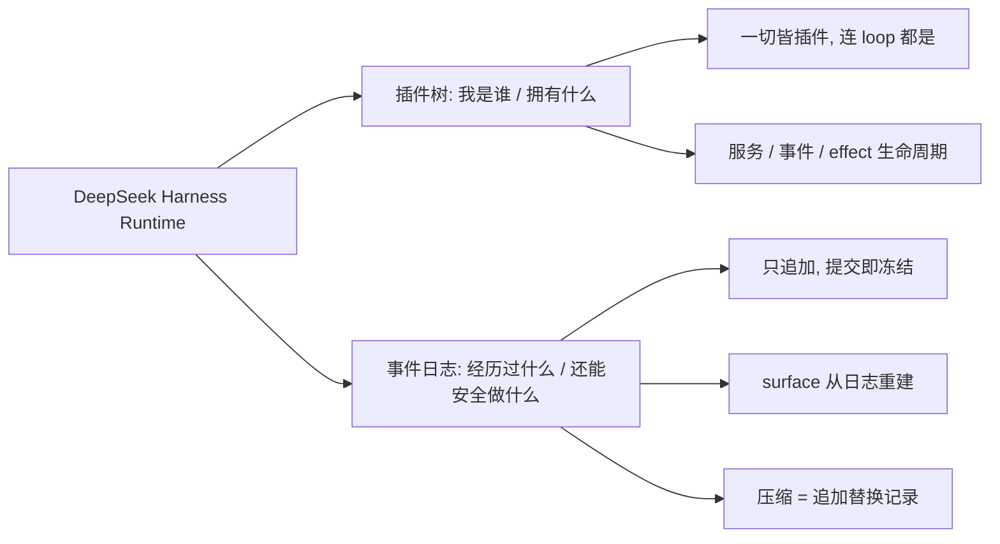
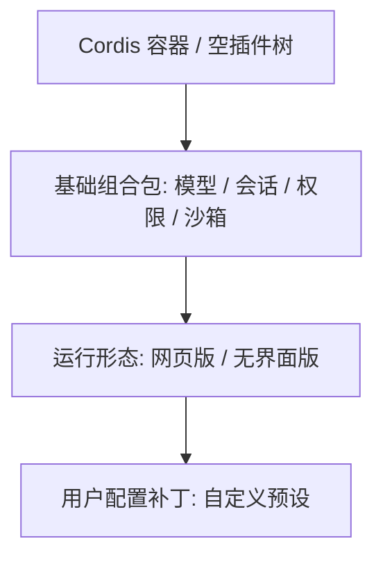
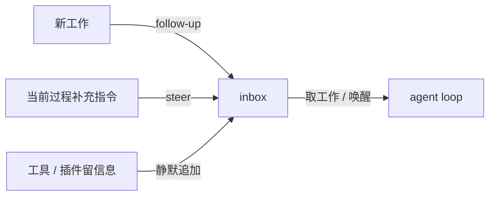
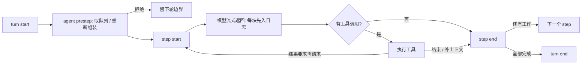
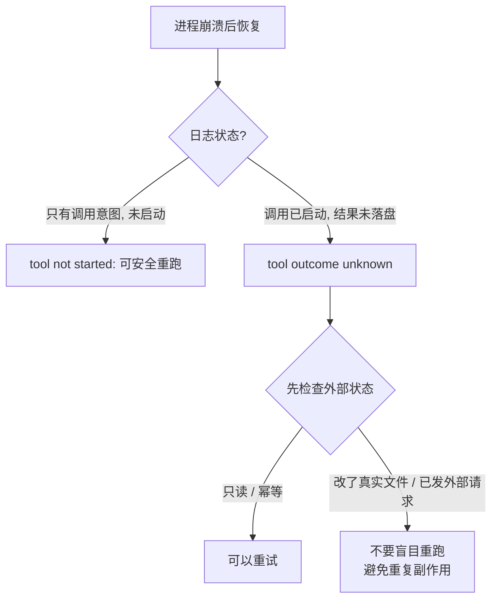
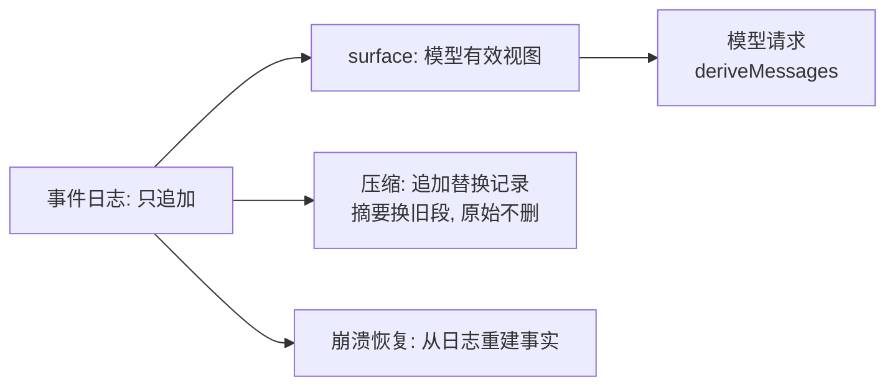
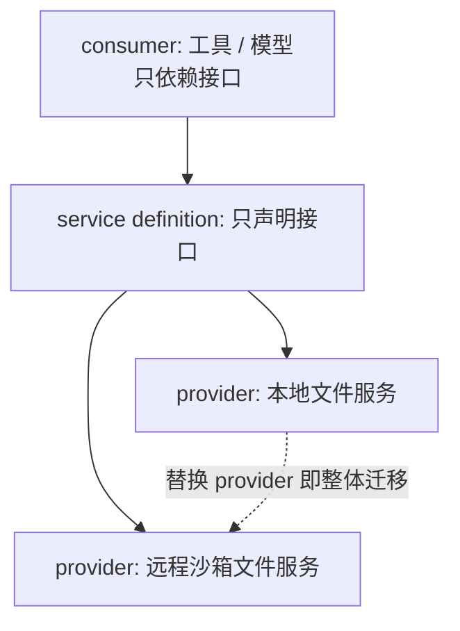
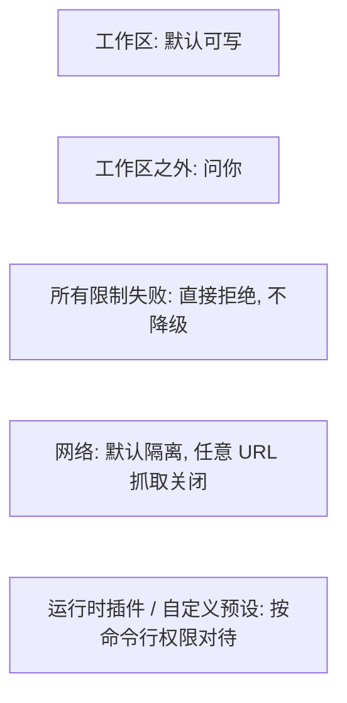

# DeepSeek Harness设计思想: 插件树与事件日志

## 0x00 这篇文章要回答什么?

几十行代码就能写一个能跑的 agent: 收一条用户消息, 拼好提示词请求模型, 模型要调用工具就执行工具, 再把结果放回上下文. 可一旦这个 agent 要**连续工作、修改真实文件、崩溃之后接着完成**, 问题就不再是"调用模型"了:

- 模型调用到一半进程崩了怎么办?
- 工具已经改了文件, 结果却没来得及写回, 还敢不敢重试?
- 几个工具可以同时执行, 哪些必须排队?
- 系统越来越复杂, 新增能力是不是每次都要改 agent loop?

本文讲的是 DeepSeek Harness 的设计思想: 它不是某一个 agent, 而是承载 agent 的**运行环境 (Runtime)** — 模型、工具、上下文、权限、持久化、交互界面都由它组织, 运行过程还能被替换、恢复、回放. 为什么一个简单的 loop 会长成一整套运行时? 它的回答收敛成两根支柱: **插件树决定"这个 agent 是谁、此刻拥有什么能力"**, **事件日志决定"它经历过什么、崩溃后还能安全地做什么"**.

> [DeepSeek Harness Runtime 整体图 #ppt ##w100%##](dsh-runtime-design.html) — 一眼看懂两大主线: 插件树决定 "我是谁", 事件日志决定 "我经历过什么". (可全屏 / 缩放)

> 关联阅读: [DSH Agent Loop 源码剖析](../003-DSH-Agent-Loop源码剖析/index.md) 讲同一套设计在代码里的真实落地 (ReactLoopAgent / inbox / 事件链); 本文讲的是设计思想的整体图景, 两者互为印证.

## 0x01 核心结论

DeepSeek Harness 的核心答案可以浓缩成一句: **"everything is a plugin" — 所有东西都是插件, 连 agent loop 本身都是**; 再配一份**不能被绕开的事件日志**作为唯一事实源. 理解了这两件事, agent loop、工具、各种能力就不再是散落的功能, 而是同一套运行时原则在不同位置上的具体实现.

推导出的可复用判断:

1. **Agent 的复杂度不在模型调用, 而在"归属"**: 能力由谁提供、插件从什么时候开始生效、副作用到底有没有发生、模型实际看见过什么、崩溃以后还能相信哪些事实. 谁把这些归属管清楚, 谁就拿到了复杂 agent 的钥匙.
2. **Loop 应当做薄**: agent loop 的主要职责是维护状态变化和事件边界; 上下文压缩、权限检查、工具超时都尽量通过扩展点接入, 而不是不断给 loop 加新分支.
3. **插件不是开关, 是有生命周期的能力单元**: 它向容器提供服务、监听带类型的事件, 并登记自己引起的副作用 (effect) 与清理方法; 卸载时 effect 按相反顺序回收, 服务撤销、监听器移除、子插件与后台任务一并结束.
4. **每步重新组装, 而不是启动时组装一次**: 每个 step 都重新组装系统提示词、运行时上下文和工具定义, 所以工具刚增删、预设刚切换、适配器刚热更新, 下一次请求就拿到当前的真实状态.
5. **日志与模型所见必须同源**: 模型能看见的内容必须能从会话日志里重新生成. 许多 agent 项目"日志归日志、模型读另一份内存消息数组", 两者会逐渐分叉; harness 选择相反: 用户消息、流式数据块、组装后的回答、工具调用与结果、轮与步骤边界, 全部进同一条只追加不改写的事件流.
6. **压缩是追加, 不是改写**: 对话太长时系统追加一条替换记录, 用摘要替换有效视图 (surface) 里的一段旧内容; 模型看到的是摘要, 而原始数据块与完整消息仍留在日志里, 回放、审计、排障都不丢.
7. **崩溃恢复要区分"未开始"与"结果未知"**: 工具启动前崩溃记为 tool not started, 可安全重跑; 工具已启动但结果没落盘记为 tool outcome unknown, 不假定失败也不盲目重跑, 而是让模型先检查外部状态, 只有只读或幂等操作才直接重试.
8. **能力要收敛到接缝 (capability seam)**: 一项完整能力分成 service definition (只声明接口) / provider (实现接口) / consumer (只依赖接口) 三层. 上层工具只依赖统一服务, 不直接碰底层实现; 想迁移执行环境, 同时替换几个 provider 即可, 不用维护本地/远程两套代码.
9. **能力自由组合, 边界仍由沙箱守**: 沙箱默认只允许写工作区, 越界要问人; 所有限制都失败时直接拒绝, 绝不悄悄降级成不受限运行. 但当前沙箱只管文件、不等于网络隔离, 任意 URL 抓取默认关闭.
10. **它仍是开发者预览版**: 即使有 100% 行覆盖 + 真实模型协议 + 跨平台沙箱测试, 格式仍随时可能变, 适合研究与搭建本地 agent 平台, 不宜当已稳定的生产基础设施.

## 0x02 关键设计细节

### 一、一切皆插件: 从一棵空的插件树开始

harness 启动时从一棵空的插件树开始叠加, 分三层:

1. 最底层是基础组合包: 负责模型和会话、工具和权限、沙箱和持久化.
2. 第二层根据运行方式加载: 网页版 (Web) 或**无界面版** (headless).
3. 最上层再叠一份用户自己的配置补丁.

想换模型就提供新的适配器; 想把本地执行迁到远程沙箱就替换对应的能力提供方; 想让某类会话少用几个工具就换一份 agent 预设配置. **整个产品本身就是插件组合出来的**, 插件树决定系统此刻拥有哪些能力.

插件的生命周期设计 (effect 清理) 是它与"静态开关"的分水岭:

- 插件可以向容器 (Cordis, DSH 以 @deepseek-ai/cordis 依赖引入的插件容器框架) 提供服务、监听带类型的事件.
- 插件会登记自己引起的副作用和对应的清理方法 (effect).
- 卸载时 effect 按**相反顺序**收回: 服务被撤销、监听器被移除、子插件和后台任务一起结束.
- 插件加载后, 工具出现在统一目录里; 卸载后后续请求立刻看不到.
- 适配器热更新时, 已经开始的请求继续用旧版本, 后续请求切到新版本 — 一致性不需要散落各处的条件判断维持.

### 二、输入队列: 三种进料方式

一条用户请求进入 harness, 先到输入队列 inbox. 队列支持三种动作:

| 动作 | 语义 | 是否唤醒 agent |
| --- | --- | --- |
| follow-up | 把新工作放到下一轮, 并唤醒 agent | 是 |
| steer | 在当前工作过程中补充指令, 让 agent 在下一个步骤处理 | 是 |
| 第三种 (静默追加, 视频未给名称) | 只给下一步补充上下文, 不主动唤醒 | 否 |

第三种适合让工具或插件先留下信息, 等下一项真实任务到来时再一起处理.

### 三、turn 与 step: 两层执行边界

harness 把执行过程分成轮 (turn) 和步骤 (step):

- **step**: 包含一次模型请求, 以及这次回答触发的工具调用.
- **turn**: 范围更大. agent 领取一批工作后, 可能连续经历多个步骤 — 直到没有工具结果、引导消息或插件要求继续处理, 这一轮才结束.

每一轮开始, 系统先写入 turn start 事件, 随后进入 agent prestep 阶段: 取输入队列里的消息, 重新组装系统提示词、运行时上下文和工具定义. 关键点是**每个步骤都重新组装**, 而不是 agent 创建时只做一次. agent prestep 还可以改写或拒绝这批输入; 即使输入被拒绝、最终没发出模型请求, 这次尝试也留下完整的轮边界.

请求通过后, 系统写入 step start 事件和用户消息, 再从会话日志里推导出模型应该看见的历史, 一起形成**可重建的请求**. 模型开始流式返回内容, 每个数据块都先写入日志, 再由消息组装器形成完整回答. 如果没有工具调用, 这个 step 就完成了; 如果有, 调度器执行工具, 工具结果可能要求再次请求模型、给下一步补上下文, 甚至直接结束. 只要还有待处理内容, loop 就进入下一个 step; 真正结束前还会触发 stop 扩展点, 给最后一次继续处理的机会; 所有任务完成后写入 turn end 事件.

### 四、事件日志: 唯一事实源

插件树回答"系统此刻拥有什么能力", 事件日志回答另一个更难的问题: **agent 到底经历过什么?**

很多 agent 项目也会记日志, 但真正请求模型时读的是另一份内存消息数组 — 日志、网页、磁盘记录和模型实际看见的上下文很容易分叉. harness 选择相反的做法:

- 模型能看见的内容必须能够**从会话日志里重新生成**.
- 用户消息、模型流式返回的数据块、组装后的完整回答、工具调用、工具结果、轮和步骤的边界, 全部进入同一条**只追加、不回改**的事件流.
- 每次追加事件时, session 先生成一份无损的 JSON 快照, 无法可靠保存的数据会被拒绝; 通过检查后事件获得连续编号并被**深度冻结**; 事件一旦提交, 后面的监听器即使报错, 也不能撤销已经发生的事实.
- 模型历史也是从这条日志推导出来的: 系统选出当前应该进入模型上下文的那部分, 这个有效视图叫 **surface**.
- 压缩不回头删除旧消息: 追加一条替换记录, 用摘要取代有效视图里的一段旧内容. 此后模型看到摘要, 而原始数据块和完整消息仍保留在日志中 — 回放、审计、问题定位都不会丢.

这套设计在进程崩溃时尤其重要 (作者现场让观众扣 1/0 投票"自己的 agent 有没有半路崩过"). 两种崩溃场景:

1. 进程在工具**真正启动以前**崩溃: 恢复后系统明确记下 tool not started, 模型知道这个操作没有发生, 必要时可以重新执行.
2. 日志里已有工具调用、却没有保存下来的执行结果: 工具**可能已经改完文件, 甚至已经向外部系统发出请求**. 此时系统不假定它失败, 也不直接重跑, 而是补上一条 tool outcome unknown — 恢复提示会要求模型先检查外部状态, 只有只读操作或重复执行也不会产生额外影响的操作才适合直接重试.

普通运行日志主要帮人追查问题; 这里的事件日志还**直接决定 agent 下一步怎样行动**, 才不会重复制造副作用. 同一条事件流还能支撑会话恢复、分叉和网页回放, 每个入口不必各自维护一套历史解释方式.

### 五、能力接缝: 让"迁到远程沙箱"变成一个配置

插件变多以后, 依赖关系可能缠在一起. harness 用一条清晰的能力边界来控制依赖, 叫 capability seam (能力接缝). 一项完整能力通常分成三层:

1. **service definition**: 只声明接口.
2. **provider**: 负责实现接口.
3. **consumer**: 只依赖接口来调用能力 — 面向模型的工具通常属于这一层.

文件系统是直观例子: 上层工具只依赖统一的文件服务, 不直接调用本地 node 文件接口; 命令行 shell、持久终端和语言服务器也都通过统一的子进程服务进入同一个执行环境. 好处是**只要同时替换文件服务和子进程服务的 provider, 就能把整个执行环境迁到远程沙箱**, 终端和语言服务器一起迁移, 不需要分别维护本地版和远程版两套实现.

同一条接缝也支撑多 agent: 系统可以在当前进程里新建 subagent, 也可以把任务交给外部服务器跑多 agent 工作流 — 不必把专用语法写进 agent loop.

### 六、工具调用管线: 每次调用都过同一道闸

工具不是"找到一个函数就直接运行", 每次调用都经过一条固定流程:

1. 系统根据当前 agent 的配置确定它能看见哪些工具, 并解析调用参数.
2. 调用进入 tool pre-execute 阶段: 权限插件可以允许、拒绝或要求人工审批. 随后还有一层**单项保护规则**, 它只能进一步收紧权限, 前面的策略不能绕过它.
3. 真正执行工具.
4. 执行完成后, 结果经过 tool post-execute 阶段: 插件可以在这里阻断结果、补充上下文, 或调整模型最终看到的内容.

结果处理也分两步:

- 成功结果先通过输出格式门禁, 成为结构明确的 JSON 数据.
- 工具自己的渲染器把同一份结果转换成模型需要的内容块, 并生成网页需要的展示信息 — 模型文字和网页卡片来自同一个标准结果, 不需要分别猜测工具输出的结构.

多个工具同时出现时, 顺序有明确含义: 确认可以并发的工具进入一个限制并发数量的执行池; 必须独占的工具形成屏障. 策略判断和最终写入日志的顺序, 仍然与模型给出的调用顺序一致. 如果任务被取消: 已经启动的调用要先结束或停止; 未启动的调用也会得到一条系统生成的结果 — 保证日志里不会留下"只有调用没有结果"的悬空记录.

### 七、边界与工程状态

- 能力可以自由组合, 但运行边界依然由沙箱和权限系统守住: 发行配置默认只允许写工作区, 超出范围就来问你.
- 如果所有可用的限制方式都失败, 系统会**直接拒绝执行**, 不会悄悄改成不受限制的运行方式.
- 这套沙箱目前**只管文件, 不等于网络隔离**, 任意网址抓取默认也没有打开.
- 能编写运行时插件的 Cordis 插件, 以及用户自己创建的预设配置, 都可以获得很高的系统能力, 应该按命令行需要的权限来对待.
- 项目设置了很重的工程检查: 核心运行时每个源文件要求 100% 行覆盖; 测试范围还包括真实模型协议、快照、浏览器和跨平台沙箱. 但它**仍然是开发者预览版**, 会话格式随时可能变化 — 适合用来研究和搭建本地 agent 平台, 还不能当成已经稳定的生产基础设施.

## 0x03 参考来源

- 视频: [DeepSeek Harness: 连 Agent Loop 本身都是插件, 凭什么? 揭秘智能体 Runtime 设计](https://www.bilibili.com/video/BV1cJb96cEg2/) — UP 主 唐国梁Tommy, 2026-08-16 发布, 约 12 分 28 秒; 本文唯一的内容证据来源.
- 项目: [deepseek-ai/dsh](https://github.com/deepseek-ai/dsh) — DeepSeek Harness 的 monorepo, 视频讲述的设计在 packages/core 等目录中有对应实现.

## 0x04 回顾与自查

读到这里, 值得先反问自己几个问题再决定是否回读:

- 我的 agent 半路崩过一次吗? 崩溃后我是怎么知道"哪些操作真的发生了"的?
- 如果让我给 agent 加一个"只能写 /workspace"的权限, 我要改 loop 本身, 还是能挂一个扩展点解决?
- 我的"会话历史"和"模型实际看到的上下文"是同一份数据, 还是已经悄悄分叉了?
- 换一个底层模型供应商时, 我是改一处适配器, 还是要在几十处工具调用里打补丁?

如果这些问题你心里没有明确答案, 那这篇视频值得看; 如果都有, 你已经理解了为什么 agent runtime 会从几十行 loop 长成一整套系统.