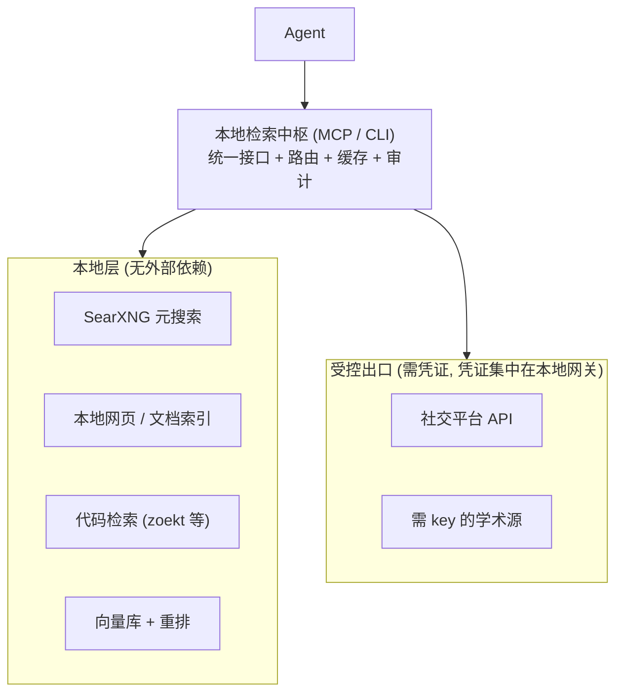

# 自建 Agent 检索栈: 本地化边界、凭证治理与可用性证明

## 0x00 背景

给 Agent 接检索, 很多人默认的做法是"买一个搜索 API 然后填 key". 但一旦把约束换成下面两条, 整个方案形态就变了:

1. **尽量完全本地自建** — 检索链路不依赖商业检索 API, 数据不出本机, 成本可预测, 不受第三方限流与条款变动摆布.
2. **凭证配置必须体面** — 社交平台终究要 token, 但如果接入指引只是"去某某页面创建应用, 把 client_id 和 secret 填到配置文件", 那这套东西不会有人真的用起来.

这两条约束放在一起会暴露一个被普遍忽视的事实: **"自建"从来不是全有或全无, 而且真正决定这套栈能不能长期活下来的, 往往不是检索算法, 而是凭证的获取与续期体验.**

本文回答三个问题: 自建的真实边界在哪、凭证配置怎么做才不劝退、以及如何证明这套自建栈比买 API 更值得.

## 0x01 核心结论

1. **先看已有的轮子: Argo 已经把本文大半需求做完了, 且以免密钥为主.** [Argo](https://github.com/taxueseek/argo) 是一个开源的"搜索 + 证据核验"工具, 实测支持 **157 个引擎, 其中 146 个不含密钥占位符 (keyless)**, 覆盖知乎 / B站 / 微博 / 小红书 / 微信 / Reddit / HackerNews / V2EX / 豆瓣 / arXiv / Common Crawl / Wayback 等. 它的官方定位就是"无 Key 自动走免费引擎 + 本地引擎", 并且**缺密钥不阻断路由**. 结论很直接: **在动手自建之前, 应该先判断 Argo 是否已经覆盖你的需求** — 本文第一节与第五节的结论, 它的取舍与本文结论高度一致.

2. **"免 token"是有层次的, 不能一概而论.** 我实测了 Argo 的 keyless 引擎, 真实存活情况差异很大: **稳定可用** (HackerNews、Bilibili、Bilibili 热搜、Crossref、PubMed、arXiv、Marginalia、世界银行、PubChem); **返回空但不算故障** (微博、小红书、搜狗微信、知乎热榜、豆瓣读书、Wayback — 多为需要登录态或被反爬拦截); **直接超时失败** (Reddit、V2EX、Gutenberg). Argo 官方 schema 自己也写明: **hackernews / v2ex / zhihu / bilibili 零密钥可用; twitter / reddit / weibo / xiaohongshu 依赖登录态或第三方 API, 可能返回空.** 所以"不需要 token"是**逐平台**成立的, 不是一个全局属性.

3. **自建要分层看, 四层里只有两层的答案是"必须自建".** 元搜索、抓取、索引与向量库可以完全自建且值得; 官方文档与代码索引自建收益极高 (数据本来就在本地或公开); 而**社交平台里确实有相当一部分无需 token 即可读** (见上一条), 只有登录态绑定的部分才需要凭证. 因此"社交平台必须配 token"是**过度假设** — 先测免密钥路径, 再决定是否为剩下的平台引入凭证.

4. **"完全本地"的正确形态是"本地中枢 + 少量受控出口".** 把 SearXNG、本地索引、代码检索、文档库都放在本机, 只对确实无法绕开的平台开一个受管出口, 并让出口的凭证集中在本地网关里. 追求"零外部依赖"的结果通常是这套栈两周后就不再更新.

5. **MCP 授权规范只解决了协议层的自动化, 没解决本地场景的核心痛点.** 它定义了 401 挑战、受保护资源元数据、动态客户端注册与 PKCE 这套机器对机器的发现与注册流程; 但规范明确说 **STDIO 传输不应走这套流程, 而应从环境获取凭证** — 这也正是本地 MCP 生态普遍靠环境变量传 key 的原因. 对你的场景而言, **真正要自己设计的是"凭证怎么拿到手"这一步**.

6. **凭证获取有四个范式, 按用户操作成本从低到高是: 免凭证 -> 浏览器回环回调 -> 设备码 -> 扫码 -> 手动粘贴.** 好的接入设计不是选一个, 而是**按环境自动降级**: 本机有浏览器就走回环回调, 无头服务器就退到设备码, 移动端平台就用扫码, 只有前面全不可行才允许手动粘贴, 并且粘贴路径也要给到"点这里就跳转到正确页面、填好参数"的程度.

7. **凭证的"配置体验"分三段, 且第一段最劝退: 注册应用、获取令牌、续期.**
   - **注册应用** 是最容易劝退的一步, 缓解手段是优先申请无需 secret 的公共客户端、把回调地址固定成可复制的一段、以及提供"带我建"的引导;
   - **获取令牌** 应当收敛成一条命令;
   - **续期** 必须自动完成, 让用户永远不需要因为 token 过期再配一次.

8. **凭证落盘优先用系统密钥环, 而不是明文文件.** 有桌面环境时用 Secret Service / Keychain / Credential Manager; 无头环境才退化为 600 权限的文件, 并明确告知风险. 顺带一个现实提醒: Node 生态经典库 keytar 所属仓库已于 2022 年停更归档, 需要迁移到仍在维护的分支.

9. **"好用"必须分层证明, 且样本量比直觉大得多.** 检索层看 recall@k / nDCG, 证据层看引用正确率与忠实度, 任务层看端到端成功率, 工程层看 p95 延迟与单次成功任务成本. 配对设计下要检出 10 个百分点的真实差距需要约 775 条样本 — 这意味着**自建栈的验证应该分两级做**, 而不是一上来就追求统计严谨.

## 0x02 关键细节

### 一、先评估 Argo: 已有轮子覆盖到哪里

在动手自建之前, 有一个必须先回答的问题: **这件事是否已经有人做完了?** 对本文的两个约束 (本地化、少 token) 而言, [Argo](https://github.com/taxueseek/argo) 是一个绕不开的参照.

#### 1.1 它是什么

Argo 是一个开源的"搜索 + 证据核验"命令行与 MCP 工具, 面向 AI Agent 使用, MIT 协议. 它把多语言路由、垂直源、深度研究与证据判定整合在一个 CLI / MCP 里. 可用三种形态接入: 命令行直接调用、挂 MCP, 以及作为 DSH 插件 (原生工具 + web seam + 可选 MCP 全量面).

它的工具面里与本文直接相关的有: 搜索 (`argo_search`)、抓取 (`argo_fetch`)、爬取 (`argo_crawl`)、社交检索 (`argo_social_search`)、公众号全文 (`argo_article`)、招聘聚合 (`argo_job`)、PDF 与截图、本地文件检索与重算 (`argo_local_*` / `argo_recompute`), 以及证据核验与澄清 (`argo_evidence` / `argo_clarify`).

#### 1.2 关键实测: keyless 引擎的真实存活情况

这是回答"能不能不配 token"的核心证据. 我从 Argo 的引擎配置中统计并**逐一实跑验证**:

- 配置中共 **157 个引擎**, 其中 **146 个不含密钥占位符** (即设计上免密钥), 仅 11 个需要 key.
- 免密钥引擎的真实表现**差异极大**, 必须分三类看:

| 类别 | 实测结果 | 代表引擎 |
| --- | --- | --- |
| 稳定可用 | 正常返回结果 | HackerNews、Bilibili、Bilibili 热搜、Crossref、arXiv、PubMed、Marginalia、世界银行、PubChem |
| 可调用但返回空 | 进程成功, 结果为空 (多因需登录态或被反爬) | 微博、小红书、搜狗微信、知乎热榜、豆瓣读书、Wayback CDX |
| 直接失败 | 超时或报错 | Reddit、V2EX、Gutenberg |

- 同时确认了一个**配置与实际不一致的坑**: 知乎的 `zhihu` 引擎在配置里标为免费, 但实跑返回 `20001: Authorization failed` —— **配置的 cost 标签不等于免凭证**, 只有实跑才算数.

这里有一个**文档与实测不一致**的地方值得单独指出. Argo 的工具描述宣称 `hackernews / v2ex / zhihu / bilibili` 零密钥可用, 但我实测这四个里**只有 HackerNews 与 Bilibili 正常返回**: 知乎报授权失败, V2EX 直接超时. 这说明即使是同一个项目内部, "声明的可用性"与"当前真实可用性"也会漂移 —— 上游站点改版、反爬升级都会让某个引擎静默失效. **结论是: 免密钥能力必须自己定期实跑验证, 不能采信任何清单 (包括本文这张表).**

#### 1.3 它验证了本文的核心判断

对照本文后面的结论, Argo 的工程取舍几乎逐条吻合:

- **"缺密钥不阻断路由"** — 官方明确: 匿名可用引擎 keyless 免配置即用, 配置了密钥的引擎自动升级为认证请求, **缺密钥不阻断路由**. 这正是本文第 6 条结论 (免凭证优先) 的生产实现.
- **它承认免费路径有损** — 官方"能力边界"里写明: 部分高质量源需 API Key, 无 Key 时自动走免费引擎加本地引擎, **质量略有折损**. 这是一句诚实的自我披露, 也说明"完全免 token"与"质量最优"之间存在真实取舍.
- **社交检索明确标注了各平台差异** — 没有把"社交平台"当成一个均质的整体, 而是逐平台标注零密钥可用性.
- **把判断权留给 Agent** — 官方定位是"负责取证 + 给可判定门禁, 不替你下结论".

#### 1.4 结论: 先复用, 再补齐

**如果 Argo 已经覆盖你的需求, 自建的正确起点是"接入 + 定向补缺", 而不是从零造一套.** 具体判断顺序:

1. 先挂上 Argo, 用本文第五节的评测方法跑一轮冒烟级测试, 看免密钥路径在你的实际查询上够不够用;
2. 把**持续失败的引擎**和**确有必要但需要凭证的平台**列成缺口清单;
3. 只对这份清单做定向补建 (本文第三节给出各层的自建选型), 其余交给 Argo.

这样做的收益是显而易见的: 你**跳过了 150+ 引擎的适配与维护**, 而这恰恰是自建检索栈里最耗时、最容易腐烂的部分.

### 二、本地化边界: 什么能自建, 什么不能

先把"自建"拆成四种不同程度的含义, 否则讨论会失焦:

| 程度 | 含义 | 典型环节 |
| --- | --- | --- |
| A 完全自建 | 数据与算力都在本机, 无外部依赖 | 本地文件/代码/笔记检索, 自建索引 |
| B 自建外壳 | 抓公开网页, 自己解析与索引 | 元搜索, 网页正文抽取, 文档库 |
| C 自建中枢 | 凭证与路由本地化, 但数据源在外部 | 需要 token 的社交平台, 部分学术源 |
| D 无法自建 | 数据在被围墙保护的平台内 | 小红书/微信公众号等无开放接口的内容 |

**分界线是这样的**: 凡是"公开网页可达"的, 都能做到 B 甚至 A; 凡是"平台把持且没有开放接口"的, 你只能做到 C (用凭证合规访问) 或彻底放弃. 这就推出一个务实的自建形态 — **本地中枢 + 少量受控出口**:



这样做的三个好处: 高频请求全部落在本地 (延迟与成本可控)、外部凭证只有一个收口 (更容易做权限与审计)、以及任一出口挂掉时主链路仍然可用.

### 三、自建检索栈的组件选型

#### 3.1 元搜索层: SearXNG 是事实标准

SearXNG (约 36.7k star, AGPL-3.0) 支持 **267 个搜索引擎, 其中 81 个默认启用**, 可自托管、无追踪. 它是自建栈里性价比最高的一块.

但必须知道它的两个边界:

- **中文引擎覆盖有限.** 官方引擎清单里有百度、夸克、搜狗、360、搜狗微信、Bilibili 等, 但**没有知乎、微博、小红书、抖音** — 也就是说 SearXNG 解决的是"中文网页级检索", 解决不了"站内内容检索".
- **引擎会失效.** 元搜索的维护成本主要来自上游引擎改版. 这是长期运营成本, 必须预期到, 不能假设部署完就一劳永逸.

#### 3.2 抓取与正文抽取

- **Crawl4AI** (约 82.1k star, Apache-2.0) — 面向 LLM 的爬虫与抓取, 输出干净 markdown, 适合作为抓取层.
- **Trafilatura** (约 6.8k star, Apache-2.0) — 正文与元数据抽取的经典选择, 比通用 HTML 清洗稳.
- 两者组合即可覆盖"抓取 -> 正文 -> 入索引"的链路, 无需任何商业 API.

#### 3.3 本地索引与向量检索

| 检索引擎 | 定位 | 适用 |
| --- | --- | --- |
| Meilisearch (约 59.2k star) | 全文 + 混合搜索 | 文档、笔记、网页索引的主力 |
| Qdrant (约 34.5k star, Apache-2.0) | 向量库 | 语义检索、大规模 embedding |
| Chroma (约 29.3k star, Apache-2.0) | 轻量向量库 | 小规模或原型 |

实践建议: **全文检索与向量检索不要二选一**, 而是混合召回后再重排. 纯向量在专有名词与代码标识符上表现很差, 纯全文在同义改写上表现很差, 这两类查询在 Agent 场景里都会高频出现.

#### 3.4 代码检索

| 方案 | star | 说明 |
| --- | --- | --- |
| zoekt (sourcegraph/zoekt) | 约 1.9k | 基于三元组的快速代码搜索, 规模化上限最高 |
| livegrep | 约 2.2k | 交互式 grep, 适合中型仓库 |
| hound | 约 5.9k | 轻量, 部署简单 |

**分界建议**: 单仓库或少量仓库用 ripgrep 加 ctags 就够了, 不要过度工程; 一旦需要在大量仓库里按符号/正则检索, 再上 zoekt.

#### 3.5 学术源: 哪些真正无需商业 key

- **arXiv**: 提供 OAI-PMH 做元数据批量同步, 以及官方检索 API; 全文批量走 requester-pays 的对象存储通道. 完全无需商业 key.
- **Common Crawl**: 数据与索引**全部免费下载**, 索引服务可直接按 URL 模式查询并支持程序化访问; 代价是数据量极大且需要自己建索引.
- **PubMed / OpenAlex / Semantic Scholar** 的开放数据集同理.

这里有一个重要的现实判断: **"用 Common Crawl 建个人搜索引擎"在技术上可行, 但在经济上通常不划算** — 你需要为海量数据付出存储与构建索引的成本, 而其中绝大多数内容与你的需求无关. 更务实的做法是**只对你真正需要的站点做定向抓取与索引**.

#### 3.6 文档层: 自建 Context7 等价物

最省力的一条路是 **llms.txt**: 这是一个为 LLM 提供站点级索引的约定, 站点根目录放一个 markdown 文件即可. 按该提案 v2 的说法, 已有**数千个站点**发布了 llms.txt, 且主流浏览器工具链已把它纳入检查项, 若干 AI 厂商也为自家开发者文档提供了该文件.

因此自建文档层的策略是分三步: **优先取 llms.txt 或 llms-full.txt -> 没有就定向抓取文档站 -> 抽取正文后入本地索引**. 这比"每次向商业文档 API 查询"更可控, 也天然支持离线.

### 四、凭证治理: 让配置这件事不再是劝退点

这一节是本文的重点, 因为它是自建栈最容易失败的地方.

#### 4.1 四种凭证获取范式

| 范式 | 规范依据 | 用户操作 | 适用环境 |
| --- | --- | --- | --- |
| 免凭证 | — | 无 | 公开源 (arXiv、HN 等) |
| 回环回调 | RFC 8252 | 浏览器里点一次"授权" | 本机有桌面环境 |
| 设备码 | RFC 8628 | 看终端给的码, 在任意设备输入 | 无头服务器、远程机器 |
| 扫码 | 平台自定义 | 手机扫一下 | 移动端平台 (如 Bilibili) |

设计原则是 **按环境自动降级**: 探测到本机有浏览器就走回环回调 (体验最好, 一步完成); 无头环境自动退到设备码并打印逐字可复制的码与验证地址; 移动端平台直接用扫码. **不要把这四种做成让用户选的配置项** — 应该由工具自己判断.

#### 4.2 MCP 授权规范给了什么, 没给什么

MCP 的授权机制是基于既有标准的一个子集: OAuth 2.1、授权服务器元数据、动态客户端注册、以及受保护资源元数据, 并在客户端侧要求使用资源指示符与 PKCE.

它带来的实际好处是 **免手工注册**: 规范里明确提到, 客户端事先不可能知道所有服务器与其授权服务器, **手工注册会给用户制造摩擦**, 因此动态客户端注册的意义正是让客户端无需人工交互就能拿到客户端标识.

但规范同时也划了一条对我们特别重要的界线:

- 使用 **HTTP 传输** 的实现应当遵循这套授权规范;
- 使用 **STDIO 传输** 的实现**不应当**遵循它, 而**应从环境获取凭证**.

这句话直接解释了为什么本地 MCP 生态大量依赖环境变量传 key — **它不是偷懒, 而是规范的建议做法**. 同时也说明: **在本地自建场景里, 凭证的"获取与续期"体验必须由你自己设计**, 规范帮不上忙.

#### 4.3 各平台的实际 auth 能力 (已核实)

| 平台 | 授权方式 | token 生命周期要点 |
| --- | --- | --- |
| GitHub | 授权码 + **设备码** | 可选过期令牌: 访问令牌 8 小时, 刷新令牌闲置 6 个月失效; 两种流程都支持 |
| X / Twitter | OAuth 2.0 PKCE | 访问令牌默认 **2 小时**, 配合刷新令牌续期 |
| Reddit | 授权码 (script / installed / web 三类应用) | script 型应用**只能访问自己的账号**, installed 型不持有 secret |
| Google / YouTube | 本机应用回环回调; 亦提供受限输入设备流程 | 注意应用发布状态对刷新令牌有效期的影响 |
| Bilibili | 第三方普遍实现**扫码登录** | 无面向个人开发者的官方开放检索 API |
| 知乎 | 官方开放平台签发 | 有正式合规通道, 商务条款需确认 |

**这张表决定了你的接入设计.** 例如: GitHub 与 Google 可以直接走设备码, 无头服务器体验很好; Reddit 的 script 型应用意味着"用你自己的账号读数据"是官方支持的合规路径, 这恰好匹配个人自建场景; 而 Bilibili 这类平台你就得老老实实做扫码.

#### 4.4 凭证落盘: 密钥环优先

优先级从高到低:

1. **系统密钥环** — Linux 的 Secret Service、macOS 的 Keychain、Windows 的 Credential Manager. Python 侧成熟方案是 keyring (约 1.5k star, 支持自定义后端); Node 侧需要特别注意, **经典库 keytar 的原始仓库已于 2022 年停止维护并归档**, 应改用仍在维护的分支 (例如 GitHub 维护的 @github/keytar).
2. **600 权限文件** — 仅在无头环境使用, 且要在文档里明说这是降级方案.
3. **环境变量** — 适合容器与临时会话, 但不适合长期持久化.

**明确的反模式**: 把 token 写进仓库里的配置、把长期 token 塞进 MCP server 的环境变量后随配置一起提交、以及多个 Agent 共享同一个明文长期凭证. 自建栈的安全边界应该收在**本地网关**这一层, 而不是散落在每个 Agent 的配置里.

#### 4.5 一个不劝退的接入设计

把上面几条落成具体的设计约定:

**原则一: 一条命令完成首次接入.** 用户应该只需要跑:

```bash
hxret auth reddit      # 自动选流程: 有浏览器走回环, 否则给设备码
hxret auth github      # 设备码流程, 终端直接给码和地址
hxret auth bilibili    # 打印二维码, 手机扫
hxret status           # 列出所有源的凭证状态: 有效 / 将过期 / 失效 / 未配置
```

**原则二: 应用注册这一步也要半自动化.** 这是最劝退的一步, 能做的有:

- **优先申请公共客户端** (不持有 secret), 这样用户不需要保管第二个秘密;
- **把回调地址固定**成一个稳定端口, 并在终端直接打印出可整段复制的回调 URL, 而不是让用户自己拼;
- **提供"带我建"路径**: 打印直达该平台应用创建页的链接, 并列出要填的字段与推荐取值, 用户只需照着填;
- **预置 scope**: 按最小权限给出一份推荐 scope 清单, 不让用户面对一长串权限做选择题.

**原则三: 拿到凭证立刻自证可用.** 授权成功后马上发一个最小请求 (例如读一条自己的公开信息), 失败就地报错. 这一步能挡掉绝大多数"看起来配好了其实不能跑"的情况.

**原则四: 错误要能分类, 不要给一句"认证失败".** 至少要区分: 未配置 / 凭证过期 / 权限不足 / 被限流 / 网络不可达. 五类错误对应五种完全不同的处理动作.

**原则五: 续期必须自动.** 有刷新令牌就静默续期; 只能靠长期令牌的平台, 要在即将失效前主动提醒, 并在提醒里直接给出重新授权的那一条命令. **让用户永远不需要因为"token 过期了"而重新阅读接入文档.**

**原则六: 状态可观测.** 一条 status 命令列出每个源的健康状况与上次成功调用的时间, 让问题在爆发前就被看到.

### 五、怎么证明这套自建栈是好的

#### 5.1 五层指标

| 层 | 测什么 | 推荐指标 |
| --- | --- | --- |
| L1 检索 | 有没有取到正确证据 | recall@k, nDCG@10, MRR |
| L2 证据 | 引用是否真的支撑结论 | 引用精确率, 忠实度 |
| L3 任务 | 端到端能不能干成 | 任务成功率, 平均轮数 |
| L4 工程 | 用不用得起 | p50/p95 延迟, 单次成功任务成本, 限流失败率 |
| L5 抗污染 | 是不是靠记忆蒙对 | 时间留出集上的成功率 |

**L3 是决策层, L1/L2 只是定位失败原因的诊断层.** 对自建方案而言, L4 的权重还要再提高一档 — 因为自建的卖点本来就是可控成本与可控延迟, 如果这两项没有优势, 自建的理由就不成立.

#### 5.2 自建方案的样本量现实

配对设计 (McNemar) 下, 要在 alpha=0.05、power=0.8 的条件下检出给定差距, 所需样本量如下:

| 想检出的真实差距 | 所需样本量 |
| --- | --- |
| 40pp | 约 40 条 |
| 30pp | 约 80 条 |
| 20pp | 约 190 条 |
| 15pp | 约 340 条 |
| 10pp | 约 775 条 |
| 5pp | 约 3,130 条 |

**自建栈与商业 API 的差距通常不会很小**, 这让验证反而变简单了:

- **冒烟级 (30-50 条)**: 能检出约 43pp 的差距, 足以回答"自建这套到底能不能用" — 自建方案常见的失败是灾难性的 (引擎失效、抓取被拦、索引没建全), 这类问题在 30 条上就会暴露;
- **决策级 (150-300 条)**: 能检出 15-20pp, 足够回答"自建 vs 买 API 该选哪个".

**止损线**: 如果两者在 300 条上分不出胜负, 说明在你的场景里它们等价, 此时应该按运维成本与合规风险决策 — 而这两项往往正是自建的优势所在.

#### 5.3 自建栈特有的评测维度

除了上面通用的五层, 自建方案还必须额外测三件事:

1. **引擎存活率** — 元搜索的上游引擎会周期性失效. 需要定期跑一组固定查询, 统计有多少引擎还能返回结果, 把"检索质量下降"和"引擎挂了"区分开.
2. **抓取成功率与内容完整度** — 对定向抓取的站点, 统计成功抓取比例与正文抽取的完整度. 正文被抽取残缺时, 检索指标可能正常但答案质量会崩.
3. **凭证健康度** — 统计各源凭证的有效率与续期成功率. 这是自建栈最容易悄悄腐烂的地方.

## 0x03 参考来源

- Argo (统一搜索与证据核验) — <https://github.com/taxueseek/argo> (开源仓库; 157 引擎 / 146 免密钥 / 缺密钥不阻断路由, 引擎存活率为本文实跑验证)
- MCP 授权规范 — <https://modelcontextprotocol.io/specification/2025-06-18/basic/authorization> (官方规范; 含 STDIO 与 HTTP 传输的凭证获取差异)
- OAuth 2.0 Device Authorization Grant (RFC 8628) — <https://www.rfc-editor.org/rfc/rfc8628> (设备码流程)
- OAuth 2.0 for Native Apps (RFC 8252) — <https://www.rfc-editor.org/rfc/rfc8252> (回环地址重定向与外部用户代理)
- GitHub OAuth 应用授权 — <https://docs.github.com/en/apps/oauth-apps/building-oauth-apps/authorizing-oauth-apps> (官方文档; 设备码与过期令牌生命周期)
- X API OAuth 2.0 PKCE — <https://docs.x.com/fundamentals/authentication/oauth-2-0/authorization-code> (官方文档; 访问令牌与刷新令牌)
- Reddit OAuth2 文档 — <https://github.com/reddit-archive/reddit/wiki/OAuth2> (官方 wiki; 应用类型与授权流程)
- Google OAuth 本机应用流程 — <https://developers.google.com/identity/protocols/oauth2/native-app> (官方文档; 回环重定向)
- Google 受限输入设备流程 — <https://developers.google.com/identity/protocols/oauth2/limited-input-device> (官方文档)
- Microsoft 设备码流程 — <https://learn.microsoft.com/en-us/entra/identity-platform/v2-oauth2-device-code> (官方文档; 设备码有效期)
- SearXNG 引擎清单 — <https://docs.searxng.org/user/configured_engines.html> (官方文档; 267 个引擎 / 默认启用 81 个)
- SearXNG — <https://github.com/searxng/searxng> (官方仓库)
- llms.txt 提案 — <https://llmstxt.org/> (规范与采纳情况)
- Common Crawl 入门 — <https://commoncrawl.org/get-started> (数据免费下载)
- Common Crawl 索引服务 — <https://index.commoncrawl.org/> (按 URL 模式查询索引)
- arXiv 批量数据访问 — <https://info.arxiv.org/help/bulk_data.html> (OAI-PMH 与全文通道)
- Crawl4AI — <https://github.com/unclecode/crawl4ai> (官方仓库)
- Trafilatura — <https://github.com/adbar/trafilatura> (官方仓库)
- Meilisearch — <https://github.com/meilisearch/meilisearch> (官方仓库)
- Qdrant — <https://github.com/qdrant/qdrant> (官方仓库)
- zoekt — <https://github.com/sourcegraph/zoekt> (官方仓库)
- livegrep — <https://github.com/livegrep/livegrep> (官方仓库)
- hound — <https://github.com/hound-search/hound> (官方仓库)
- bilibili-api (扫码登录实现参考) — <https://github.com/Nemo2011/bilibili-api> (社区库)
- Python keyring — <https://keyring.readthedocs.io/en/latest/> (官方文档; 后端与配置)
- @github/keytar — <https://www.npmjs.com/package/@github/keytar> (维护中的 keytar 分支)

### 附: 相邻主题

- [对话记忆与知识库增量沉淀](../004-对话记忆与知识库增量沉淀/index.md) — 知识拿进来之后如何增量维护
- [自维护可插拔记忆层设计](../007-自维护可插拔记忆层设计/index.md) — 经验如何跨项目复用
