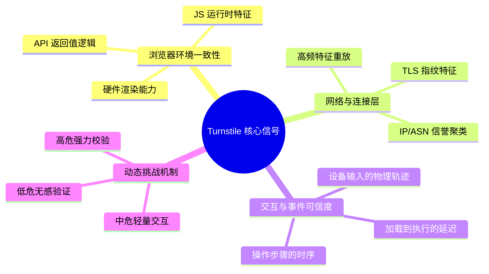

# CloudflareTurnstile防御分析:浏览器信号检测面与误判权衡

> [!NOTE]
> 本文由 AI 辅助沉淀, 需要用户 review 后再提交.
>
> 如果一个验证组件注定无法 100% 拦截自动化, 那它存在的意义是什么? 是"绝对正确", 还是"把攻击成本抬到不值得"?

## 0x00 背景

本笔记沉淀 [nax 的博客](https://naxbr.com/article/cloudflare-turnstile-defense-analysis) 文章《Cloudflare Turnstile 防御分析：浏览器信号、检测面与误判权衡》(2026-06-03). 原文站在防御者视角, 分析 Turnstile 为什么有效、依赖哪些信号、网站在安全与误判之间怎么取舍.

选择这篇做 AI 逆向视角沉淀的原因:

- 它是四篇中唯一"站在对手(防御方)视角"的文章, 正好补全逆向闭环: 001(攻: 工程) -> 002(机制) -> 003(AI 求解) -> 004(防: 检测面建模). 逆向者只有理解防御者怎么建模, 才能知道伪装要满足什么约束.
- 它把 Turnstile 的信号来源明确拆成四大维度(环境一致性 / 网络连接层 / 交互事件可信度 / 动态分级), 这是可操作的检测面清单.
- 它提出的"整体一致性最难伪造"是理解一切反检测的根本判断; 它的"三个接入误区"则是逆向者找弱点的直接入口.

本文沉淀防御模型与权衡原则, 不提供绕过步骤. 边界说明: 原文以产品/风控视角写作, 本文保留其防御立场, 仅用于学习"对手如何思考".

## 0x01 核心结论

**Turnstile 不是"更现代的验证码", 而是一个风险控制组件**: 它持续评估"浏览器环境是否自洽 / 连接特征是否自然 / 交互是否可信 / 风险等级是否够高", 而不是出一道题考用户.

核心转变(原文):

> 从"出一道题考用户", 变成"持续判断这个会话的整体可信度".

对逆向者最重要的三个判断:

1. **"真实浏览器环境"的价值在于整体一致性, 而非单个字段** — 设备、浏览器、渲染栈、网络链路、交互节奏天然互相支持; 批量自动化最难伪装的正是这种一致性.
2. **防御方重点不是抓单一必死特征, 而是多维判断** — 单点信号允许噪声, 多点组合才形成结论, 高风险场景再追加验证.
3. **单靠改前端字段不足以稳定通过** — IP 和连接拓扑的特征(聚类、高频重放)会直接出卖你; 这是为什么"高质量代理 + 指纹一致性"比"前端补丁"更接近本质.

## 0x02 关键细节

### 2.1 Turnstile 的四大信号维度(防御面清单)



1. **浏览器环境一致性**: 一个真实环境会在很多地方互相一致 — 暴露的能力、JS 运行时对象、插件/语言/渲染能力、API 行为方式、接口返回值之间的逻辑关系. 请求头声称桌面浏览器但环境缺少真实能力, "不自洽"本身就是风险信号. **重点不在某一个字段, 而在整体是否像真实浏览器.**

2. **网络与连接层特征**: 即使页面伪装得很好, 连接层不自然仍会被提高风险分数. 防御者看的是: 连接模式像不像正常浏览器流量、来源是否在异常密集的访问簇里、同一指纹是否高频重复、看似不同的会话是否共享底层特征.

3. **交互与事件可信度**: 真实用户留下"细碎但自然"的痕迹 — 加载与交互间的合理延迟、鼠标/滚动/焦点切换接近连续行为、元素可见性与操作顺序符合实际、有少量无目标小动作. 自动化环境"知道自己要做什么", 轨迹过于笔直, 节奏太理性. **有效的是观察交互过程的宏观节奏是否合乎常理, 而不是盯死某一条鼠标路径.**

4. **风险分级与动态挑战**: 低风险无感通过, 中风险轻量交互, 高风险进入严格计算校验. 动态分级兼顾"正常用户少受打扰"和"可疑流量付出高昂成本".

### 2.2 三个常见接入误区(逆向者的弱点入口)

- **误区一: 当成万能盾** — Turnstile 只是入口处的"流量筛子", 不是"金库大门". 若后端没有配额控制、行为审计、速率限制、IP/ASN 策略、账户全局风控, 攻击流量仍可在业务逻辑深处找缺口. 逆向启示: **验证组件只保护入口, 业务逻辑深处往往是更弱的攻击面.**
- **误区二: 只在前端做花架子校验** — 关键看服务端是否真正做了四件事: 请求 Cloudflare API 校验 Ticket、票据与会话上下文绑定、后端缓存限制票据历史复用与短时重放、校验结果纳入后端综合决策. 启示: **若服务端没校验票据, 前端再真也是摆设 — 这就是最常见的"假盾".**
- **误区三: 一遇攻击就一刀切拉满强度** — 短期清静, 长期饮鸩止渴(转化率跳水、弃填率上升、移动端/老设备恶化、海外误杀飙升). 启示: **强度拉满会提高对所有流量(含真用户)的成本, 反而让"低强度入口 + 真代理"更划算.**

### 2.3 更稳的接入思路(防御方设计, 逆向者对照)

```text
第一层: 把 Turnstile 放在高价值入口(注册/登录/找回密码/评论/API key 申请/易被刷领取接口)
  -> 第二层: 后端做真实性校验(票据 + 会话 + 提交动作 + 请求上下文 + 风险分数)
  -> 第三层: 补速率限制和行为分析(限流/设备画像/请求审计/异常聚类)
  -> 第四层: 持续看误判(哪些页面误伤高/地区通过率异常/终端类型问题多/接口仍被刷)
```

产品平衡原则: **越接近核心资产越值得让用户多走一步, 越接近高频日常操作越应无感**. 安全不是全站统一加厚, 而是把摩擦放在最值钱的地方.

### 2.4 未来演进

- 更多无感验证、更多服务端风险关联、更强的会话级评估、更少依赖单次挑战、更强调跨层信号一致性.
- 对站点维护者: 把浏览器验证、后端票据校验、限流、日志分析、风控策略串成完整链路, 而不是"前端挂一个组件".

## 0x03 验证与引用

- 原文: [Cloudflare Turnstile 防御分析：浏览器信号、检测面与误判权衡](https://naxbr.com/article/cloudflare-turnstile-defense-analysis), nax 的博客, 2026-06-03.
- 逆向视角闭环: 本分类 001 [CF 过盾工程](../001-CF过盾工程-从零实现Turnstile绕过/index.md)(攻) <-> 本文(防); 001 中的"伪装四维度"与本文"检测面四维度"正好互为镜像.
- 机制侧: 本分类 002 [真实浏览器扩展的验证机制拆解](../002-真实浏览器扩展的验证机制拆解/index.md) 解释了"为什么整体一致性 / 可信事件 / 状态判断"会被检测.
- 边界说明: 本文保留原文防御者视角, 仅用于学习防御模型, 不提供绕过步骤.

## 0x04 总结

读这篇笔记, 需要问自己的问题是:

> 如果你的任务是"让一个会话通过检测", 你是在补单个字段, 还是在伪造一整套互相自洽的环境、连接与行为?

- 单点补丁会被"整体一致性"检测识破 — 因为防御方看的从来不是某一个特征.
- 真正的攻防博弈发生在成本层面: 防御方把批量滥用的成本抬到不值得, 攻击方则寻找"低强度入口 + 服务端未校验"这类结构性弱点.

对通用 AI 逆向而言, 这篇的独有价值是**逆向者的对手建模**: 读懂防御方把信号分成哪些维度、在哪些环节留了"假盾"、什么时候会因误判而放松, 才能决定自己的伪装要覆盖到哪一层, 以及弱点该往哪里找.
