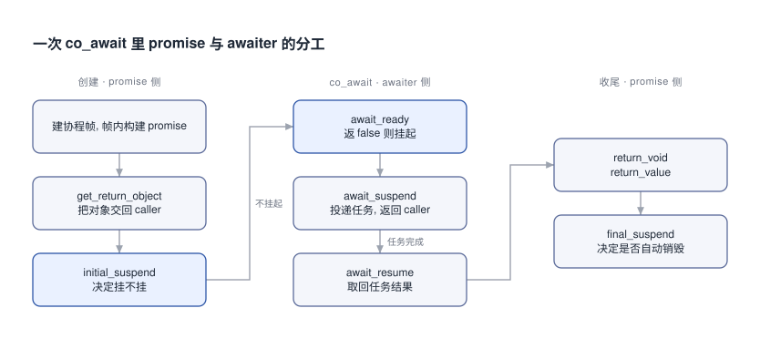
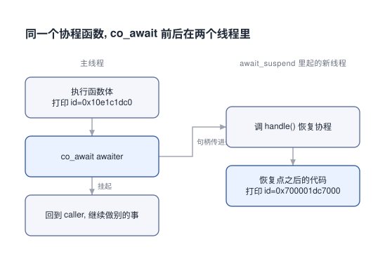

# C++20协程原理与应用

给 HXLibs 的 iocp 那套东西对接协程时, 我卡在一个问题上: 标准为什么不给有栈协程.

## 0x00 标准替我做了选择, 而且理由很直白

先把两个词分清楚. 无栈协程就是一个可以挂起、之后再恢复的函数; 有栈协程相当于用户态线程, 自己带一段栈.

切换成本差在这里: 无栈协程切换一次约等于一次函数调用, 有栈协程切一次就是用户态线程切换那个价钱. 有栈协程比系统级线程还是轻得多, 但跟无栈比就偏重了.

看到这里很容易得出"无栈一定更快". 原文自己把这个结论按了下去: 这点差距在带 IO 的异步系统里基本看不出来, 因为 IO 比切换开销高了几个数量级.

所以这点差距在带 IO 的场景里用不上. 用得上的是那些对切换成本敏感的场合. 提案作者 Gor Nishanov 在 CppCon 2018 演示过纳秒级切换, 顺手做了个减少 Cache Miss 的特性.

> [!TIP]
> 那句"纳秒级"是一次单点演示, 引用它得连着 IO 那条一起引, 否则就是拿一个演示结论去推广到所有场景.
>
> 至于 C++20 最后为什么定无栈: 提案是微软主导的 (源头是 C#), Google 当时发起过一系列吐槽并试着给出有栈方案, 反对意见大概是难理解、太灵活, 还有动态分配带来的性能问题. 定下来的理由是 "Zero Overhead Abstractions" 这条设计哲学.

## 0x01 有栈协程那个"栈", 是堆上一块假栈

有栈协程的常见做法是在堆上提前分配一块较大内存当栈, 原文举的例子是 64K. 协程参数和 return address 都放这块内存上.

切换时用 `swapcontext` 一类手段, 让系统把这块堆内存当成普通栈来用.

问题就出在这个"较大": 给小了有栈溢出风险, 给大了纯浪费内存. 无栈协程没有这块假栈, 所以两头都不沾.

有栈协程拿这个代价换到的好处是侵入性小, 已有业务代码几乎不用动. 对一个正在往里塞协程的存量项目来说, 这个好处不小.

## 0x02 三行协程, 一百多行生成代码

判定规则很简单: 函数体里出现 `co_await`、`co_yield`、`co_return` 任意一个, 它就是协程. 不用加任何标注.

```cpp [异步client-回调版]
async_resolve({host, port}, [](auto endpoint) {
    async_connect(endpoint, [](auto error_code) {
        async_handle_shake([](auto error_code) {
            send_data_ = build_request();
            async_write(send_data_, [](auto error_code) {
                async_read();     // 里面还要再套一层递归读
            });
        });
    });
});
```

```cpp [异步client-协程版]
auto endpoint   = co_await async_query({host, port});
auto error_code = co_await async_connect(endpoint);
error_code      = co_await async_handle_shake();
send_data       = build_request();
error_code      = co_await async_write(send_data);
while (true) {
    co_await async_read(response);
    if (finished()) break;
    append_response(recieve_data_);
}
```

同一个"解析域名 → 连接 → SSL 握手 → 发送 → 接收"的流程, 换成上面第二个 tab 之后就是平的了. 递归读也变成了一个普通 `while`.

(两个 tab 里域名解析一个叫 `async_resolve` 一个叫 `async_query`, 原文里就是这么写的, 没作说明.)

代价是编译器在背后铺了一层东西. 一个三行的协程函数, 最终生成的是一百多行代码, 骨架长这样:

```cpp [生成框架-函数体]
{
  co_await promise.initial_suspend();   // 返回类型决定: 立刻执行函数体, 还是先挂起
  try {
    coroutine body;                     // 你写的那几行
  } catch (...) {
    promise.unhandled_exception();
  }
FinalSuspend:
  co_await promise.final_suspend();     // 返回 suspend_never 就自动销毁
}
```

> [!TIP]
> 这段骨架里有个容易被忽略的细节: **禁用异常时, 生成的代码里没有 try-catch**, 此时协程的运行效率几乎等同非协程版的普通函数. 原文把它列为协程的设计目的之一, 嵌入式场景会在意这一点.
>
> 创建过程本身是四步: 建协程帧 → 帧内构建 promise → 把协程参数拷进帧 → 调 `promise.get_return_object()` 把对象交回 caller. `coroutine_handle` 通常就存在这个返回对象里, 它由此获得访问协程的能力.

## 0x03 promise 和 awaiter 各管什么

要分清的名字有这么几个: `promise_type`、promise 对象、awaitable、awaiter、`coroutine_handle`.

先把最容易混的两个钉住. **awaitable** 是支持 `co_await` 的类型; **awaiter** 是定义了 `await_ready` / `await_suspend` / `await_resume` 的类型. `co_await expr` 要求 expr 是 awaitable, 而这一次 `co_await` 的具体行为取决于据它生成的 awaiter. 一个类型同时充当两者是允许的, 示例里那个 `awaiter` 结构体就是这么干的.



上图左右两列就是分工: 左边 promise 决定协程什么时候开始、什么时候销毁, 中间 awaiter 决定这一次 `co_await` 要不要挂、挂完去干什么、回来拿什么.

`promise_type` 管一类协程的行为, 可定制的点是 `initial_suspend`、`final_suspend`、`unhandled_exception`、`return_value`. 协程帧、promise 对象、协程实例三者一一对应.

awaiter 这边有两个定死的规矩. 一是 `await_ready()` 返 **false** 才挂起 (因为编译器生成的判断是 `if (!awaiter.await_ready())`), 二是 `await_suspend` 的返回类型只允许 `void` 或 `bool`.

```cpp [生成框架-co_await]
if (!awaiter.await_ready()) {            // 返 false 才往下走
  <suspend-coroutine>
  // 返回 void: 挂起后直接回 caller
  // 返回 bool: 由这个 bool 决定回不回 caller
  awaiter.await_suspend(handle_t::from_promise(p));
  <return-to-caller-or-resumer>
  <resume-point>                         // 任务完成, 协程从这里继续
}
return awaiter.await_resume();           // 取回任务结果
```

原文的判断是: 这里面真正重要的只有 promise 和 awaiter, 其余都是工具人. 看完上面这段生成代码我是信的.

## 0x04 co_await 前后不在同一个线程

`std::coroutine_handle` 能访问协程帧、恢复协程、释放协程帧. 下面只用到恢复这一件.

```cpp [跨线程-awaiter]
struct awaiter {
  bool await_ready() { return false; }              // 要挂起
  void await_suspend(std::coroutine_handle<task::promise_type> handle) {
    std::thread([handle]() mutable { handle(); }).detach();   // 句柄带走, 在新线程里恢复
  }
  void await_resume() {}
};
```

```cpp [跨线程-协程函数]
task test() {
  std::cout << std::this_thread::get_id() << "\n";   // 主线程
  co_await awaiter{};
  std::cout << std::this_thread::get_id() << "\n";   // 换线程了
}
```

实测打出来的两个 id 是 `0x10e1c1dc0` 和 `0x700001dc7000`, 确实不是同一个线程.



右边那一列是 `await_suspend` 里起的新线程. 图上看得很清楚: 线程没被换掉, 换的是句柄的落脚点. 恢复动作发生在新线程, 恢复点之后的代码自然跟着过去了.

> [!TIP]
> 他们那个示例带了 1 到 14 的编号打印, 顺序是: 构造 promise → `get_return_object` → `initial_suspend` 不挂起 → 执行函数体 → `await_ready` 返 false → `await_suspend` 起线程 → 回到 caller → 在新线程恢复 → `return_void` → `final_suspend` 不挂起, 自动销毁. 想把时序在脑子里对齐, 照着跑一遍比读文字快.
>
> `initial_suspend` 和 `final_suspend` 返回 `std::suspend_never` 就是"此处不挂起"; `final_suspend` 返回它时协程自动销毁, 不返回它就得自己动手销毁.
>
> 两个抄代码前要留意的地方: 原文 §4 把 `final_suspend` 写成了 `awaiter.final_suspend`, 它其实在 promise 上; 另外原文示例的 `final_suspend()` 没标 `noexcept`, 那是 2022 年的写法, 现行标准要求它是 `noexcept`.

## 0x05 写到这里就明白为什么绕不开协程库

上面那个示例只是"起个线程打印 id", 就已经要手写一个 `task` 返回类型、塞在它里面的 `promise_type` (五个方法)、再加一个 `awaiter` 结构体. 而它连"等协程结束"都没实现, 用的是 `sleep_for` 糊过去的. 作者自己给了个量级: 真要实现等待协程结束的逻辑, 代码还会增加一倍.

原因是 C++20 给的只有底层原语和挂起恢复机制. 它现在只适合库作者用.

```cpp [协程库-async_simple]
Lazy<void> PrintThreadId() {
    std::cout << std::this_thread::get_id() << "\n";
    co_return;
}

Lazy<void> TestPrintThreadId(async_simple::executors::SimpleExecutor &executor) {
    std::cout << std::this_thread::get_id() << "\n";
    PrintThreadId().via(&executor).detach();     // 调度就这一行
    co_return;
}

int main() {
    async_simple::executors::SimpleExecutor executor(/*thread_num=*/1);
    async_simple::coro::syncAwait(TestPrintThreadId(executor));
}
```

`async_simple` 是阿里开源的那个库, 组件是 `Lazy` (lazy 求值的无栈协程)、`Executor`、批量操作的 `collectAll` / `collectAny`、还有 `uthread` (有栈协程). 上面这段里 promise 和 awaiter 一个都没出现, 把协程丢到 executor 线程上去就是中间那行 `.via(&executor).detach()`.

这也正好解释了我一开始的困惑: 标准不给有栈协程, 也不打算给我一个好用的协程. 它只负责把原语铺好, 好不好用是库的事.

想看这套原语怎么变成一个能用的东西, 可以接着看 [HXLibs 协程串行调度器探索](../001-HXLibs编写串行协程调度器/index.md "hxid:hx-5d296b49"), 那篇是拿这些东西真写了一个调度器.

底层只铺原语、好不好用交给上层, 这套分工我在写 skill 那边也在反复碰到. 下次给 HXLibs 的 iocp 封一层时, 得先想清楚往上露多少.

## 0x0A 参考来源

- [C++20协程原理和应用](https://zhuanlan.zhihu.com/p/497224333) (祁宇、许传奇、韩垚): 本文的机制描述和那两个线程 id 都来自这篇
- [同文的 CSDN 发布版](https://csdnnews.blog.csdn.net/article/details/124123024): 知乎页有反爬, 本次的正文是从这里取的
- [Understanding operator co_await](https://lewissbaker.github.io/2017/11/17/understanding-operator-co-await): 原文推荐的 `co_await` 细节解析
- [alibaba/async_simple](https://github.com/alibaba/async_simple): 原文介绍的那个协程库, 组件与用法以仓库文档为准
