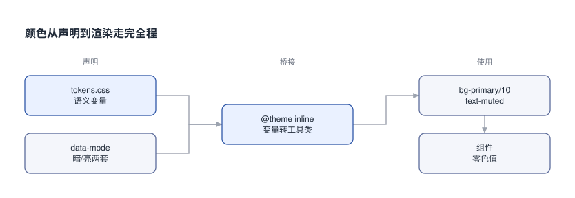
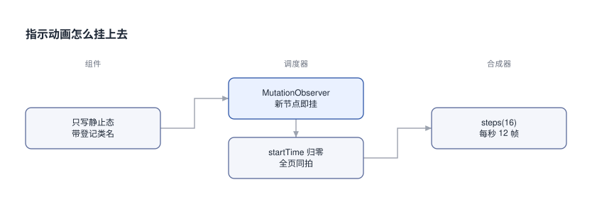

# OpenVetta 界面设计系统拆解: 从设计令牌到可直接复用的组件包

做 HX-Email 的界面时卡住了: 颜色全硬写在组件里, 想换一套配色就得全文替换. 翻到 open-vetta 之后, 我把它的视觉规范整套拆了下来, 做成了一个能直接拷走的包.

## 0x00 一份能被机器检查的清单

open-vetta 的主色配得好看, 但可迁移的是那份 259 行的 `apps/desktop/DESIGN.md`. 开头第一句就声明: 这是改动界面的硬性规范. 与它冲突的现存代码被定义为待清理的债, 不许当范例复制.

第二句更重要. 它指定了单一事实源, 也就是 `src/renderer/styles.css` 里的 CSS 变量与 `@theme inline` 块. 规范文档只是对那份源码的解释. 所以改观感的地方是那份 CSS 变量, 而不是组件.

文件末尾还带一张九条的提交前勾选表. 每一条都能机械检查, 下面摘其中六条:

```text [规范-自查表]
[ ] 没有 hex / rgb( / 默认 Tailwind 调色盘
[ ] 所有线条 1px, 没有 border-2 / ring-2
[ ] 没有 rounded-3xl 与 rounded-[Npx]
[ ] 没有 transition-all
[ ] 按钮一律用 <Button> + variant
[ ] 卡片 hover 无 shadow
```

这六条就是我判断它能否被复用的依据. 一条讲不清、也检查不了的规范, 在第二个项目里必然退化成摆设.

## 0x01 颜色只能有一个来源

颜色只允许来自 `@theme inline` 暴露出的语义 token 类. 它的 alpha 变体也只放行固定十档: `/5 /10 /15 /20 /25 /30 /40 /50 /60 /70 /80`. 被点名的禁止项是 hex、`rgb()`、`hsl()`, 以及 Tailwind 默认调色盘里的那一整组原色.

固定档位的价值在跨组件一致性. `bg-primary/10` 在导航选中块、标签、卡片强调态里是同一个值. 十处界面片段的透明层次天然对齐. 随手写个 `/37` 就把这条毁了.

[界面外壳 (vendored 组件拼装) #ppt ##w100%##](ui-mirror.html)

上面这块是我用 vendored 组件拼的**外壳**, 只做到像. 真正一比一的在 0x0A 那一节.

做法是把它的前端源码整包拷进来: `packages/ui` 加 `packages/theme-ui` 加 `packages/theme-sdk` 三个包. 再写一个**假宿主**喂数据.

为什么这样就能跑: 它的组件只吃 model, 不知道数据从哪来. 所以脱离 Electron 也能原样渲染. 渲染出来的每一个像素都出自上游源码, 我一行没改.

默认停在新会话页, 点左侧任意会话切到对话态. 点右上角放大后可交互.



上图是这套机制的全程. `tokens.css` 里声明语义变量, `data-mode` 决定用暗色还是亮色那一套, `@theme inline` 把变量桥接成工具类, 组件里只出现类名. 换皮就是换变量, 组件一行不动.

代价在这里: 亮色不是暗色的反相. 主色在暗色下取 `rgb(99,102,241)`, 到亮色要压到 `rgb(79,70,229)`, 才能在白底上保住对比度. 终端 ANSI 那十六个颜色也是整组重调的. 维护的是两套独立取值, 不是一份色板.

> [!TIP]
> 多分段图表色用了另一套思路. 上下文构成的五段色写作 `oklch(0.72 0.12 268/215/165/95/25)`. 亮度 0.72 与彩度 0.12 五段完全相同, 只有色相在变. 原因写在注释里: 避免相邻分段因明度差被读成"一高一低", 那会让读者把并列关系误读成大小关系. 同理, 我复现时一开始给色块加了 `opacity-70`, 立刻就把五个等亮度色相又拉回了不同明度, 正好毁掉它, 后来去掉了.

## 0x02 层级靠 1px 线和半透明底, 不靠阴影

卡片默认零阴影. 这一条最容易被抄漏.

规范给出的卡片基线是一串可以直接抄的类:

```tsx [卡片-基线]
<div className="rounded-xl border border-border/50 bg-card/40 backdrop-blur-sm
                transition-colors duration-200
                hover:border-primary/40 hover:bg-card/60" />
```

hover 只换边框颜色和背景透明度两件事. 不加阴影、不放大、不平移超过 2px.

那阴影用在哪? 白名单制. Popover、Dropdown、Dialog 允许 `shadow-md` 或 `shadow-lg`; 拖拽中的元素用 `shadow-lg`; Toast 与浮动条用 `shadow-md`; 普通卡片、列表项、grid 卡一律没有. 规范还专门否决了主色发光阴影, 把 `shadow-[0_4px_16px_-6px_var(--primary)]` 这种写法点名写进了禁止项.

被选中的元素怎么表达? 用 ring, 不用阴影:

```tsx [强调态-选中]
className="ring-1 ring-inset ring-primary/30 bg-primary/10 border-primary/40"
```

线条全局统一 1px 是配套的硬约束. 禁止 `border-2`、`ring-2`、`outline-2` 及以上, 也禁止 `border-[Npx]` 这类任意值. 想加重分隔就去改颜色深度, 把 `border-border/40` 提到 `border-border`, 不许通过加粗线条来强调.

> [!TIP]
> 我在复现时踩过一次: 统计卡想突出, 就用主色实底画了一整块. 结果四个卡片互相抢眼, 版面直接被压垮. 原设计里主色做大面积的地方只有主操作按钮一处. 统计卡的强调是 1px 主色边框加 10% 叠色, 再让数字转主色, 视觉权重足够, 但不占面积. 这一条没写在规范的字面上, 是从"主色只做小面积点缀"这个整体倾向推出来的.

## 0x03 形状与密度的分档

圆角按元素角色分五档, 其中四档由 `--radius` 一个变量派生. 这四档具体是 `calc(var(--radius) - 4px)`、`calc(var(--radius) - 2px)`、原值和 `calc(var(--radius) + 4px)`, 而 `--radius` 取 `0.5rem`. 卡片面板 `rounded-xl`; 列表项、输入框、常规按钮 `rounded-lg` 或 `rounded-md`; 高度不超过 9 的小 chip 也是 `rounded-lg`; pill、标签、segmented control、圆形图标按钮 `rounded-full`; Hero 或超大装饰容器才允许 `rounded-2xl`, 且只一处. `rounded-3xl` 及以上被禁止. 改一个变量就能整站改圆角手感.

字号只放行七档, 从 `text-[10px]` 到 `text-[15px]`, 再加 `text-[20px]+` 专供统计数字. 间距按容器角色给死: 紧凑列表项 `px-3 py-2.5`, 标准卡片 `px-3.5 pt-3 pb-3`, 页面外层 `px-8`, Popover 内菜单项 `px-2.5 py-1.5`.

网格列数不写死, 一律自适应:

```tsx [网格-自适应]
// 小卡
className="grid grid-cols-[repeat(auto-fill,minmax(240px,1fr))] gap-2.5"
// 行式列表
className="grid grid-cols-[repeat(auto-fill,minmax(320px,1fr))] gap-3"
```

禁止的是 `grid-cols-3` 这种写死的写法, 窗口一变窄它就塌.

## 0x04 动效的上限全是数字

规范的总则只有一句: UI 是工具, 不是 showroom, hover 只反馈, 不表演. 上限全部写成了数字, 不是形容词.

上限全部是具体数字:

```text [动效-上限]
卡片 hover 位移    { y: -2 }            是上限, 不允许叠 scale / rotate / shadow
按钮 hover 缩放     1.04                上限
按钮 tap 缩放       0.94                下限
进入动画            opacity 0→1 + y 8→0 时长 <= 0.5s
stagger            0.04 ~ 0.06         delayChildren <= 0.15
```

被禁止的是四件事: 装饰性持续旋转或弹跳; 卡片 hover 同时叠 `scale`、`rotate`、`shadow`; 入场动画长于 0.6s; 写 `transition-all`.

spring 参数也是固定值, 不给"看情况"的余地. 入场 `{ stiffness: 280~320, damping: 26 }`, 按钮交互 `{ stiffness: 380, damping: 22 }`.

单独拎出来说 `transition-all`. 它被禁的理由是会把没预料到的属性一起拉长. 焦点圈、边框颜色、布局尺寸本来该瞬时切换, 被它一网打尽之后全被拖成渐变色. 这是"廉价动画感"最常见的来源. 规范给按钮和链接写了一条全局规则, 只过渡三个颜色属性, 各 0.15s: `color`、`background-color`、`border-color`. 输入框更窄, 只过渡其中的两个.

## 0x05 「进行中」指示动画为什么不能写 CSS 关键帧

这一条是全套规范里最硬、也最容易被当成过度设计的部分.

前提是 macOS 主窗口带毛玻璃. 这种窗口下页面每出一帧, 系统都要整窗重新合成. 按规范的原话说, 一个 4px 的脉冲点用平滑关键帧逐帧插值, 就足以让流式全程 GPU 不闲.

上游作者给出的实测数据 (Chromium 132, macOS 毛玻璃窗口) 是这样的. 这三行数字是他们的测量结果, 本次没有复现, 换平台与换浏览器都不保证成立:

```text [动效-帧成本实测]
opacity/transform 关键帧 + steps(16)   每秒画 12 帧    主线程 ≈ 0
平滑曲线关键帧                          每秒 70 帧      --
注册自定义属性做时钟                    画帧同样少      Blink 每帧在主线程重算样式
```

最后那行的代价有条件: 把时钟挂在 `:root` 上时是每秒 300ms 的主线程开销. 规范的原话是"不要再走这条路".

所以做法是: CSS 里只写静止态, 一个字的关键帧都不写. 动画由宿主的调度器用 Web Animations API 挂上去.



上图是这条链路. 元素只带一个登记过的类名, `MutationObserver` 扫到新节点就挂动画. 调度器再把 `animation.startTime` 锁到文档时间线原点. 于是不管元素什么时候挂载, 全页指示器都停在同一拍上换帧. 第二圈波纹用 `offset: 0.5` 错开半个周期.

有个细节值得单独记下: 相位 0 的外观必须就是正常外观. CSS 里那些光晕元素写的是 `opacity: 0`, 因为"没有动画的时候它本来就该看不见". 这条判据让减少动态偏好下的降级几乎不用额外代码. 调度器读一次媒体查询, 命中时直接返回空的卸载函数, 一个动画都不创建.

流式文字用的是另一个思路: 不做逐元素淡入, 改成亮度分级.

```css [流式-亮度分级]
.markdown-streaming-tail .streaming-chunk-recent { opacity: 0.8; }
.markdown-streaming-tail .streaming-chunk-latest { opacity: 0.55; }
```

上游由 rehype 插件把流式末尾的文字按短语包成 `.streaming-chunk`, 再给最新两个短语打上 `-latest` 与 `-recent` 类.

亮度只在下一次放出短语时随重渲染改变. 出帧数与内容更新节奏完全一致, 不额外产生一帧. 而且只动 `opacity` 保持 inline 排版, 不用 `transform`, 免得换行位置跳动.

## 0x06 把令牌抄成一个可复用的包

拆完之后我先做了一件事: 把令牌与组件纪律抄成一个独立包, 放在 `components/HX-VettaUI/`. 它是给**自己的项目**用的, 不是复刻件.

```text [产物-目录]
components/HX-VettaUI/
  src/tokens.css              设计令牌, 不依赖 Tailwind
  src/styles.css              @theme inline 桥接
  src/lib/live-animations.ts  steps(16) 调度器
  src/components/             14 个组件文件
  src/desktop/                桌面端专属 CSS 与说明
  src/showcase/Showcase.tsx   设计系统演示页
```

分层是刻意的, 因为不同人想要的深度不一样:

```tsx [产物-按需取用]
// 只要一套配色和手感: 拷 tokens.css, 零依赖, 任何项目都能用
import "./tokens.css";

// 要 bg-primary/10 这类写法: 再叠 Tailwind v4 的桥接层
import "./styles.css";

// 要现成组件: src/index.ts 统一导出全部组件
import { Button, Card, ContextBar } from "./src/index";
```

组件按上游的实现思路重写了一遍. `Button` 用 cva 定义 variant 与八档尺寸, 内边距由子元素决定 (`has-data-[icon=inline-end]:pr-2`), 传图标时不用手调.

`Dialog` 的宽度用单条 `max-w-[min(24rem,calc(100%-2rem))]`, 而不是 `max-w` 加 `sm:max-w` 组合. 上游注释写明了原因: `twMerge` 会把 `sm:max-w-sm` 留在结果里, 在 sm 断点反过来盖掉使用方传进来的 `max-w-lg`.

跑起来看:

```bash [产物-启动]
cd components/HX-VettaUI
npm install
npm run dev      # http://localhost:5273, 右上是亮暗切换
```

演示页里那条列表树的连接线值得一提, 它是纯 CSS 伪元素画的. 非末项画一条通高竖轨加首行高度的横枝, 末项改成 L 形并给左下圆角收口. `li` 内段落上下外边距清零, 横枝才会对准第一行文字而不是段落框.

这个包的意义是**可复用**, 不是**像**. 想核对原版长什么样, 看 0x09 那一节.

## 0x07 桌面端那几条单独放

macOS 式的 overlay 滚动条默认全透明. 只在该容器被 hover 或获得焦点时才显形. 它始终占 8px 宽度, 所以不引起布局跳动. 窗口拖拽区靠 `-webkit-app-region: drag` 配内部的 `.no-drag` 反向声明. 光标和 `caret-color` 也一并收进 token.

它们都依赖宿主能力, 所以我在包里单独开了 `src/desktop/` 一组, 靠根元素上的 `data-platform` 标记生效. 纯 Web 环境不打这个标记, 这一组规则全部不命中:

```css [桌面端-门控]
/* 所有桌面端规则都带 :root[data-platform="mac"] 前缀, 因此天然隔离 */
:root[data-platform="mac"] .sidebar-dock .sidebar-surface {
  background-color: color-mix(in srgb, var(--background) var(--sidebar-vibrancy-tint, 60%), transparent);
  /* 毛玻璃上必须把 --accent 换成半透明叠加色, 理由见下 */
  --accent: color-mix(in srgb, var(--foreground) 10%, transparent);
}
```

里面最值得抄的是毛玻璃侧边栏的一个坑. 毛玻璃会透出背后桌面的明暗, 而 `--accent` 通常是不透明实色. 底色跟着桌面走、选中块纹丝不动, 背后亮的那一段底色就会被抬得比选中块还亮. 高亮与底色的明暗关系当场反转, 看起来像选中背景消失了. 解法是把侧边栏子树内的 `--accent` 换成半透明叠加色. 写成"在当前合成底色上再压 10% 前景色", 背后黑白都成立.

> [!TIP]
> 这套东西的底层机制其实只有一条: `@theme inline` 把 CSS 变量桥接成 Tailwind 工具类. 上游把主题能力明确分成三档, 分别是配置式外观 (只换 surface 装饰)、组件替换 (只换某个局部组件)、整区接管 (接管完整区域并复用 Theme SDK). 三档刻意不混进同一个 API, 主题在 manifest 里逐个 slot 声明能力, 不是整个界面全给. 本次抽出来的只有 token 与组件分层这一层, 那套主题运行时没有搬. 两者之间是有契约关系的, 拆开只搬一半就得自己承担这半边的稳定性. 上游为 Apache-2.0, 允许商用、修改与再分发, 复现时保留版权与许可声明.

## 0x08 用什么搭的

前面讲的都是"应该长什么样". 这一节是"用什么搭出来", 缺了它就只能看着规范猜.

**基础件层只有七个直接依赖**. 这是最值得抄的一条: `radix-ui`(无样式交互原语)、`class-variance-authority`、`clsx` 与 `tailwind-merge`(类名合并)、`lucide-react`、`react-day-picker`、`vaul`. 整套按钮、对话框、下拉、开关都建在这七个之上, 没有第二个组件库.

**样式链是 Tailwind 4 + Vite 插件**:

```ts [技术栈-样式链]
// vite.config.ts  没有 postcss.config.js, 也没有 tailwind.config.js
import tailwindcss from "@tailwindcss/vite";
import react from "@vitejs/plugin-react";
plugins: [react(), tailwindcss()]

// renderer/styles.css  Tailwind 4 的配置全在 CSS 里
@layer vetta-plugins, theme, base, components, utilities;
@import "tailwindcss";
@import "tw-animate-css";
@import "@vetta-org/theme-ui/styles.css";
@plugin "@iconify/tailwind4";
```

**图标是 Iconify + 单一 collection**. 写法 `icon-[solar--<name>-linear]`, 数据包 `@iconify-json/solar`, 由 `@iconify/tailwind4` 按需生成. 有个坑要提前知道. 导航项的图标名存在**数据字符串**里, Tailwind 扫不到. 必须在 CSS 里显式登记:

```css [技术栈-图标登记]
/* 少了这几行, 图标不生成、界面出现空位, 而且不报任何错 */
@source inline("icon-[solar--chat-round-line-linear]");
@source inline("icon-[solar--widget-2-linear]");
```

**shadcn 是拷代码进仓库用的**, 不是运行期依赖. 仓库带 `components.json`, 里面锁定了 `style: "radix-nova"`、`baseColor: "neutral"`、`iconLibrary: "lucide"`; `aliases.ui` 指向仓库内的目录, 说明组件是拷进来再改的.

**字体走系统栈**, 不引外部字体: `-apple-system, "SF Pro Text", "SF Pro Display", "Helvetica Neue"`. 仓库虽然装了 Geist, 主界面样式表里并没有引用它.

**UI 实现层另外还用到** `motion`(动效)、`react-virtuoso`(长列表虚拟化)、`react-markdown` 一族(消息区 Markdown 与公式)、`shiki` 与 `@codemirror/*`(代码高亮)、`@lobehub/icons-static-svg`(模型厂标).

**宿主层**才是大头, 但那层与观感无关: `jotai`、`@tanstack/react-router`、`i18next`、`@xterm/xterm`、`@lexical/react`、`mermaid`、`@xyflow/react`、`three`、`gsap`. 复刻观感不需要它们.

> [!TIP]
> 有个反直觉的点: 这三个包**都不发布**, `package.json` 的 `main` 直接指向 `./src/index.ts`. 所以你不能 `npm install` 它们, 只能拷源码加别名解析. 我一开始就是想装包, 结果发现 npm 上根本没有.
>
> 拷完之后还有个坑: `theme-ui` 的 `exports` 有 30 个子路径, 从 `index.ts` 整体导入会把整棵依赖树(shiki / codemirror / three)拉进产物, 实测 **487 KB 涨到 10.8 MB**. 要深导入到具体文件.

## 0x09 一比一的来源: 驱动官方构建

前面几节讲的都是「它长什么样」. 这一节是「怎么拿到一模一样的」, 也是我走过弯路的结论.

先把结论放前面: **自己拼外壳永远只能做到像**. 我试过 vendor 上游组件加手写宿主, 成品里只有 6.7% 的元素真出自上游, 交互和对齐全对不上. 原因很硬: renderer 里有 523 处 `window.vetta.*` 调用 (plugins / session / agentTeams / fs / config 等等), 数据面根本造不全.

真正可行的是驱动官方构建本身:

```bash [一比一-三步]
# 1. 装 bun, 装上游依赖, 起官方应用
cd ref/open-vetta/apps/desktop && bun install && bun run dev

# 2. Electron 开发模式默认开着远程调试端口
ss -ltn | grep 9223

# 3. 用 CDP 连上去, 它就是一个可编程的真窗口
node scripts/capture-app.mjs captures
```

[Vetta 界面展厅 #ppt ##w100%##](ui-gallery.html)

上面这份展厅里的 17 屏全部截自那个真应用, 不是我重绘的. 左侧可点分组, 方向键翻页, 放大能看清每个控件的间距与描边.

采集脚本留在 `scripts/capture-app.mjs`, 想更新素材重跑一条命令即可.

## 0x0A 设置页: 布局与动效的样板间

设置页是整套界面里最值得逐行看的一屏. 它没有聊天页那种空白的大胆, 全部功夫都在"一屏里放下十几个可选项还不乱".

**分隔线是一条浮着的 1px 竖线**. 外壳只有 34 行:

```tsx [设置页-外壳]
<div className="relative flex min-h-0 w-full flex-1 overflow-hidden">
  {/* 竖线不到底, 底部留 44px, 所以它是"浮着的分隔"而不是把页面切成两半 */}
  <div className={"pointer-events-none absolute top-0 bottom-11 w-px bg-border " +
                  (narrow ? "left-14" : "left-[200px]")} />
  <SettingsSidebar model={model} />
  <SettingsContent>{content}</SettingsContent>
</div>
```

**两级导航的"展开"是选中态的表现, 不是独立状态**:

```tsx [设置页-展开判据]
// 选中即展开, 切走即收起  不需要维护"哪些组展开了"这份状态
const expanded = expandable && (activeTab === item.key || activeParentKey === item.key)
```

这一行省掉了整整一类 bug: 只要不存"展开状态", 就不会出现"选中项藏在一个收起的组里".

**内容区定版心靠 max-width, 不靠栅格**. 每页都是 `mx-auto w-full max-w-[680px] px-8`. 版心 680, 左右各 32 留白. 页标题 `text-[20px] font-bold`, 分区之间统一 `mb-6`, 标题与内容 `mb-3`. 整页只有一个间距尺度在重复, 所以扫视时不会被打断.

**选中态只改 1px 边框色, 绝不叠 ring**:

```tsx [设置页-选中态]
const SELECTION_ACTIVE = "border-primary/50 bg-primary/10";
const SELECTION_IDLE   = "border-border/60 hover:border-primary/40 hover:bg-accent/40";
```

源码注释写明了原因: 同一根边框再叠 `ring-inset` 会变成约 2px 的双线, 而全局线条约定是 1px.

**主题预览卡不是截图, 是用真实主题色实时画出来的**. 这是整页最巧的一招. 背景由五个绝对定位的圆组成, 父层统一 `blur(28px) saturate(115%)` 糊开; 中间再叠一个用同一套色画的**迷你窗口模型**: 标题栏三个圆点、四条不同宽度的文字条、两个按钮块.

```tsx [设置页-预览卡]
const colors = [palette.primary, palette.accent, palette.ring, palette.chart1, palette.chart2];
<div style={{ background: palette.background }} className="relative aspect-[16/9] rounded-lg border">
  <div style={{ filter: "blur(28px) saturate(115%)" }}>
    {BLOB_LAYOUT.map((b, i) => (
      <div key={i} style={{ left: b.left, top: b.top, width: b.w, height: b.h,
                            transform: `rotate(${b.rotate}deg)` }}>
        <div className="h-full w-full rounded-full" style={{ background: colors[i] }} />
      </div>
    ))}
  </div>
  {/* 迷你窗口: 三圆点标题栏 + 四条文字条 + 两个按钮块, 全用该主题的色值 */}
</div>
```

加一个主题就自动多一张预览, 不用准备图片, 而且预览永远不可能与真实配色不一致.

**换主题是从点击位置展开的圆形揭示**, 用 View Transition 实现:

```ts [设置页-换主题]
const endRadius = Math.hypot(Math.max(x, innerWidth - x), Math.max(y, innerHeight - y));
// 动画直接做在 View Transition 的伪元素上, 不把坐标写成会继承整棵 DOM 的根变量
element.animate(
  [{ clipPath: `circle(0px at ${x}px ${y}px)` },
   { clipPath: `circle(${endRadius}px at ${x}px ${y}px)` }],
  { duration: VIEW_TRANSITION_MS, easing: "ease-in-out", fill: "both",
    pseudoElement: "::view-transition-new(root)" },
);
```

它在 `transition.ready` 之后才启动动画. 那个时机在伪元素树建好、首次绘制之前, 所以不会闪出未经裁剪的新页面. 不支持该 API 时回退成单纯的颜色过渡.

> [!TIP]
> 有一处必须提醒: 设置页这类界面**没法脱离桌面宿主跑**. renderer 里有 523 处 `window.vetta.*` 调用 (plugins / session / agentTeams / fs / config ...), 我用普通浏览器直开它的 renderer 地址, 结果是 `window.vetta` 未注入、挂载点空白, 控制台报 `Cannot read properties of undefined (reading 'hostAccess')`.
>
> 所以想核对这一屏, 只能跑它的桌面应用 (`bun run dev`), 不能像新会话页那样做成网页预览.

设计系统真正的分水岭不在配色多少, 而在有没有一条让颜色只有一个来源的桥. 桥在, 换皮才只是改变量.