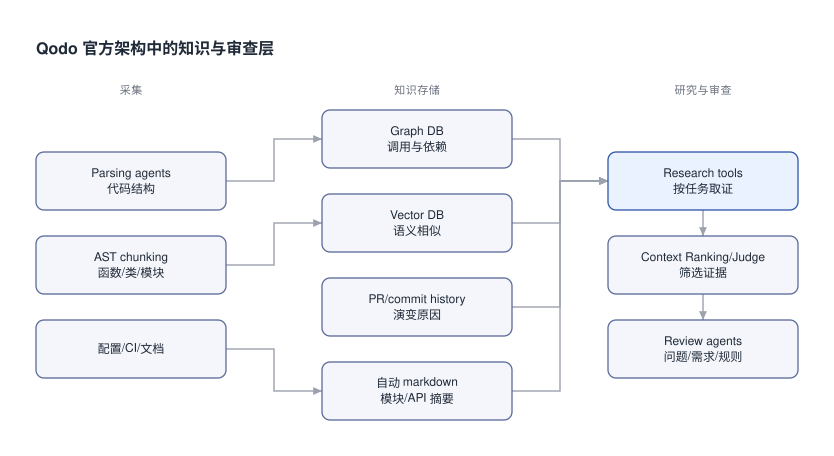
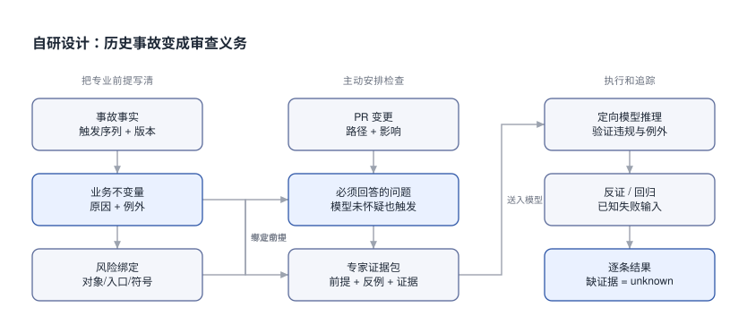

# AI CR 的规则、事故记忆与业务上下文: 重点研究 Qodo

我最近在研究代码质量, 想搭一个 AI CR. 难点是那些只有内部人才知道的事故和业务约束.

## 0x00 模型没有想到的风险

[ScyllaDB #31705](https://github.com/scylladb/scylladb/pull/31705) 改了 repair 的恢复过程. 采集时仓库有 15785 stars, PR 尚未合并. Qodo 看到持续重试, 建议加一个总上限. 作者回答: “This is expected behavior.”

这里有一条业务要求: hints 和 batchlog 必须先 flush 成功. 成功以后才能记录 repair time. 后台要继续恢复. 调用方等不下去, 可以超时离开.

```text [超时契约-合法]
调用方等待超时
后台恢复继续
flush 成功以后, 才能记录 repair time
```

```text [超时契约-违规]
调用方等待超时
顺便取消后台恢复
系统失去必须完成的恢复义务
```

一句“重试要有限制”没有解释后台恢复的业务要求. 本例的后台恢复必须继续, 不能被总重试上限中断. [作者的解释](https://github.com/scylladb/scylladb/pull/31705#discussion_r4035329429)就是这条前提的公开证据.

千条规则里若有大量这样的知识, 系统要先替模型提出具体问题. 例如: “本次修改是否把等待者超时变成了取消恢复?” 再让模型查代码和证据.

本文的厂商事实按 2026-10-08 UTC 的公开文档解释. 后半部分的 AI CR 架构与原型是自研设计, 不代表 Qodo 后台实现.

## 0x01 三家的能力对照

三家都在做规则、学习和仓库上下文. 选型时, 可以从各自公开的控制项开始看.

| 需求 | Cubic | Greptile | Qodo |
|---|---|---|---|
| 规则 | Custom agents, 共享指令, 路径过滤 | 结构化规则 ID、scope、severity、enabled, 目录继承 | Review Standards 实体, 来源、例子、scope、生命周期、相关规则检查 |
| 记忆 | 反馈与资深 reviewer 历史, learnings 例外/修订/删除 | 互动学习, 知识库含 revert、rollback、incident PR | PR history、Relevance、Rule Miner, 各有不同职责 |
| 业务背景 | 仓库文档、跨仓库链接、自动 wiki | 代码图、可编辑知识库、相关仓库 | 代码图、历史、规则、ticket、spec/design、跨仓库关系 |

来源分别是 [Cubic 官网](https://www.cubic.dev/)与[文档](https://docs.cubic.dev/)、[Greptile 官网](https://www.greptile.com/)与[文档](https://www.greptile.com/docs)、[Qodo 官网](https://www.qodo.ai/)与[架构文档](https://docs.qodo.ai/core-concepts/qodo-platform-architecture.md).

针对本次目标, Qodo 值得重点拆的是“规则如何成为可管理的政策”. 官方对来源、激活、停用、scope 和统计写得比较具体. 这能支持架构研究, 还不能证明千条规则的容量或准确率.

公开材料未给出保证, 意味着仍需验证. 这不能推成产品没有该功能. 三家的千条容量、全关键覆盖、知识同步和 ACL 实现质量都没有在这里独立验证.

选型验收需要在实际付费环境里试容量、范围、权限和同步, 不能仅靠官网判断这些效果.

Cubic 的 [custom agent](https://docs.cubic.dev/ai-review/custom-agents.md)有明确预算. 常规每仓库启用 5 个, 有 scans 的 Pro/Max 等计划可到 15 个. 每 agent 的文本加引用文件共 10000 字符, 超出会截断. 把千条规则塞进一个 agent, 得先面对这个限制.

Greptile 用 [.greptile/config.json](https://www.greptile.com/docs/code-review/greptile-config-reference.md)管理单条规则. `rules.md` 则按整文件作为上下文, 没有单条 ID 的禁用能力.

> [!TIP]
> Cubic 的背景文档与 active enforcement 用途不同, 明确要强制检查时应使用 custom agent. Greptile 的 settings 近目录覆盖, rules 累加, `disabledRules` 按 ID 取消父规则. 不能把两家的自由文本背景都当作逐条执行保证.

<details>
<summary>Cubic 与 Greptile: 迁移规则和接入业务知识时的细则</summary>

Cubic 的评论会标识来源 agent, 部分组织可以申请提高数量限制. 一份长文本中写千条检查, 不会自动形成千个可治理的规则实体.

custom agent 有名称、说明、linked instruction files 和路径过滤.

[Cubic 背景来源](https://docs.cubic.dev/ai-review/custom-context.md)包括 README、AGENTS、context 和 skills. GitHub PR 的 linked files 读 head commit, CLI 读 default branch. 两处建议不同时, 先确认读取的是不是同一版本.

[Cubic 跨仓库链接](https://docs.cubic.dev/ai-review/cross-repo-reviews.md)双向生效. 默认最多五个相关仓库, 需要 same installation. companion PR 变化后, 原 finding 可以更新, 所以要保留对应证据版本.

[自动 wiki](https://docs.cubic.dev/wiki/ai-wiki.md)按计划提供日、周、月刷新, 通过滚动 PR 导出. 生成目录的手工修改会被覆盖. 这些是文档刷新规则, 不能据此推断全部代码索引的延迟.

[Greptile 配置](https://www.greptile.com/docs/code-review/greptile-config.md)还规定 `files` 引用累加. `.greptile/` 优先于旧 greptile.json. dashboard rules 与文件 rules 分别管理, 共同适用.

多目录 PR 的若干 boolean 设置采用 OR. auto-approval 使用 strictest-wins, 政策读取 base branch. 这条版本规则仅针对 auto-approval, 不能扩大到全部 review 规则.

[Greptile 代码图](https://www.greptile.com/docs/how-greptile-works/graph-based-codebase-context.md)保存文件、函数、调用、导入和使用关系. [跨仓库上下文](https://www.greptile.com/docs/code-review/cross-repo-context.md)有 Repo Clusters 与 `context.repos`, 显式配置优先. 仓库需要相同 SCM host, 且当前 credential 可访问.

关联仓库上下文是 read-only.

</details>

## 0x02 Cubic 的并发发现与业务误读

[Sim #8762](https://github.com/simstudioai/sim/pull/8762)讨论成员离开后如何保留共享资源. 采集时仓库有 29792 stars, PR 尚未合并.

Cubic 抓到了一个撤权竞态. 请求选中了旧 permission, 另一请求却已经删除旧授权并给同一用户建了新授权. 此时按 user/workspace 删除, 新授权也会被撤销.

```text [撤权序列-旧逻辑]
请求 A 选中 grant id=old
请求 B 删除 old, 创建 grant id=new
请求 A 按 user/workspace 删除
new 被误删
```

```text [撤权序列-修复方向]
请求 A 保存选中的 immutable permission ID
锁住 workspace 与选定 grant, 验证仍是原对象
只按选定 ID 删除; 对象消失或被替换则返回 404
new 保留
```

[作者明确确认修复](https://github.com/simstudioai/sim/pull/8762#discussion_r4212496062), 并报告 PostgreSQL 竞态负控旧版失败、修复版通过. 这部分测试成绩来自作者, 此处没有独立重跑. 同一 PR 还收到原始 author 归属和锁顺序反转的有效发现.

但另一条建议出了业务问题. Cubic 建议先转移 owner, 给 payer 建 admin 权限. 然后才验证 successor 的访问资格. [作者指出](https://github.com/simstudioai/sim/pull/8762#discussion_r4211982132): 付款者不自动拥有既有访问权. 检查必须发生在转移之前, 否则原本应返回 400 的负例会返回 200.

这里的既有资格是 grant 或 org-admin. transfer 本身不能制造原本就应该存在的前置条件.

它还建议 soft-deleted MCP server 不阻止账户删除. [作者解释](https://github.com/simstudioai/sim/pull/8762#discussion_r4211981741): 软删除关闭访问, 保留配置仍受 retention 保护. 永久删除 creator 会通过外键 cascade 销毁它.

这个 PR 里, Cubic 找到了竞态. 作者也纠正了它对付款者权限和软删除资源保留要求的判断.

## 0x03 Greptile 的所有权发现与撤回

[NVIDIA DALI #6327](https://github.com/NVIDIA/DALI/pull/6327)是已合并 PR, 采集时 5772 stars. Greptile 发现 PrimaryContext 析构会无条件 release. 但只有调用 Get 的 device 才 retain.

有对象不代表已经取得资源所有权. [作者回复](https://github.com/NVIDIA/DALI/pull/6327#discussion_r3168800468)“Nice catch! Fixed.” 最终修复先检查 non-null handle, 再 release; [固定修复源码](https://raw.githubusercontent.com/NVIDIA/DALI/98405bafc3e109afa2fb9252bf6e90b0d8c0e91a/dali/core/device_guard.cc)可以直接核对.

旧版 SHA 是 `ea373484954accc62a24a11f761f1616db45dee3`. 当前 summary 的 5/5 是可更新快照, 不能代表早期 P1 评论所在版本.

另一个建议是测试无 GPU 时 skip. 作者说明测试套件隐含至少一个 GPU. Greptile [明确撤回](https://github.com/NVIDIA/DALI/pull/6327#discussion_r3168715093), 称这个 skip guard 是 redundant noise.

这就是一条应写进业务知识的前置条件: “此套件要求至少一个 GPU”. 不能把它扩大为所有程序、所有部署环境的条件.

后续[人类 reviewer 还发现](https://github.com/NVIDIA/DALI/pull/6327#discussion_r3181165160)测试 plain bool 并发写的 data race. 单凭这一个 PR 算不出漏报率. 这里的人类复核确实补出了一处并发错误.

作者也修复了这处测试竞态.

## 0x04 Qodo 的真实 PR 证据

ScyllaDB 的重试争议之外, Qodo 也发现了有效问题. 超时测试用了 `pytest.raises(Exception)`, transport 或 setup 随便失败, 测试也能通过. [评论](https://github.com/scylladb/scylladb/pull/31705#discussion_r4027312479)要求证明失败确实来自 timeout.

后续版本改成 `pytest.raises(asyncio.TimeoutError)`. 原 review SHA 是 `59ecef5115e13b25fa5b60b95c2c88d22236ebe8`, 后续 head 是 `e659514d19f64de44c69907479e4fea73c8d1e6c`. 没有作者明确归功 Qodo, 所以只能说作了对应修改.

它还认为排队 replay 会加重过载. 作者反驳: 首次 drain 后, 后续近乎空操作. 这是性能争议, 没有独立压测结果.

[PR-Agent #3993](https://github.com/The-PR-Agent/pr-agent/pull/3993#issuecomment-6056291519)展示了规则参与审查的过程. 采集时仓库有 13308 stars. Qodo 引用 rule **2985635**, 要求 lint 清理不得改变程序行为.

采集时该 PR 尚未合并.

```text [规则关联-公开可见链条]
规则: lint 清理不得改变行为
变更: YAML fallback 的 catch 从所有异常缩窄为 yaml.YAMLError
证据: invalid date 能抛出 ValueError, 调用者仍依赖 fallback
结果: 维护者明确确认 Qodo 的发现, 后续恢复异常契约
```

[维护者 review](https://github.com/The-PR-Agent/pr-agent/pull/3993#pullrequestreview-5454788091)写了“as Qodo flagged”, 对应 review 标为 resolved. 另一条 rule 2694678 要求 production 行为变化同步测试. 它引用旧成功路径测试, 指出 fallback 没覆盖.

这个仓库来自 Qodo 且受其赞助, 有利益关联. 私有规则详情没有公开读取; 这条 PR 也没有证明规则来自自动事故挖掘. “Bugs(0), Rule violations(3)”是分类, 不能理解成没有行为错误.

[mirrord #4986](https://github.com/metalbear-co/mirrord/pull/4986)展示了连续修复审查, 采集时 5359 stars. Qodo 先发现同 key 的 set/remove 没替换旧 pending mutation. 第一版修复又在 CString 校验前 forget. 结果无效的 NUL 值吞掉了有效旧值.

```text [环境变量反例-不能丢旧状态]
set(K, valid)
set(K, NUL-invalid) → 校验失败
先前的 valid pending mutation 仍应存在
```

两次都有作者修复回应. 但最终合并范围缩成 probe 相关改动, 最终 head 不含 envp.rs. 作者说相关测试会放后续 PR. 历史评论不能证明这些中间修复都随本 PR 上线. 同一 PR 的连续审查也没有验证跨 PR 记忆.

要比较历史版本, 初版、第一修复、第二修复的 SHA 分别是 `79522fbffd22f174b672b36326f7047d6945d8d8`、`0297eac3a9e328ee1b63677d6b37fd4ca8ccc9ca`、`ba0285adefcddc255d16140410ba9f8af256f9ef`.

## 0x05 排名需要统一口径

“发现更多”对应 recall, “报告尽量都是真的”对应 precision. 真实 PR 用来解释错误类型, 性能比例则需要相同样本和配置.

以下来自 [Martian 原始数据](https://codereview.withmartian.com/benchmark_dashboard.json)的本次快照. 配置为 default judge Opus 4.5、core profile. 样本有 50 个 PR、158 个 gold findings:

judge 的完整标识是 `anthropic_claude-opus-4-5-20251101`.

| 版本标签 | Precision % | Recall % | F1 % | F2 % |
|---|---:|---:|---:|---:|
| Cubic v2 | 61.5 | 65.8 | 63.6 | 64.9 |
| Greptile v4-1 | 50.9 | 51.3 | 51.1 | 51.2 |
| Qodo v2 | 55.4 | 62.0 | 58.5 | 60.6 |
| Qodo Extended v2 | 67.1 | 64.6 | 65.8 | 65.1 |

这个表支持同口径的局部比较. Cubic v2 的 recall 最高; precision 最高的是单列的 Qodo Extended v2. 不能把 Extended 合并为默认版, 也不能拿旧版本成绩代表当前整个平台.

数据默认 beta=2, 页面默认加权分数也不能直接叫 F1. 换 judge 或 profile, 数字会变. [方法说明](https://raw.githubusercontent.com/withmartian/code-review-benchmark/e616e849755441da38f18bf3adba2c9583b03803/offline/README.md)保留了静态样本和 LLM judge 的限制.

完整运行配置和执行日期未全公开, gold 也可能遗漏. 在线用未来修复判断真值时, 仍要分清“被采纳”和“确实正确”. 上面的 PR 经过选择, 并非随机样本, 不能用其评论比例估计总体排名.

> [!TIP]
> Greptile 的[自测 82% catch rate](https://www.greptile.com/benchmarks)不惩罚 false positives, 不能当 precision. Cubic 2026-03-25 的厂商文章引用的是旧快照. Qodo 的[自建基准](https://www.qodo.ai/blog/how-we-built-a-real-world-benchmark-for-ai-code-review/)含 100 PR、580 个注入缺陷和规则违规, 要保留样本分布与利益关系. 三种成绩不能拼成一张无条件排名.

旧数字也要留日期: Cubic 的上述厂商文章报告 F1 65.7、precision 73.2、recall 59.6. Greptile 的 82% 来自 2025-07 的五仓库、五十 bugs 自测. Qodo 的 2026-02-04 报告为 F1 60.1. 这些都不能替代上表的同口径快照.

## 0x06 Qodo 怎样组织上下文

[官方架构](https://docs.qodo.ai/core-concepts/qodo-platform-architecture.md)将采集、知识存储和研究工具分开. 图里只画公开组件, 不猜内部执行算法.



Graph DB 适合追调用和依赖, Vector DB 适合找相似概念. PR/commit history 补演变原因. 自动 markdown 保存模块与 API 摘要. 这些来源在研究工具里共同参与取证.

Parsing agents 还提取接口关系, 自动 markdown 也保存架构摘要. 公开研究工具有 `deep-research`、`find-similar`、`deep-issue` 和 `ask`.

AST chunking 按函数、类和模块边界分块.

不同 review agents 分别检查缺陷、破坏性变更、ticket 合规、重复逻辑和规则. Context Ranking / Judge 筛选证据. 组件清单没有给出“所有适用规则一定被逐条检查”的算法保证.

同样不能仅凭组件名称, 认定每个 agent 总能取得全部相关材料.

代码索引能查到当前实现. 判断这次修改是否符合业务要求, 还得查业务规范. 旧代码本身违背规范时, 不能靠索引把错误实现升级为标准.

Qodo 的[跨仓库关系](https://docs.qodo.ai/governance/cross-repo-code-review.md)可以自动或手动定义. 类型涵盖 Code、Service、Data、Pipeline、Docs. 默认读取相关仓库 main; 判断部署兼容性还需要明确真实消费者版本.

特定 PR 或 ticket 链接可以指定其他 branch/PR. 这仍需要核对是否对应真实部署组合.

## 0x07 Review Standards 的治理价值

独立管理一条规则, 就能追查它的来历和使用记录. 谁提出的? 适用哪里? 何时启用或停用? 哪次 PR 触发过?

Qodo 的[规则实体](https://docs.qodo.ai/governance/rule-enforcement/generate-and-manage-rules.md)包含名称、内容、正反例、类别、severity、scope、source type 和 source. 支持人工生成、文件导入、历史挖掘.

管理员、team admins 的管理权限与成员候选审批不同. 集成时要核对谁能生成候选、谁能改变规则状态.

Qodo 建议每条规则只有一个可测目标, 说明检查原因、适用条件, 配合正反例.

激活、停用、删除是不同操作. Deactivate 保留历史, Delete 永久删除. 生成时可以检查冲突、重复和重叠 scope. 完整冲突裁决算法未公开.

手写规则默认 Global; 文件规则按目录及子目录适用, root 文件只覆盖该仓库. 批量 set-scope 会替换已有 scope; 25 个组织/仓库实体的限制是 scope 操作限制, 不能当规则数量上限.

[Rule analytics](https://docs.qodo.ai/governance/rule-enforcement/analytics.md)统计近 30 天的通过评估、违规和带未解决违规合并. 最后一项记录的是已经合并的违规, 不能据此推断平台会阻止合并.

## 0x08 迁移规则前要核查的限制

先查 [Rule Miner](https://docs.qodo.ai/governance/rule-enforcement/rule-miner.md)的窗口. “约 1000”是最近 merged PR, 首轮每仓库最多 10 条规则. 后续每两周最多新增 5 条. 接受且产生修改的评论才进入候选. 一次强 ownership 评论也能形成候选.

首轮等待 PR history indexing 完成. ownership 加权、重复反馈和路径聚类会影响生成; 太像已有规则的候选会跳过. 未合并 PR 和全历史事故不在完整覆盖契约内.

一次严重事故未落在这些评论里, 就应该显式登记. 不能等两周后期待挖掘器把仓库外复盘自动补齐.

再查[文件同步细则](https://docs.qodo.ai/governance/rule-enforcement/generate-and-manage-rules.md). 已导入文件持续受监视, 但只追加新规则; 现有规则修改、删除不自动反映. 新支持文件也要重新 import.

```text [文件同步-需要对账]
新增一条规则 → 可追加
修改旧规则 → 核查并在平台管理
删除源段落 → 核查并停用/删除平台旧规则
```

同页说文件会持续更新, 但细则只保证追加新规则. 现有规则的修改和删除不自动同步. 千条迁移应按这个限制设计对账.

完整更新/删除同步仍需厂商说明和实际导入试验确认.

第三项是 [Rule enforcement 默认关闭](https://docs.qodo.ai/configuration/finding-types.md). 规则 active 和 agent 已启用是两个条件. 默认激活策略也分来源和组织日期. mined rules 的切分日是 2026-09-01, imported rules 是 2026-09-30. 新组织默认直接激活, 旧组织默认 Pending. Rule Miner 的默认配置可以修改.

bugs 始终开启. 安装后的 preset、组织和仓库配置都要核查. 只写了额外 compliance 指令, 不能证明 enforcement 已执行.

第四项是[需求文档接入](https://docs.qodo.ai/integrations/documentation-and-design-integrations.md). 每 PR 最多一个 spec 和一个 design, 同类只取首个. Notion 与 Confluence 也共享一个 spec 名额. [Spec Agent](https://docs.qodo.ai/code-review/view-requirement-gaps-in-findings.md)标 Research Preview. 官方建议避免生产和业务关键流程.

设计材料支持 Figma; [票据上下文](https://docs.qodo.ai/integrations/ticketing-integrations.md)支持 Jira、Linear、Azure DevOps 等. 接入这些来源, 不代表自动吸收公司全部业务 wiki.

这几项会直接影响规则迁移和事故防御, 不能只看“支持企业上下文”这句话.

## 0x09 历史学习如何分工

Qodo 的 [PR history](https://docs.qodo.ai/core-concepts/pr-history.md)保存历史背景. [Relevance](https://docs.qodo.ai/code-review/relevance.md)表达类似发现过去被接受或忽略的倾向. Rule Miner 从行为信号提出政策候选.

Relevance 分高、中、低, 可以附历史 PR 链接.

严重问题即使延期处理, 也应保留原来的 `severity`. 在自研数据模型中, 我用 `disposition` 记录延期, 用 `confidence` 记录证据置信度.

```json [反馈状态-延期仍有风险]
{
  "disposition": "deferred",
  "severity": "critical",
  "correctness": "confirmed",
  "rule_state": "active"
}
```

Qodo 文档说 active rule 的建议被 dismissed 会降低信号. 自研系统应限定这种自动学习的权限. 普通偏好可以修订, 关键事故规则的停用需要有权 owner 和明确理由.

[Cubic learnings](https://docs.cubic.dev/ai-review/memory-and-learning.md)支持新增、修订、移除或保留, 可写 Do not apply when 例外. 也支持去重归档和编辑删除. [Greptile Knowledge Base](https://www.greptile.com/docs/how-greptile-works/knowledge-bases.md)明确包含回退、回滚和事故 PR. 仓库外的事故仍要另补来源.

<details>
<summary>反馈学习的输入和边界</summary>

Cubic 使用直接评论、解释、reaction, onboarding 可选择资深 reviewer 的历史反馈. 每周去重归档, CSV 导入上限 5MB. 文档中的 Explicit learning only 需限定到相应反馈路径, 不能据此否认历史模式学习. 官方描述 team/repo 隔离, 隔离效果尚未独立验证.

[Greptile 学习信号](https://www.greptile.com/docs/how-greptile-works/memory-and-learning.md)包括人类讨论、机器人回复、reaction 和提交前后是否修复. [Suggested rules](https://www.greptile.com/docs/code-review/custom-standards.md)通常约十个 PR 后出现, 可 approve、modify、ignore. 重复候选需要整理.

其 Knowledge Base 有 index 和分区域文档, 自动初扫并随变更更新. 文档展示的忽略次数与噪声下降幅度未经独立复测, 不能当成固定内部算法.

</details>

## 0x0A 编码前拿到规则

Qodo 公开的 [Get Rules skill v1.1.5](https://raw.githubusercontent.com/qodo-ai/qodo-skills/866d301dfbec39d5bb18bde72ac0dc770cc759a1/skills/qodo-get-rules/SKILL.md)可以用来研究编码前的规则接入. 固定提交是 `866d301dfbec39d5bb18bde72ac0dc770cc759a1`.

它做 topic 和 cross-cutting 两次查询, 各 top-k 20, 按 ID 去重; 少于 3 条时允许一次 broaden. 空结果和调用失败分别处理. 这个接入策略没有公开后台 review 的检索算法.

scope 从仓库 remote 推导. [Get Rules 文档](https://docs.qodo.ai/agentic-toolbox/agentic-toolbox-get-rules-skill.md)标 Research Preview.

若先试小规模业务要求, Qodo 的[额外指令](https://docs.qodo.ai/code-review/extra-instructions.md)可以写进 `.pr_agent.toml`. 以下参数结构来自官方, 指令值是本例自拟:

三个入口分别面向 issue finding、compliance 和 review effort.

```toml [Qodo配置-按检查任务]
[review_agent]
issues_user_guidelines = "Check permission revocation for concurrent re-grants"
compliance_user_guidelines = "Preserve grant identity and retained shared resources"
smart_router_extra_instructions = "Treat auth and lifecycle changes as high risk"
```

portal 提供组织默认配置, 单次 PR 也有参数入口. 额外指令不能提供独立规则的版本和执行账本.

Greptile 的[官方结构化 schema](https://www.greptile.com/docs/code-review/greptile-config-reference.md)则可以表达单条规则:

```json [Greptile配置-单条规则]
{
  "rules": [{
    "id": "auth-revoke-selected-grant",
    "rule": "Revoke the selected permission ID; preserve concurrent replacement grants.",
    "scope": ["src/auth/**"],
    "severity": "high",
    "enabled": true
  }]
}
```

这些是厂商配置. 自研部分还需要 rule revision、专业证据、执行结果和覆盖账本. 两者的参数名不能直接混用.

> [!TIP]
> [Manage Review Standards skill](https://raw.githubusercontent.com/qodo-ai/qodo-skills/866d301dfbec39d5bb18bde72ac0dc770cc759a1/skills/qodo-manage-standards/SKILL.md)公开了 metadata/list/get 与 create/update/set-state/set-scope/bulk 等实体操作, 包括 dry-run 和不确定结果的读回. 这是治理接口的研究材料, 本次没有安装或写入厂商平台. 开源 PR-Agent 是捐给社区的 legacy 项目, 不能拿其旧实现替代当前商业平台的事实.

非管理员生成规则要考虑 Pending. 批量 set-scope 前保存原 scope 和预期变更, 因为这项操作会替换范围.

## 0x0B 事故怎样变成义务

从 Sim 的授权事故可以提炼一条不变量. 被撤销的是选定授权对象, 不能顺带撤销并发新建的授权.

事故记录需要保存具体触发顺序、影响版本、原因、修复 SHA 和 owner. 规则再说明在哪些入口检查, 遇到什么例外. 回归用失败序列证明旧实现确实有问题.

事故的用户影响也要记录, 推测原因与确认原因分开. 门禁之外还需上线监测, 检查新的入口或调度是否绕过了原防御.



上图中的“风险绑定”是自研系统需要维护的连接. 修改某个表、入口或业务对象, 就提出相应问题. 模型尚未怀疑它, 问题也会被安排.

例如修改 creator 删除路径, 检查计划就主动提问. “是否有外键 cascade 会销毁必须保留的共享资源?” 取证计划要求找保留契约、外键策略、调用者与相关测试.

存下事故摘要以后, 还得把规则绑定到相关入口. 审查时查业务证据, 并运行回归. 当绑定漏配、新入口绕过旧回归或检查未运行时, 复发防御仍会失效.

## 0x0C 专家证据包

命令“重试必须封顶”太短, 模型不知道哪些重试必须继续. 专家证据包需要把问题、原因、前提和合法反例一起送进去.

下面是自研字段示例, 业务语义取自 ScyllaDB 的公开讨论:

```json [专家证据包-后台恢复]
{
  "question": "本次改动是否将等待者超时变成取消后台恢复？",
  "invariant": "flush 成功前不得记录 repair time",
  "causal_explanation": "恢复义务尚未完成，后台需继续重试",
  "preconditions": ["hints/batchlog flush 尚未成功"],
  "legal_example": "等待者超时，后台仍继续恢复",
  "violation_example": "通用次数上限让恢复义务被永久中断",
  "evidence_required": ["批准的恢复契约", "等待者调用路径", "flush 实现", "测试"],
  "missing": [],
  "verdict_contract": "引用证据，检查例外；前提不齐则 unknown"
}
```

真正接入仓库时, 每份 evidence 都要有来源、SHA 或文档版本、定位和权限. 自动摘要继续携带原引用, 其中的结论也应能回查原文.

摘要不能取得比原来源更高的权威.

完整 packet 还要有 rule revision、exceptions 和 incident sequence. 模型输出应保留触发顺序、反证、missing 和 confidence. 低置信度也应留为 unknown, 不能只看字段齐全就通过.

模型先说明专业不变量和前提, 再定位违反路径.

取证后还要找反证: retry cap 是否仅限制等待者? 等待者合法超时而后台继续恢复时, 不能机械套用“重试封顶”建议.

问题和材料送到以后, 模型仍可能判断错. 接入模型后, 要请业务 owner 用事故样本和合法反例核验结果.

## 0x0D 千条规则如何触发

先按批准规则的元数据列出适用集合 A, 再确定关键集合 C. scope 至少包含组织/仓库、路径或符号、业务域和有效版本. 变化影响包括删除、重命名两端、调用者与接口影响. 路径或符号无法解析时记录范围错误, 不能默认为无规则.

语义检索负责补背景和近似事故. 关键 C 的条目无论相似度排第几, 都必须进入计划, 或留下明确的未执行记录.

```text [TopK反例-遗漏]
21 条关键规则都适用
第 21 条恰好被违反, 但语义相关性最低
只取 top-20 → 第 21 条未被检查, 相关缺陷漏报
```

```text [TopK反例-覆盖账本]
先列全 21 个适用关键 ID
再安排取证、模型/测试检查
缺预算或缺证据 → 指明哪个 ID 未完成
```

模型无需每次读全库 1000 条. 它按专业问题和足够上下文拆批推理. 有关联或互相约束的规则要同批处理, 避免分别产生矛盾建议.

规则库量、适用量、关键量、送入模型量和实际执行量要分别报告.

但 A 也是建模结果. 某个入口没有被映射, 那条事故规则就不会进入本次检查. 要单独测风险召回, 并对 unmapped scope 保留巡检或 owner 补审.

## 0x0E AI CR 的模块边界

下图是可起步开发的自研架构. 主路径从 PR 变更进入专业义务规划, 取证以后才到模型. 新风险探索另行读取变更, 与已知事故检查共同产生结果; 图中省略它的独立输入连接.

[浏览 AI CR 的模块与关系 #ppt ##w100%##](expert-review.html)

图中“批准的专家知识”向上提供规则和前提. 模型节点接收 EvidencePacket, 返回 structured verdict; 回归与反证端口负责验证, 账本保存逐条状态.

ChangeEnvelope 包含 repo/base/head、变更路径与符号、影响关系、运行权限和批准政策快照. 验证者还要查引用是否属于同一快照, 是否忽略例外.

最小端口约定如下, 可以替换模型和检索后端:

```text [端口契约-输入输出]
KnowledgeCompiler: 规则/事故/业务不变量 → 批准知识与风险绑定
ImpactMapper: ChangeEnvelope → 路径/符号/业务对象的变化影响
ObligationPlanner: 变化影响 + 批准政策 → 检查问题与必需证据
ResearchPort: 取证义务 + 权限/版本 → EvidencePacket
ModelPort: EvidencePacket → verdict + 引用 + 反证 + missing
ValidationPort: verdict + 原证据 → 回归/引用/业务复核结果
RunLedger: 输入快照 + 每条结果 → 覆盖、风险与未完成原因
GatePolicy: 账本 + 批准例外 → pass / block / needs_review
```

自由探索端口继续找规则库里没有的新问题. 学到的新知识先成为候选, 通过审批和历史回放后进入 active. 多个 agent 同意一条建议, 仍需要事实证据.

## 0x0F 数据契约

规则库需要能够独立更新一条规则, 查到某次审查使用的旧版本. 以下为自研 schema, 不是厂商配置:

仓库名包含所属组织, 如 `acme/service`, 避免短名称重名.

```json [规则实体-专家检查]
{
  "id": "AUTH-GRANT-IDENTITY",
  "revision": 3,
  "assertion": "撤销必须针对选定的 immutable permission ID",
  "rationale": "同用户并发新建的授权应继续保有访问权",
  "scope": {"repos": ["acme/service"], "paths": ["src/auth/"], "domain": "authorization"},
  "trigger": {"operations": ["grant_revoke"], "symbols": ["revoke_permission"]},
  "severity": "critical",
  "state": "active",
  "owner": "authorization-team",
  "source": {"kind": "incident", "id": "INC-GRANT-001", "revision": 1},
  "exceptions": [],
  "checker": {"kind": "regression", "ref": "replacement_grant_survives"},
  "examples": {"pass": "只删除选定 ID", "fail": "按 user/workspace 删除"}
}
```

| 实体 | 必须能追溯的内容 |
|---|---|
| Rule | ID/revision、assertion、scope、触发条件、例外、owner、检查器 |
| Incident | 触发顺序、影响版本、确认原因、修复、关联不变量与回归 |
| Knowledge | 类型、来源权威、版本、有效期、撤销、ACL、supersedes |
| Finding | rule revision、证据定位、预期/实际行为、反证、处理状态 |
| ReviewRun | code/policy/knowledge 快照、适用计划、逐条结果、gate |

code 使用本次 head, policy 使用受保护的批准版本. knowledge 使用固定 revision. PR 不能自己删一条关键规则, 就让同次审查免查它.

ReviewRun 保存 base/head SHA、跨仓库 SHA、工具/model 配置和时间. 知识 revision 改变时创建新 run, supersede 旧 run 并保留原证据. rebase 后重新定位并验证评论, 关闭旧 thread 不等于修复成功.

知识按类型分存: 实现事实、业务不变量、架构决策、事故、spec 和普通偏好. 如果现有实现违反保留政策, 审查应以已批准的政策为准.

规范与实现冲突时记录 conflict, 交 owner 裁决或揭示实现违规.

组织、仓库、条目状态、ACL 和有效版本过滤发生在检索前. agent 有权读内部材料, 不意味着可以公开评论全部内容. 图扩展、缓存和摘要也要继承权限与来源版本.

附件也要受同样约束. 输出后过滤无法撤销模型已经读到的内容. 知识更新或撤销后, 相关缓存和派生摘要应失效. 旧规范仅用于有权的历史重放, 新 run 使用新快照.

<details>
<summary>规则冲突、同步和反馈的开发契约</summary>

导入先检查 stable ID、同义重复、同 scope 相反 assertion 和 supersedes/exception. 冲突进入 pending/conflict, 由有权 owner 决定范围、例外或替换, 留下理由. 自然语言冲突检测会遗漏, 只能提供候选.

自研系统的关键事故规则不能被任意子目录 disabledRules 静默取消.

批准例外要记录条件、owner、期限和原 rule revision. 关键事故规则停用还需替代防御或风险接受, 保留审计. 事故已修复不表示规则失效; 架构消除了触发条件时仍需证明和批准. 临时例外还要限定适用版本, 到期后恢复要求或阻止放行.

文件同步使用稳定 source key: 组织/仓库、精确文件和段落 ID. revision 保存源 SHA/hash. 相同 key 的修改产生新 revision, 删除产生 tombstone 或 pending retirement. 名称和相似度不能认定实体身份.

平台手工修改与文件修改并发时显式处理冲突. 可以选单一事实源或三方合并, 不能静默覆盖. create → 改 severity → delete 三轮后应保留同一 stable ID 与完整历史, 活跃状态符合最终批准结果.

Knowledge 至少保存 ID/revision、kind、statement、source、authority/owner、scope、有效期、status、ACL、supersedes 和关联 rule IDs. Finding 还要关联 knowledge IDs、验证记录和 limitation.

disposition 可为 accepted、false_positive、deferred、disputed、obsolete. resolved 单独记录代码状态. false_positive 需要反例或缺失前提证据, 沉默与关闭 thread 不算. 错误评论撤回以后, 仍保留审计和纠正原因.

规则停用、替换、删除都要保留审计事件. 类别标签也不等于严重度, 例如 rule violation 仍可能是行为缺陷.

</details>

## 0x10 不完整就是不完整

适用规则至少要区分通过、违规、未知、预算跳过和错误. 对应 pass、violation、unknown、skipped_budget 和 error. 模型尚未接入, 就另外记录 await_model.

正式系统还需 not_applicable, 并保存可复核的理由. 机械规则先交 linter/AST, 领域行为优先交回归, 其余再走模型或人工裁决.

适用性结果还应保存 match reason, 说明为什么触发这条规则.

预算不足时, 可以拆批或补审. 不能默默截断, 再把“零评论”当成没有问题. 每个未完成的关键 ID 都应看得到.

```json [运行账本-预算不足]
{
  "library_count": 1200,
  "applicable_count": 21,
  "critical_count": 21,
  "critical_executed": 0,
  "budget": 1,
  "complete": false,
  "gate": "needs_review"
}
```

这是原型的实际输出字段, 成本单位是演示预算单位. 正式结果还会逐条列出 rule status 与 packet. 1200 是规则库总量, 21 是本次适用量, 两者不能混成“1200 条全部通过”.

`complete` 只回答执行是否完成. 若模型输出 pass 且引用都存在, 仍未证明专业推理正确. 原型将它标为 `validation_pending`, gate 保持 needs_review.

关键覆盖率的分母是已建模的适用关键集合 C. 分子是有有效执行记录、且没有 unknown/error/skipped 的 C 条目. 这项分数不衡量 scope 是否漏配或模型是否误判.

关键违规先 block; 缺证据、未知范围和预算不足需要补审. 规则停用或局部例外需要有权 owner, 不能用普通反馈自动取消事故防御.

## 0x11 拿原型开始接线

原型由同目录的 [review_core.py](review_core.py) 与 [review_lab.py](review_lab.py)组成. 下载两份文件, 用 Python 3.10+ 即可运行. 它只用标准库, 没有服务、账号和数据库依赖.

它生成 1200 个唯一 ID, 其中 3 条是专家示例, 其余是合成规则夹具. 默认 retention 案例在空 issue 列表下, 仍规划共享资源保留问题并导出业务证据.

当前 packet 只有 question、rule revision、code head、evidence、missing 和检查指令. 前面的完整因果、前提和例外字段是接真实系统时的设计契约, 原型还没有全部实现.

`--case` 还支持 grant 和 repair. `--budget` 为非负整数, 默认 22.

```bash [原型运行-自检与专家问题]
python review_lab.py --self-test
python review_lab.py --case retention --out retention-run.json
```

自检实际通过 17 项. 它检查 top-20 遗漏反例、权限/过期/撤销和预算不足. 也检查旧 packet revision 保留、引用伪造拒绝和规则更新/删除对账.

```bash [原型运行-千条库与预算]
python review_lab.py --rules-out rules.json --case grant --budget 22
python review_lab.py --case grant --budget 1 --enforce-gate
```

grant 案例有 21 条适用关键规则. 预算 22 时, 最小 grant 回归执行, 20 条合成语义义务仍 await_model; `complete=false`. 每条合成义务的演示成本是 1. 预算 1 时, GRANT 的成本是 2, 账本显示 skipped_budget.

旧撤权与 identity 修复的正反回归在 `--self-test` 内执行. 它验证 A 被替换为 B 后, 删除 A 应保留 B. 这个最小模型没有证明真实数据库锁、HTTP 路由或部署行为正确.

知识来源标为 fixture. 原型也不模拟完整 Git glob 或向量库. 自检故意错配路径后要求补审, 用来暴露 scope 漏配.

接入真实模型时, 先把导出的 packet 发给 ModelPort, 要求返回以下结构. 原型可通过 `--verdicts verdicts.json` 导入:

```json [模型端口-结果文件]
{
  "RETENTION": {
    "status": "unknown",
    "evidence_ids": ["code", "retention_contract"]
  }
}
```

`status` 接受 pass、violation、unknown. 无效引用会报 error, 缺必需证据会 unknown. 即使外部结果 pass, 原型只核对字段和引用, 不冒充已经独立验证业务推理.

`evidence_ids` 必须是当前 packet 内的证据 ID 字符串数组. 无效结果格式也会 error. `critical_executed` 统计已有 pass/violation 的关键条数, 不衡量理解正确率.

非 unknown 结果还必须引用全部必需证据, 引用不完整会转为 unknown.

原型只匹配 active 规则, 按输入顺序筛选并深拷贝. 空计划也是 `complete=false`、`gate=needs_review`. 非空且每条为 pass/violation 才 complete, 关键条目另有 `critical_complete`.

它没有生产例外审批. 只有最小回归的确定性结果能直接通过, 模型 pass 仍待独立验证.

`--enforce-gate` 让非 pass gate 返回非零. 没有该参数时, 退出 0 只代表生成报告完成, 不能用于合并批准.

## 0x12 验收专业理解

“模型根本不会怀疑”要拆成三个可测问题. 一次 review 失败, 才能定位该改规则绑定、取证还是推理.

先冻结真实 PR 审查时的 SHA, 固定厂商、模型和配置版本, 再评测.

| 验收对象 | 冻结样本后检查 |
|---|---|
| 风险召回 | gold 事故的专业 question 是否进入 plan |
| 证据召回 | 所需业务前提、例外和对应代码是否进入 packet |
| 判断质量 | 模型对事故、变体和合法反例的 verdict 是否正确 |

例如 repair 样本应同时包含“错误中断后台恢复”和“合法地让等待者超时”. 只测事故正例, 会奖励一个到处喊“重试必须封顶”的模型.

另外统计关键规则未执行率、误阻断、每 PR 延迟和费用. 覆盖率与 precision/recall 各有分母. 采纳率不能说明报告的缺陷有多少属实, 也不能说明漏了多少.

计算前先去重 findings, disputed 项单独保留. 事故回归通过率也单独统计. 样本除了事故与合法反例, 还要包含领域例外、跨文件影响和过期知识.

规则或知识 revision 变化后, 重放已确认事故与误报, 再用新 PR 作前瞻验证. 旧修复不能泄漏到该版本的输入; 固定样本记忆也不能当泛化成绩.

gold 由历史修复与领域 owner 的判断建立, 不能只靠机器人自评.

扩展知识用例时, 还应比较规范与普通偏好冲突. 这属于验收规格, 不是当前 17 项自检已证明的模型判断.

## 0x13 起步顺序与写法

先让一条真实事故具有可追溯的 rule、packet、回归和 gate. 再扩到 1200 条规则元数据、影响映射和模型端口. 最后接自动挖掘, 避免未经批准的历史习惯直接变成关键政策.

图用于追关系, 全文用于精确术语, 向量用于语义召回, 规则实体负责政策. 一个向量库不能替代全部职责.

最小交付按规则导入、事故回归和未完成状态验收. 数据库种类和 agent 数量不作为完成标准.

这份原型按精确仓库名、路径前缀和显式操作标签匹配. 数据采用 JSON 契约并保存 revision. 它没有实现真实 AST、完整影响图、生产 ACL 或模型服务. `ImpactMapper` 和 `ResearchPort` 是接真实仓库时需要替换的入口.

规则写法也要固定: 一条一个 assertion, 写明触发条件与合法例外; finding 先给输入序列、证据和预期/实际行为, 再给修复建议. 不用“代码要整洁”这样的措辞代替验收条件.

接真实仓库时, 先拿一条已确认的事故核对触发条件、所用证据和检查结果.
