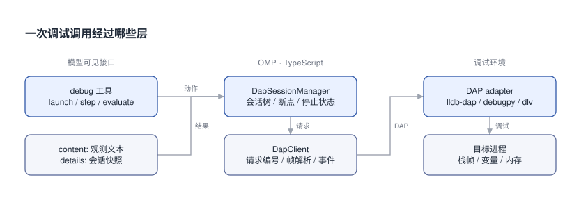

# oh-my-pi 的功能与原生调试: 对比 Pi 和 Codex

我对 oh-my-pi 的“原生调试”挺好奇, 想看看 Agent 怎么读变量、验证 review 里的猜测.

## 0x00 它在 Pi 上加了什么

如果已经在终端里读 diff, 下一步想直接查引用、看诊断、打断点验证一个越界假设, oh-my-pi 把这些入口接在同一个 coding agent 里. 模型调用 `lsp` 查代码关系, 调用 `debug` 驱动调试器, 调用 `task` 分配子任务. 下面主要看 `debug` 怎么接入代码审查.

下文简称 **OMP**, 固定版本 **18.8.7**, 源码为 [`d485860`](https://github.com/can1357/oh-my-pi/blob/d485860ba15c3fce2b0e2c1a02c0d88c8f53c448/README.md). 它是 Pi 的 fork, 使用 Bun 和部分 Rust native 组件. [原版 Pi 的库接口](hxid:hx-dae6c1b4)仍在独立演化, 两边不能只换一个 import 包名就假设兼容.

使用 Bun 安装可固定本文版本. 模型凭据、语言服务器和调试适配器仍需按目标项目配置.

```bash [安装入口-OMP]
# README 要求 Bun >= 1.3.14.
bun install -g @oh-my-pi/pi-coding-agent@18.8.7
omp
```

下面的功能清单按这个版本的 README 和源码注册表展开. 有些入口默认关闭, 有些走 eval helper, 还有些由扩展和发现机制提供, 因而不能只看一个工具总数.

## 0x01 功能清单与入口

[`BUILTIN_TOOLS`](https://github.com/can1357/oh-my-pi/blob/d485860ba15c3fce2b0e2c1a02c0d88c8f53c448/packages/coding-agent/src/tools/index.ts)登记了 30 个工具工厂. `createIf` 和设置会影响实际启用结果, 因此这张表表示产品能提供什么, 不表示当前会话一定把全部工具声明发给模型.

| 功能组 | 注册表中的入口 | 用途和启用条件 |
|---|---|---|
| 文件与资源 | `read`, `write`, `edit` | 读本地文件、URL、PDF、归档、SQLite 和内部资源; 写入能力依具体协议; edit 默认支持 hashline |
| 文本与结构查询 | `grep`, `glob`, `find`, `ast_grep`, `ast_edit` | 路径/内容检索、AST 查询、结构化改写提案 |
| 执行 | `bash`, `eval` | 持久 shell; Python/Bun 持久计算与工具回调 |
| 代码理解 | `lsp`, `debug`, `ida` | 语言服务器、DAP、IDA; IDA 接口依赖本机 idalib 与配置 |
| 协调 | `task`, `wait`, `todo`, `ask` | 子代理、等待后台结果/消息、待办与交互追问 |
| 外部查询 | `web_search`, `github`, `security_scan` | 网页、GitHub CLI 操作、Codex Security 云扫描; 后两项默认关闭 |
| 上下文控制 | `checkpoint`, `rewind`, `context_notes`, `new_context` | 保存检查点、带报告收缩探索上下文、上下文笔记与新上下文入口; 前两项默认关闭 |
| 记忆与技能 | `memory_edit`, `retain`, `recall`, `reflect`, `learn`, `manage_skill` | 保存/检索/修订记忆、保存经验与管理技能; 受 backend 和设置约束 |

另有 `think/yield/goal` 三个隐藏入口. `yield` 与后面的结构化 reviewer 输出直接相关. `security_scan` 会使用 Codex Security, 所以它也不能被算作“相对 Codex 独有的一套扫描引擎”.

[README 的 21 项产品能力](https://github.com/can1357/oh-my-pi/blob/d485860ba15c3fce2b0e2c1a02c0d88c8f53c448/README.md)还覆盖了下列组合入口. 表中列出操作入口和适用场景.

| 能力 | 操作入口或实现形式 | 与代码审查的关系 |
|---|---|---|
| 子代理协作 | `task`、可选独立 worktree、类型化 yield、Agent Hub | 分工取证、检查输出结构、查看和干预子任务 |
| 第二模型旁审 | advisor 角色 | 独立上下文中的模型跟读主任务并反馈 |
| 共享会话 | `/collab`, `omp join`, 只读观看链接 | 人与人协作查看或操作同一会话 |
| 审查与批注 | `/review`, `/annotate code-review` | 分发 reviewer, 在 diff 行上补充人工关注点 |
| GitHub 与内部资源 | `pr://`, `issue://`, `agent://`, `skill://`, `ssh://` 等 | 把 PR 和子代理结果作为可读取资源 |
| 冲突与改写提案 | `conflict://`, `ast_edit`, `xd://resolve` | 选择冲突版本, 预览并接受结构改写 |
| 提交拆分 | `omp commit` | 分析工作区, 按依赖拆分提交并检查消息 |
| 浏览器 | eval 的 `browser` helper | 用真实页面复现前端行为; 可连接 Chromium/Electron 或浏览器 relay |
| 桌面操作 | eval 的 `computer` helper | 窗口、截图、原生输入和辅助功能树; 不提供浏览器 DOM |
| 搜索与资料读取 | `web_search` + `read` | 查询文档, 读取网页与 PDF |
| 记忆后端 | local、Hindsight、Mnemopi | 跨会话保存事实和经验, 具体工具随后端变化 |
| 流中规则干预 | TTSR | regex 命中后中止流、注入规则再重试; 这是行为纠偏 |
| 编辑器与配置复用 | ACP/Zed、兼容其他 agent 的规则/skills/MCP 配置 | 接到编辑器或已有仓库约定 |
| 原生执行组件 | Rust 搜索/编辑/shell 组件 | 部分操作在进程内执行; 本文未测性能 |
| 模型路由 | provider、default/smol/slow/plan/commit/vision/task/advisor/tiny 角色 | 按任务分配模型, 配置 fallback 和凭据轮换 |
| 提示与会话控制 | `ultrathink`, `orchestrate`, `workflowz`, `/vibe`, `/fresh` | 调整推理/协作方式、驱动持久 worker、重置 provider 流状态 |
| 图像与语音 | README 列出的 `generate_image`, `tts` | 与本篇 review 主线关系较小, 默认关闭 |

这里的 browser/computer/generate_image/tts 不在上面那 30 项工厂表中, 不应当成同一种默认直接工具. 部分能力通过 helper、扩展或可发现入口暴露; 开启 `tools.xdev` 后, `read xd://` 可列出可发现工具, `write xd://<tool>` 调用对应能力. 项目配置还可加载 extensions、hooks、commands、skills 和 MCP.

## 0x02 与当前 Pi、Codex 放在一起看

对比以固定版本 Pi 1.1.0、OMP 18.8.7 和 2026-10-10 可查的 Codex 官方文档为准. 这里区分 Codex CLI/IDE、SDK、App Server 与官方文档中的 ChatGPT app/web, 不能把某一个界面缺的按钮推成整个产品不支持.

| 比较项 | 原版 Pi | OMP | Codex |
|---|---|---|---|
| 做自己的工作流 | `pi-ai` / core / session SDK 可分层使用 | 复用已集成的 coding agent 工具和角色 | SDK 自动化 Codex 线程; App Server 嵌入更完整客户端 |
| 多代理 | 上游有意不内置, 可扩展 | `task`、Agent Hub、advisor 等产品能力 | 官方已有 subagents, 当前版本默认启用 |
| MCP 与扩展 | 当前已内置 MCP/codemode/tool_search 的 CLI 集成 | MCP、hooks、skills、工具及内部资源入口 | MCP、skills; App Server 有实验性动态工具接口 |
| 原生调试 | 所查上游默认工具未包含 OMP 这套 DAP 接口 | `debug` 对接真实 adapter, 管会话和停止状态 | 所查官方文档未确认同等内置 DAP 动作接口, 可经命令/MCP 接外部工具 |
| 语义查询与写入联动 | 可扩展 | 内置 LSP 查询、诊断与写入集成 | 所查文档未确认同等内置 LSP 工具契约 |
| 同轮工具调度 | 默认并行; 一个 sequential 工具让整批串行 | shared/exclusive 屏障 | 此处不作未核对的调度实现推断 |
| Review 入口 | 本篇配套示例自行定义 PR 输入/输出 | `/review`、reviewer、批注和 PR 资源协议 | CLI `/review`、`codex exec`、GitHub `@codex review` |
| 执行边界 | 上游不内置 OS 权限隔离 | 独占调度、快照校验、ACP 权限交互各有用途; 本研究未确认等价 OS 沙箱契约 | 官方明确提供 OS 沙箱与独立审批策略 |
| 浏览器 | 默认工具未列浏览器; 可自行扩展 | eval browser/computer helper | CLI/IDE 无该内置浏览器入口, 可接浏览器 MCP; 官方 Browser 页面另列 ChatGPT app/web |

Codex 这几项可以分别对照官方 [subagents](https://learn.chatgpt.com/docs/agent-configuration/subagents)、[MCP](https://learn.chatgpt.com/docs/extend/mcp?surface=cli)、[skills](https://learn.chatgpt.com/docs/build-skills)、[GitHub review](https://learn.chatgpt.com/docs/third-party/github)、[沙箱](https://learn.chatgpt.com/docs/sandboxing)、[审批模式](https://learn.chatgpt.com/docs/permission-modes)和[浏览器](https://learn.chatgpt.com/docs/browser)文档. 这组比较不包含同题审查准确率测试.

如果已经在用 Codex, 想把 review 接进脚本, [TypeScript SDK](https://learn.chatgpt.com/docs/codex-sdk)的入口就是线程. 它复用 Codex 的运行方式, 与 Pi 让你直接注入 `streamFn` 和 `execute` 的库层接口处于不同层次.

```typescript [Codex对照-线程接口]
import { Codex } from '@openai/codex-sdk';

const codex = new Codex();
const thread = codex.startThread();
const result = await thread.run('审查当前分支相对主分支引入的 bug');
console.log(result.finalResponse);
```

[App Server](https://learn.chatgpt.com/docs/app-server)还提供 `thread/start`、`turn/start`、`turn/interrupt`、审批和事件. 实验性 `dynamicTools` 经 `item/tool/call` 回调客户端, 需开启 `capabilities.experimentalApi`. 因此“Codex 不能自定义工具”不成立. [codex exec](https://learn.chatgpt.com/docs/non-interactive-mode)则适合 CI/脚本, 可用 `--json` 接事件.

回到 PR 工作流的选择: 要自己定义输入、取证工具和输出契约, Pi core 很直接; 要现成的调试、语义查询和协作入口, OMP 集成得更多; 要沿现有 Codex/GitHub/沙箱流程自动化, Codex 已有相应产品接口. 

## 0x03 debug 怎样连上真实程序

假设 review 时看到 `values[i]`, 静态分析怀疑 `i` 会等于数组长度. OMP 可以在这行之前断住, 读出 `i` 和数组类型, 把实际值交给模型. 它通过 Debug Adapter Protocol, 简称 **DAP**, 与调试适配器通信.



图中左侧是模型能调用的 `debug` 工具, 中间是 OMP 的 TypeScript 会话管理器与协议客户端, 右侧才是 `lldb-dap` 等适配器和目标程序. 会话管理和 DAP 通信由 TypeScript 层实现.

最常用的 JSON 调用可以按下面顺序理解. 这是发给 OMP `debug` 的参数, 每步等待返回后再做下一步; 栈帧和变量引用必须取自实际结果, 不应抄一个固定 ID.

```json [调试调用-启动并检查]
[
  { "action": "launch", "adapter": "lldb-dap", "program": "/work/demo", "cwd": "/work" },
  { "action": "set_breakpoint", "file": "/work/demo.c", "line": 4 },
  { "action": "continue" },
  { "action": "stack_trace", "levels": 5 },
  { "action": "scopes" },
  { "action": "evaluate", "expression": "i", "context": "watch" },
  { "action": "terminate" }
]
```

这段数组用于展示多个独立调用, 不是 `debug` 接收的单次批量参数. OMP 可以在省略 `frame_id` 时使用当前 stopped frame; 若要展开变量, 则把 scopes 返回的引用传给 `variables` 的 `variable_ref` 或 `scope_id`. 上面的启动顺序依赖适配器停在入口; 独立协议复现会在初始配置阶段先设断点.

[`debug` 的 schema](https://github.com/can1357/oh-my-pi/blob/d485860ba15c3fce2b0e2c1a02c0d88c8f53c448/packages/coding-agent/src/tools/debug.ts)还包括 attach、条件/函数/数据断点、线程、步入/步过/步出、pause、内存读写、反汇编、模块和自定义 DAP 请求. 动作能否工作取决于 adapter capabilities. `evaluate` 可以执行有副作用的表达式, 不能一律按只读查询处理.

OMP 参数用 `frame_id`、`variable_ref` 等名字, 原始 DAP 常用 `frameId`、`variablesReference`. 工具执行层负责转换并返回模型可读 `content`, `details` 则供宿主渲染快照. 交互命令 `/debug` 是 OMP 自身的诊断菜单, 和模型工具 `debug` 是两件事.

## 0x04 DAP 里最容易写错的等待顺序

只写“发 launch, 等结果, 再设置断点”, 某些适配器就会卡住. 它要收到 `configurationDone` 才完成 launch; 客户端却还在等 launch 返回, 根本走不到配置步骤.

[OMP 会话管理器](https://github.com/can1357/oh-my-pi/blob/d485860ba15c3fce2b0e2c1a02c0d88c8f53c448/packages/coding-agent/src/dap/session.ts)把启动请求留在进行中, 先完成握手. 同时提前监听 `stopped`, 防止目标很快停住、事件先于后续 await 到达.

```text [启动握手-请求与事件交错]
initialize → capabilities
发送 launch, 保留 Promise
等待 initialized 事件
设置断点 → 按能力发送 configurationDone
等待 launch 响应
等待 stopped 事件 → 读取 stack/scopes/variables
```

[DAP 客户端](https://github.com/can1357/oh-my-pi/blob/d485860ba15c3fce2b0e2c1a02c0d88c8f53c448/packages/coding-agent/src/dap/client.ts)还要处理字节流. 一帧是 `Content-Length: 字节数` 加空行和 JSON, 不能拿 readline 把每一行当独立 JSON. 普通 response 用 `request_seq` 找 pending Promise; stopped/output 等 event 则走事件通道. 多个 pending 请求可以存在, 不意味着有状态的 step 和 evaluate 适合随意并发.

OMP 的管理器保留 adapter、线程、栈帧、断点和输出, 当前只允许一个 root 调试会话, 下面可挂 child 会话. adapter 反向请求 `runInTerminal` 时由宿主启动进程, `startDebugging` 可创建 child. 断点变更还会通过专门的队列同步到会话树.

> [!TIP]
> 当前实现默认单请求超时 30 秒, debug 工具 timeout 范围 5..300 秒, 输出缓存 128 KiB, 空闲约 10 分钟后清理. 客户端 abort/timeout 只拒绝等待, 该路径不会自动发送 DAP cancel 或终止目标. 超时后仍需确认会话状态并显式清理, 尤其不能把有副作用的 evaluate 当成“肯定没执行”直接重试.

## 0x05 一个能跑的调试协议例子

下面的 [dap-demo.py](dap-demo.py)用 Python 标准库直接驱动 `lldb-dap`. 它创建 5 行 C 程序, 用 `clang -g -O0` 编译, 在 `return values[i]` 前断住, 读取栈和变量. 这样能完整看见帧解析、请求编号、启动握手和事件等待, 代码没有复制 OMP 整个管理器.

运行需要 Python 3、clang 和 lldb-dap 在 PATH 中. 把脚本放在空的临时目录, 它会在那里写入 `demo.c` 和编译产物 `demo`; 最后用 disconnect 结束目标并关闭 adapter.

```python [协议复现-dap-demo.py]
"""Minimal DAP reproduction: Python 3 standard library + clang + lldb-dap."""
import asyncio
import json
import os
from pathlib import Path

async def main():
    root = Path(__file__).resolve().parent
    source = root / 'demo.c'
    source.write_text('int main(void) {\n  int values[3] = {10, 20, 30};\n  int i = 3;\n  return values[i];\n}\n')
    build = await asyncio.create_subprocess_exec('clang', '-g', '-O0', str(source), '-o', str(root / 'demo'))
    assert await build.wait() == 0
    proc = await asyncio.create_subprocess_exec('lldb-dap', stdin=asyncio.subprocess.PIPE,
                                                stdout=asyncio.subprocess.PIPE, stderr=None, env={**os.environ, 'DEBUGINFOD_URLS': ''})
    pending, events, seq = {}, asyncio.Queue(), 0
    async def reader():
        try:
            while True:
                header = await proc.stdout.readuntil(b'\r\n\r\n')
                size = int(next(x.split(b':', 1)[1] for x in header.split(b'\r\n') if x.lower().startswith(b'content-length:')))
                msg = json.loads(await proc.stdout.readexactly(size))
                if msg['type'] == 'response':
                    future = pending.pop(msg['request_seq'], None)
                    if future is not None and not future.done():
                        if msg['success']: future.set_result(msg.get('body', {}))
                        else: future.set_exception(RuntimeError(msg.get('message', str(msg))))
                elif msg['type'] == 'event': await events.put(msg)
        except (asyncio.IncompleteReadError, asyncio.CancelledError):
            for f in pending.values():
                if not f.done(): f.set_exception(RuntimeError('Adapter closed'))
    async def request(command, **args):
        nonlocal seq
        seq += 1
        request_id = seq
        future = asyncio.get_running_loop().create_future()
        pending[request_id] = future
        data = json.dumps(dict(seq=request_id, type='request', command=command, arguments=args)).encode()
        proc.stdin.write(f'Content-Length: {len(data)}\r\n\r\n'.encode() + data)
        await proc.stdin.drain()
        print('SEND', command)
        try: return await asyncio.wait_for(future, 30)
        finally: pending.pop(request_id, None)
    async def event(name):
        while True:
            msg = await asyncio.wait_for(events.get(), 30)
            if msg['event'] == name:
                print('EVENT', name, {k:v for k,v in msg.get('body', {}).items() if not k.startswith('$')})
                return msg.get('body', {})
    pump = asyncio.create_task(reader())
    launch = None
    try:
        caps = await request('initialize', adapterID='lldb', clientID='minimal-review',
                             linesStartAt1=True, columnsStartAt1=True, pathFormat='path')
        # launch may wait for configurationDone: it must stay in flight.
        launch = asyncio.create_task(request('launch', program=str(root / 'demo'), cwd=str(root), stopOnEntry=False, initCommands=['settings set symbols.enable-external-lookup false']))
        await event('initialized')
        bp = await request('setBreakpoints', source={'path': str(source)}, breakpoints=[{'line': 4}])
        assert bp['breakpoints'][0]['verified']
        if caps.get('supportsConfigurationDoneRequest'): await request('configurationDone')
        await launch
        stop = await event('stopped')
        frames = await request('stackTrace', threadId=stop['threadId'], levels=5)
        frame = frames['stackFrames'][0]
        scopes = await request('scopes', frameId=frame['id'])
        locals_ = await request('variables', variablesReference=scopes['scopes'][0]['variablesReference'])
        result = await request('evaluate', expression='i', frameId=frame['id'], context='watch')
        print('FRAME', frame['name'], 'line', frame['line'])
        print('LOCALS', json.dumps(locals_['variables']))
        print('EVALUATE i =', result['result'])
        assert frame['line'] == 4 and result['result'] == '3'
        print('EVIDENCE: index 3 is outside values[3]; stopped before the invalid access.')
        await request('disconnect', terminateDebuggee=True)
    finally:
        if launch is not None:
            if not launch.done(): launch.cancel()
            await asyncio.gather(launch, return_exceptions=True)
        if proc.returncode is None:
            try: await asyncio.wait_for(proc.wait(), 2)
            except TimeoutError: proc.kill(); await proc.wait()
        pump.cancel()
        await asyncio.gather(pump, return_exceptions=True)

asyncio.run(main())
```

运行 `python dap-demo.py` 后, 关键观测是 `frame=main, line=4`, 局部变量 `values` 为 `int[3]`, `i=3`, evaluate 也返回 `3`. 这些已经支持这次输入下的索引越界, 不必真的读出越界地址再等它崩溃; C 的未定义行为不保证 crash.

这个复现在 Linux、Python 3.14、clang/LLDB 23.1.1 上跑过. 它关闭外部调试符号查找, 避免样例受在线符号查询拖延; 这是复现条件, 不是 OMP 默认设置. 它验证了 DAP 协议链, **没有运行完整 OMP CLI 或其 DapSessionManager**. debugpy、gdb、dlv 的入口来自源码配置, 未逐一实测.

## 0x06 多工具调度怎样保护调试状态

同时读取 A、B 两个源文件很自然, 但 `step_over` 会改变当前停在哪一帧. 如果旧帧的 variables 查询与 step 并发, 结果可能对应不同状态. OMP 因此把 `debug` 标为 `exclusive`, `edit/write` 也使用独占模式.

[调度器](https://github.com/can1357/oh-my-pi/blob/d485860ba15c3fce2b0e2c1a02c0d88c8f53c448/packages/agent/src/agent-loop.ts)使用两类等待关系: shared 等最近的 exclusive; exclusive 等最近的 exclusive 和它前面所有 shared. 后面的 shared 再等待新的 exclusive. 与 Pi 的“一项 sequential 让整批串行”相比, OMP 保留了独占前后两个共享组内部的并发.

[barrier-demo.mjs](barrier-demo.mjs)只复现这条调度规则, 可以直接运行 `node barrier-demo.mjs`. 它断言 A/B 并行, 然后 step, 最后 C.

```javascript [共享独占-barrier-demo.mjs]
// Teaching reproduction of OMP's shared/exclusive scheduling rule.
import assert from 'node:assert/strict';
const trace = [];
let barrier = Promise.resolve();
let shared = [];
const tasks = [];
for (const [name, mode, delay] of [['read-A','shared',40],['read-B','shared',5],['debug-step','exclusive',2],['read-C','shared',1]]) {
  const ready = mode === 'exclusive' ? Promise.all([barrier, ...shared]) : barrier;
  const task = ready.then(async () => {
    trace.push(`start:${name}`);
    await new Promise(resolve => setTimeout(resolve, delay));
    trace.push(`end:${name}`);
  });
  tasks.push(task);
  if (mode === 'exclusive') { barrier = task; shared = []; }
  else shared.push(task);
}
await Promise.allSettled(tasks);
assert.deepEqual(trace,['start:read-A','start:read-B','end:read-B','end:read-A','start:debug-step','end:debug-step','start:read-C','end:read-C']);
console.log('SHARED_EXCLUSIVE', JSON.stringify(trace));
```

如果 scopes 需要刚返回的 frameId, 仍要等 `stack_trace` 的结果后才能组装参数, 或由工具内部串起来. continue/step 后应重新取栈帧和变量引用, 不把旧 `frameId/variablesReference` 当成永久身份.

复现中的任务只成功执行, 不覆盖 OMP 的 steering、重试、speculation 和后台任务. 这个示例只演示正常完成时的执行顺序, 没有模拟这些分支.

## 0x07 审查前后还有哪些工具值得接

取 PR 时, OMP 的 [PR 协议](https://github.com/can1357/oh-my-pi/blob/d485860ba15c3fce2b0e2c1a02c0d88c8f53c448/packages/coding-agent/src/internal-urls/issue-pr-protocol.ts)把 diff 做成资源路径. 先读清单, 再读某个文件, 比直接把整个 PR 塞进上下文更容易控制取证量.

```json [PR资源-分段读取]
[
  { "path": "pr://owner/repo/123/diff" },
  { "path": "pr://owner/repo/123/diff/1" },
  { "path": "pr://owner/repo/123/diff/all" }
]
```

上面同样表示三种 `read` 参数, 不是一个批量调用. `/diff/1` 是本次清单的第一项, 不是永久文件 ID 或源码行号. handler 使用 gh 和 SQLite 缓存并提供 freshness 信息; 真正记录发现时仍应保存 commit 和文件坐标.

接着用 [LSP](https://github.com/can1357/oh-my-pi/blob/d485860ba15c3fce2b0e2c1a02c0d88c8f53c448/docs/tools/lsp.md)追踪定义、引用、调用关系或诊断. OMP 会在查询前协调磁盘内容与语言服务器状态. review 阶段要注意 `rename` 默认会应用, 预览应显式 `apply: false`, 或使用 `lspReadOnly` 限制写动作; code_actions 默认先列出动作. 

需要修复时再看 [hashline](https://github.com/can1357/oh-my-pi/blob/d485860ba15c3fce2b0e2c1a02c0d88c8f53c448/docs/tools/edit.md). 当前版本的输入用文件快照 TAG 和 PUT/CUT/MV/REM, 下面的 `1A2B` 只是示意, 实际必须来自最近一次有锚点的 read/grep/edit 结果.

```text [Hashline输入-替换原始第四行]
[src/example.ts#1A2B]
PUT 4.=4:
+const value = 2;
```

所有行号相对这个原始快照. Rust `pi-edit` 解析和计算变更, TypeScript 层整合写入、预览和 LSP. 快照过时或未读范围会影响编辑是否接受, 独占执行不免除这些检查. 它也不是可直接交给 `git apply` 的 unified diff, 更不是旧教程中逐行 `LINE:HASH` 的输入.

## 0x08 把动态证据接到 reviewer

OMP 内置 reviewer 并不会因为有 `debug` 就自动调试所有 PR. [当前 reviewer 配置](https://github.com/can1357/oh-my-pi/blob/d485860ba15c3fce2b0e2c1a02c0d88c8f53c448/packages/coding-agent/src/prompts/agents/reviewer.md)的工具表没有 debug, 并要求不编辑、不触发构建, bash 用于读 diff/log/show. 它检查变更和消费者代码, 通过 incremental `yield` 提交 findings 与 verdict.

每条 finding 包括优先级、置信度、文件和行区间, 位置要与 diff 重叠, 范围不超过 10 行. 大 diff 超过 50000 字符或 20 个文件时, [review 分发](https://github.com/can1357/oh-my-pi/blob/d485860ba15c3fce2b0e2c1a02c0d88c8f53c448/packages/coding-agent/src/extensibility/custom-commands/bundled/review/prompt.ts)使用按文件预览并要求继续读取. 普通模式可分发多个 reviewer; [headless 模板](https://github.com/can1357/oh-my-pi/blob/d485860ba15c3fce2b0e2c1a02c0d88c8f53c448/packages/coding-agent/src/prompts/review-headless-request.md)明确只创建一个 reviewer task.

如果要把调试加进 review, 我会单独定义 verifier 的输入输出. 下面是扩展设计, 不是 OMP 已有的默认工作流. reviewer 先提出待验证假设, verifier 在指定构建和输入下观察, 再把证据还给 reviewer.

```json [动态验证-建议契约]
{
  "input": {
    "commit": "固定提交 SHA",
    "build": "调试构建及其编译参数",
    "hypothesis": "第 4 行访问 values[3]",
    "reproduction": "运行给定最小输入"
  },
  "output": {
    "breakpoint": "demo.c:4",
    "frame": "main",
    "observed": "values 为 int[3], i 为 3",
    "impact": "下一次数组访问越界",
    "cleanup": "已终止本次启动的目标"
  }
}
```

verifier 需要明确允许构建、执行和调试, 并负责自己启动的会话清理. 仅给原 reviewer 塞进 debug, 仍会和它禁止构建的提示冲突. 多个 reviewer 汇总时, 还应按同一 head、路径、行区间和缺陷原因去重, 并检查跨目录的生产者与消费者; 这些规则需要在自定义工作流中实现.

维护目标项目的可复现构建是这里的主要成本. 没有环境就保留未验证假设, 不能补写一份没有观察过的变量记录. 记录中要写清: 用什么输入停在哪一行, 看到了什么值, 以及这些值怎样支持缺陷判断.

这个例子只验证了给定输入下的越界. 换一个提交或构建, 还需要重新运行.
