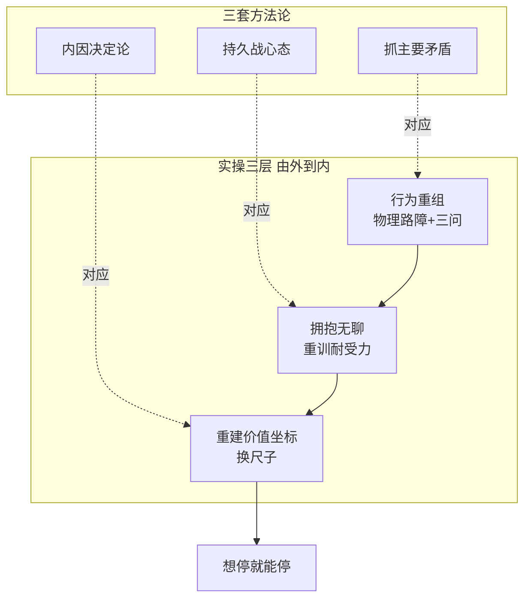

# 短视频=精神鸦片: 用毛选方法论解构注意力成瘾

> [!NOTE]
> 本文提炼自 B 站视频《毛选实战局》一期节目 (BV1Xv8x6uEqa), 拆解短视频成瘾的机制, 并借用毛选的方法论给出应对思路. 适合正在和短视频反复拉扯、想找回专注力的人阅读.

## 0x00 背景

你是否有过这样的经历: 反复卸载短视频 App, 又反复装回来; 越想早点睡, 越是刷到凌晨三点; 遇到一点困难就想放弃, 然后不自觉点开短视频. 这些都不是意志力问题, 而是注意力已经被一套设计好的机制接管了.

这期视频的价值在于: 它没有停留在「短视频有害, 少刷点」的劝诫上, 而是把成瘾拆成可验证的机制链, 再用「抓主要矛盾」「持久战」「内因外因」这套方法论给出真正可执行的出路. 本文把它整理成一份可以直接对照自查的清单.

## 0x01 核心结论

先给结论, 再展开推导:

1. **短视频成瘾与鸦片同构**, 都是用高频刺激攻占神经系统, 大脑产生三层反应: 及时快感 (多巴胺=渴望), 断崖戒断 (焦躁空虚), 麻醉现实 (DMN 关机).
2. **成瘾真正改写的是判断万事万物的底层逻辑**, 表现为三支暗箭: 延迟满足失效、消费主义、反智主义, 三箭合流完成**阶层固化**.
3. **戒不掉的原因是把主要矛盾找错了**: 不是「手机 vs 自己」, 而是「资本和技术合谋制造的高强度外部刺激 vs 你的内在理性系统」. 手机是外因, 大脑是内因, 外因通过内因起作用.
4. **出路不是砸手机, 而是持久战 + 强化内因**: 胜负不在一次卸载, 而在每次失控后恢复控制的速度.
5. **真正的自由不是想刷就刷, 而是想停就能停.**

整体论证链:

## 0x02 关键细节

### 2.1 三层成瘾机制: 与鸦片同构

视频从「鸦片毁身体, 短视频毁大脑」切入: 设计者用十几年反复测试出一套专门攻击人类神经系统的组合拳, 大脑会产生三层反应, 每一层几乎都与鸦片成瘾一致.

| 层 | 一句话 | 生理机制 | 体感 |
|---|---|---|---|
| ① 及时快感 | 多巴胺不是快乐, 是渴望 | 看到好玩的视频, 多巴胺释放, 像一只看不见的手在耳边说「下一个更精彩」 | 刷到不满足, 放下又难受, 永远饥饿 |
| ② 断崖戒断 | 多巴胺水平断崖式下跌 | 前扣带回皮层与脑岛报警, 前额叶皮层能量耗尽, 无力压制冲动 | 焦躁空虚; 越想控制越难受, 刷一下多巴胺立刻回来 |
| ③ 麻醉现实 | 你以为在放松, 其实在麻木 | 视觉/听觉皮层被占满, 默认模式网络 (DMN) 被强行关机 | 失去深度思考与创造力来源 |

最隐蔽的是第三层: 牛顿看苹果、爱因斯坦构想相对论时那些灵光乍现, 都来自 DMN 活跃; 短视频用碎片信息填满每一秒空隙, 等车、排队、上厕所都不留发呆时间, 等于把后台操作系统掐死了. 视频里的一句话: 「你以为你在休息, 其实你在毁掉自己处理复杂信息的能力」.

[三层成瘾机制 #ppt ##w100%##](opium-3layer.html)

### 2.2 三支暗箭: 底层逻辑被重写

当人被训练成只能接受「几秒就爽一次」的节奏, 改变的不仅是耐心, 还有判断万事万物的底层逻辑. 视频把这三支暗箭称为「开胃菜之后的杀招」:

1. **延迟满足失效**: 立刻有回报被当成世界本该如此的样子, 三分钟没反馈就觉得没用; 读书太慢、健身太累、技能太枯燥. 失去延迟满足能力的人, 没法完成任何长期目标, 也不再相信缓慢积累的力量.
2. **消费主义**: 短视频平台是情绪放大器, 资本把稍纵即逝的「想要」放大到你无法忽视, 然后顺手一指: 下单吧. 付款瞬间多巴胺又一个小高峰, 把消费当成对自己努力的唯一奖赏; 让你永远当消费者, 永远在欲望跑步机上奔跑.
3. **反智主义**: 十五秒讲完干货、三十秒学会技能、一分钟读完书, 关上手机脑子里空空如也; 更可怕的是习惯压缩饼干式的浅薄知识后, 会本能排斥任何需要动脑子的东西, 无法识别欺骗, 更没有能力组织反抗. 视频引用了那句老话: 「没有调查就没有发言权」.

三箭合流的终点是**阶层固化**: 「让你既没时间没精力, 也没脑子去想你到底是怎么走到这一步的」.

[三支暗箭 #ppt ##w100%##](opium-3arrows.html)

### 2.3 毛选方法论: 怎么把仗打赢

看清三支暗箭只是撕开了算法的第一层包围圈, 接下来用三套方法论, 把这场仗从「怎么防」升级为「怎么赢」:

- **抓主要矛盾**: 很多人以为主要矛盾是「手机和自己」, 其实真正的主要矛盾是「外部刺激 与 你的理性系统」. 手机消灭不了, 诱惑永远存在, 唯一能做的是强化内因: 把理性系统建起来, 让自己扛得住诱惑.
- **坚持持久战**: 大部分人陷入两种错误态度——亡国论 (反正打不赢, 干脆投降, 任由算法吞噬) 和速胜论 (卸载 App 就能赢, 没撑过三天又装回, 陷入更深的自我否定). 正确心态: 这是持久战, 不追求一次性戒断, 追求每次失控之后恢复控制的速度越来越快; 今天刷三小时, 明天两个半小时就是进步. 允许自己反复, 但不允许自己放弃.
- **内因决定论**: 别人讲再多道理、收藏再多教程都是外因, 不行动就毫无关系. 一切建议的前提是: 先承认自己被困住了, 并且想出来.

视频里的原话: 「进步不会是直线上升, 而是波浪式前进」.

[毛选方法论与实操 #ppt ##w100%##](opium-method.html)

### 2.4 实操三层: 由外到内

方法论落到行动, 视频把方案拆成三个层面, 从最外层到最内层:

| 层 | 动作 | 关键招 |
|---|---|---|
| 行为重组 (最外层) | 给手装刹车 | 物理路障: App 移出首页、放第三屏、睡前放另一个房间; 想刷时停 30 秒自问三句: 我现在是什么情绪? 现在刷对我有什么价值? 我现在有没有更重要的事? |
| 拥抱无聊 (中间层) | 重训对枯燥的耐受力 | 等车、排队、吃饭时不拿手机; 容忍短暂枯燥是进入深度思考的必经之路, 创造力往往诞生于无聊 |
| 重建价值坐标 (最深层) | 换掉被算法校正的尺子 | 问自己: 十年后想站在哪里? 刷这个视频对实现目标有帮助吗? 没帮助为什么要刷? 自律不是被逼的, 是自己选的 |

三层的关系可以串成一句话: 行为重组把无意识刷动变回有意识选择, 拥抱无聊把被填满的缝隙还给 DMN, 重建价值坐标让时间自动流向长远目标.

### 2.5 最后一句

技术本身是中性的: 它可以服务资本, 把你变成流量的奴隶; 也可以服务于你, 让你有更多时间去学习、去创造、去生活. 关键在于**谁能控制你的注意力**. 正如视频结尾所说: 这个时代不缺聪明, 缺的是那种能为了长远目标, 忍得住枯燥、耐得住寂寞、扛得住诱惑的人.

## 0x03 参考来源

- 《短视频=精神鸦片? 用毛选方法论拆穿算法陷阱》- B 站视频 BV1Xv8x6uEqa, 频道「毛选实战局」: https://www.bilibili.com/video/BV1Xv8x6uEqa/
- 视频中引用: 毛泽东《矛盾论》《论持久战》的「主要矛盾」「持久战」「内因外因」概念 (非原文, 为视频阐述)
