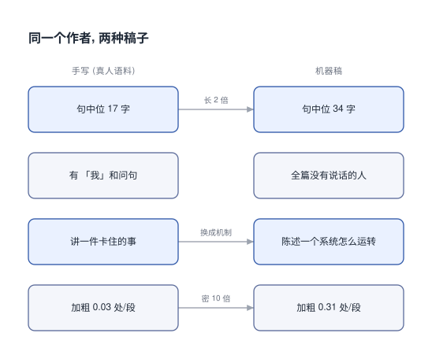

# 怎么判断自己写的东西有没有 AI 味

调教 AI 写笔记有一阵了, 就是不说人话. 已经没有人类了, 到底有没有在说人话?

## 0x00 先查这句话里有没有人在说话

量之前我以为差在词上. 我以为机器稿爱堆那种很官方的大词.

量完发现, 差的是句子里有没有一个在说话的人.

真人那 215 句里, 「啊」136 次, 「吧」88 次, 「我们」81 次. 再往下是「呢」77 次, 「哎」62 次. 剩下的「对吧」44 次, 「其实」28 次.

我那份 94 句的稿子, 这七个词加起来是 0.



上图左栏是手写语料那边, 右栏是我这份稿子.

句子这一级的差距同样大. 换成每千段计数是这样.

```text [语料-逐项对照]
感叹句      手写 224.7  ->  我的稿 7.5
省略号      手写 209.7  ->  我的稿 11.2
我们/咱们   手写  54.9  ->  我的稿  5.0
第一人称    手写 389.5  ->  我的稿 36.1
疑问句      手写 147.3  ->  我的稿 18.7
```

第一人称差 11 倍, 感叹句差 30 倍.

看着像「机器不会说人话」, 但下面两项把这条路堵了.

口语词 (其实、反正、就是、好像) 两边几乎一样, 219.7 对 190.5. 程度副词 13.7 对 10.0.

那些词不是不会用, 是没有需要表达的情绪.

两组样本的段落数几乎一样, 801 段对 803 段. 差的是句数, 1926 句对 3595 句, 快一倍.

句子被切得更碎, 这是后面好几项指标的来源.

```text [语料-真人原句]
哎，长这个样子
其实没那么难，对吧
那肯定是不行的
从 channel 出来，这不就是读嘛
```

```text [语料-我写的稿]
箭头方向表示数据流向.
该组件的语义边界由调用方自行维护.
```

第二轮那句把箭头念了出来. 书面语会写成「箭头方向表示数据流向」. 抽象规则在这边被翻成了动作.

上手就搜一遍「我」. 再挑一句看它是在指一个东西, 还是在引出下一步.

前者是在推进. 两样都不是的, 只是不含新信息的应答, 那就是口水.

顺带说一句这套样本的来路. 口播素材来自一个技术视频, 经语音识别转写, 674 行原文切出 215 句.

只有一个讲者, 所以学到的一部分是他个人的口癖. 这条限制在后面几节会再提一次.

## 0x01 读出声, 哪一句让你喘气

挑全篇最长的那句, 读出来.

手写 blog 1752 句, 中位 17 字, 均值 22, p90 43. 手写 docs 32781 句, 中位 25 字, 均值 30, p90 58. ai-docs 里 3177 句, 中位 34 字, 均值 39.

真人技术口播 215 句, 中位 29 字, 均值 34, 最长 120 字.

我按同主题写的讲稿, 中位 50 字, 均值 62, 最长 385 字.

385 字一句在屏幕上就是一大段, 中间没有任何停顿点.

```text [句长-三类语料]
手写 blog    中位 17 字 / 均值 22 / p90 43    (1752 句)
手写 docs    中位 25 字 / 均值 30 / p90 58    (32781 句)
口播转写     中位 29 字 / 均值 34 / 最长 120  (215 句)
```

```text [句长-真人技术文章]
edsionte 内核短文     中位 33 字
博客园 luconsole     中位 23 字
博客园 LittleHann    中位 27 与 29 字
CSDN weiqifa0        中位 27 字
```

第一组里 17 那行是我自己写的随笔. 随笔本来就短.

同体裁的真人技术文章落在 23 到 33 之间. 我这份技术稿在 34.

同一作者的讲稿是 50, 那是我最差的样本. 它是按主题硬写出来的, 不是有话要说.

手写 blog 里 90% 的句子在 43 字以下. 所以 43 可以当一条可用的线.

最直接的办法是找出最长那句读出声. 一口气读不完就拆成两三句. 不需要任何工具.

顺带记一个坑. 本仓库的中文正文用半角句点结尾.

切句只认全角句号时, 整段会被当成一句, 量出来是中位 90 字.

那个假数字会让阈值整个定错. 阈值一旦靠估计拍成 60, 32 篇人写笔记里 31 篇会被误报.

所以阈值必须从分布里取, 不能拍.

## 0x02 数加粗: 一段里画了几个重点

手写 blog 每段加粗 0.03 处. 我这份 ai-docs 每段 0.31 处.

含加粗的段落从 2% 涨到 23%. 第一句就是加粗标记的段落从几乎 0 涨到 15.9%.

```text [加粗-实测]
加粗处 / 段      手写 0.03     我的稿 0.31
含加粗的段落     手写 2%       我的稿 23%
段首即加粗       手写 约 0     我的稿 15.9%
段落首句中位     手写 21 字    我的稿 34 字
```

一段里的加粗别超过四分之一. 超了就是全画重点等于没有重点.

这一条还有个变体. 列表项一律写成「加粗小标题 + 冒号 + 说明」的样子, 也是同一个指纹.

人写的列表参差不齐, 长短不一. 机器排的列表整齐得像表格.

## 0x03 名词是不是都在指概念

只有抽象名词这一项, 我的稿子明显超标. 每千段 51 个对 379 个, 差 7.4 倍.

手写那句是「咱们以C++为例, java方法名太长了, 没有Tab我怎么活」.

我的稿是「v2 移除了 EventLoop 依赖后, 这个问题交给了调用者管理」.

左边在讲一件具体的事, 右边在陈述一个机制. 稿子被说「像说明书」, 大概就是因为这个.

左边那种句子我写不出来.

```text [抽象名词-现行计数表]
机制 链路 形态 维度 范式 要素 场景 体系 流程 闭环 抓手
赋能 生态 矩阵 组合拳 层面 视角 定位 方法论 语义层
```

函数、进程、线程这类有确定所指的技术词不算在内.

这张表是第二版. 第一版里还有 方法、路径、结构、模型、框架、模式 这六个词.

后来加上「能力」一共七个, 都被对照证伪了.

拿真人技术文章一跑, edsionte 那篇命中旧表 700 次每千段.

逐条看上下文, 命中的全是「绝对路径」「文件系统数据结构」「方法一/方法二」.

在那个语境里它们都指具体的东西.

「绝对路径」是一个确定的路径. 「文件系统数据结构」是内核里真实存在的那几个结构体.

「方法一」「方法二」是那篇文章自己给的两种解法.

「能力」是在 MCP 那篇里被踢出去的. 它在那儿指 capabilities 字段, 是个术语.

```text [抽象名词-同一篇两种表]
edsionte 那篇        旧表 700  ->  新表 0
我写的 MCP 那篇       旧表 765  ->  新表 183
```

换表之后我那篇仍高约 10 倍. 词表修对了, 病还在.

挑一句, 把里面的抽象名词换成一件具体的事, 看这句还成不成立. 换不进去, 这句就没在讲事.

同一个词在不同文章里性质不同. 所以这张表只能当提示.

它报出来时该做的动作是看一眼这个词在这儿是术语还是空壳. 不是直接删掉.

这条也解释了一件事. 我原以为差在词上, 其实词只是症状.

真正的问题在选材和立意上, 后面 0x08 会回到这里.

## 0x04 找同体裁的真人文章当对照

随笔跟技术笔记本来就不同. 上面那些比值里混着一层体裁差.

要把它拆开, 得拿同体裁的真人文章来比.

拿五篇真人技术文章跑同一张表, 每千段命中 0 / 17 / 9 / 18 / 11.

```text [空壳词-五篇真人技术文章]
口径: 每千行正文, 去 frontmatter 与代码块, 分母取 >20 字的行

edsionte 内核短文        0
CSDN weiqifa0           9
博客园 LittleHann #2    11
博客园 LittleHann #1    17
博客园 luconsole        18
```

上限大约 18. 我那份 MCP 稿换表后是 183, 高约 10 倍.

这组数字比手写 blog 强, 因为体裁对上了.

前面那个 7.4 倍是随笔对技术笔记, 里头有体裁差. 这组是同体裁对照, 剩下来的差只能归到写法上.

手写 blog 那边 0 篇命中, 但它本来就不该命中. 随笔里没有技术名词.

这组五篇不一样. 它们全是技术文章, 里面有大量技术术语, 仍然只有 0 到 18.

这才是能区分「术语」和「空壳」的一组对照.

素材怎么挑也有一条. 扫站内全部 md 里的 BV 号, 拿「作者真的引用过」当过滤器.

不用播放量, 也不用自己的主观判断.

按这个筛法, 被引用过的视频归到四个 UP 主. 算法精讲 5 次, 硬件选购 1 次, Redis 教程 1 次, 现代 OpenGL 1 次.

引用过就等于他实际看过, 并且认为值得进知识库. 这比任何外部指标都可靠.

这五篇文章也来自引用链. 作者一篇手写博客里引了 12 个技术链接, 我挑出能抓正文的那几篇.

其中一篇打不开, 抓回来是 0 字节, 所以实际参与对照的是五篇.

判据只有一句. 把这个词换成「具体发生了什么」, 句子会变好还是变空.

会变好就换掉它. 换不了就留着, 因为它本来就是具体的.

## 0x05 判据要分清是哪一种媒介的

前面有几条是从技术直播里读出来的, 一共七条.

```text [口播手法-七条]
先接住困惑  自问自答推进   失败讲成交互  用问题引出动作
报菜单

取舍要说清     给读者能带走的东西
```

拿真人技术文章逐条复核, 只有两条在文章里成立.

```text [手法-逐条核对]
取舍要说清             成立      通用判据
给读者能带走的东西      成立      通用判据
先接住困惑再往下讲      不成立    口播特性
自问自答推进           不成立    口播特性
失败讲成交互           不成立    口播特性
用问题引出动作         不成立    口播特性
报菜单 (预告目录)      文章不用   口播特性
```

那两条成立的之所以成立, 是因为跨了领域复现.

「取舍要说清」在一个硬件评测里也出现了. 那个开场是先声明不做什么.

它说这一期不是具体型号的大横评, 因为箱包这类产品型号太多, 更新换代也快, 根本测不过来.

然后才说明真正要做的是什么: 一期教人怎么看维度的选购指南.

划边界、给理由、说明真正做的东西, 三步都有. 没有道歉, 也没有「篇幅所限」这种套话.

「给读者能带走的东西」也是跨领域复现的. 算法教学那边给的是一个名字.

他把一条推理结论叫做循环不变量, 读者带走这个词, 能用在别的题上.

硬件那边给的是方法. 明说学会看维度比记住型号有用.

差在媒介. 口播的听众没法回看. 讲者得一路确认对方跟上了.

所以自问自答、接住困惑这类动作在口播里是必需的. 书面读者能回看, 直接给结构更省事.

把口播习惯写成文章规范, 等于把「陪着听众走」硬塞给可以自己走的读者.

```text [媒介-回看能力决定手法]
             口播          书面
读者能否回看  不能          能
所以要做的    一路确认跟上  直接给结构
表现          自问自答      背景+问题+思路
```

这一条推翻过一版模板. 早先照口播总结写了两条硬规则: 禁止第二人称、禁止预告目录.

后来发现两条都在主动否定正确写法.

笔吧评测室的开场是「你有没有这种经历啊」. 它紧接着给了三个具体动作.

打开电商页面、想不出关键词、看着都一样, 读者能对上号, 成立.

没有场景的那类只是招呼, 不成立.

预告目录也一样. 灵茶山艾府开场直接报菜单: 先讲 A, 再对比 B, 最后解决 C.

它让读者先知道这趟值不值得跟. 差在说的是「我要讲什么」还是「你能拿到什么」.

文章这边该学的是另一套, 四条.

```text [书面文章-四条手法]
开场给背景 + 问题 + 思路三件套, 不寒暄
小标题短, 名词短语, 不写成句子
正文从一件具体的事入手, 不从定义串联开始
给两种以上做法, 说清各自适用条件
```

edsionte 那篇 1533 字讲完一个完整问题. 开头三句交代完场景、要解决什么、怎么解.

没有「随着…的发展」, 没有目录, 也没有那种开头就问候读者的套话.

另一篇长教程的第一句主语是「当我们想要拦截…时」. 不是「inline hook 是一种技术」.

读者带着一个具体目的进来, 文章从这个目的接住他.

它给解法的方式是摆出选择加代价. 方法一要理解进程和文件系统数据结构之间的关系.

方法二简单安全, 但少了那个思考过程. 读者自己判断要哪种.

结尾允许留一句态度, 不必收成总结. 那篇末句是在讲「欣赏内核中代码实现的严谨性」.

这句是作者自己的态度. 换成一句总结陈词就把这点人味抹平了.

## 0x06 小标题写成名词短语

作者手写的小标题中位 8 字. 真人技术文章 16 到 18 字已经是上限.

```text [小标题-长度]
作者手写 (中位 8 字): 7 字   与 AI 斗智斗勇4 字   修复过程10 字   0.4 交流的推荐方式

真人技术文章 (16~18 字, 上限):
<1> inline hook 是什么
<2> inline hook 基本原理
```

我按「用想做什么的说法」往下推, 推成了整句. 结果 20 到 31 字, 比真人上限还长一倍.

```text [小标题-踩坑]
差:  ## 0x03 想知道 server 支持哪个版本、能干什么, 就问 server/discover
好:  ## 0x03 版本与能力发现

差:  ## 0x04 想让 AI 动手就 tools, 想喂数据就 resources, 想套问法就 prompts
好:  ## 0x04 服务端原语
```

「用想做什么」说的是角度. 从用途切入, 而不是从术语定义切入.

它说的不是长度. 标题就是标题, 不是句子. 你翻任何一本书都能看到这一点.

这一条也最容易被漏在别处. 把小标题改短之后, 人容易以为正文开头也改好了.

其实开头可能还是定义串联.

判据是第一段有没有出现一件读者能想象出画面的事. 比如连了两个 server, 报了个错, 量了一次.

没有就是定义串联.

## 0x07 素材用了多少, 篇幅够不够

同一分类里, 我写的那篇 5664 字, 旁边几篇是 11780 和 12682.

我只写了人家的一半, 链接还只有 2 个.

回头数原始素材 566 行, 构成是这样的.

```text [素材-覆盖率]
机制说明 (Scope / Concepts / Layers / Primitives / Notifications)   148 行  26%
## Example (一步步走完一次完整交互)                                418 行  74%   <- 完全没用
  Discovery / Tool Discovery / Tool Execution / Real-time Updates
```

我只写了「这个东西是什么」, 没写「它实际怎么跑一遍」. 三个症状是同一个原因.

短, 是因为那一节本来就只占素材的四分之一. 引用少, 是因为 Example 那节全是可引的报文和方法名.

深度不够, 是因为知道每个字段什么意思, 跟知道它们怎么串起来, 是两回事.

写完回头数一遍素材里还有多少没用. 超过 30% 就说明选材窄了, 或者漏了某节.

机制类的主题必须有一节是走一遍. 从第一次请求到拿到结果, 按顺序把报文列出来.

只有字段说明没有流程, 读者拿到的是零件清单, 不是一台能跑的机器.

再对一次字数. 跟同分类已有篇目比, 低于中位数的 60% 时先别急着润色.

先自查是不是漏了整节.

## 0x08 形式全过了, 还是可能没人读

上面几条都是形式指标. 它们判断得了像不像人写, 判断不了值不值得读.

更明显的差别在选材.

手写 blog 讲的是他自己卡住的那件事. ai-docs 讲的是某个主题是什么.

```text [选材-两种稿子]
手写 blog   没有Tab我怎么活
ai-docs     架构概述 / 选型指南
```

前者有一个人在对付具体的麻烦, 后者是一份整理过的资料. 这一条任何正则都测不出来.

引入这一层更早就能查. 40 篇手写引入里, 感叹或欢呼 29 次, 具体时间地点 19 次, 情绪词 14 次.

那批引入钉在具体的时刻或一次具体的遭遇上. 有人报面试过了, 有人写第一天上班几点出发.

有一版机器写的引入这三项全是 0. 而它的形式指标全过.

第一人称有, 落点真实, 没有套话, 句长 26 字也在线内.

我读完仍然觉得「写不出来这种内容」. 差别在因果方向.

```text [引入-情绪是输入还是装饰]
作者:  遇到事      -> 有情绪        -> 写下来
倒推:  决定写文    -> 找个情绪      -> 写
```

手写那边的情绪是事情本身带来的. 被编译器卡了半天, 所以骂它. 情绪先发生, 文章事后才写.

倒推的那种是先决定写一篇讲某个主题的文章, 再回头找一个合适的情绪入口.

情绪是真的, 但它是挑出来的, 不是那次遭遇留下的东西.

判据是一句自问. 这个引入里写的那件事, 在我决定写这篇文章之前就发生过吗.

答「是」, 引入就落在真实的遭遇上. 答「不, 是我为了开头想的」, 那它是倒推的.

推论是选题顺序要反过来. 从已经积累的遭遇里挑一篇来写.

为了某个主题硬写不好, 不是文笔问题. 是那件事没真的发生过.

## 0x09 这套判据自己的边界

上面那些数字别当硬标准用. 我自己已经误伤过一次了.

口播素材只有一个人: Benny Huo 讲协程那一期, 215 句. 我从里面读出七条写作手法写进了模板. 后来拿真人技术文章一对, 只有两条站得住, 另外五条是他的口播习惯.

样本是 1 的时候, 学到的是那个人的口癖.

第二组对照也有毛病. 第一轮拿手写 blog 比技术笔记, blog 是随笔, 双方体裁本来就不同.
抽象名词那个 7.4 倍里混着体裁差, 素材原文没把这一层剥出来.

后来补的五篇真人技术文章拆掉一部分, 但也就五篇, 而且全在系统编程方向. 换成前端或者数据库还成不成立, 我不知道.

口播和书面是两种媒介, 所以上面那些判据只能当方向用.

方向的意思是「句子别太长、别都写完整」. 它不代表每句话都得加语气词.

数字全是 2026 年 9 月抽的一次样. 除了词表那两项, 没有第二个人跑过同一套脚本.

句子数有两套口径: 1926 / 3595 与 1752 / 3177. 它们出自两次不同的切句规则, 不能互相换算.

43 字和每千段 200 个是为了减少误报才选的软阈值, 只在偏理论的题材上试过.

这张词表在不同文章里性质会变, 所以它只能当提示用.

真要拿它当标准, 得用自己当时的手写语料把这几个数重跑一遍. 阈值全是从中文语料量出来的, 生成器换一代就得重来.