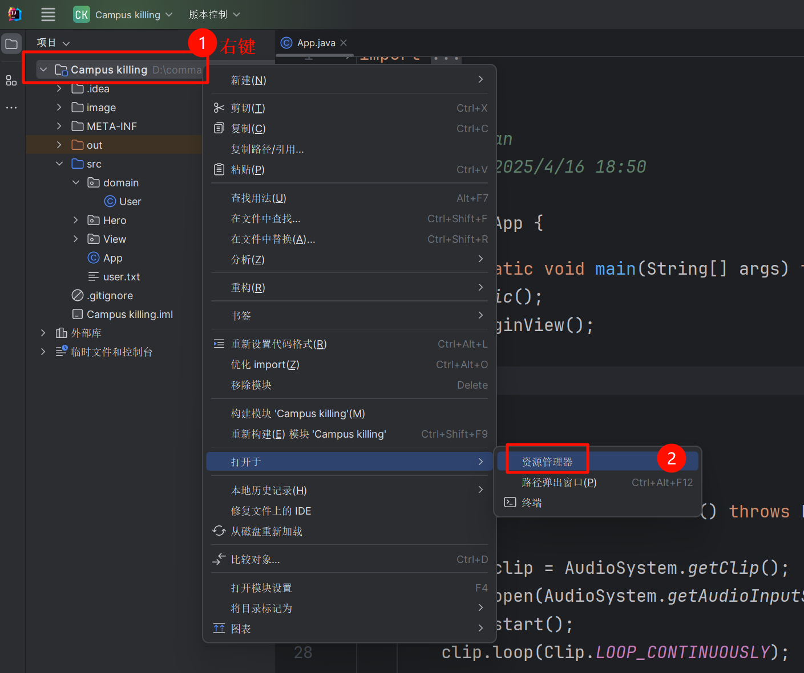
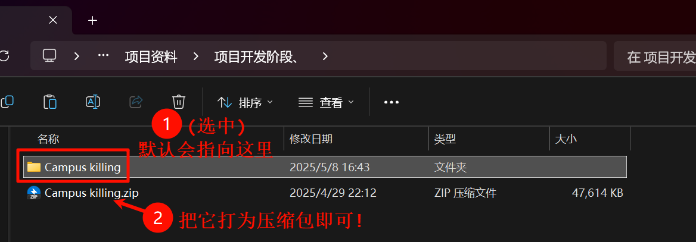

和同学们的一些分享, 演示一些萌新可以做的、简单的java项目, 与简单的技术介绍.

<!-- truncate -->

<details>
<summary>考勤</summary>

> <h2 style="color:red">组长考勤, 结束后把参会名单私发小学长 (今晚12点前)</h2>
> 格式: xxx小组, 实际到场人数/总人数 | (学长需要统计, 以评估积极性)

- [x] 记得录屏

> [!WARNING]
> B站直播有 5 ~ 10 秒的延迟, 各位见谅一下哈, 我也没有办法.
>
> 舍友这边可能会有点吵, 各位凑合一下~

<div style="margin-top: 200px;" />

</details>

## 1. 小组事项提醒
### 1.1 统计到场人数

请`组长`统计每个小组到场人数, 然后私发给`我`.

格式: xxx组全齐 / yyy没有到(缺勤/联系不上) / zzz因为xyz请假

### 1.2 第一次项目的说明

第一次项目以 **熟悉流程** 为主
- 不要做难度高的项目 而是尽量多的组员参与到团队项目中

> 通常难度高的项目, 会导致部分组员没法参与开发!

### 1.3 审核题

> 完成人数不到2人的 只能做一星难度项目
> 
> 完成人数不到一半的 只能做一, 二星难度项目

- 独立完成!

- 对0基础同学有一定难度!

- 评估小组是否可以做高难度项目的手段!

> [!TIP]
> 不是必须完成的, 只是评估手段.

#### 1.3.1 项目难度审核题判分标准

审核标准:
1. 全局变量/静态变量(变量类型/变量名) <span style="color:red">不允许修改</span>
2. 函数声明(参数, 返回值, 函数名次) <span style="color:red">不允许修改</span>
3. 函数的 **代码实现逻辑** 和 **功能描述** 要能`对应`上, 确保 **代码质量** 和 **可读性**!

- 除了技术官以外的同学, 不要求实现`isWin`和`gameView`
- 技术官需要另外提交运行截图(大于等于5颗落子的截图 + 胜利界面截图)

#### 1.3.2 项目难度审核题提交时间

14号, 中午12点前, 组长把五子棋代码 按照格式收齐; 

> [!TIP]
> (如果可以, 可以先在 `13号中午` 收齐一次, 提交上来, 我先审核. 如果一次不过关, 那么是可以修改的)

> [!WARNING]
> 组长要把关`打包的格式`

> <span style="color:red">组长狠狠的跟进呀!</span> 没有什么时间了 

#### 1.3.3 考核题易错点: 递归调用

因为上级对这个错误的评判略显暧昧, 我也不知道对不对, 但是我看的不爽, 那应该就是不对. (上班这样写, 可以马上下班了! 永久)

```java [j2-递归调用示例]
// 以下有部分是伪代码!, 命名我也用中文好了!
public class Game {
    public static void 菜单() {
        while (true) {
            switch (用户输入) {
                case '1':
                    开始游戏();
                    break;
                case '2':
                    // 打印敬请期待
                    菜单(); // 返回菜单
                    break;
                // ...
            }
        }
    }

    public static void 开始游戏() {
        初始化();
        while (true) {
            打印地图();
            用户输入();
            if (是否游戏结束()) {
                打印胜利界面();
                break;
            }
        }
    }

    public static void 打印胜利界面() {
        // printf ... 打印
        用户按任意键继续();
        // 返回菜单
        菜单();
    }
}
```

```java [j2-修复八嘎]
// 以下有部分是伪代码!, 命名我也用中文好了!
public class Game {
    public static void 菜单() {
        while (true) {
            switch (用户输入) {
                case '1':
                    开始游戏();
                    break;
                case '2':
                    // 打印敬请期待
                    break; // 返回菜单
                // ...
            }
        }
    }

    public static void 开始游戏() {
        初始化();
        while (true) {
            打印地图();
            用户输入();
            if (是否游戏结束()) {
                打印胜利界面();
                break;
            }
        }
    }

    public static void 打印胜利界面() {
        // printf ... 打印
        用户按任意键继续();
        // 返回菜单
        return; // !!!
    }
}
```

### 1.4 一些截止时间提醒

- 最低进度要求的截止时间 (参考是: 考题提交之前, 但最晚是: 项目启动之前)

- 额外技术/项目启动的时间等等; gui: swing, 数据持久: i/o流、mysql (必须得在 `第二次小组会议` 上, 全员确认了, 并且完成了对应的考核题才行. 如果是项目开始后才打算边学边做, 就绝对不被允许的!!!)

> [!NOTE]
> 像音乐播放、彩色字体这种, 是可以临时学会的, 但最好都安排一下~

### 1.5 第二次小组会议

这些是组长在`第二次小组会议`会议要说的, 这里不碎碎念了..

```markdown [vscode]
1. 小组会议: 项目前准备
内容:
    1. 项目的开发流程: 
        立项 设计 架构 分工 测试 答辩
    
    2. 学习进度统计: 
        统计每个组员的学习进度
    
    3. 额外技术安排:
        1. 组长得讲一遍对应的界面技术
        
        2. 安排额外技术
            c/c++ 小组内要安排学习控制台操作或easyx
            具体的内容:学什么
            负责人: 哪些人学
            截止时间: 最好是【项目启动】之前完成
            提交方式: 通常是完成某道题目
        
    4. 立项准备:
        小组内 每个组员可以开始准备自己的项目想法
        在后面项目启动时 要开会讨论定下来做什么项目
        项目想法: 不要只是一个名字 最好详细一些
            比如名次/核心功能/拓展想法/参考视频链接
    
    5. 时间提醒:
        项目期间:
            组员: 完成每天分配的任务
                设计阶段: 每天一小时 + 小组会议参与
                开发阶段: 每天两小时 + 小组会议参与
            
            注意:
                产品经理/技术官 在项目设计阶段/项目开发阶段 不允许小组会议请假
        

=== 第二次小组会议 ===

- 参会情况

- 项目开发流程介绍
	- 整体项目流程 (立项~答辩)
	- 项目时间安排

- 学习进度统计 [精确到人名, 只需要填写下面数字!!!]
	1: 数据类型, 运算符及之前
	2. if, switch部分
	3. for while部分
	4. 数组
	5. C/C++: 函数或指针达到其一 | Java: 方法
	6. C/C++: 达到最低进度要求 | Java: 面向对象学习中
	7: Java达到最低进度要求

    示例: 
        张三: 7
        老八: 6

- 额外技术讲解
	- 讲解额外技术(界面, 数据持久)
	- 是否安排额外知识点学习任务
		- 人数: 技术点
		- 人数: 技术点
			> 例:   5:EasyX
			>       2:文件流
	- 截止时间

- 其他:
	- 立项讨论
	- 时间安排的提前说明

=====================================
```


<div style="margin-top: 80px;" />

## 2. 项目演示讲解
### 2.1 ★ 走迷宫

涉及技术:

- 控制台、彩色字体、音乐播放

优点:

- 彩色字体, 方便区分; 

- 实现简单, 方便拓展 (此处让各位, 思考一下, 你认为还有什么可以添加的呢?)

    > 地图还是太简单了? 能否复杂点? 我能不能添加推箱子元素? 这样地图就是可变的了

    > 亦或者是箱子占点? 解密开门? ...

    > 我能否实现怪物随机游走? 来回游走?

    > 是不是还缺少了背景音乐? (有了音乐, 设置不也可以加上了吗?)

    > 能否实现随机地图? (上网复制粘贴一个迷宫生成算法, 然后自己再已有地图上, 简单修改一下, 不就是自己写的了吗?)

    > 注意到, 他们的困难地图, 是有子迷宫机制的, 但是子迷宫只是进去, 然后出来又在原点.

    > 能不能拓展一下? 从 A -> B 迷宫, 出来后是在 C 迷宫, 这里才有 出口, 而 A 迷宫的出口是假出口?

    > 或者原本是死路, 出来后, 才看到活路?

    > 或者添加陷阱, 然后如果在陷阱嘎了, 会触发看广告、充值机制? 然后再死亡回溯? 回到最近的死亡前的一刻?

    > 是不是还缺东西? 能不能搞背包? 这样变成搜集向 + 解密向, 顺带可以添加成就系统

    > 迷宫太无聊了? 整点带迷雾的迷宫? 必须要探索了, 才会显示? 或者更难的, 只有最近的 $x$ 格, 才会显示 (相当于视野范围)

    > 因为只是控制台, 做不了手电筒版本? 错, 可以是wasd是移动, 方向键的上下左右是手电筒, 这样视野就自带方向!

    > 再整点随机, 就tm变成移动迷宫了?! (你们还可以继续拓展...)

以上的拓展, 都是我刚刚想到的~, 核心功能的难度只有一星: 走迷宫 + (推箱子)

- 某些拓展, 实际上也并不是很难, 多加一些变量, 记录好状态即可(~~最好用枚举哈~~), 但是游戏的丰富度, 就完全不是一个维度了~

### 2.2 ★★ 白手起家

涉及技术:

- 控制台, io流 (存档), 彩色字体

优点:

- 模拟经营、交互式的游戏, 比较适合java... (因为输入输出的问题, 等会会讲)

- 彩色字体游戏总体的风格统一, 而且有背包系统, 以及随机事件, 让玩家切身以为自己真的是奸商~

### 2.3 ★★ 水木火

涉及技术:

- swing (界面美化) + 背景音乐

优点:

- 本质是推箱子, 或者说是 2048; 非常好玩, 有创新, 融合了一些知识~

- 美术风格统一

### 2.4 ★★ 校园三国杀

涉及技术:

- swing + 背景音乐 + 数据持久化(登录注册)

优点:

- 有趣, 使用了很多抽象元素, 使人眼前一黑

- 本质是三国杀 (虽然我不是很会玩), 但是融合了一些现实的魔改, 使其为自己创新的 `校园杀`

- 还有彩蛋: 输入xxx的名字, 就可以启用作弊模式

<div style="margin-top: 80px;" />

## 3. 项目流程
### 3.1 如何发项目给别人

项目根目录, 打成压缩包!





> 为什么不使用`Git`?
>
> - 第二次项目 / 大项目 才要求使用;
>
> - 本次如果想使用git, 那么至少本组的全部人都可以熟练的使用git!

### 3.2 具体的项目流程

> 都会有相应的直播会议教大家

### 3.3 难度划分

> 同步和异步可以自己去学习一下
>
> 某些异步操作可以使用同步插帧实现

```Java [j1-1级]
class GameData {
    // 数值访问简单
    public static int[][] map;

    // 同步, 游戏规则简单
    public static void run() {
        while (true) {
            // 输出地图
            // 输入 (可以等好久, 必需做出操作, 才会影响游戏, 否则相当于暂停)
            // 移动
            // 判断输赢 / 伤害 -> break or continue
        }
    }
}
```

```java [j1-2级]
// 有使用类 关联一个类
class Data {
    int[][] 背包;
};

class 玩家 {
  	Data m_背包;
};
```


- 3级 (web 前后端)
	- 依赖于异步实现，部分功能有较高难度，数值访问已经比较复杂（比如嵌套数组、嵌套类）
	- 通常具有`自由移动`(支持斜向(比如 37° 方向移动)), `发射子弹`(速度差), `碰撞检测` 等功能的小游戏属于这个难度范畴


---

> [!TIP]
> 特别的, 根据小组实力, <span style="color:gold">不建议第一次项目, 直接采用`面向对象`进行架构, 特别是涉及继承和多态的</span>

### 3.4 关于额外技术
#### 3.4.1 swing

- 图形界面

> 如果要学习`图形界面`, 必需在 $第二次会议$ 时候定下来, 不能项目开始 (也就是可行性分析阶段) 才开始学习!
>
> 并且`图形界面`<span style="color:red">必需完成练习题, 才算是初步掌握</span>, 不然项目期间原地暴毙 (特别是是swing)
>
> 注意: 如果使用`图形界面`, 那么小组至少要 **一半人**(上取整) 掌握(即完成练习题), 否则形式肥肠危险!

#### 3.4.2 数据持久化 (文件读写)

- 用处: 存档 / 登录注册 / 排行榜

- 高级用处: 从文件中读取关卡数据...

#### 3.4.3 音乐播放

- 没什么好说的, 基本上是复制粘贴就ok

#### 3.4.4 分文件、分包编程

- 分文件开发, 可以使得代码结构清晰

> (可以的话) 技术官可以学一下

### 3.5 代码规范

注释:

```C++ [vscode]
/**
 * @brief 函数作用
 * @param a - 含义 (可使用的值)
 * @param b - 含义 <其他备注>
 * @return <类型> - 含义
 * */
int fun(int a, int b);
```

- https://gitee.com/Heng_Xin_666/binomial/blob/v1.0.1/ProjectDocuments/05_ReadmeFile/GoodCode.md

## 4. 一些项目技巧
### 4.1 游戏体验

以下是一些简单的功能, 可以作为拓展, 但是答辩的时候希望大家都可以加上, 以丰富项目:

> [!TIP]
> 此处仅讨论 控制台 项目

1. 新手引导: 第一次进入游戏/第一关, 可以特化一些文字, 以教导玩家最基本的操作
	
    有的小组做一个拼图游戏, 但是却没有拼好的样子给玩家对照, 我不知道原图, 我怎么拼啊? (但是異議あり!)

2. 彩色字体

```C++
int main() {
     printf("Hello Color!\n");
     return 0;
}
```

```
int main() {
     printf("Hello Color!\n");
     return 0;
}
```

3. 打字机特效

	对于一些剧情、背景交代的文字, 咱们可以一个字一个字的打印, 而不是一下输出一大坨文字.

    | 打字机特效 |
    |:--:|
    ||

	对于图形界面, 咱们也可以这样 (类似于glgame) 或者 搞星球大战那种由远及近的也可以 (像是ppt特效..)

4. 音乐播放

	这个好像很复杂, 但是实际上就是复制粘贴的 (具体可以看图灵院文档)

### 4.2 超简单的拓展

很简单, 但是确实可以丰富游戏, 让我们看起来功能很多.

- 教程关卡

- 皮肤切换

- 开发人员介绍

- 内购充值?!

- 彩蛋?!

- 成就系统?!

### 4.3 个人提供的Java库

非阻塞输入!

- https://github.com/HengXin666/HXCin

- 国内链接: https://gitee.com/Heng_Xin_666/HXCin