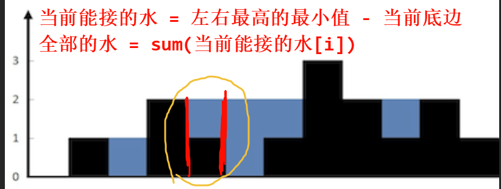

最近打算把 Hot100 给它肝了, 不过只是每日3题罢了...

有些题目二刷了, 之前会的, 现在还是得思考, 但是这种东西, 你思考你就输了...

故本博客会记录题目, 并且把题目的解法总结为短短的几句话或者图示, 以方便我复习 =-=

> 长期更新

<!-- truncate -->

## 1. 哈希

- [1. 两数之和](https://leetcode.cn/problems/two-sum/description/)

    > 前缀和 (维护右枚举左), 秒了

- [49. 字母异位词分组](https://leetcode.cn/problems/group-anagrams/)

    > 给每一个字符串排序后哈希加入分组, 然后再return; $O(n \times m \log{m} )$, $m$ 是字符串长度

    > 进阶的是使用 `array<int, 26>` 来记录数字然后哈希; $O(n m)$

    > 更厉害的是使用质数表然后乘法, 这样可以直接拿数字哈希

- [128. 最长连续序列](https://leetcode.cn/problems/longest-consecutive-sequence/)
  
    > 在未排序的数组中, $O(n)$ 找到最长连续序列, 使用哈希集合, 枚举 $x$ 与 $x + 1$ 来不断 next; 维护最大长度, 剪枝就是先把全部数先放集合, 从而去重; 然后再判断 $x - 1$ 是否在集合, 如果在, 说明之前已经枚举过它了, 不会有更长的, 可以直接 `continue` 了

## 2. 双指针

- [283. 移动零](https://leetcode.cn/problems/move-zeroes/)

    > 一个指针指向数字的后一个位置, 和一个不断变量的数字, 如果非0, 就和该指针交换位置, 并且指针++;

    ```cpp
    class Solution {
    public:
        void moveZeroes(vector<int>& nums) {
            int mae = 0;
            for (int& x : nums) {
                if (x) {
                    swap(x, nums[mae]);
                    ++mae;
                }
            }
        }
    };
    ```

- [11. 盛最多水的容器](https://leetcode.cn/problems/container-with-most-water/)

    > 左右指针, 维护最高的柱子, 同时遍历过程中, 不断计算并维护当前的水的最大值; 移动左右的低的柱子

- [15. 三数之和](https://leetcode.cn/problems/3sum/)

    > 有很慢的 $O(n^2)$ 的哈希的维护右枚举左的写法.

    > 正解应该是排序后双指针

    ```cpp
    class Solution {
        using ll = long long;
    public:
        vector<vector<int>> threeSum(vector<int>& nums) {
            // 和为 0 的, 不重复的 (v1, v2, v3)
            int n = nums.size();
            vector<vector<int>> res;
            ranges::sort(nums); // 排序后, 定一, 然后就是 [有序版-两数之和]
            for (int i = 0; i < n - 2; ++i) {
                int v = nums[i];
                if (i && v == nums[i - 1]) // 去重
                    continue;
                if (v + nums[i + 1] + nums[i + 2] > 0) // 剪枝: 当前 + 最小 > 0 => 不可能会 == 0
                    break;
                if (v + nums[n - 1] + nums[n - 2] < 0) // 剪枝: 当前 + 最大 < 0 => 目前不会 == 0
                    continue;
                int l = i + 1, r = n - 1, tg = -v;
                while (l < r) {
                    int x = nums[l] + nums[r];
                    if (x > tg) {
                        --r;
                    } else if (x < tg) {
                        ++l;
                    } else { // ==
                        int lv = nums[l], rv = nums[r];
                        res.push_back({v, lv, rv});
                        while (l < r && lv == nums[l]) // 去重
                            ++l;
                        while (l < r && rv == nums[r]) // 去重
                            --r;
                    }
                }
            }
            return res;
        }
    };
    ```

- [42. 接雨水](https://leetcode.cn/problems/trapping-rain-water/)

    > 前缀和 + 后缀和 罢了 (其中一个方法)
    >
    > 

