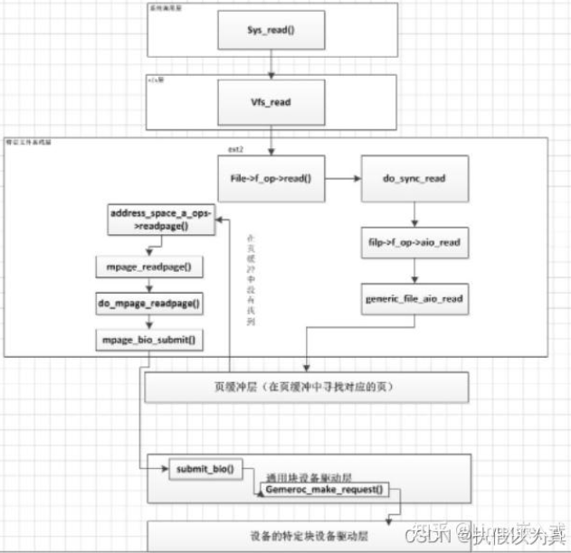

这个是上班要求的, 不能使用 AI, 自己通过搜索, 把这个解决方案搞出来, 并且说明为什么选择这个方案, 不选择其他方案.

今天已经肝完了, 上头挺满意的, 然后让我把他们写出来了 =-=, Linux编写内核模块qwq...

<!-- truncate -->

## 文件监控服务

### 一、需求
#### 1.1 文件清单

用户可以选择文件, 加入`文件清单`; 程序会记录选择的文件的 **绝对路径**, 以确保无歧义.

#### 1.2 指定进程

用户可以指定进程, 加入`白名单`; 程序会记录选择的进程的 **启动路径** 的 **绝对路径** 作为唯一进程标识. 

#### 1.3 可拦截读写系统调用

对 `文件清单` 内的文件进行读写操作时, 需要拦截 **非** 白名单 的进程.

#### 1.4 日志系统

日志记录:

> [触发时间] [触发进程(全路径)] [该进程操作对象(文件)] [该进程操作内容] [本程序处理结果]

### X、技术实现的查询
#### x.1 查找关键字及其文章

系统读写调用拦截
- [手把手教你｜拦截系统调用](https://blog.csdn.net/weiqifa0/article/details/122571798)

linux拦截读写调用
- [Linux系统下白名单外进程阻断实现原理](https://juejin.cn/post/7215825282040676412)
- [盘点Linux中常见的过滤拦截技术](https://zhuanlan.zhihu.com/p/549849135) (实际上这篇就是综述, 的说)
    1. 用户态动态库拦截
    2. 内核态系统调用拦截
    3. 堆栈式文件系统拦截
    4. inline hook拦截
    5. LSM(Linux Security Modules)
    6. eBPF Hook拦截
- [Linux环境下的拦截技术](https://blog.csdn.net/qq_66359721/article/details/147139241)
    > 有保护文件与网络过滤demo

系统调用劫持获取文件绝对路径
- [Linux内核中通过文件描述符获取绝对路径](http://edsionte.com/techblog/archives/4406)

Linux系统调用劫持
- [Linux漏洞挖掘:06---系统调用劫持之（通过/boot/System.map目录获取sys_call_table系统调用表）](https://www.freesion.com/article/1205184276/)

- [sys_call_table](https://www.cnblogs.com/LittleHann/p/4127096.html)
> 需要区分32和64位系统; 并且系统每次重启其 sys_call_table 的内存地址都会变我们需要获取到他们的地址; 并且记得复原, 如果不复原系统会崩掉, 你的程序结束后, 就是野指针了

堆栈式文件系统
- 发现比较难对付, 先略过

inline hook
- [inline hook 原理&教程](https://www.cnblogs.com/luconsole/p/14813573.html)
- [五分钟带你手搓一个简易的 inline hook 实现控制流劫持](https://eunomia.dev/zh/blogs/inline-hook/) & https://github.com/eunomia-bpf/inline-hook-demo
> 需要考虑线程安全; 跨平台(arm/x86)指令集的差异

内核安全模块 编写
- [如何编写一个Linux内核模块，这次手把手教你](https://zhuanlan.zhihu.com/p/420194002)

内核安全模块 编写拦截
- [动手写一个基于Linux内核的网络数据包拦截扩展](https://rivers.chaitin.cn/blog/cqj64sh0lnedo7thptp0)

内核安全模块 可移植性
- [Linux内核学习笔记之可移植性](https://hjk.life/posts/linux-kernel-portability/)

Linux Security Modules 可移植性
- [Linux 内核的可裁剪性与可移植性底层原理详解](https://zhuanlan.zhihu.com/p/10981876370)
> 感觉可以插入的点比较受约束?? 再找找看; 感觉和 eBPF 的区别就是是否可以hook用户态? 再找找看

LSM模块 可作用函数
- [Linux 安全 - LSM hook点](https://blog.csdn.net/weixin_45030965/article/details/133749748)
- [LSM模块动态Hook实现](https://just4coding.com/2023/12/01/lsm-hook/) (CentOS7/8的示例)

LSM模块 hook点
- [LSM 安全模块开发 —— 文件打开 2FA ](https://www.neko.ooo/lsm-mod/)

eBPF Hook 拦截读写
- [收藏！使用eBPF技术审计和拦截文件读写操作](https://www.eet-china.com/mp/a357540.html)

LSM模块 与 eBPF hook 对比
- [BPF LSM 完全实践（建议收藏）](https://zhuanlan.zhihu.com/p/681005652)

lsm hook 读写
- [Linux内核安全模块（Linux Security Module，LSM）例子](https://blog.csdn.net/farsight_2098/article/details/130875915)

### 二、技术笔记
#### 2.1 Linux中常见的过滤拦截技术
##### 2.1.1 用户态动态库拦截

Linux上的动态库劫持主要是基于 `LD_PRELOAD` 环境变量，这个环境变量的主要作用是改变动态库的加载顺序，让用户有选择的载入不同动态库中的相同函数。

但是使用不当就会引起严重的安全问题，我们可以通过它在主程序和动态连接库中加载别的动态函数，这就给我们提供了一个机会，向别人的程序注入恶意的代码。

> [!TIP]
> 这是一个最简单的劫持 ，但是如果劫持了类似于 `geteuid/getuid/getgid`，让其返回`0`，就相当于暴露了root权限。所以为了安全起见，一般将 `LD_PRELOAD` 环境变量禁用掉。

#### 2.1.2 内核态系统调用拦截

Linux内核中所有的系统调用都是放在一个叫做 `sys_call_table` 的内核数组中，数组的值就表示这个系统调用服务程序的入口地址。


当用户态发起一个系统调用时，会通过80软中断进入到 `syscall hander`，进而进入全局的系统调用表 `sys_call_table` 去查找具体的系统调用，那么如果我们将这个数组中的地址改成我们自己的程序地址，就可以实现系统调用劫持。

但是内核为了安全，对这种操作做了一些限制:

1. `sys_call_table` 的符号没有导出, 不能直接获取.
2. `sys_call_table` 所在的内存页是只读属性的, 无法直接进行修改.

解决方法 (不唯一):

1. 获取 `sys_call_table` 的地址: `grep sys_call_table /boot/System.map-uname -r`

2. 控制页表只读属性是由`CR0`寄存器的`WP位`控制的，只要将这个位 **清零** 就可以对只读页表进行修改。

实例代码在 https://zhuanlan.zhihu.com/p/549849135

```cpp
/* make the page writable */
int make_rw(unsigned long address) {
    unsigned int level;
    pte_t *pte = lookup_address(address, &level); // 查找虚拟地址所在的页表地址
    pte->pte |= _PAGE_RW; // 设置页表读写属性
    return 0;
}
 
/* make the page write protected */
int make_ro(unsigned long address) {
    unsigned int level;
    pte_t *pte = lookup_address(address, &level);
    pte->pte &= ~_PAGE_RW; // 设置只读属性
    return 0;
}
```

```cpp
// 开始替换系统调用
static int syscall_init_module(void) {
    orig_getdents = sys_call_table[__NR_getdents];
    make_rw((unsigned long)sys_call_table); // 修改页属性
    sys_call_table[__NR_getdents] = (unsigned long *)hacked_getdents; // 设置新的系统调用地址
    make_ro((unsigned long)sys_call_table);
    return 0;
}

// 恢复原状
static void syscall_cleanup_module(void) {
    printk(KERN_ALERT "Module syscall unloaded.\n");
    make_rw((unsigned long)sys_call_table);
    sys_call_table[__NR_getdents] = (unsigned long *)orig_getdents;
    make_ro((unsigned long)sys_call_table);
}
```

#### 2.1.3 堆栈式文件系统

Linux通过`vfs虚拟文件系统`来统一抽象具体的磁盘文件系统，从上到下的IO栈形成了一个堆栈式。

通过对内核源码的分析，以一次读操作为例，从上到下所执行的流程如下:



内核中采用了很多c语言形式的面向对象，也就是函数指针的形式，例如read是vfs提供用户的接口，具体底下调用的是ext2的read操作。我们只要实现VFS提供的各种接口，就可以实现一个堆栈式文件系统。L

实现了一个堆栈式文件系统，相当于所有的读写操作都会进入到我们的文件系统，可以拿到所有的数据，就可以进行做一些拦截过滤。

#### 2.1.4 inline hook

我们知道内核中的函数不可能把所有功能都在这个函数中全部实现，它必定要调用它的下层函数。

如果这个下层函数可以得到我们想要的过滤信息内容，就可以把下层函数在上层函数中的offset替换成新的函数的offset，这样上层函数调用下层函数时，就会跳到新的函数中，在新的函数中做过滤和劫持内容的工作。

所以从原理上来说，inline hook可以想hook哪里就hook哪里。

但是有两个问题:

1. 如何定位hook点.
2. 如何注入hook函数入口.

第一个需要你看过对应的内核源码

- 第二个有两种方法:
    1. 接进行二进制替换，将call指令的操作数替换为hook函数的地址
    2. Linux内核提供的kprobes机制
        > 其原理是在hook点注入int 3(x86)的机器码，让cpu运行到这里的时候会触发sig_trap信号，然后将用户自定义的hook函数注入到sig_trap的回调函数中，达到触发hook函数的目的。这个其实也是调试器的原理。

#### 2.1.5 LSM (内核安全模块)


LSM在内核中做了以下工作:
1. 在特定的内核数据结构中加入安全域。
2. 在内核源代码中不同的关键点插入对安全钩子函数的调用。
3. 加入一个通用的安全系统调用。
4. 提供了函数允许内核模块注册为安全模块或者注销。
5. 将capabilities逻辑的大部分移植为一个可选的安全模块,具有可扩展性。

实例: https://rivers.chaitin.cn/blog/cqj64sh0lnedo7thptp0

```cpp
#include <linux/module.h> // included for all kernel modules
#include <linux/kernel.h> // included for KERN_INFO
#include <linux/init.h>   // included for __init and __exit macros
#include <linux/netfilter.h>
#include <linux/netfilter_ipv4.h>
#include <linux/netdevice.h>
#include <linux/vmalloc.h>

MODULE_LICENSE("GPL");
MODULE_DESCRIPTION("A Simple Hello Packet Module");

enum {
    NF_IP_PRE_ROUTING,
    NF_IP_LOCAL_IN,
    NF_IP_FORWARD,
    NF_IP_LOCAL_OUT,
    NF_IP_POST_ROUTING,
    NF_IP_NUMHOOKS
};

static struct nf_hook_ops in_nfho;  // net filter hook option struct
static struct nf_hook_ops out_nfho; // net filter hook option struct

static void dump_addr(unsigned char *iphdr) {
    int i;
    for (i = 0; i < 4; i++) {
        printk("%d.", *(iphdr + 12 + i));
    }
    printk(" -> ");
    for (i = 0; i < 4; i++) {
        printk("%d.", *(iphdr + 16 + i));
    }
    printk("\n");
}

unsigned int my_hook(void *priv, struct sk_buff *skb, const struct nf_hook_state *state) {
    printk("Hello packet! ");
    // printk("from %s to %s\n", in->name, out->name);
    unsigned char *iphdr = skb_network_header(skb);
    if (iphdr)
    {
        dump_addr(iphdr);
    }
    return NF_ACCEPT;
    // return NF_DROP;//会导致上不了网
}

static int __init init_func(void) {
    // NF_IP_PRE_ROUTING hook
    in_nfho.hook = my_hook;
    in_nfho.hooknum = NF_IP_LOCAL_IN;
    in_nfho.pf = PF_INET;
    in_nfho.priority = NF_IP_PRI_FIRST;

    nf_register_net_hook(&init_net, &in_nfho);

    // NF_IP_LOCAL_OUT hook
    out_nfho.hook = my_hook;
    out_nfho.hooknum = NF_IP_LOCAL_OUT;
    out_nfho.pf = PF_INET;
    out_nfho.priority = NF_IP_PRI_FIRST;

    nf_register_net_hook(&init_net, &out_nfho);
    return 0;
}

static void __exit exit_func(void) {
    nf_unregister_net_hook(&init_net, &in_nfho);
    nf_unregister_net_hook(&init_net, &out_nfho);
    printk(KERN_INFO "Cleaning up Hello_Packet module.\n");
}

module_init(init_func);
module_exit(exit_func);
```

#### 2.1.6 ebpf

eBPF 是一个在内核中运行的虚拟机，它可以去运行用户。在用户态实现的这种 eBPF 的代码，在内核以本地代码的形式和速度去执行，它可以跟内核的 Trace 系统相结合，给我们提供了在线扩展内核功能的技术。

eBPF的hook点功能包括以下几部分:
1. 可以在Storage、Network等与内核交互之间；
2. 也可以在内核中的功能模块交互之间；
3. 又可以在内核态与用户态交互之间；
4. 更可以在用户态进程空间。

#### 2.1.7 总结

1. 动态库劫持不太完全，劫持的信息有可能满足不了我们的需求，还有可能别人在你之前劫持了，一旦禁用 `LD_PRELOAD` 就失效了。

2. 系统调用劫持，劫持的信息有可能满足不了我们的需求，例如不能获取 `struct file` 结构体，不能获取文件的`绝对路径`等。

3. 堆栈式文件系统，依赖于Mount,可能需要重启系统。

4. inline hook，灵活性高，随意Hook，即时生效无需重启，但是在不同内核版本之间通用性差，一旦某些函数发生了变化，Hook失效。

5. LSM，在早期的内核中，只能允许一个LSM内核模块加载，例如加载了SELinux，就不能加载其他的LSM模块，在最新的内核版本中不存在这个问题。

6. eBPF Hook,可以用户态编程控制，灵活性高，即时生效无需重启，但依赖内核的版本，通用性差，一旦某些函数发生了变化，Hook失效。

### 2.2 LSM hook点说明

在VFS（虚拟文件系统）层中，定义了三个主要对象，它们封装了低级文件系统开发所使用的接口:

```cpp
super_block（超级块）对象
file（文件）对象
inode（索引节点）对象
```

每个对象都包含一组操作，这些操作定义了VFS与实际文件系统之间的接口。LSM（Linux安全模块）利用这些接口来介入文件系统访问。

> LSM使用内核对象中定义的不透明安全指针; 通过在这些结构体中添加安全指针，LSM可以监视和控制与文件系统相关的操作。
> 
> 这样，LSM可以在文件系统访问过程中介入，执行安全策略检查、权限控制等操作，以增强系统的安全性。

#### 2.2.1 LSM super_block hooks

```cpp
struct super_block {
	......
#ifdef CONFIG_SECURITY
	void *s_security;
#endif
	.....
}
```

当文件系统在内核中表示时, `super_block` 结构体是代表该文件系统的内核对象。

`super_block` 结构体在挂载和卸载文件系统以及获取文件系统统计信息时被使用。

LSM（Linux安全模块）提供了一组钩子函数，用于介入对 `super_block` 的各种操作。

- 在挂载文件系统时，内核首先通过调用 `sb_mount()` 钩子函数来验证挂载请求的有效性。LSM可以使用该钩子函数执行额外的安全检查，例如验证挂载任务的权限或确保挂载选项的有效性。

- 在卸载文件系统时，会调用 `sb_umount()` 钩子函数来检查卸载文件系统所需的权限。LSM可以利用这个钩子函数来执行访问控制，确保只有授权的任务能够执行卸载操作。

- `sb_remount()` 钩子函数在修改文件系统挂载选项时被调用。LSM可以利用该钩子函数验证请求的挂载选项的有效性和安全性。

当任务尝试获取文件系统统计信息（如磁盘使用情况或可用空间）时，会调用 `sb_statfs()` 钩子函数。LSM可以使用该钩子函数执行权限检查，确保只有授权的任务能够访问文件系统统计信息。

```cpp
union security_list_options {
	// ......
	int (*sb_remount)(struct super_block *sb, void *mnt_opts);
	int (*sb_statfs)(struct dentry *dentry);
	int (*sb_mount)(const char *dev_name, const struct path *path,
			const char *type, unsigned long flags, void *data);
	int (*sb_umount)(struct vfsmount *mnt, int flags);
	// ......
}
```

#### 2.2.2 LSM hooks

同理还有以下hook:

```md
一、LSM file system hooks
    1.1 LSM super_block hooks
    1.2 LSM file hooks
    1.3 LSM inode hooks
二、LSM Task hooks
    > 当任务在内核中表示为可调度任务时，task_struct 结构体是代表该任务的内核对象。
    > task_struct 结构体包含了任务的基本信息，如用户/组 ID、资源限制以及调度策略和优先级等。
三、LSM IPC hooks
    > 当任务需要访问内核中的 SysV IPC 机制时，内核提供了标准的 SysV IPC 机制，包括共享内存、信号量和消息队列等。这些机制允许进程之间进行通信和共享数据。
四、LSM Network hooks
    > 网络是Linux中的一个重要方面，尤其是在保护系统免受网络攻击方面，LSM为内核的这个领域提供了扩展的安全性。应用层对网络的访问是通过一系列与套接字相关的钩子函数进行介入的。
五、LSM Module & System hooks
```

https://blog.csdn.net/farsight_2098/article/details/130875915

代码实例:

下面是一个基于进程名和文件名实现特定进程可以访问特定文件的LSM示例代码

> 这个示例的功能是，只允许特定进程可以访问特定的文件。当进程不在允许访问列表或者访问的文件与被保护路径不匹配时，会返回-EACCES错误，表示拒绝访问。

```cpp
#include <linux/lsm_hooks.h>
#include <linux/path.h>
#include <linux/dcache.h>
#include <linux/namei.h>
 
// 定义允许访问文件的进程名称
static char *allowed_process_name = "my_app";
// 定义需要保护的文件路径
static char *file_path = "path/to/protected/file";
 
// 在inode对象访问的钩子点上实现自定义钩子函数
static int example_inode_permission(struct inode *inode, int mask) {
    // 获取当前进程的进程组ID和进程ID
    pid_t current_pid = task_tgid_vnr(current);
    // 获取当前进程的进程名称
    char * current_process_name = (char*)get_task_comm(current);
 
    // 判断进程名称和进程组是否匹配
    if (strcmp(current_process_name, allowed_process_name) || current_pid != pid_nr(get_task_pid(current, PIDTYPE_PID))) {
        // 如果当前进程名称和进程组和要求不匹配，则拒绝访问
        return -EACCES;
    }
 
    // 判断访问的文件路径是否与被保护路径匹配
    struct path file;
    int err = kern_path(file_path, LOOKUP_FOLLOW, &file);
    if (err) {
        printk(KERN_INFO "%!(NOVERB)s not found.\n", file_path);
        return -EACCES;
    }
    if (file.dentry != inode->i_dentry) {
        return -EACCES;
    }
 
    // 允许进程访问文件
    return 0;
}
 
// 定义自定义钩子函数列表
static struct security_hook_list example_hooks[] = {
    LSM_HOOK_INIT(inode_permission, example_inode_permission),
};
 
// 安全模块初始化函数
static __init int example_init(void) {
    printk(KERN_INFO "example LSM initialized\n");
 
    // 注册自定义钩子函数
    security_add_hooks(example_hooks, ARRAY_SIZE(example_hooks));
 
    return 0;
}
 
// 安全模块注销函数
static __exit void example_exit(void) {
    printk(KERN_INFO "example LSM exited\n");

    // 删除自定义钩子函数
    security_delete_hooks(example_hooks, ARRAY_SIZE(example_hooks));
}
 
// 模块初始化和注销函数
security_initcall(example_init);
module_exit(example_exit);
 
MODULE_LICENSE("GPL");
MODULE_DESCRIPTION("LSM示例：仅特定进程可以访问特定文件");
```

下面是一个基于特定进程名实现只有特定进程可以使用网络的LSM示例代码:

> 示例的功能是，只允许特定进程可以使用网络。如果进程不在允许使用网络的列表中，会返回-EACCES错误，表示拒绝使用网络。此示例重点测试套接字和连接到远程主机的行为，但可以通过添加其他适当的钩子来扩展其功能。

```cpp
#include <linux/lsm_hooks.h>
#include <linux/net.h>
#include <linux/sched.h>
 
// 定义允许使用网络的进程名称
static char *allowed_process_name = "my_network_app";
 
// 在socket对象访问的钩子点上实现自定义钩子函数
static int example_socket_socket_create(int family, int type, int protocol, int kern) {
    // 获取当前进程的进程名称
    char * current_process_name = (char*)get_task_comm(current);
 
    // 判断当前进程名称是否匹配允许使用网络的进程名称
    if (strcmp(current_process_name, allowed_process_name)) {
        return -EACCES;
    }
 
    return 0;
}
 
// 在bind（绑定套接字）钩子点上实现自定义钩子函数
static int example_socket_socket_bind(struct socket *sock, struct sockaddr *address, int addrlen) {
    // 获取当前进程的进程名称
    char * current_process_name = (char*)get_task_comm(current);
 
    // 判断当前进程名称是否匹配允许使用网络的进程名称
    if (strcmp(current_process_name, allowed_process_name)) {
        return -EACCES;
    }
 
    return 0;
}
 
// 在connect（连接到远程主机）钩子点上实现自定义钩子函数
static int example_socket_socket_connect(struct socket *sock, struct sockaddr *address, int addrlen, int flags) {
    // 获取当前进程的进程名称
    char * current_process_name = (char*)get_task_comm(current);
 
    // 判断当前进程名称是否匹配允许使用网络的进程名称
    if (strcmp(current_process_name, allowed_process_name)) {
        return -EACCES;
    }
 
    return 0;
}
 
// 定义自定义钩子函数列表
static struct security_hook_list example_hooks[] = {
    LSM_HOOK_INIT(socket_socket_create, example_socket_socket_create),
    LSM_HOOK_INIT(socket_bind, example_socket_socket_bind),
    LSM_HOOK_INIT(socket_connect, example_socket_socket_connect),
};
 
// 安全模块初始化函数
static __init int example_init(void) {
    printk(KERN_INFO "example LSM initialized\n");
 
    // 注册自定义钩子函数
    security_add_hooks(example_hooks, ARRAY_SIZE(example_hooks));
 
    return 0;
}
 
// 安全模块注销函数
static __exit void example_exit(void) {
    printk(KERN_INFO "example LSM exited\n");
 
    // 删除自定义钩子函数
    security_delete_hooks(example_hooks, ARRAY_SIZE(example_hooks));
}
 
// 模块初始化和注销函数
security_initcall(example_init);
module_exit(example_exit);
 
MODULE_LICENSE("GPL");
MODULE_DESCRIPTION("LSM示例：仅特定进程可以使用网络");
```

### 2.3 LSM 与 BPF
#### 2.3.1 系统认识 LSM
LSM（Linux Security Module） 中文翻译为内核安全模块，尽管从名字上是安全模块，但 LSM 其实是一个在内核各个安全模块的基础上提出（抽象出）的轻量级安全访问控制框架。该框架只是提供一个支持安全模块的接口，本身不能增强系统安全性，具体的工作交给各安全模块来做。

LSM 在内核中体现为一组安全相关的函数，是提供实施强制访问控制（MAC）模块的必要组件，可实现策略与内核源代码解耦。安全函数在系统调用的执行路径中会被调用，对用户态进程访问内核资源对象进行强制访问控制，受保护的对象类型包括文件、目录、任务对象、凭据等。从版本 5.4 开始，该框架目前包括整个内核的 224 个挂钩点、一个用于注册要在这些挂钩点调用的函数的 API，以及一个用于保留与受保护内核对象关联的内存以供 LSM 使用的 API。如果要想要进一步了解可参考内核文档 [LSM 部分](https://www.kernel.org/doc/html/latest/admin-guide/LSM/index.html) 内容。


LSM 背后的核心概念是 LSM 钩子。LSM 钩子暴露在内核的关键位置，可通过挂钩进行管制的操作示例包括:

- 文件系统操作
- 打开、创建、移动和删除文件
- 挂载和卸载文件系统
- task/process operations 任务 / 进程操作
- 分配和释放任务，更改任务的用户和组标识
- 套接字操作
- 创建和绑定套接字
- 接收和发送消息

其被定义在 [lsm_hook_defs.h](https://elixir.bootlin.com/linux/v6.2/source/include/linux/lsm_hook_defs.h) 中:

```cpp
/*
 * The macro LSM_HOOK is used to define the data structures required by
 * the LSM framework using the pattern:
 *
 *	LSM_HOOK(<return_type>, <default_value>, <hook_name>, args...)
 *
 * struct security_hook_heads {
 *   #define LSM_HOOK(RET, DEFAULT, NAME, ...) struct hlist_head NAME;
 *   #include <linux/lsm_hook_defs.h>
 *   #undef LSM_HOOK
 * };
 */
LSM_HOOK(int, 0, binder_set_context_mgr, const struct cred *mgr)
LSM_HOOK(int, 0, binder_transaction, const struct cred *from,
	 const struct cred *to)
LSM_HOOK(int, 0, binder_transfer_binder, const struct cred *from,
	 const struct cred *to)
LSM_HOOK(int, 0, binder_transfer_file, const struct cred *from,
	 const struct cred *to, struct file *file)
LSM_HOOK(int, 0, ptrace_access_check, struct task_struct *child,
	 unsigned int mode)
LSM_HOOK(int, 0, ptrace_traceme, struct task_struct *parent)
```

格式为:

```cpp
LSM_HOOK(<return_type>, <default_value>, <hook_name>, args...)
```

LSM 提供的大多数钩子都需要返回一个整数值（也有部分返回 `void`, 表示忽略运行结果），返回值中的值一般定义如下:

- 0 等同于授权；
- ENOMEM 无可用内存；
- EACCESS，安全策略拒绝访问；
- EPERM，执行此操作需要权限。

#### 2.3.2 LSM BPF

在 LSM BPF 出现之前，能够实现实施安全策略目标的方式有两种选择：配置现有的 LSM 模块（如 AppArmor、SELinux），或编写自定义内核模块。LSM BPF 则提供了第三种实现的方案 ，灵活且安全，具有可编程性。

使用 LSM BPF，开发人员能够在无需配置或加载内核模块的情况下编写精细策略。LSM BPF 程序会在加载时进行验证，然后在调用路径中到达 LSM hook 时执行。这些 BPF 程序允许特权用户对 LSM 钩子进行运行时检测，以使用 eBPF 实现系统范围的 MAC（强制访问控制）和审计策略。

截止到内核 6.2.0 版本， BPF 自身安全相关的 LSM hook 函数有 7 个 ，通过编译条件宏 CONFIG_BPF_SYSCALL 控制，主要设涉及 bpf 系统调用、BPF 程序和 BPF map 相关操作:

```cpp
#ifdef CONFIG_BPF_SYSCALL
LSM_HOOK(int, 0, bpf, int cmd, union bpf_attr *attr, unsigned int size)
LSM_HOOK(int, 0, bpf_map, struct bpf_map *map, fmode_t fmode)
LSM_HOOK(int, 0, bpf_prog, struct bpf_prog *prog)
LSM_HOOK(int, 0, bpf_map_alloc_security, struct bpf_map *map)
LSM_HOOK(void, LSM_RET_VOID, bpf_map_free_security, struct bpf_map *map)
LSM_HOOK(int, 0, bpf_prog_alloc_security, struct bpf_prog_aux *aux)
LSM_HOOK(void, LSM_RET_VOID, bpf_prog_free_security, struct bpf_prog_aux *aux)
#endif /* CONFIG_BPF_SYSCALL */
```

在继续并尝试编写 LSM BPF 程序之前，请确保：

- 内核版本至少为 5.7；
- LSM BPF 已启用。

LSM BPF 的启用可以通过以下方式进行验证，正确的输出应包含 bpf:

```bash
cat /sys/kernel/security/lsm
capability,lockdown,landlock,yama,apparmor,bpf
```

如果没有，则必须通过将 LSM BPF 添加到内核配置参数中来手动启用它。 ...

### 三、决策
#### 3.1 Hook 技术选型: LSM

我们认识了 常见的 Linux 的拦截技术:

1. 用户态动态库拦截
2. 内核态系统调用拦截
3. 堆栈式文件系统拦截
4. inline hook拦截
5. LSM(Linux Security Modules)
6. eBPF Hook拦截

先说结论, 选择 [5]LSM(Linux Security Modules) 作为 Hook 技术

好处: 这个是系统内核提供的API, 相对于我们自己对非公开的函数进行hook, 显然操作系统本身提供的API会更加稳定

> [!NOTE]
> 最新的变化, 可以直接看 Linux 的git开发日志: https://github.com/torvalds/linux/commits/master/include/linux/lsm_hook_defs.h
>
> 历史版本api变化对比, 可以参考: https://depsurf.github.io/index/lsm.html

而且它已经满足我需要的功能:

1. 可以 hook 文件、网络的读写操作
2. api 比较容易适配

然后是为什么不选择其他的:

对于[1]用户态动态库拦截, 它非常的不稳定; 如果 `LD_PRELOAD` 环境变量被禁用就无效了; pass

对于[2]内核态系统调用拦截, 需要找到内核运行时的 `sys_call_table` 函数指针数组, 然后想办法修改我们需要的那个函数的函数指针; 并且需要处理 x86/arm、 64/32 上的一些差异问题; 而且劫持的信息量太少了, 不能获取 `struct file` 结构体，不能获取文件的`绝对路径`等; 完全不满足我们之前的需求. pass

对于[3]堆栈式文件系统拦截, 个人认为这个太复杂了, 看别人实现的简易demo都是1300行的; 而且依赖于Mount, 可能需要重启系统才能生效; 所有pass掉, 因为有更好的选择

对于[4]inline hook拦截, 它虽然似乎是万能的, 但是有两个难点: 

1. 找hook点, 一般是需要对操作系统内核有一定了解的, 才可以找到hook点 (知道调用链路, 知道应该hook谁), 又因为它hook的是操作系统内部的私有函数, 所以可能会因为系统更新、不同发行版的差异, 导致接口对不上, 比较难适配各个发行版;

2. 注入hook函数的入口, 解决方案都是比较难适配各个发行版的;

对于[6]eBPF Hook拦截, 它很强大, 但是可能过于新了, 要求操作系统内核 需要 5.7 以上的版本; 而且就算是支持, 也不一定是默认开启的, 需要自己设置开启;  就比如:

```bash
kylin@tq:~/hx$ lsb_release -a
No LSB modules are available.
Distributor ID:	Kylin
Description:	Kylin V10 SP1
Release:	v10
Codename:	kylin

kylin@tq:~/hx$ uname -a
Linux tq 5.10.0-8-generic #33~v10pro-KYLINOS SMP Wed Mar 22 07:21:49 UTC 2023 x86_64 x86_64 x86_64 GNU/Linux
```

以及教程使用的 乌班图-22.04 也是默认不开启的; 可见支持比较麻烦, 日后可以作为可选组件加上, 但是初步开发就先 pass

#### 3.2 其他细节
##### 3.2.1 如何获取 被hook的操作的执行 进程pid

https://blog.csdn.net/farsight_2098/article/details/130875915

```cpp
// 获取当前进程的进程组ID和进程ID
pid_t current_pid = task_tgid_vnr(current);
// 获取当前进程的进程名称
char * current_process_name = (char*)get_task_comm(current);
```

或者是

```cpp
// Linux LSM(Linux Security Modules) Hook Technology
// https://www.cnblogs.com/LittleHann/p/4134939.html
int execve_lsm_hook(struct linux_binprm* bprm) {
    struct cred* currentCred;

    if (bprm->filename) {
        printk("file: %s\n", bprm->filename);
        //printk("file argument: %s\n",bprm->p);
    } else {
        printk("file exec\n");
    } 
    
    currentCred = current->cred;    
    printk(KERN_INFO "uid = %d\n", currentCred->uid);
    printk(KERN_INFO "gid = %d\n", currentCred->gid);
    printk(KERN_INFO "suid = %d\n", currentCred->suid);
    printk(KERN_INFO "sgid = %d\n", currentCred->sgid);
    printk(KERN_INFO "euid = %d\n", currentCred->euid);
    printk(KERN_INFO "egid = %d\n", currentCred->egid);  

    printk("comm: %s\n", current->comm);
    return 0;
} 
```

#### 3.2.2 获取进程的绝对启动路径

> [!NOTE]
> 可以进一步的, 获取其inode, 以防止程序重命名了带来的问题?

<!-- 
Linux内核中通过文件描述符获取绝对路径 http://edsionte.com/techblog/archives/4406
 -->

[[linux c/c++] 通过读取 /proc 路径获取指定进程名的信息](https://blog.51cto.com/u_15803983/9231946)

[Linux C语言 获取可执行文件的绝对路径、进程运行目录【cwd】](https://blog.csdn.net/qq_22613757/article/details/88828424)

```cpp
#include <stdio.h>
#include <unistd.h>
char * get_exe_path( char * buf, int count) {
    int i;
    int rslt = readlink("/proc/self/cwd", buf, count - 1);
    if (rslt < 0 || (rslt >= count - 1)) {
        return NULL;
    }
    buf[rslt] = '\0';
    for (i = rslt; i >= 0; i--) {
        printf("buf[%d] %c\n", i, buf[i]);
        if (buf[i] == '/') {
            buf[i + 1] = '\0';
            break;
        }
    }
    return buf;
}

int main(int argc, char ** argv) {
    char path[1024];
    printf("%s\n", get_exe_path(path, 1024));
    return 0;
}
```

