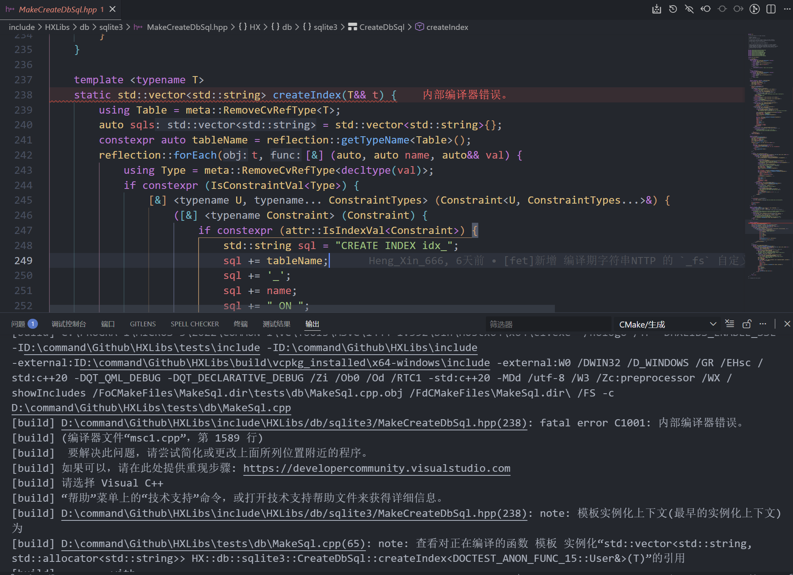
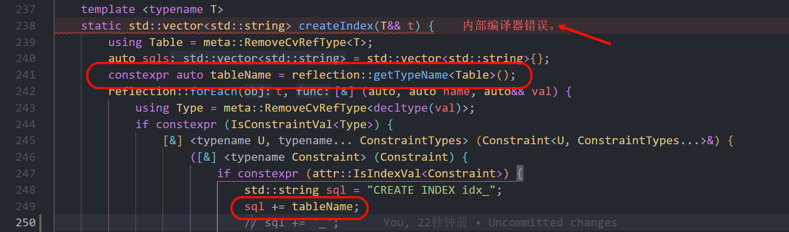
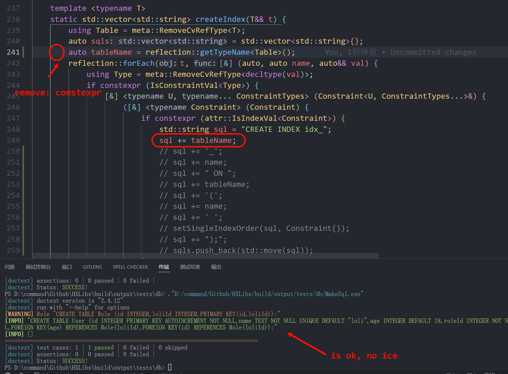
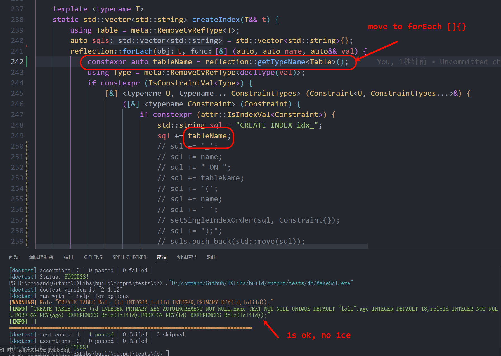

菜逼 MSVC 随便写写就触发 ICE 了, 微软你写的什么狗屎代码?

<!-- truncate -->

在 https://github.com/HengXin666/HXLibs/issues/17 中描述.

## 错误原因

## 解决方案

1. 移入 forEach 内部:

2. 去掉 constexpr || 替换成 const

## 最小复现

暂时无法复现..., 只能通过代码qwq, 不知道怎么触发. 就很玄学. 源码我那边夹杂了许多模板, 不知道有没有干扰.