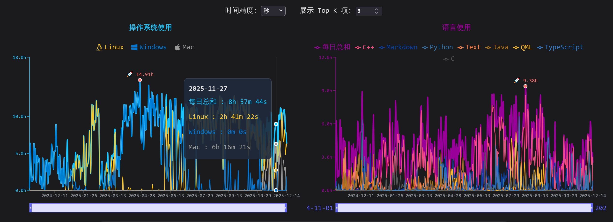

博客更新日志和计划 (I)

- 支持在主页显示 WakaTime 的统计数据 (操作系统 && 语言)

- 拟定支持番剧记录

<!-- truncate -->

## 一、WakaTime 统计数据

如图, 基于 [Python 脚本](https://github.com/HengXin666/HengXin666/blob/main/py/wakatime_req.py) 结合 Github Actions 实现自动更新. 需要时候动态请求即可

## 二、アニメ 功能

### 2.1 期望支持的功能

1. [番剧记录], 包含:
    - 用户信息 (记录用户操作的)
        - 添加时间
        - 更新时间
        - 用户收藏的相关的图片 (基于角色分类) -> 角色信息::用户上传的角色图片
        - 番剧状态 (看过/在看/想看/搁置/抛弃)
    - 番剧信息 (记录番剧的)
        - 番剧发布时间 (x月新番 / yyyy年春)
        - bangumi url
        - 番剧名称
        - 番剧类型 (?)
        - 番剧全集数
        - 番剧评分
        - 番剧简介
        - 番剧海报
        - 声优-角色
        - op/ed/角色曲
    - 歌曲信息 (op/ed/角色曲)
        - 歌曲名称
        - 专辑 (可选)
        - 歌手
        - 歌曲封面 (可选)
    - 角色信息
        - 角色名称
        - 声优名称 (可能多个)
        - 角色简介 (可选)
        - 角色图片 (可选)
        - 角色出演的番剧 (用于`力导向图`等)
        - 用户上传的角色图片 -> 用户信息::用户收藏的相关的图片

2. 基于 [番剧记录] 自动按照月/年, 生成番剧时间线 (看番列表)

3. 基于番剧、角色、声优, 生成`力导向图`, [支持筛选(待讨论)] (注意性能)

### 2.2 需要的页面

1. `/anime/list/time` -> 按照月, 生成番剧时间线 (看番列表) (基于用户添加的看番时间顺序, 而不是番剧发布顺序)

2. `/anime/list/all` -> 番剧列表 (基于番剧发布时间顺序), 用于展示用户看过的所有番剧

> [!TIP]
> 功能 1 && 2, 使用的是同类卡片展示, 点击后会展示 [番剧记录] 的全量信息, 并且对接 Github 评论区.

1. `/anime/graph` -> 力导向图 (基于角色、声优、番剧)

2. `/anime/kara/{角色名称}` -> 展示角色的卡片, 包含角色图片、角色出演的番剧、角色简介、角色曲、用户上传的图片等

### 2.3 目前困难点

1. 图片, 目前使用 Github 存储, 观看时候会很费流量. 需要考虑使用 CDN 存储 || 图床
    - 需要一个图床列表, 多图床备份. 主内容依旧存放在 Github, 使用流水线每次同步到图床即可
    - 前端应该 自动判断使用图床 or Github 数据 (?), 或者有一个选项卡让用户选择

2. 力导向图, 需要处理特殊情况, 还要性能qwq