博客更新日志和计划 ( $II$ )

- 见 [(#17)](https://github.com/HengXin666/HXLoLi/issues/17) `V1.0 第一期基础功能` 部分

<!-- truncate -->

## V1.0 第一期基础功能 
- 数据搜集部分
    - [x] 收藏列表 (包含用户评价, 用户状态)
    - [x] 主题详情
    - [x] 每一集标题、简介
    - [x] 人物、声优
    - [x] 关联内容（上下季、op/ed、game、book） 
    - [x] 上述内容的图片

    使用 Python 爬取 bgm.tv API:

    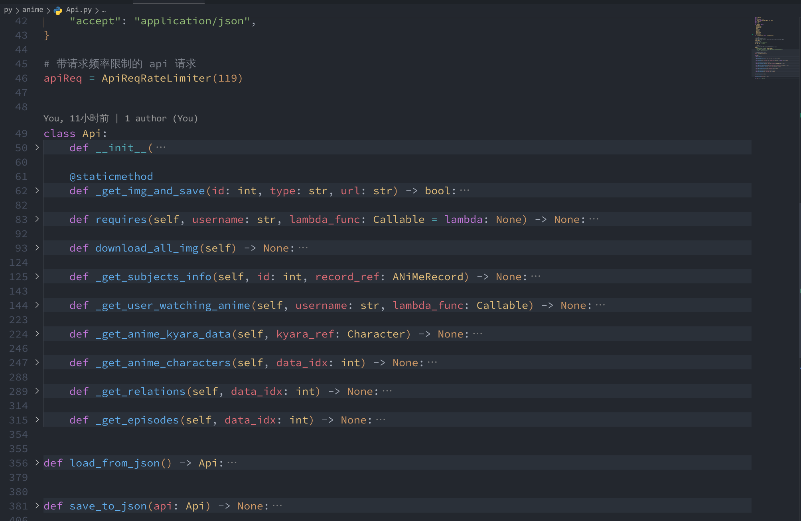

- 流水线自动化更新
    - [x] 进行自动爬取

    基于 Github Workflows 定时任务, 每日触发运行py脚本爬取, 然后更新:

    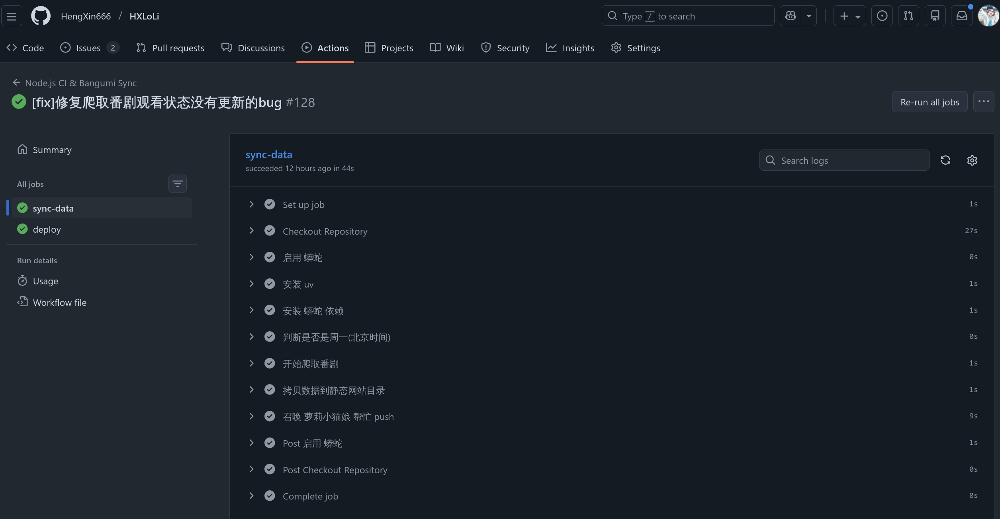

- 前端展示
    - [x] 主页列表, 区分观看状态, 按照观看时间排序/番剧播出顺序

    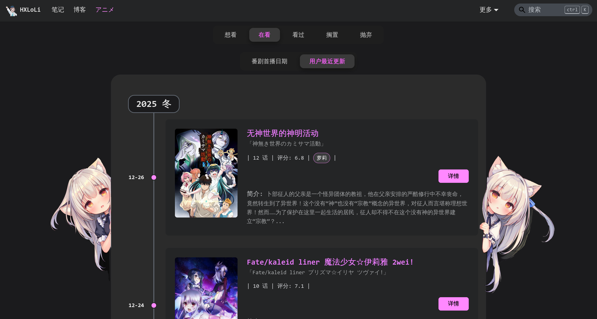

    - [x] 番剧详情界面

    > 详细番剧数据:
    > 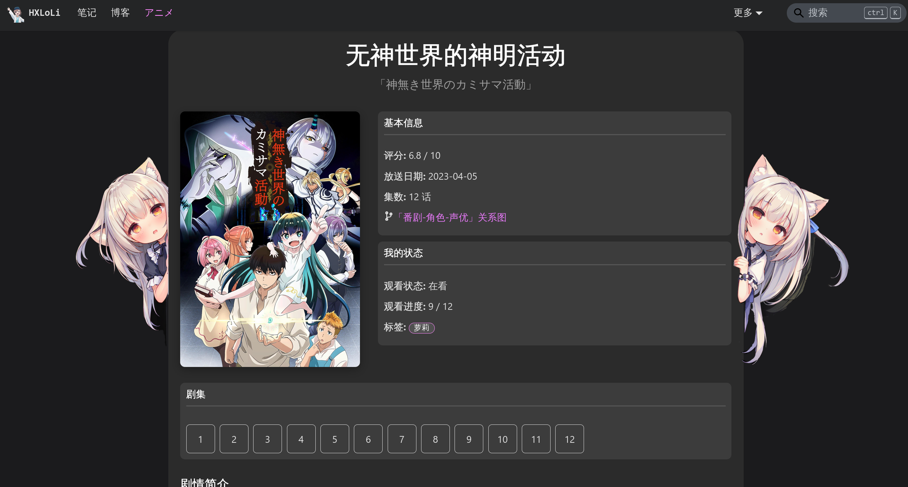
    > 
    > 每一集标题、简介等:
    > 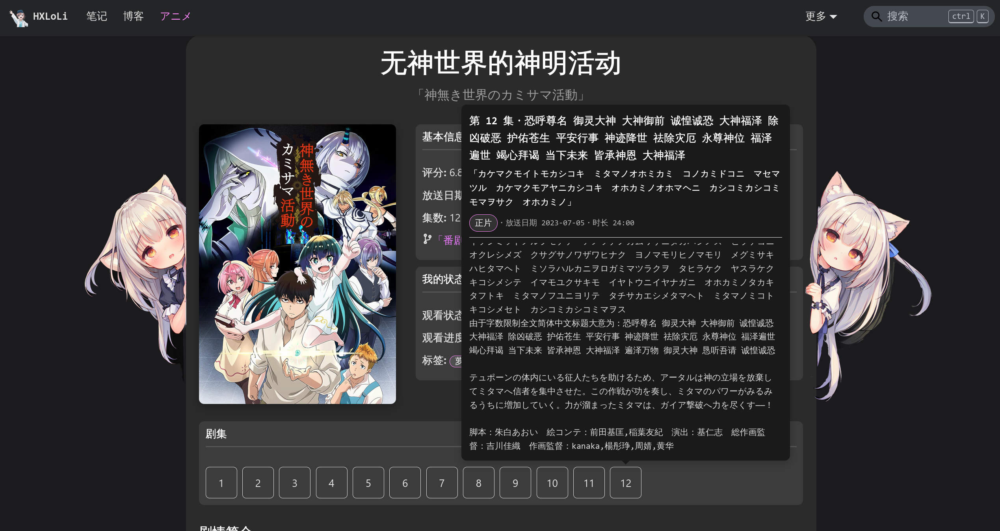
    > 
    > 角色列表、角色简介:
    > 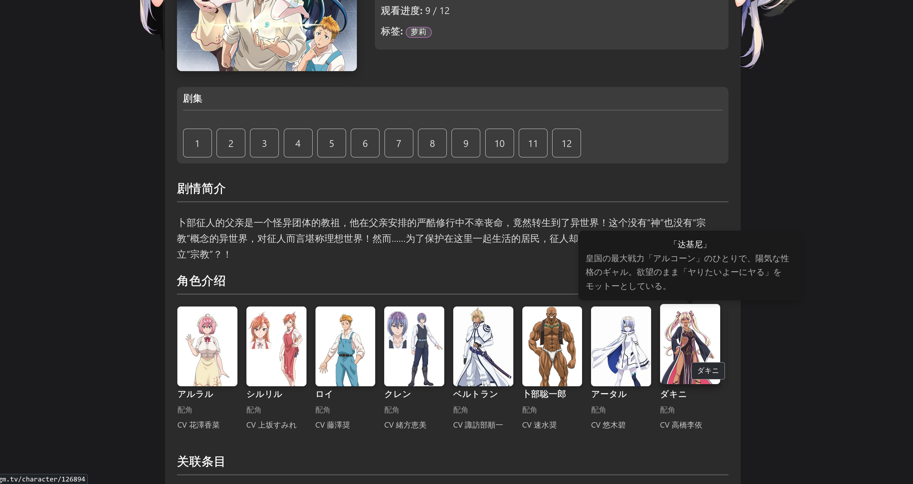
    > 
    > 对应声优:
    > 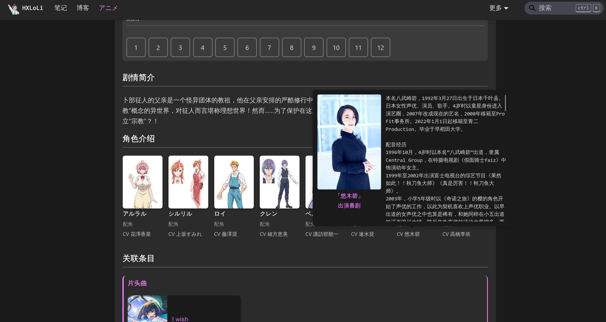
    > 
    > 管关联条目:
    > 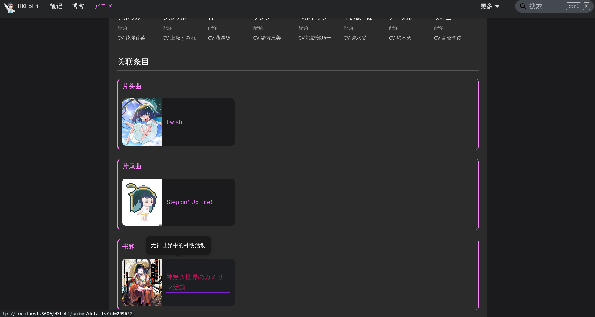
    > 
    > 评论区:
    > 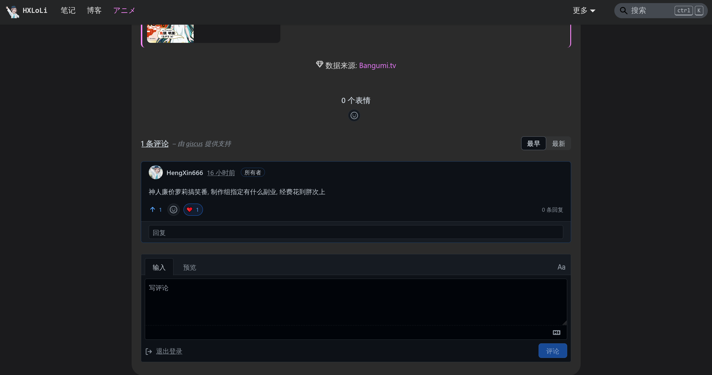

    - [x] 番剧关系图界面

    > 单番剧, 可以展示上下季关系:
    > 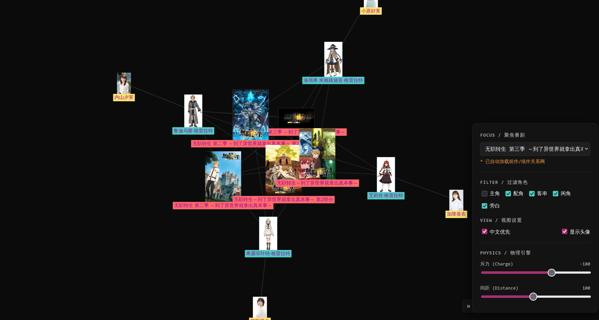

    > 全部番剧, 可以展示到 `cv-角色-番剧` 关系: (中间节点可以持久高亮)
    > 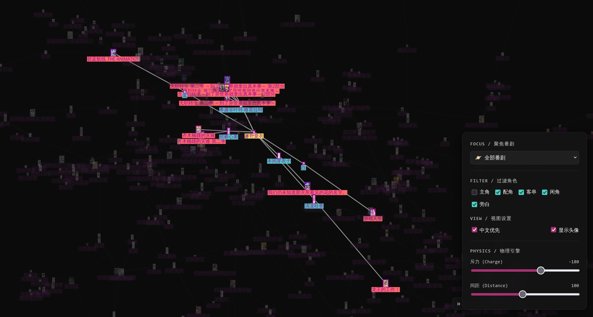

## V2.0 第二期基础功能
- [x] 查看某声优出演的番剧-角色列表 (从番剧详情的声优详情悬浮窗中新增链接跳转)
- [x] 番剧详情接入 Github Discussions 评论区

> 查看某声优出演的番剧, 悬浮在对应项上还可以显示番剧图片、角色图片:
> 
> 
> 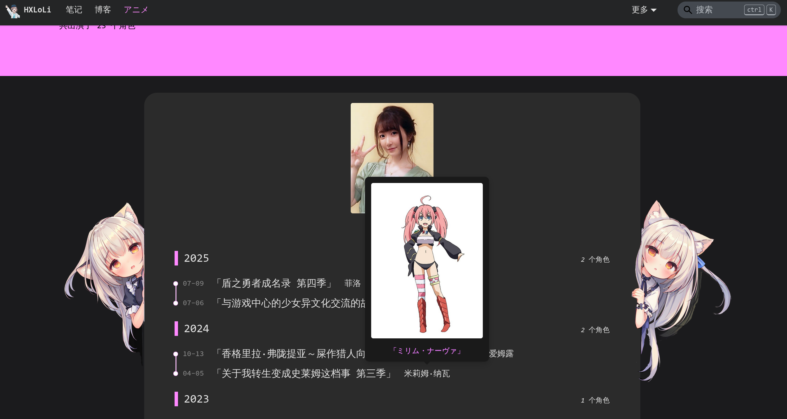

评论区已接入 Github Discussions:

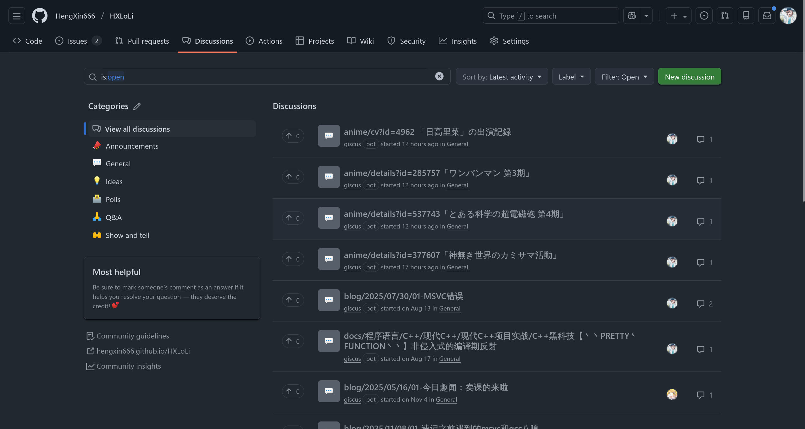

## 附: BUG修复

- 图片缩放bug [(#40)](https://github.com/HengXin666/HXLoLi/issues/40), 并且去掉 `plugin-image-zoom` 插件. 改为自己实现.