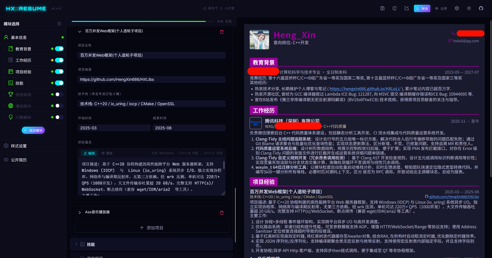
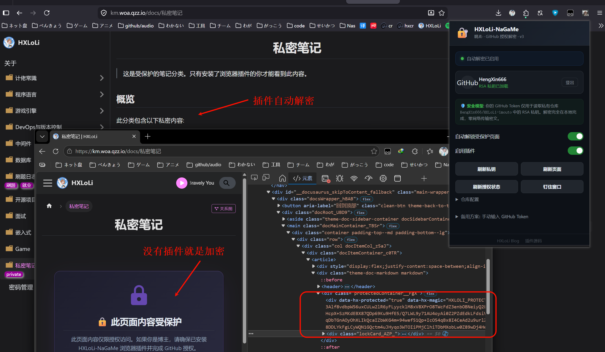
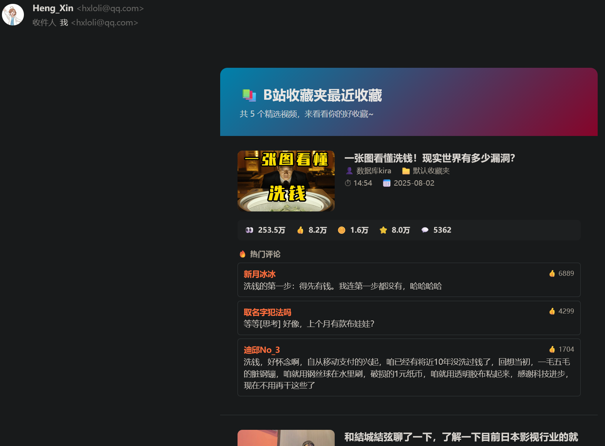
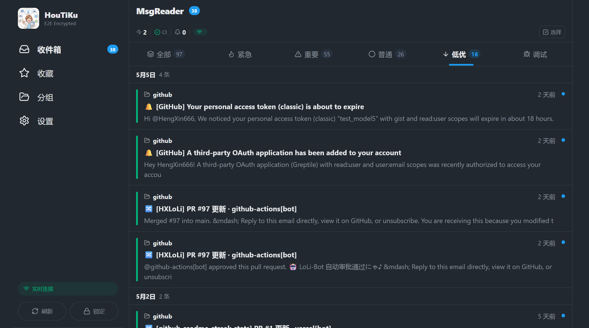
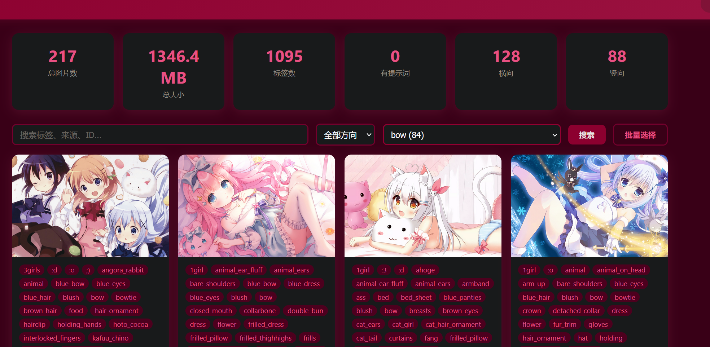
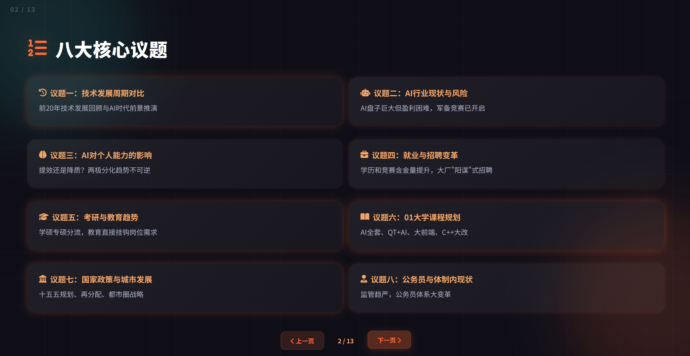
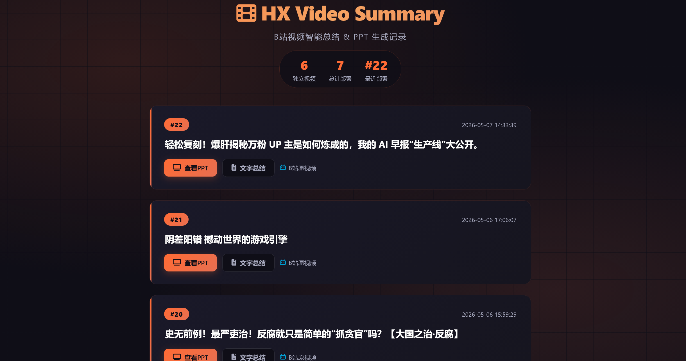

吹水一下最近写的一些玩具项目. 因为比较无聊... 基本上按照时间顺序绍介.

<!-- truncate -->

## 一、[HX-Resume](https://github.com/HengXin666/HX-Resume) 简历制作平台

> 在线体验: https://hengxin666.github.io/HX-Resume/

因为最近要写简历, 但是之前用那个破平台, 写的有水印. 而且不好用. 还有那个数量限制. 所以决定自己做一个.

数据就直接存储到 github 的私有仓库就完事了~

支持 高清图片、PDF、html 导出. 而且为了一些隐私需求. 还支持打码.

整体是指挥 AI 做的. 纯前端会先保存到浏览器缓存. 所以不用后端也能简单使用 (本地使用最好还是开后端. 数据安全)



## 二、[HXLoLi-NaGaMe](https://github.com/HengXin666/HXLoLi-NaGaMe) 自用浏览器插件

之前我为博客定制了一套 非对称加密 (准确的说, 是 `RSA-OAEP + AES-256-GCM` 混合加密) 的功能.

也就是, 可以把一些比较私人的信息, 存放到公开博客中. 而且不会被别人看到. (因为我的博客是纯静态博客, 所以没有后端)

更不可能存在后端鉴权这种东西. 所以干脆直接加密, 然后内嵌密文. 这样别人就看不到了.

然后我就可以通过我写的浏览器插件, 通过配置好的特征, 进行解密. 然后得到原始数据.



> [!TIP]
> 关于私密笔记的明文内容, 就存储到 `私有仓库` 中, 待构建时候, 从 `公共仓库` 中拉取然后构建. (还能白嫖免费的工作流, 不花费私有额度)


## 三、[HX-Git-DB](https://github.com/HengXin666/HX-Git-DB) 分布式可多版本git风格无需部署免费数据库

其实, 我综合以上 `一、二` 点的共同点, 发现其存储层实际上都需要一个 `私有仓库`. 进行存储.

那么是否可以通用的? 提供一个库帮我们完成上述操作呢? 不就是白嫖免费云存储吗? (并且还是分布式, 还是多版本, 还是git风格, 更不需要部署)

```py [db-快速开始]
from hx_git_db import make_database, MsgType

with make_database("https://github.com/user/repo.git", "data") as db:
    with db.open("config.json") as f:
        data = f.read_json()
        data["count"] = data.get("count", 0) + 1
        f.write_json(data)
    # 退出 with 时自动 commit + push + 清理临时目录
```

```py [db-only模式]
# 分支永远只有一个提交, 每次 push -f, 不保留历史。适合存储不需要版本管理的数据(如缓存、状态快照)。
db = make_database("https://github.com/user/repo.git", "data", only=True)
```

```py [db-普通模式]
db = make_database("https://github.com/user/repo.git", "data")
db.pull()

db.set_commit_msg(MsgType.FEAT, "更新配置")

with db.open("config.json") as f:
    f.write_json({"version": "2.0"})

db.push()
db.cleanup()
```

方便集成到 github 工作流中, 直接使用~

## 四、[HX-Recall](https://github.com/HengXin666/HX-Recall) 收藏夹吃灰清灰工具

刷视频时候, 突然冒出的想法:

> 经常看到很多东西. 如b站视频. 感觉不错. 然后就放到文件夹吃灰了. 然后永远都不会打开第二次...
>
> 是否可以编辑一个通用程序? ai skill >> 自动化 >> github 工作流?
>
> 定时推送一些错过的东西? 以巩固. ~~(亦或者是心理安慰 (总之我也比较闲))~~

> [!TIP]
>
> 另外思考这里的决策路径不一样: 以前我们总是倾向 AI 搜索, 然后告知我们, 但是这样完全就不懂我们的需求. 基本上召回不到我们需要的数据. 就更别说细致分析了. 在垃圾堆里面有什么好东西呢?!
>
> 反倒是 我们自己去冲浪, 自己收藏的东西. 才是我们自己确认过的好东西. 所以我们需要想办法活化它. 利用起来, 而不是吃灰; 即便你已经读取过第一次; 一段时间后, 第二次也会有其他的见解?



感觉不错, 反正也算是一种推荐. 感觉有意思就再看一次就完事了~

> 项目目前没有接入 AI skill, 不过可以爬取 b站 自带的 AI 总结. 但是 b站 的曲奇保质期太短了.. 隔三差五就要配置.. 目前这个已经吃灰了 (下面有解决方案)

## 五、[HX-HouTiKu](https://github.com/HengXin666/HX-HouTiKu) 端到端加密的统一消息推送聚合平台

> AI 定时任务、CI/CD、监控告警、工作流通知……消息来源越来越多, 散落在各个平台, 平铺无优先级。

HX-HouTiKu 把它们统一到一个 App! 支持端到端加密, 保证消息安全; 并且支持 PC 和 安卓 APP两种用户端.

更重要的是, 它直接部署在 Cloudflare 免费套餐上 ~~(感谢大善人 CF 🙏)~~

并且可以直接作为对外邮箱使用, 基于 CF, hook 邮件, 转发到 HX-HouTiKu. 再转发到 主邮箱.



> 原本只是觉得 [HX-Recall](https://github.com/HengXin666/HX-Recall) 它发邮件. 并不方便我看. 才萌生了这个想法的~

挺好的, 勉勉强强可以算是一个分布式的项目. 还遇到了经典的问题: 如何保证消息同步? (因为消息是支持删除的, 如果本设备删除了. 其他设备不在线 (无法通过ws广播操作), 那么你怎么同步这些消息? (需要保证性能) (CF 免费额度中, 数据库查找次数是有限的, 需要尽可能优化 ~~(虽然基本不可能用得完)~~))

```sh [HouTiKu-问题场景]
设备A: 有消息 [1, 2, 3, ..., 10000]
设备B: 有消息 [1, 2, 3, ..., 9000](离线中)

设备A 操作: 删除了第 9000 条消息
设备B 上线: 服务器只返回 top 50 (即 [9951~10000])
           → 时间窗口增量清理只能清理 9951~10000 范围内的差异
           → 第 9000 条消息在窗口之外, 永远不会被清理
           → 设备B 的缓存中永远残留着已删除的第 9000 条
```

我看了 QQ、WX、纸飞机, 他们都有不同的解决方案.

我这里就用最简单的, 直接记录操作日志 (比如xx时间删除了xx消息id, 然后存入数据库的一个操作日志表中)

每一个客户端都需要本地维护一个`时间`, 然后每次上线就使用这个`时间`去请求 这个`时间`之后的操作日志. 从而同步.

对于什么时候存储这个`时间`? 最简单的方案是, 每次ws同步消息时候, 就更新一下. (第一次启动app时候, 就把时间设置为`26-01-01` (因为这时候app都没有存在, 更不可能有消息)), 这样可以防止用户app强制退出后, 没有落盘的问题.

## 六、[HX-CF-LoLi-Img](https://github.com/HengXin666/HX-CF-LoLi-Img) 基于 CF 的免费图片存储 + 随机图片

因为有点上瘾白嫖 CF 了, 无聊就搞了一个这个...



因为设计时候是可以通过 tag 进行分类的. 所以顺便还能学习到 `倒排索引` 的使用喵~

> [!NOTE]
> 顺便还写了一个 (暂时没有开源)
>
> 二次元图片爬取框架: 爬取 → 去重 → 分类 → 推荐
>
> 基于 waifuc(爬取架构)+ imgutils(CCIP去重 & WD14分类)+ CLIP(推荐算法)

不过爬取有点拉胯, 有的大部分爬取接口都不能用. 而且图片质量参差不齐. 但是还是可以用的. (不过这个东西, 我配置了代理忘记管它了. 把我 100GB 的流量用完了... 艹)

因为是 ai 写的, 去重应该是可以的 (不需要图片, 即可分布式去重), 但是推荐算法有点拉 (可能是我的审美太高了, 根本就没有什么好图片...)

## 七、[HX-Video-Summary](https://github.com/HengXin666/HX-Video-Summary) 视频转写与总结工具

> 视频转写与总结工具, 使用 FunASR (paraformer-zh) 进行中文语音识别, 支持标点恢复和语音端点检测(VAD)。接入 deepseek-v4 进行总结。并且生成 炫酷 PPT html (在Github工作流中运行)
>
> 在线预览: https://bvs.woa.qzz.io

> [!TIP]
> 5.3 不是有座谈会吗? 然后内容太劲爆. 突然感觉有了干劲. 想着一定要沉淀下来!
>
> 正巧最近看到了 [AI-Animation-Skill](https://github.com/Unclecheng-li/AI-Animation-Skill), 就想到整个 AI 总结玩玩?

一波操作就搞出这个来了. ~~历年的座谈会 (我有录屏的), 就都总结到 https://ppt.woa.qzz.io/ 了 (不过我都加密了, 毕竟不能也不好传播)~~



现在这个项目被我复用一下 (正好无聊, 买了点 ds-v4 的 token 玩玩, 感觉还不错) (至少很便宜, 我 5h + 3 个终端 几乎不断的跑. 才花费我 10 元左右)

现在它被用于总结 B站 视频. 看到有意思的, 就可以总结一下. 生成 PPT html. 然后在线预览. (相当于更有可视化了~)

并且可以沉淀到 Github Page 上. 随时都可以看:



> [!WARNING]
> 更重要的是, 这样可以直接被 `四、` 复用, 到时候就不需要爬取视频了, 只需要从 ppt html 中随机选择就完事了!
