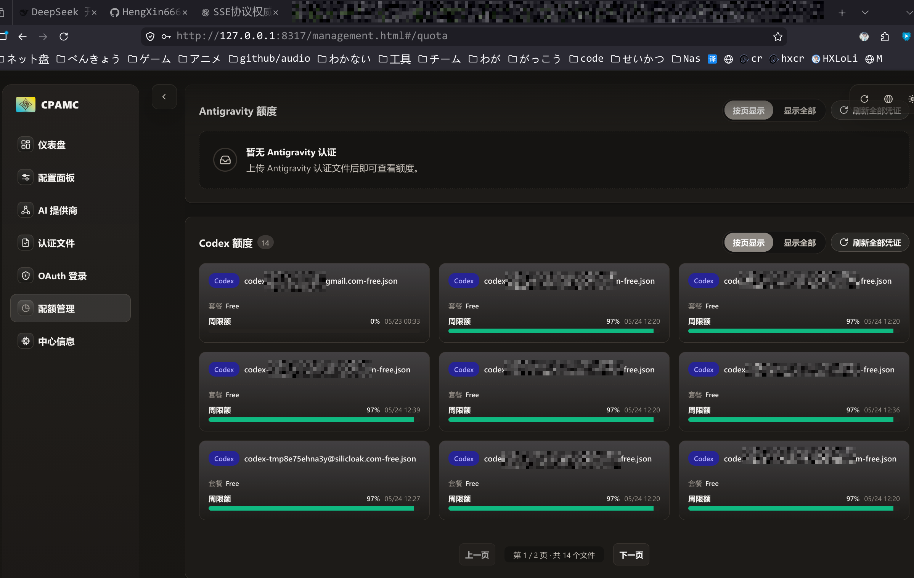
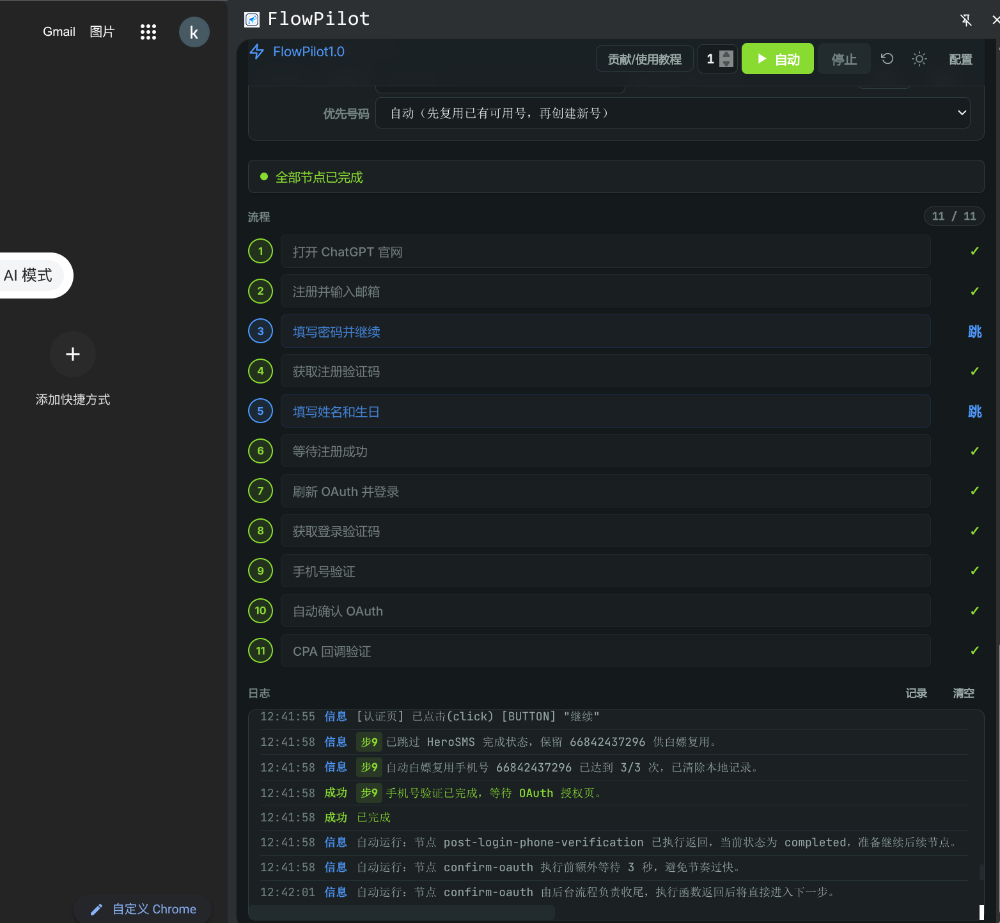

没事找事折腾...

<!-- truncate -->

## 一、最终效果

> 大概是 1\$ 的效果, 主要接码突然涨价到 0.2\$ 一个号码了..., 一个号码可以被重复使用 3 次.

## 二、步骤

> [!TIP]
> 本片需要有一定的调研能力, 遇到什么问题, 我也不负责. 项目都是网络的上的. 不具备实时性!

### 2.1 CPA 面板

- [CLIProxyAPI](https://github.com/router-for-me/CLIProxyAPI)

用于存储凭证, 以及负载均衡.

### 2.2 浏览器插件

- [浏览器插件](https://github.com/QLHazyCoder/FlowPilot)

> 带有自定义邮箱 + 接码功能

> [!TIP]
> 建议使用 com 域名配合 cf 自建邮箱使用
>
> 接码需要 `泰国` 手机号 (如果是 HeroSMS 的话)

## 三、技巧

如果少量的话, 建议看着插件, 因为有时候会有Bug. 特别是接码的时候. 

建议手动计数白嫖次数, 满三次就关闭浏览器. 重新启动, 以刷新插件手机号缓存.

否则可能出现它重复购买已经被上一轮使用过的手机号的情形. 待你熟悉后, 再爱咋咋地.

## 四、免责声明

> [!NOTE]
> 仅学习分享. 出现什么问题. 自己想办法! 这个东西说不定什么时候就失效了, 纯没事折腾. 后续还有保活呢?!