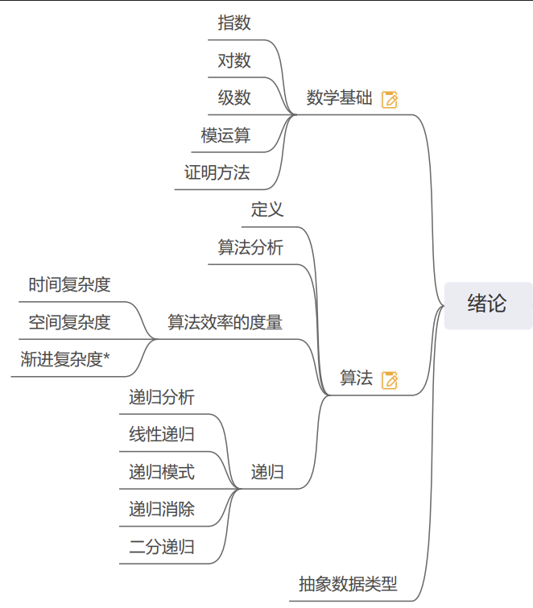

# 开端

> 你需要对以下内容有一点认识...



<p style="color:yellow">算法的基本性质: 输入, 输出, 确定性, 有穷性, 可行性</p>

## 时间复杂度

时间复杂度就是用来方便开发者估算出程序的运行时间的, 通俗的讲, 因为我们不能仅仅通过代码的长度/行数/**语句次数** 来判断一个程序的快慢, 因为假如你对 `if()` 讨论, 那么实际在编译的时候, 或许在汇编上面又不是一条, 在CPU指令集的使用上又不是一条, 可能还会因为底层物理架构从而影响次数, 所以就出现了一个**估算出程序的运行时间**的方法--计算时间复杂度.

首先, 时间复杂度, 不受代码长度的影响 比如 写一百条 `a = 1;` 的代码, 因为`不论多少的数据量, 它永远只执行 一百次 "a = 1;", 所以它的时间复杂度是 O(1) 或者说是 O(C)` 即 `常数` 级别的时间复杂度.

于之对应的, 下面的代码的时间复杂度就是 O(s), 即 随着数据量`(s)`的增大, 程序执行的时间也变长 即 所谓 `线性时间复杂度`.
``` C
int s;
scanf("%d", &s);
for (int i = 0; i < s; ++i)
{
  ...
}
```

*相信你已经对时间复杂度有了初步的了解了...*

**举例:**
> 1. 常数时间复杂度（O(1)）：无论输入规模大小，算法的执行时间都保持不变。
> 2. 线性时间复杂度（O(n)）：算法的执行时间随着输入规模线性增长。
> 3. 对数时间复杂度（O(log n)）：算法的执行时间随着输入规模的增大而增长，但增长趋势是逐渐减缓的。<p style="color:yellow">常见于某些二分算法</p>

``` C
// 推导 int x = 1, n = 100;
While (x < n)
{
        X *= 2;
}
// 2^x = n
// 也就是 x = log2n    即 O(lngn)
```
> 8. 平方时间复杂度（O(n^2)）：算法的执行时间与输入规模的平方成正比。
> 9. 阶乘时间复杂度（O(n!)）: 指算法的执行时间与输入规模的阶乘成正比
> 10. 多项式级别的阶乘时间复杂度（如O(n^n)）

## 空间复杂度

与 `时间复杂度` 类似的, 只不过 `空间复杂度` 是指 变量额外消耗的空间的大小.

空间复杂度 为 O(1)
``` C
int a = 1;
int b = a;
int c = b;
```

空间复杂度 为 O(N)
``` C
int s;
scanf("%d", &s);
int *arr = (int *)malloc(sizeof(int) * s);
for (int i = 0; i < s; ++i)
{
    scanf("%d", &arr[i]);
}