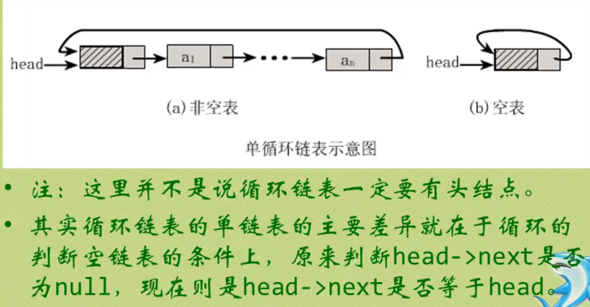

# 线性表
| ##container## |
|:--:|
|<h2>大纲</h2>|
||

## 方法

通常需要实现的方法

```C
void initList(List *L);                 // 初始化操作, 建立一个空的线性表
int listEmpty(List L);                  // 判断是否为空表 1是0否
void clearList(List *L);                // 将线性表清空
void getElem(List L, int i, int *e);    // 将线性表L第i个元素返回给e
int locateElem(List L, int e);          // 查找线性表L中是否有值为e的元素, 有则返回其在表中的序号, 否0
int listInsert(List *L, int i, int e);  // 在线性表L中第i个位置插入新元素e
int listDelete(List *L, int i, int *e); // 删除线性表L中第i个位置的元素, 并返回其值给e
int getListLength(List L);              // 返回线性表的长度
```


## 顺序存储结构
### 顺序存储结构的优缺点
优点:
- 无须为表示表中元素之间的逻辑关系而增加额外的存储空间。
- 可以快速地存取表中任意位置的元素。

缺点:
- 插入和删除操作需要**移动**大量元素
- 当线性表长度变化较大时，难以确定存储空间的容量。
- 容易造成存储空间的“碎片”

---
### 数组

数据结构封装:
```C
typedef int ElemType;

typedef struct{
    ElemType data[MAXSIZE]; // 当然修改为动态申请长度也没问题!
    int length;
} List;
```

时间复杂度分析:

查找: $O(N)$

插入: $O(N)$

删除: $O(N)$

因为插入/删除后均需要移动元素以保证其索引的连续.

代码实现(非唯一): [顺序存储结构-数组](../002-顺序存储结构丶数组/index.md)

---
### 静态链表

<span style="color:red">可以简单的理解成使用数组实现了单向链表</span>

#### 静态链表的优缺点
优点：
- 在插入和刪除操作时，只需要修改游标，**不需要移动元素**，从而改进了在顺序存储结构中的插入和刪除操作需要移动大量元素的缺点。

缺点:
- 没有解决连续存储分配（数组）带来的表长难以确定的问题。
- **失去了顺序存储结构随机存取的特性**。

---

备忘录

- 我们对数组的第一个和最后一个元素做特殊处理，他们的`data`不存放数据。
- 我们通常把未使用的数组元素称为备用链表。
- 数组的第一个元素，即下标为O的那个元素的`cur`就存放备用链表的第一个结点的下标。
- 数组的最后一个元素，即下标为`MAXSIZE-1`的`cur`则存放第一个有数值的元素的下标，相当于单链表中的头结点作用。

| ##container## |
|:--:|
||
||

数据结构封装:

```C
typedef int ElemType;

typedef struct{
    ElemType data;  // 数据
    int cur;        // 游标
} Component, StaticLinkList[MAXSIZE];
```

时间复杂度分析:

查找: $O(N)$

插入: $O(N)$

删除: $O(N)$

因为要遍历一次, 所以时间复杂度是O(N).

代码实现: [顺序存储结构-静态链表](../003-顺序存储结构丶静态链表/index.md)

## 链式存储结构
### 线性表链式存储结构定义
我们把存储数据元素信息的域称为数据域，把存储直接后继位置的域称为指针域。指针域中存储的信息称为指针或链。这两部分信息组成数据元素称为存储映像，称为结点（Node）。

n个结点链接成一个链表，即为线性表( $a_1$, $a_2$, $a_3$, ..., $a_n$ )的链式存储结构。

因为此链表的每个结点中只包含一个指针域，所以叫做单链表。

---
### 在链表中，头指针、头节点和第一个节点是不同的概念
**头指针（head pointer）** 是指向链表第一个节点的指针变量。它用于表示整个链表的起始位置。

**头节点（head node）** 是位于链表的最前端的一个特殊节点，它**不存储任何数据**，主要作用是为链表提供一个统一的入口点。

第一个节点是链表中实际存储数据的第一个节点，它紧随头节点而来。

简而言之，**头指针指向头节点，而头节点指向第一个节点**。它们之间确实有联系，但代表的概念并不相同。

// 但是并非 有 头指针就一定有头节点 没有头结点 头指针就直接指向第一个节点<br>
// 具体是看 链表的设计和实际需求

---
### 链式存储结构的优缺点

链式存储结构是一种数据结构，其中元素通过指针相互连接形成链表。它与数组等顺序存储结构相比具有以下优点和缺点：

优点：

1. 动态性：链式存储结构可以根据需要动态添加或删除节点，而无需提前定义容量。这使得链表适用于频繁插入和删除操作的场景。
2. 灵活性：链表的节点可以在内存中分散存储，不需要连续的内存空间。因此，链表可以充分利用零散的内存空间，避免了固定容量的限制。
3. 大小可变：链表的大小可以根据实际需求进行动态扩展或收缩，而不会浪费额外的内存空间。
4. 插入和删除效率高：在已知节点的情况下，链表的插入和删除操作只需要修改相邻节点的指针，时间复杂度为O(1)。

缺点：

1. 随机访问困难：链表的节点不是连续存储的，因此无法通过索引直接访问某个节点，需要从头节点开始按序访问，时间复杂度为O(N)。这使得链表在查找某个特定节点时相对较慢。
2. 内存占用较大：链表中的每个节点都需要存储指向下一个节点的指针，这使得链式存储结构相对于顺序存储结构来说，会占用更多的内存空间。

综上所述，链式存储结构适用于频繁插入和删除操作的场景，并具有动态性和灵活性。但是，由于随机访问困难和较大的内存占用，链式存储结构在某些情况下可能不如顺序存储结构高效。选择使用哪种存储结构应根据实际需求和问题的特点来决定。

---
### 单向链表


```C
typedef int ElemType;

typedef struct Nobe{
    ElemType data;
    struct Nobe* next;
} Nobe;

typedef Nobe* LinkList;
```

时间复杂度分析:

查找: $O(N)$

插入: (头插 $O(1)$, 尾插 $O(N)$, 指定未知位置元素后 $O(N)$ (因为找到该元素的前驱结点))

删除: 同上(头/尾/指定)

代码实现: [链式存储结构-单向链表](../004-链式存储结构丶单向链表/index.md)

---
### 循环链表

数据结构封装:
```C
typedef int ElemType;

typedef struct Nobe{
    ElemType data;
    struct Nobe* next;
} Nobe;

typedef Nobe* LinkList;
```

**将单链表中终端结点的指针端由空指针改为指向头结点**，就使整个单链表形成一个环，这种头尾相接的单链表成为单循环链表，简称循环链表.

| ##container## |
|:--:|
||
|图示-循环链表|

时间复杂度分析:

查找: $O(N)$

插入: (头插 $O(1)$, 尾插 $O(N)$, 指定未知位置元素后 $O(N)$ (因为找到该元素的前驱结点))

删除: 同上(头/尾/指定)

代码实现: [链式存储结构-循环链表](../005-链式存储结构丶循环链表/index.md)

---
### 循环链表改进版: 使用终端结点

| ##container## |
|:--:|
||
|例のように言うまでもなく|

时间复杂度分析:

查找: $O(N)$

插入: (头插 $O(1)$, **尾插 $O(1)$**, 指定未知位置元素后 $O(N)$ (因为找到该元素的前驱结点))

删除: 同上(头/尾/指定)

代码实现: [链式存储结构-循环链表(改)](../006-链式存储结构丶循环链表【改】/index.md)

#### 课后习题

代码: [课后习题code](../008-线性表丶课后习题code/index.md)

##### 如何判断单链表是否有环 (鹅厂真题)

双指针 =-=
| ##container## |
|:--:|
||

##### 约瑟夫问题

```C++
/*
    详情: 提高挑战难度:编号为1～N的N个人按顺时针方向围坐一圈，
    每人持有一个密码（正整数，可以自由输入），
    开始人选一个正整数作为报数上限值M，从第一个人按顺时针方向自1开始顺序报数，报道M时停止报数。
    报M的人出列，将他的密码作为新的M值，从他顺时针方向上的下一个人开始从1报数,如此下去，直至所有人全部出列为止。

    功能: 约瑟夫问题的课后作业
    参数:   循环链表的二级指针 - L
            长度 - len
            余下人数 - remaining
*/
```

##### 魔术师发牌

| ##container## |
|:--:|
||

##### 拉丁方阵

| ##container## |
|:--:|
||

---
### 双向循环链表

数据结构封装:

```C
typedef int ElemType;

typedef struct DualNobe
{
    ElemType data;
    struct DualNobe *prior; // 前驱结点
    struct DualNobe *next;  // 后继结点
} DualNobe, *DuLinkList;
```


| ##container## |
|:--:|
||
||

时间复杂度分析:

查找: $O(N)$

插入: (头插 $O(1)$, 尾插 $O(1)$, 指定未知位置元素后 $O(N)$ (因为找到该元素的前驱结点), 指定已知位置 $O(1)$ (比如已知该位置的指针(迭代器)))

删除: 同上(头/尾/指定)

代码实现: [链式存储结构-双向循环链表](../007-链式存储结构丶双向循环链表/index.md)

#### 课后习题
代码: [课后习题code](../008-线性表丶课后习题code/index.md)
##### 维吉尼亚加密
| ##container## |
|:--:|
||

# 栈与队列
## 特点分析
- 线性表逻辑上是线性关系，它的操作是可以任意位置进⾏删除和添加的
- 当把线性表的操作进⾏了⼀定的约束，就有了特殊的结构
    - 只能在⼀端进⾏添加和删除，[栈](../009-栈/index.md)
    - 只能在⼀端进⾏添加，另外⼀端进⾏删除，[队列](../014-队列/index.md) 