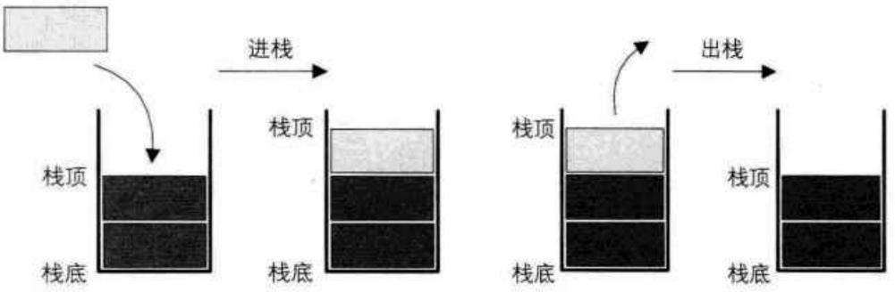

# 栈
## 思维导图
```markmap##h300
# 栈
## 栈模型
## 栈与递归
### 函数调用栈
### 避免递归
## 栈应用
### 逆序输出
### 递归嵌套
### 延迟缓冲
### 逆波兰表达式
## 试探回溯法*(算法设计)
### 定义
### 应用
#### 八皇后问题
#### 迷宫寻径
```
## 栈的定义
- 官方定义: **栈（Stack）** 是一个<span style="color:red">后进先出(Last in first out,LIFO)</span>的线性表，它要求<span style="color:red">只在表尾</span>进行刪除和插入操作。
  
- 小甲鱼定义：所谓的栈，其实也就是一个特殊的线性表（顺序表、链表），但是它在操作上有一些特殊的要求和限制:
  - 栈的元素必须“后进先出”
  - 栈的操作只能在这个线性表的表尾进行。
  - 注：对于栈来说，这个表尾称为栈的栈顶页（top)相应的表头称为栈底（bottom）

## 栈的细分
- 栈顶指针指向的是有效数据还是下⼀个待插⼊的数据
    - 满栈
    - 空栈
- 栈顶指针指向下⼀个元素时，是向内存空间上还是下的位置
    - 递增栈
    - 递减栈

## 栈的“上溢”和“下溢”
- 栈的“上溢”和“下溢”，可以总结为：栈满还存会“上溢”，栈空再取会“下溢”。

- 对于栈的两种表示⽅式来说，顺序栈两种情况都有可能发⽣；⽽链栈由于“随时需要，随时申请空间”的存储结构，不会出现“上溢”的情况。

## 栈的操作
| ##container## |
|:-:|
|栈的插入操作，叫作进栈，也称压栈、入栈。类似子弹入弹夹，|
|栈的删除操作，叫作出栈，也有的叫作弹栈。如同弹夹中的子弹出夹|
||

依照`C++ STL`的做法, 其一般只提供一下几种核心方法:
```C 伪代码
typedef int ElemType;

ElemType getTop();     // 获取栈顶元素
void push(ElemType e); // 入栈: 在栈顶添加元素
ElemType pop();        // 弹栈: 删除栈顶元素

// 获取长度 / 初始化栈 / 清空、释放 栈
```

## 时间复杂度分析
查询: $O(1)$

添加: $O(1)$

删除: $O(1)$

## 实现方式

> 如果栈的大小已知 (需要处理的资源数量已知), 那么可以使用数组栈
>
> 反之, 链式栈可能更好

### (顺序存储结构)固定大小的数组
[顺序存储结构-固定大小的数组栈](../010-顺序存储结构丶固定大小的数组栈/index.md)

### (顺序存储结构)动态长度的数组
[顺序存储结构-动态长度的数组栈](../011-顺序存储结构丶动态长度的数组栈/index.md)

### (链式存储结构)链表的头插法
[顺序存储结构-动态长度的数组栈](../011-顺序存储结构丶动态长度的数组栈/index.md)

## 课后习题
代码: [栈-课后习题code](../013-栈丶课后习题code/index.md)
### 课堂练习: 进制转换 二进制 转为 十进制
### 课堂练习: 进制转换 二进制 转为 八进制
### 逆波兰表达式计算加减乘除
### 输入中缀表达式输出逆波兰表达式