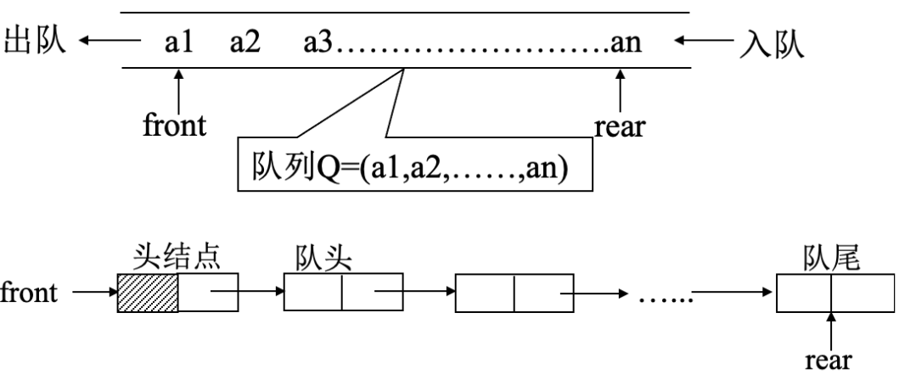
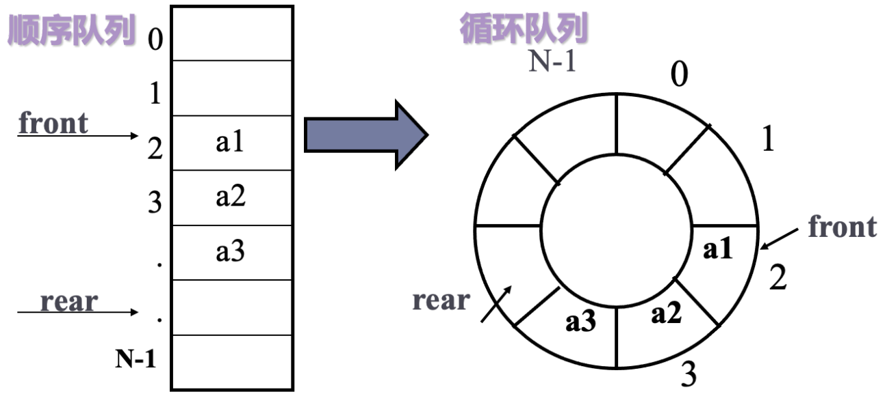
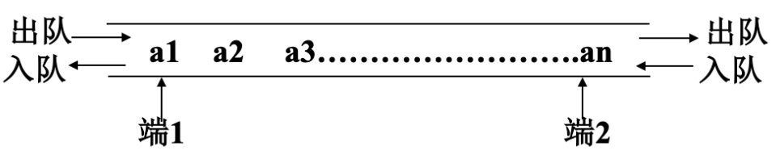
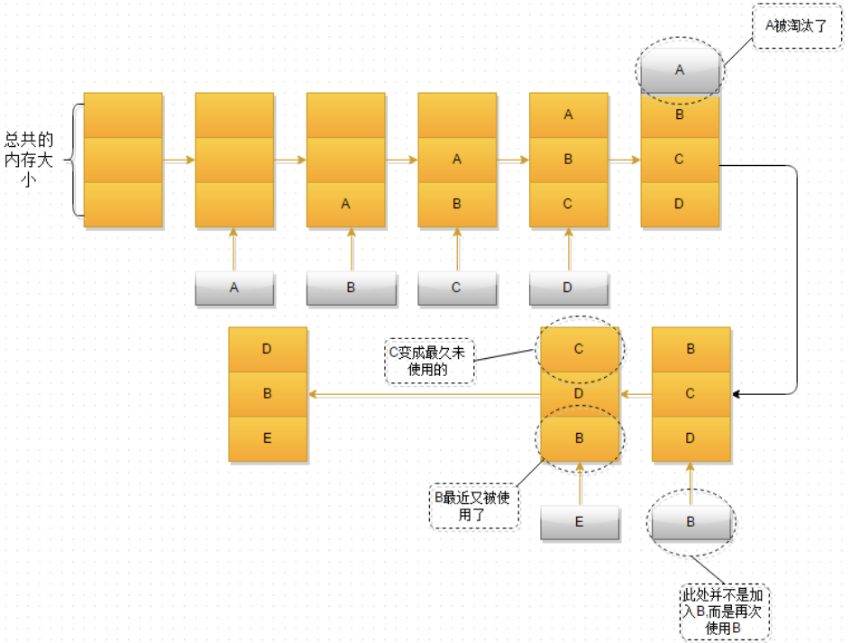

# 队列
## 思维导图
```markmap##h300
# 队列
## 队列模型
## 队列描述
### 链表描述
### 顺序表描述
### 双端队列
## 队列应用
### 层次遍历中的应用
### 在计算机系统中的应用
### 循环分配器
```

## 定义
- 队列是一种特殊的线性表，特殊之处就在于它只允许在表的前端进行删除操作，在表的后端进行插入操作。

- 和栈一样，队列也是一种操作受到限制的线性表。进行插入操作的端称之为队尾，进行删除操作的端称之为队头。

- 队列中没有队列的时候，称之为空队列。队列的数据元素，又叫做队列元素。在队列中插入一个队列元素称之为**入队**，在队列中删除一个队列元素，称之为**出队**。

- 因为队列只允许在一端插入，在另一端删除，所以只有最早进入的队列元素才可以从队列中删除，故队列又称为<span style="color:red">先进先出</span>线性表。

## 结构特点
- ⽀持顺序存储和链式存储

| ##container## |
|:--:|
||

## 单端队列
### 单向顺序队列
- 用一维数组来存放顺序队列的数据元素
- 队头设置在即将离开队列的元素处
- 队尾设置在即将插入队列的位置处
```图示
               队尾
                |
                v
[ ][A][B][C][D][ ][ ][ ]
    ^
    |
   队头
```

### 循环顺序队列
- 当队尾索引指向了`size - 1`时，代表已经满了，但对头由于之前的出队事件，队列中应该还有多余的空间，这种称之为**假溢出**。
  
- 为了解决假溢出的问题，就是将我们的顺序队列看成是首尾相接的循环结构。首尾指示器不变，这种队列就叫做，**循环顺序队列**。

| ##container## |
|:--:|
||

#### 队尾队头操作行为

```C
rear = (rear + 1) % maxSize;
front = (front + 1) % maxSize;
```

#### 队满和队空的判断

```C
// 队空时，约定
rear == front
// 队满时，约定
(rear + 1) % maxSize == front
```
---

代码实现: [循环顺序队列](../015-循环顺序队列/index.md)

### 链式队列
- 不用担心队满

代码实现: [单向链式队列](../016-单向链式队列/index.md)

## 双端队列
- 两端都是结尾的队列，队列的每一端都可以插入数据和移除数据
- 这种定义，是方便一个结构来实现栈和队列，当我们只允许使用一端出队、入队操作的时候， 他等价于一个栈。当限制一端只能出队，另一端只能入队，他就等价于一个普通队列。

| ##container## |
|:--:|
||

## 其他特殊队列
### LRU缓存淘汰
**LRU(Least Recently Used)** 最近最少使用算法，根据数据的历史访问记录来进⾏淘汰数据，其核心思想是“如果数据最近被访问过，那么将来被访问的几率也更高”。

#### LRU过程
1. 新数据插入到链表头部；
2. 每当缓存命中（即缓存数据被访问）, 则将数据移到链表头部；
3. 当链表满的时候, 将链表尾部的数据丢弃
- 过程描述:

| ##container## |
|:--:|
||

- 这里我们是根据时间来来判断的，就是最近最久未使用的。如果根据使用次数来判断，做缓存的命中，那就叫做LFU（LeastFreequentlyused）。目前Redis应该就是用的LFU。
  
### 延迟队列
- 延时队列中的元素在入队时会制定一个延迟时间，表示其希望能够在经过该指定时间后处理。从某种意义来说，他不像是一个队列。更像是一个以时间为权重的堆。

  > <span style="margin-left: 30px;"></spwan>用户可以在小程序中订阅不同的微信或者QQ的模板消息，产品同学可以在小程序的管理端新建消息推送计划，当到达指定的时间节点的时候给所有订阅模板消息的用户进行消息推送。
  >
  > <span style="margin-left: 30px;"></spwan>如果仅仅是服务单一的小程序，那也许起个定时任务，或者甚至人工的定时去执行能够最便捷最快速的去完成这项需求，但我们希望能够抽象出一个消息订阅的模块服务出来给所有业务使用，这时候就需要一种通用的系统的解决方案，这时候便需要使用到延迟队列了。

#### 常用场景
- 新建的订单，如果用户在15分钟内未支付，则自动取消。
- 公司的会议预定系统，在会议预定成功后，会在会议开始前半小时通知所有预定该会议的用户。
- 安全工单超过24小时未处理，则自动拉企业微信群提醒相关责任人。
- 用户下单外卖以后，距离超时时间还有10分钟时提醒外卖小哥即将超时。
  
  > <span style="margin-left: 30px;"></spwan>对于数据量比较少并且时效性要求不那么高的场景，一种比较简单的方式是轮询数据库，比如每秒轮询一下数据库中所有数据，处理所有到期的数据，比如如果我是公司内部的会议预定系统的开发者，我可能就会采用这种方案，因为整个系统的数据量必然不会很大并且会议开始前提前30分钟提醒与提前29分钟提醒的差别并不大。
  >
  > <span style="margin-left: 30px;"></spwan>但是如果需要处理的数据量比较大实时性要求比较高，比如淘宝每天的所有新建订单15分钟内未支付的自动超时，数量级高达百万甚至千万，这时候如果你还敢轮询数据库怕是要被你老板打死，不被老板打死估计也要被运维同学打死。

### 阻塞队列
- 它是一个队列（类似于一个List），可以存放O到N个元素
- 可以执行插入或弹出元素操作
- 当队列中没有元素时，对这个队列的弹出操作将会被阻塞，直到有元素被插入时才会被唤醒；
- 当队列已满时，对这个队列的插入操作就会被阻塞，直到有元素被弹出后才会被唤醒。

> <span style="margin-left: 30px;"></spwan>在线程池中，往往就会用阻塞队列来保存那些暂时没有空闲线程可以直接执行的任务，等到线程空闲之后再从阻塞队列中弹出任务来执行。一旦队列为空，那么线程就会被阻塞，直到有新任务被插入为止。