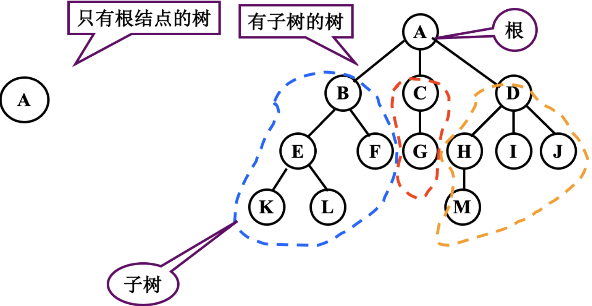
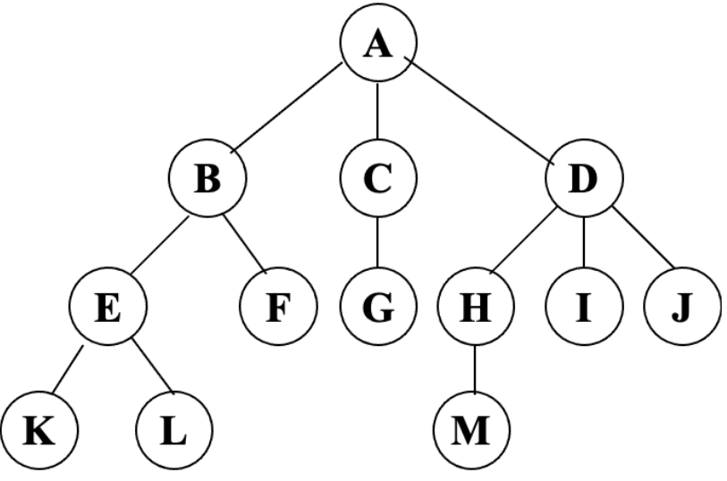
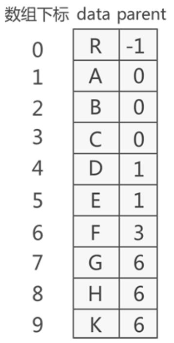
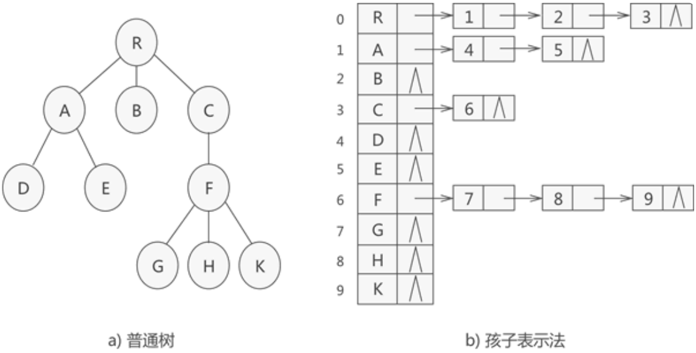
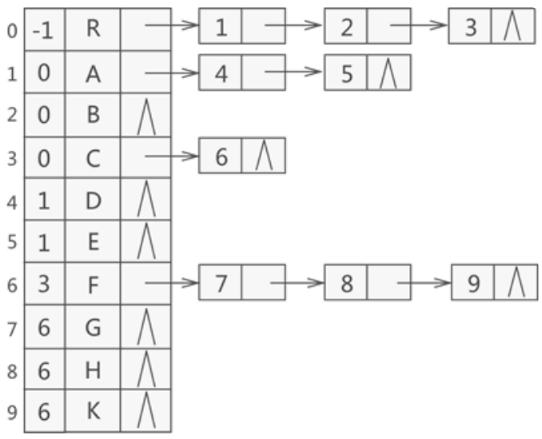
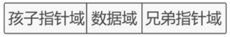
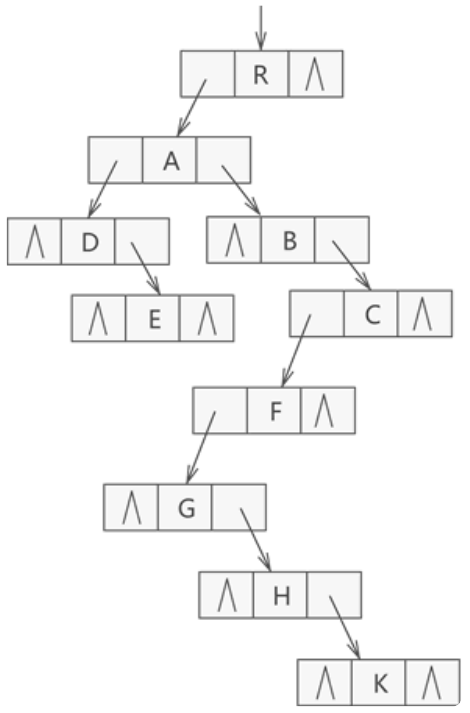

# 树
## 树的表达方式
集合中的元素关系呈现出一对多的情况

### 树的定义
- **树(Tree)** 是n（n≥O）个节点的有限集合T，它满足两个条件:
    - 有且仅有一个特定的称为**根(Root)** 的节点.
    - 其余的节点可以分为m（m≥0）个互不相交的有限集合T1、T2、...、Tm，其中每一个集合又是一棵树，并称为其根的**子树（Subtree）**.

| ##container## |
|:--:|
|

- 树的定义具有递归性, 即"树中还有树".

### 树的概念
- `结点`：使用树结构存储的每一个数据元素都被称为“结点”。例如图中的A就是一个结点。
- `根结点`：有一个特殊的结点，这个结点没有前驱，我们将这种结点称之为根结点。
- `父结点（双亲结点）、子结点和兄弟结点`：对于ABCD四个结点来说，A就是BCD的父结点，也称之为双亲结点。而BCD都是A的子结点，也称之为孩子结点。对于BCD来说，因为他们都有同一个爹，所以它们互相称之为兄弟结点。
- `叶子结点`：如果一个结点没有任何子结点，那么此结点就称之为叶子结点。
- `结点的度`：结点拥有的子树的个数，就称之为结点的度。
- `树的度`：在各个结点当中，度的最大值。为树的度。
- `树的深度或者高度`：结点的层次从根结点开始定义起，根为第一层，根的孩子为第二层。依次类推。

> | ##container## |
|:--:|
||
>
> 结点A的度：3 结点B的度：2 结点M的度：0
>
> 结点A的孩子：B C D 结点B的孩子：E F
>
> 树的度：3 树的深度：4
>
> 叶子结点：K L F G M I J
>
> 结点A是结点F的祖先
>
> 结点F是结点K的叔叔结点

## 树的存储结构
### 双亲表示法
| ##container## |
|:--:|
||

> 双亲表示法采用顺序表（也就是数组）存储普通树，其实现的核心思想是：顺序存储各个节点的同时，给各节点附加一个记录其父节点位置的变量。
>
> 根节点没有父节点（父节点又称为双亲节点），因此根节点记录父节点位置的变量通常置`-1`。
- 利用顺序表存储，表元素由数据和父结点构成
- 特点分析：
    - 根结点没有双亲，所以位置域设置为`-1`
    - 知道一个结点，找他的父结点，非常容易，O(1)级
    - 找孩子节点，必须遍历整个表

| ##container## |
|:--:|
||

### 孩子兄弟表示法
> 孩子表示法存储普通树采用的是“顺序表+链表”的组合结构。
>
> 其存储过程是：从树的根节点开始，使用顺序表依次存储树中各个节点。需要注意，与双亲表示法不同的是，孩子表示法会给各个节点配备一个链表，用于存储各节点的孩子节点位于顺序表中的位置。
>
> 如果节点没有孩子节点（叶子节点），则该节点的链表为空链表。

| ##container## |
|:--:|
||

使用孩子表示法存储的树结构，正好和双亲表示法相反，查找孩子结点的效率很高，而不擅长做查找父结点的操作。

我们还可以将**双亲表示法**和**孩子表示法**合二为一:
| ##container## |
|:--:|
||

### 孩子兄弟表示法
> 在树结构中，同一层的节点互为兄弟节点。例如普通树中，节点A、B 和C 互为兄弟节点，而节点D、E 和F也互为兄弟节点。
>
> 所谓孩子兄弟表示法，指的是用将整棵树用二叉链表存储起来，具体实现方案是：从树的根节点开始，依次存储各个结点的孩子结点和兄弟结点。
>
> 在二叉链表中，各个结点包含三部分内容：
>
> 

| ##container## |
|:--:|
||
|孩子兄弟表示法示例图|

> 在以孩子兄弟表示法构建的二叉链表中，如果要查找结点`x`的所有孩子，则只要根据该结点的`firstchild`指针找到它的第一个孩子，然后沿着孩子结点的`nextsibling`指针不断地找它的兄弟结点，就可以找到结点`x`的所有孩子。