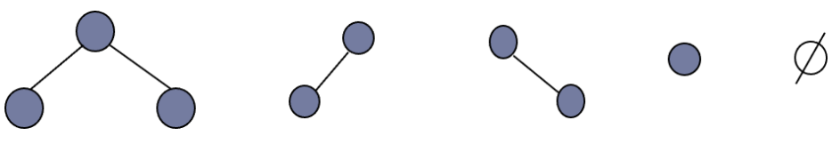
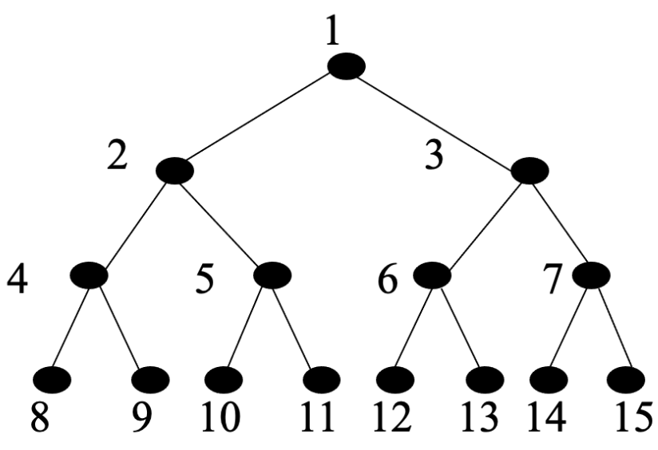
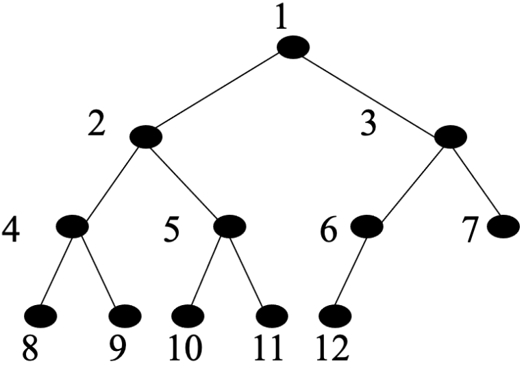
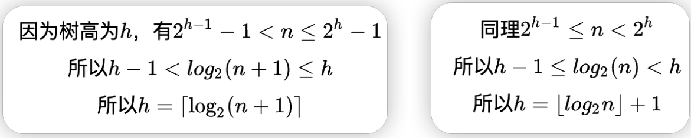
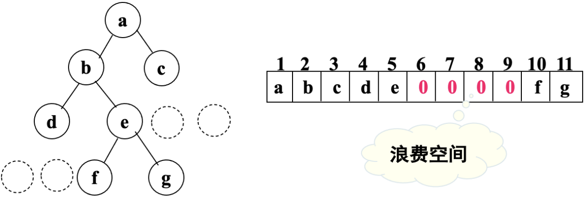
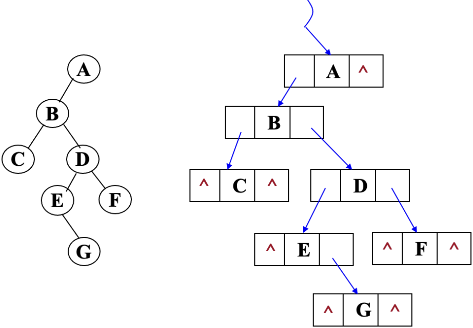
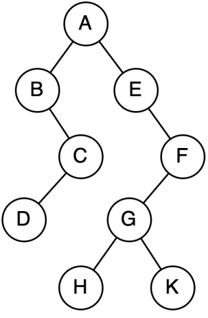

# 二叉树
## 二叉树简介
### 二叉树定义
- 二叉树是每个结点最多有两个子树的树结构。**二叉树不允许存在度大于2**的树，
- 它有五种最基本的形态：
    - 二叉树可以是空集
    - 根可以有空的左子树或者右子树；
    - 左右子树都是空。只有左子树或者右子树的叫做斜树。

| ##container## |
|:--:|
||

### 二叉树的概念和性质
#### 满二叉树与完全二叉树
##### 满二叉树
> <span style="margin-left: 30px;">在一棵二叉树中，如果所有分支结点都存在左子树和右子树，并且所有叶子结点都
在同一层上，这样的二叉树称为**满二叉树**。
>
> <span style="margin-left: 30px;">一棵深度为 $k$ 且有 $2^k-1$ 个结点的二叉树称为满二叉树。 $(k ≥ 1)$

| ##container## |
|:--:|
||

##### 完全二叉树
>  <span style="margin-left: 30px;">如果一棵深度为`k`，有`n`个结点的二叉树中各结点能够与深度为`k`的顺序编号的满二叉树从`1`到`n`标号的结点相对应的二叉树称为**完全二叉树**。

| ##container## |
|:--:|
||

###### 特点
- 所有的叶结点都出现在第`k`层或者第`k-1`层.
- 若任一结点，如果其右子树的最大层次为`i`，则其左子树的最大层次为`i`或`i+1`.

### 二叉树的性质
- 性质1:
  > 在二叉树的第`i`层上的结点最多为 $2^{i-1}$ 个. (i >= 1)
- 性质2:
  > 深度为k的二叉树至多有 $2^{k-1}$ 个结点. (i ≥ 1)
- 性质3:
  > 在一棵二叉树中，叶结点的数目比度为`2`的结点数目多一个。
  >
  > a. 总节点数为各类节点之和: $n = n_0 + n_1 + n_2$
  >
  > b. 总节点数为所有子节点数加一: $n = n_1 + 2*n_2+ 1$
  >
  > 故: $n_0 = n_2 + 1$
- 性质4:
  >具有N个结点的完全二叉树的深度为 $\left \lfloor log_2N \right \rfloor + 1$。(向下取整)
  >
  > 
- 性质5:
  > 如果有一棵n个结点的**完全二叉树**，其**结点编号**按照**层次序**（从上到下，从左到右），则除**根结点**(*没有父结点*)外，满足`[i/2，i, 2i, 2i+1]`的规则
  >
  > 即 `[父结点, 自己, 左孩子, 右孩子]`

## 二叉树的存储
### 顺序存储
- 依靠`性质5`，可以将任意棵二叉树构造成满二叉树结构或完全二叉树结构，依据下标规则，就可以找到父结点，子结点。

| ##container## |
|:--:|
||

### 链式存储
- 由于二叉树的每个结点最多只能有两个子树，每个结点定义两个指针域和一个数据域即可.

| ##container## |
|:--:|
||

## 二叉树的遍历
### 遍历思想
- 遍历：沿某条搜索路径周游二叉树，对树中的每一个节点访问一次且**仅访问一次**。
- 对线性结构而言，只有一条搜索路径（因为每个结点均只有一个后继），故不需要另加讨论。
- 二叉树是非线性结构，每个结点有两个后继，则存在如何遍历即按什么样的搜索路径进行遍历的问题。
    - 按层次，父子关系，知道了父，那么就把其所有的子结点都看一遍
    - 按深度，一条道走到黑，然后再返回走另一条道

| ##container## |
|:--:|
||

遍历结果:

(中左右) 前序遍历: <span style="color:red">A</span> B C D <span style="color:rgb(69,148,213)">E F G H K </span><br>
(左中右) 中序遍历: B D C <span style="color:red">A</span> <span style="color:rgb(69,148,213)">E H G K F </span><br>
(左右中) 后序遍历: D C B <span style="color:rgb(69,148,213)">H K G F E</span> <span style="color:red">A</span> <br>

### 广度遍历
- 算法思想
    - 引入队列，将根结点入队
    - 从队列中取出队头元素，访问该结点，将该结点的所有孩子节点入队
    - 再次从队列中取出队头元素，并访问，以此重复
    - 直到队列为空，说明所有元素都遍历完成
- 算法实现
### 递归
#### 递归的概念
- 递归其实就是某个函数直接或者间接的调用了自身。这种调用方式叫递归调用。说白了还是一个函数调用。
- 既然是函数调用，那么就有一个雷打不动的原则：所有被调用的函数都将创建一个副本，各自为调用者服务，而不受其他函数的影响。

#### 递归的条件
递归函数分为两个条件，边界条件和递归条件。
- 边界条件：就是递归中止条件，避免出现死循环。也叫做递归出口。
- 递归条件：也就是递归体。将一个大问题分解为一步步小问题。也是递归调用的阶段。

递归函数在具备这两个要素以后，才可以在有限次的计算后得出想要的结果。
### 深度遍历
#### 前序遍历
#### 中序遍历
#### 后序遍历
代码实现: [二叉树的前中后层遍历code](../003-二叉树的前中后层遍历code/index.md)

### 根据遍历结果重构二叉树
1. 如果某树的前序遍历结果是`abdgcefh`, 中序遍历结果是`dgbaechf`, 问: 后序遍历结果是?

`gdbehfca`

2. 已知一棵⼆叉树的中序序列和后序序列分别是`BDCEAFHG`和`DECBHGFA`，请画出这棵⼆叉树

```C++
        A
       / \
      B   F
       \   \
        C   \
       / \   G
      D   E /
           H
```
