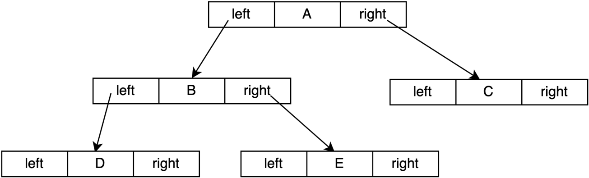
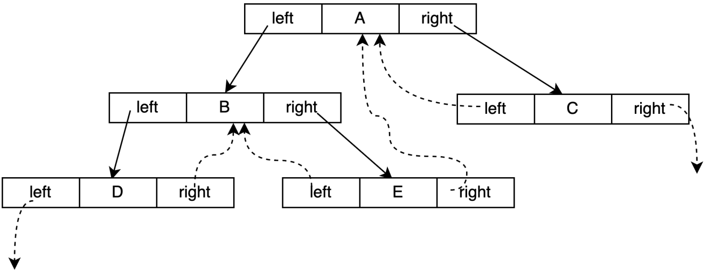

# 线索二叉树
## 背景介绍
- 现有一棵结点数目为`n`的二叉树，采用二叉链表的形式存储，对于每个结点均有指向左右孩子的两个指针域。

- 结点为`n`的二叉树一共有`n-1`条有效分支路径。那么，则二叉链表中存在`2n -（n-1）= n+1`个空指针域. 那么，这些空指针造成了空间浪费。

| ##container## |
|:--:|
||

- 当对二叉树进行中序遍历时可以得到二叉树的中序序列。

- 如图所示二叉树的中序遍历结果为DBEAC，可以得知A的前驱结点为E，后继结点为C。

- 这种关系的获得是建立在完成遍历后得到的，那么可不可以在建立二叉树时就记录下前驱后继的关系呢，那么在后续寻找前驱结点和后继结点时将大大提升效率。

## 线索化
- 将某结点的空指针域指向该结点的前驱后继，定义规则如下:
    - 若结点的左子树为空，则该结点的左孩子指针指向其前驱结点。
    - 若结点的右子树为空，则该结点的右孩子指针指向其后继结点。
- 这种指向前驱和后继的指针称为线索。将一棵普通二叉树以某种次序遍历，并添加线索的过程称为线索化。

| ##container## |
|:--:|
||

## 线索化的改进

- 可以将一棵二叉树线索化为一棵线索二叉树，那么新的问题产生了。我们如何区分一个结点的`lchild`指针是指向左孩子还是前驱结点呢?
- 为了解决这一问题，现需要添加标志位ltag，rtag。并定义规则如下:
    - `ltag`为0时，指向左孩子，为1时指向前驱
    - `rtag`为0时，指向右孩子，为1时指向后继

| ##container## |
|:--:|
||

- 在遍历过程中，如果当前结点没有左孩子，需要将该结点的`lchild`指针指向遍历过程中的前一个结点，所以在遍历过程中，设置一个指针（名为`pre`），时刻指向当前访问结点的前一个结点。

## 线索化的优势
递归遍历需要使用系统栈，非递归遍历需要使用内存中的空间来帮助遍历，而线索化之后就不需要这些辅助了，直接可以像遍历数组一样遍历。

线索二叉树核心目的在于加快查找结点的前驱和后继的速度。如果不使用线索的话，当查找一个结点的前驱与后继需要从根节点开始遍历，当然，如果二叉树数据量较小时，可能线索化之后作用不大，但是当数据量很大时，线索化所带来的性能提升就会比较明显。

## 代码实现
```C
#include <stdio.h>
#include <stdlib.h>

typedef char Element;

typedef struct _B_tree_node
{
    Element data;
    /* 线索化特有的, 为 0 则是普通的数, 为 1 则是线索化的了*/
    _Bool Ltag;
    _Bool Rtag;
    struct _B_tree_node *left;  // 左子树
    struct _B_tree_node *right; // 右子树
} BTreeNode;

typedef struct
{
    BTreeNode *root;            // 树根
    int nodeNum;                // 结点数
    int tag;                    // <状态>线索化特有的
    /*
     * 定义:
     * 0 为未线索化
     * 1 为前序线索化
     * 2 为中序线索化
     * 3 为后序线索化
     * 4 为层序线索化
     * */
} BTree;

BTree *binaryTreeInitialization(BTreeNode *root);   // 初始化树头
BTreeNode *addBinaryTreeNode(Element e);            // 创建一个节点
void linkNodeToBinaryTree(BTree *T, BTreeNode *F, BTreeNode *L, BTreeNode *R);    // 链接节点
void inOrderThreadedTree(BTree *T);     // 线索化   <递归>
void inOrderTree(BTree *T);             // 中序遍历 <线索化版本>
// void inOrderTree(BTree *T);          // 线索化后的遍历 (不需要递归)
void freeBinaryTree_TagTOW(BTree **T);  // 释放树   <线索化版本>

void text_01(void);                     // 用于测试代码

BTree *binaryTreeInitialization(BTreeNode *root)
{
    BTree *T = (BTree *)malloc(sizeof(BTree));
    if (!T)
    {
        printf("TREE_ROOT malloc Error!\n");
        return NULL;   
    }
    T->nodeNum = 0;
    T->root = root;
    T->tag = 0;
    return T;
}

BTreeNode *addBinaryTreeNode(Element e)
{
    BTreeNode *node = (BTreeNode *)malloc(sizeof(BTreeNode));
    if (!node)
    {
        printf("TREE_NODE malloc Error!\n");
        return NULL; 
    }
    node->data = e;
    node->Ltag = node->Rtag = 0;
    node->left = node->right = NULL;
    return node;
}

void linkNodeToBinaryTree(BTree *T, BTreeNode *F, BTreeNode *L, BTreeNode *R)
{
    if (!F)
    {
        printf("[Error]: Parent Is NULL!\n");
        return; 
    }
    if (L)
        ++T->nodeNum;
    if (R)
        ++T->nodeNum;
    F->left = L;
    F->right = R;
}

static BTreeNode *pre = NULL;   // 私域全局变量 - 小弟: 始终跟在node指针后面
static void zhong_xui_bian_li(BTreeNode *node)  // 私域函数 <链接属性为只能在本文件中 访问 || 使用 >
{
    if (node)
    {
        zhong_xui_bian_li(node->left);
        // 中节点
        if (!node->left)        // 指向前驱结点
        {
            node->left = pre;
            node->Ltag = 1;
        }
        if (pre && !pre->right) // 指向后继结点
        {
            pre->right = node;
            pre->Rtag = 1;
        }
        pre = node; // 注意! 这个是全局变量, 在下面这个语句的上下是有区别的!!!
                    // 在上是指中, 在下是去完才指中(慢了!)
        zhong_xui_bian_li(node->right);
    }
}

void inOrderThreadedTree(BTree *T)
{
    /* 这个是一个递归的中序线索化qwq */
    if (T->tag != 0)
    {
        printf("[Error]: The Tree 线索过了!\n");
        return; 
    }
    zhong_xui_bian_li(T->root);
    T->tag = 2;
}

void inOrderTree(BTree *T)
{   
    // 中序遍历
    if (T->tag != 2)
    {
        printf("[Error]: The Tree 中序线索了吗!\n");
        return; 
    }
    BTreeNode *node = T->root;
    while (node)
    {   
        // 1. 左
        while (!node->Ltag)
        {
            node = node->left;
        }
        printf("%c ", node->data);

        // 2. 回溯<到达中节点>输出再往右
        while (node->Rtag && node->right)
        {
            node = node->right;
            printf("%c ", node->data);
        }
        node = node->right;
    }
}

void freeBinaryTree_TagTOW(BTree **T)
{
    if ((*T)->tag != 2)
    {
        printf("[Error]: The Tree 中序线索了吗!\n");
        return; 
    }
    BTreeNode *node = (*T)->root;
    BTreeNode *Free_node = NULL;

    while (node)
    {   
        // 1. 左
        while (!node->Ltag)
        {
            node = node->left;
        }
        Free_node = node;

        // 2. 回溯<到达中节点>输出再往右
        while (node->Rtag && node->right)
        {
            node = node->right;
            free(Free_node);
            Free_node = node;
        }
        
        node = node->right;
        free(Free_node);
    }

    free(*T);
    *T = NULL;
}

/* 当然忽略 0 1, 采用后序遍历进行删除也可以 */
// static void freeTreeNode(ThreadedBTree *tree, TreeNode *node) {
//     if (node) {
//         if (node->lTag == 0)
//             freeTreeNode(tree, node->left);
//         if (node->rTag ==0)
//             freeTreeNode(tree, node->right);
//         free(node);
//         --tree->count;
//     }
// }

void text_01(void)
{
    // 创建结点
    BTreeNode *T_a = addBinaryTreeNode('A');
    BTreeNode *T_b = addBinaryTreeNode('B');
    BTreeNode *T_c = addBinaryTreeNode('C');
    BTreeNode *T_d = addBinaryTreeNode('D');
    BTreeNode *T_e = addBinaryTreeNode('E');

    BTree *T_head = binaryTreeInitialization(T_a);
    linkNodeToBinaryTree(T_head, T_a, T_b, T_c);
    linkNodeToBinaryTree(T_head, T_b, T_d, T_e);
    inOrderThreadedTree(T_head);
    inOrderTree(T_head);
    freeBinaryTree_TagTOW(&T_head);
}

int main(void)
{
    // 二叉链表 - 中序线索二叉树 - 实践版
    /*
     * 线索化
     * 将某结点的空指针域指向该结点的前驱后继，定义规则如下：
     *  若结点的左⼦树为空，则该结点的左孩⼦指针指向其前驱结点。
     *  若结点的右⼦树为空，则该结点的右孩⼦指针指向其后继结点。
     * 
     * ltag为0时，指向左孩⼦，为1时指向前驱
     * rtag为0时，指向右孩⼦，为1时指向后继
     * 
     * 遍历过程中，如果当前结点没有左孩⼦，需要将该结点的 lchild 指针指向遍历过程中的前⼀个结点，
     * 所以在遍历过程中，设置⼀个指针（名为 pre ），时刻指向当前访问结点的前⼀个结点。
    **/
    text_01();
    
    return 0;
}
```
