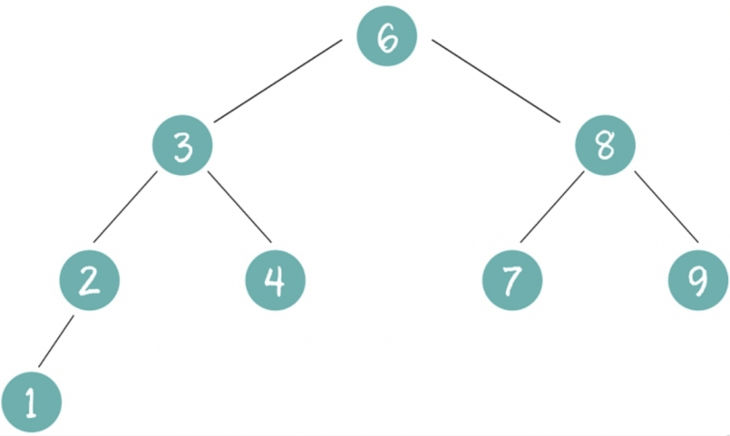

# 二叉搜索树 (BST)
**二叉搜索树(BinarySearchTree)**，也有称之为二叉排序树、二叉查找树

## 定义和性质
在二叉树的基础上，增加了几个规则约束：
- 如果他的左子树不空，则左子树上所有结点的值均小于它的根结点的值。
- 若它的右子树不空，则右子树上所有结点的值均大于它的根结点的值。
- 它的左、右树又分为二叉排序树。

| ##container## |
|:--:|
||

## 二叉搜索树的优势
- 二叉排序树的中序遍历，就是一个从小到大排好序的序列，但是查找时，完全没有必要先进行中序遍历生成一个有序的数组，再二分查找，直接根据二叉搜索树的约束直接操作。
- 查找时间最坏情况就是树的深度 $O(logN)$ (n为结点个数)
- 二叉搜索树的查找逻辑，可以写成递归的思路和非递归思路。

```C 二叉树查找伪代码
BiTree SearchBST(BiTree T,KeyType key) {
    //如果递归过程中 T 为空，则查找结果，返回NULL；或者查找成功，返回指向该关键字的指针
    if (!T || key == T->data) {
        return T;
    } else if (key < T->data) {
        //递归遍历其左孩⼦
        return SearchBST(T->lchild, key);
    } else {
        //递归遍历其右孩⼦
        return SearchBST(T->rchild, key);
    }
}
```

## 二叉搜索树的实现
### 二叉搜索树的插入操作
- 算法思想
    - 插入的新节点都是在叶节点位置
    - 寻找插入节点的位置，建立父节点和新节点的左右关系
    - 是一种递归思想
- 递归思路
    - 涉及到前后节点，子问题就是返回新节点，上一个状态就是左子树还是右子树来接收
- 递归核心代码

### 查找某一节点下的最大或最小值
- 算法思想
    - 比当前节点小的值，一定放在他的左子树上，那么一直往左查找最左边的节点，就是最小值
    - 比当前节点大的值，一定放在他的右子树上，那么一直往右查找最左边的节点，就是最大值
- 算法实现

### 二叉搜索树的删除操作
- 算法分析
    - 删除结点的三种可能性:
        - 删除叶子(度为0)的结点
        - 删除度为1的结点
        - 删除度为2的结点 

#### 删除叶子结点
- 叶子结点从二叉搜索树中移除后，并不影响其他结点的排列规则，直接删除

#### 删除度为1的结点
- 该节点缺失左子树或右子树，当去掉这个节点后，剩余的左子树和右子树满足二叉搜索树的要求
- 矛盾在于删除的这个节点，属于父节点的左边还是右边，那么剩余的左子树或右子树仍然满足父节点的左右属性，接入这个父节点就可以

#### 删除度为2的结点
- 假设要删除的节点A，他的后结点，既有大于他的也有小于他的，现在就是要选择一个节点B，满足左边节点都比B小，右边节点都比B大。

- 其实就是中序遍历时，前一个节点或后一个节点来替换这个节点，然后删除前一个或后一个节点

#### 递归思路
- 二叉搜索树的删除情况
    - 删除叶子节点，直接删除
    - 删除的节点有一个叶子节点，用叫子节点来替代
    - 删除的节点有两个子节点
        - 找到前驱节点，复制前驱节点的值覆盖掉预备删除的节点，然后删除前驱节点
        - 找到后继节点，复制后继节点的值覆盖掉预备删除的节点，然后删除后继节点

## 代码实现
### 递归实现

```C
#include <stdio.h>
#include <stdlib.h>

typedef int Element;

typedef struct _B_tree_node
{
    Element data;
    struct _B_tree_node *left;  // 左子树
    struct _B_tree_node *right; // 右子树
} BTreeNode;

typedef struct
{
    BTreeNode *root;            // 树根
    int nodeNum;                // 结点数
} BTree;

BTree *binaryTreeInitialization(void);              // 初始化树头
BTreeNode *addBinaryTreeNode(Element e);            // 创建一个节点
void setBST(BTree *T, Element val);                 // 二叉搜索插入
void searchBSTNode(BTree *T, Element val);          // 二叉搜索树的查找
void delBSTNode(BTree *T, Element val);             // 删除二叉搜索树的某个结点
void putBST(BTree *T);                              // 中序遍历树
void freeBinaryTree(BTree **T);                     // 释放树   <后序遍历>

void text_01(void);                                 // 测试代码

BTreeNode *addBinaryTreeNode(Element e)
{
    BTreeNode *node = (BTreeNode *)malloc(sizeof(BTreeNode));
    if (!node)
    {
        printf("TREE_NODE malloc Error!\n");
        return NULL; 
    }
    node->data = e;
    node->left = node->right = NULL;
    return node;
}


BTree *binaryTreeInitialization(void)
{
    BTree *T = (BTree *)malloc(sizeof(BTree));
    if (!T)
    {
        printf("TREE_ROOT malloc Error!\n");
        return NULL;   
    }
    T->nodeNum = 0;
    T->root = NULL;
    return T;
}

static BTreeNode *_setBST(BTree *T, BTreeNode *N, Element val)
{
    if (N)
    {
        if (val > N->data)
        {
             N->right = _setBST(T, N->right, val);
        }
        else if (val < N->data)
        {
             N->left = _setBST(T, N->left, val);
        }
        return N;
    }
    else
    {
        BTreeNode *node = addBinaryTreeNode(val);
        ++T->nodeNum;
        return node;
    }
}

void setBST(BTree *T, Element val)
{
    T->root = _setBST(T, T->root, val);
}

static void _S_BSTNode(BTreeNode *node, Element val)
{
    if (node)
    {
        if (val < node->data)
        {
            _S_BSTNode(node->left, val);
        }
        else if (val > node->data)
        {
            _S_BSTNode(node->right, val);
        }
        else
        {
            printf("找到了! %d \n", node->data);
        }
    }
    else
    {
        printf("没有找到 val = %d\n", val);
    }
}

void searchBSTNode(BTree *T, Element val)
{
    if (T)
    {
        _S_BSTNode(T->root, val);
    }
}

static BTreeNode *_delBSTNode_S_mae(BTreeNode *node, Element val)
{
    // 中序遍历, 寻找值val 的前驱结点 (md 实际上只剩下左左左这个过程)
    while (node->right)
    {
        node = node->right;
    }

    return node;
}

static BTreeNode *_delBSTNode(BTreeNode *node, Element val)
{
    if (node)
    {
        if (val < node->data)
        {
            node->left = _delBSTNode(node->left, val);
        }
        else if (val > node->data)
        {
            node->right = _delBSTNode(node->right, val);
        }
        else
        {
            BTreeNode *tmp = NULL;
            // 找到删除的目标
            if (!node->left)
            {
                // 如果左子树为空, 那么度一点小于2
                // 不要理会度为0还是1, 因为如果是1, 那么我拿右子树为新结点, 那也没有问题
                // 为0就是拿NULL嘛~
                tmp = node->right;
                free(node);
                return tmp;
            }

            if (!node->right)
            {
                // 如果右子树为空, 那么度一点小于2
                // 同上
                tmp = node->left;
                free(node);
                return tmp;
            }
            // 度为 2 的情况
            // 查找前驱结点的
            tmp = _delBSTNode_S_mae(node->left, val);
            node->data = tmp->data;
            node->left = _delBSTNode(node->left, tmp->data);
        }
        return node;
    }
    else
    {
        printf("没有找到 %d 的啦!\n", val);
        return NULL;
    }
}

void delBSTNode(BTree *T, Element val)
{
    /*
    * 删除二叉搜索树的某个结点
    * 如果这个结点的度 为 0, 1 那么
    *   0 的随便拿个子树(NULL)作为新的
    *   1 则拿那个非空子树作为新的
    * 
    *   如果度为 2
    *       那么需要寻找它的 前驱结点 或者 后继结点 (可以通过中序遍历寻找与这个值相邻的即是啦)
    *       然后, 将 前驱/后继结点的值赋值给 度为二的结点(转移仇恨), 然后从度为2这个结点的 下一个结点
    *       即 前驱/后继(选择其一, 上同), 开始寻找这个值, 并且对寻找到的这个值的结点进行删除
    *       被找到的结点的度一定小于 2 !
    *           # 为何? 
    *               因为中序遍历的 前驱/后继 一定是因为度 < 2才出现的
    *               不然就一直 node = node.left 了(左左左...)
    * */
    // 本代码以前驱结点为例子
    T->root = _delBSTNode(T->root, val);
}

static void _putBST(BTreeNode *N)
{
    if (N)
    {
        _putBST(N->left);
        printf("%d\t", N->data);
        _putBST(N->right);
    }
}

void putBST(BTree *T)
{
    _putBST(T->root);
}

static void _freeBT(BTreeNode *node)
{
    if (node)
    {
        _freeBT(node->left);
        _freeBT(node->right);
        free(node);
    }
}

void freeBinaryTree(BTree **T)
{
    _freeBT((*T)->root);
    free(*T);
    *T = NULL;
}

void text_01(void)
{
    Element data[] = {1, 4, 3, 3, 2, 2, 3, 0, 7, 2, 1};
    int len = sizeof(data) / sizeof(data[0]);
    BTree *T_head = binaryTreeInitialization();
    for (int i = 0; i < len; ++i)
    {
        setBST(T_head, data[i]);
    }
    putBST(T_head);
    putchar('\n');
    searchBSTNode(T_head, 1);
    searchBSTNode(T_head, 999);
    delBSTNode(T_head, 1);
    delBSTNode(T_head, 64);
    putBST(T_head);
    putchar('\n');
    freeBinaryTree(&T_head);
}

int main(void)
{
    // 二叉搜索树(BST) 也称 二叉排序树 / 二叉查找树
    text_01();
    
    return 0;
}
```

### 非递归

```C
#include <stdio.h>
#include <stdlib.h>

typedef int Element;

typedef struct _B_tree_node
{
    Element data;
    struct _B_tree_node *left;  // 左子树
    struct _B_tree_node *right; // 右子树
} BTreeNode;

typedef struct
{
    BTreeNode *root;            // 树根
    int nodeNum;                // 结点数
} BTree;

BTree *binaryTreeInitialization(void);              // 初始化树头
BTreeNode *addBinaryTreeNode(Element e);            // 创建一个节点
void setBST(BTree *T, Element val);                 // 二叉搜索插入
void searchBSTNode(BTree *T, Element val);          // 二叉搜索树的查找
void delBSTNode(BTree *T, Element val);             // 删除二叉搜索树的某个结点
void putBST(BTree *T);                              // 中序遍历树
void freeBinaryTree(BTree **T);                     // 释放树   <后序遍历>

void text_01(void);                                 // 测试代码

BTreeNode *addBinaryTreeNode(Element e)
{
    BTreeNode *node = (BTreeNode *)malloc(sizeof(BTreeNode));
    if (!node)
    {
        printf("TREE_NODE malloc Error!\n");
        return NULL; 
    }
    node->data = e;
    node->left = node->right = NULL;
    return node;
}


BTree *binaryTreeInitialization(void)
{
    BTree *T = (BTree *)malloc(sizeof(BTree));
    if (!T)
    {
        printf("TREE_ROOT malloc Error!\n");
        return NULL;   
    }
    T->nodeNum = 0;
    T->root = NULL;
    return T;
}

void setBST(BTree *T, Element val)
{
    // 插入
    BTreeNode *mae = NULL;
    BTreeNode *p = T->root;
    // 判断是否有根, 没有需要树头指向根
    if (!p)
    {
        T->root = addBinaryTreeNode(val);
        ++T->nodeNum;
        return;
    }

    while (p)
    {
        mae = p;
        if (p->data > val)
        {
            p = p->left;
        }
        else if (p->data < val)
        {
            p = p->right;
        }
        else
        {
            // 值不能相同
            return;
        }
    }

    ++T->nodeNum;
    if (mae->data > val)
    {
        mae->left = addBinaryTreeNode(val);
    }
    else
    {
        mae->right = addBinaryTreeNode(val);
    }
}

void searchBSTNode(BTree *T, Element val)
{
    // 查找
    BTreeNode *p = T->root;
    while (p)
    {
        if (p->data > val)
        {
            p = p->left;
        }
        else if (p->data < val)
        {
            p = p->right;
        }
        else
        {
            // 找到了
            printf("存在该结点: %d\n", val);
            return;
        }
    }

    printf("该结点不存在!\n");
}

static BTreeNode *_delBSTNode_S_mae(BTreeNode *node, Element val)
{
    // 中序遍历, 寻找值val 的前驱结点 (md 实际上只剩下左左左这个过程)
    while (node->right)
    {
        node = node->right;
    }

    return node;
}

void delBSTNode(BTree *T, Element val)
{
    /*
    * 删除二叉搜索树的某个结点
    * 如果这个结点的度 为 0, 1 那么
    *   0 的随便拿个子树(NULL)作为新的
    *   1 则拿那个非空子树作为新的
    * 
    *   如果度为 2
    *       那么需要寻找它的 前驱结点 或者 后继结点 (可以通过中序遍历寻找与这个值相邻的即是啦)
    *       然后, 将 前驱/后继结点的值赋值给 度为二的结点(转移仇恨), 然后从度为2这个结点的 下一个结点
    *       即 前驱/后继(选择其一, 上同), 开始寻找这个值, 并且对寻找到的这个值的结点进行删除
    *       被找到的结点的度一定小于 2 !
    *           # 为何? 
    *               因为中序遍历的 前驱/后继 一定是因为度 < 2才出现的
    *               不然就一直 node = node.left 了(左左左...)
    * */
    // 本代码以 根结点找后继, 非根结点找前驱 为例子
    BTreeNode *mae = NULL;
    BTreeNode *p = T->root;

    // 寻找
    while (p)
    {
        if (p->data > val)
        {
            mae = p;
            p = p->left;
        }
        else if (p->data < val)
        {
            mae = p;
            p = p->right;
        }
        else
        {
            break;
        }
    }

    if (p) // 为空表示找不到
    {
        if (mae)
        {
            // 判断待删除结点的度是多少
            if (p->left == NULL)
            {
                if (mae->left == p)
                {
                    mae->left = p->right;
                }
                else
                {
                    mae->right = p->right;
                }
                free(p);
            }
            else if (p->right == NULL)
            {
                if (mae->left == p)
                {
                    mae->left = p->left;
                }
                else
                {
                    mae->right = p->left;
                }
                free(p);
            }
            else    // 度为2
            {
                // 找前驱结点 (左子树就是了) 但是要小心: 前驱度为2的情况
                // 解决方法: 无限替换, 直到度不为2即可
                /*
                *               7   <-- 删除 结点"7"
                *              /
                *             5
                *            / \
                *           4   6
                * */
                // 需要是 p左, 然后右右右...
                BTreeNode *q = p->left;
                BTreeNode *tmp = NULL;
                while (q->right)
                {
                    tmp = q;
                    q = q->right;
                }

                p->data = q->data;
                tmp->right = q->left;
                free(q);
            }
        }
        else
        {   // 为根结点
            if (p->left == NULL)
            {
                T->root = p->right;
                free(p);
            }
            else if (p->right == NULL)
            {
                T->root = p->left;
                free(p);
            }
            else    // 度为2
            {
                // 找后继结点
                BTreeNode *q = p->right;
                while (q->left)
                {
                    mae = q;
                    q = q->left;
                }
                p->data = q->data;
                if (mae)
                {
                    mae->left = q->left;
                }
                else
                {
                    T->root->left = q->left;
                }
                free(q);
            }
        }
        --T->nodeNum;
    }
    else
    {
        printf("没有找到: %d\n", val);
    }
}

static void _putBST(BTreeNode *N)
{
    if (N)
    {
        _putBST(N->left);
        printf("%d\t", N->data);
        _putBST(N->right);
    }
}

void putBST(BTree *T)
{
    _putBST(T->root);
}

static void _freeBT(BTreeNode *node)
{
    if (node)
    {
        _freeBT(node->left);
        _freeBT(node->right);
        free(node);
    }
}

void freeBinaryTree(BTree **T)
{
    _freeBT((*T)->root);
    free(*T);
    *T = NULL;
}

void text_01(void)
{
    Element data[] = {1,2,3,4,100,150,50,40,60,55,65,54,57,65,61,67,78};
    int len = sizeof(data) / sizeof(data[0]);
    BTree *T_head = binaryTreeInitialization();
    for (int i = 0; i < len; ++i)
    {
        setBST(T_head, data[i]);
    }
    putBST(T_head);
    putchar('\n');
    searchBSTNode(T_head, 3);
    searchBSTNode(T_head, 999);
    delBSTNode(T_head, 7);
    delBSTNode(T_head, 100);
    putBST(T_head);
    putchar('\n');
    freeBinaryTree(&T_head);
}

int main(void)
{
    // 二叉搜索树(BST) 也称 二叉排序树 / 二叉查找树
    // 非递归的实现
    text_01();
    
    return 0;
}
```
