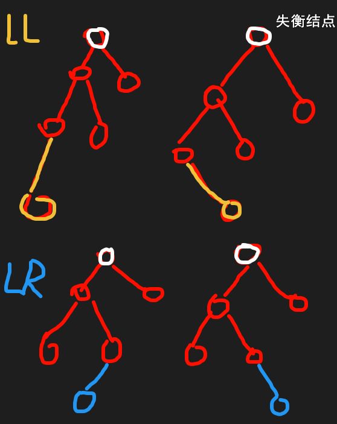
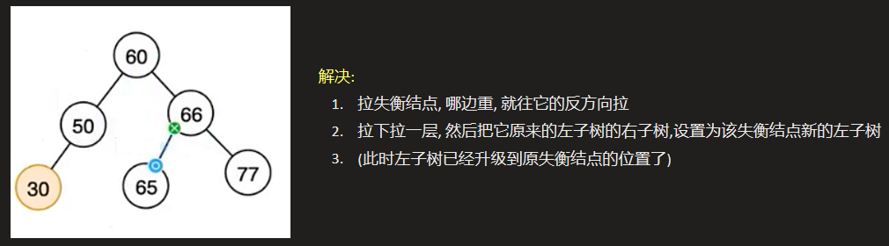
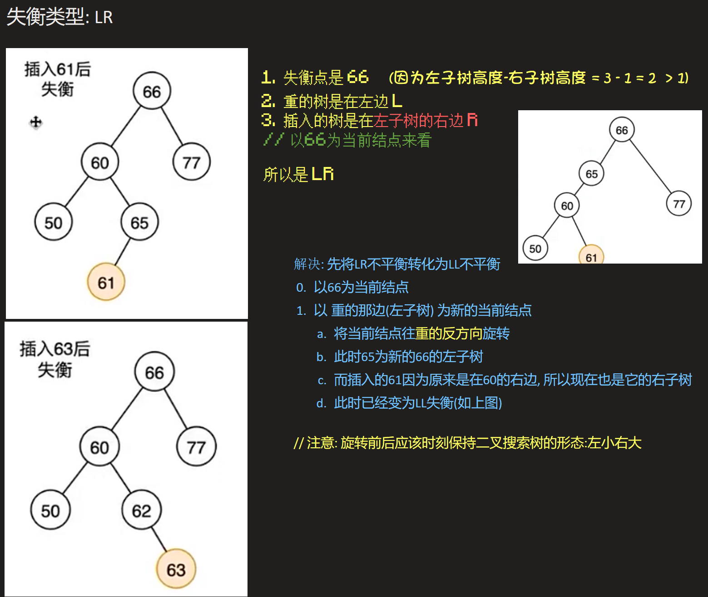

# 二叉平衡树 (AVL树)
> <span style="margin-left: 30px;">AVL树是最早被发明的自平衡二叉查找树。在AVL树中，任一节点对应的两棵子树的最大高度差的绝对值为1，因此它也被称为高度平衡树。AVL树是根据它的发明者G.M.Adelson-Velsky和E.M.Landis命名的。
> 
> <span style="margin-left: 30px;">查找、插入和删除在平均和最坏情况下的时间复杂度都是 $O(logn)$。增加和删除元素的操作则可能需要借由一次或多次树旋转，以实现树的重新平衡。

## 二叉搜索树的问题

- 二叉搜索树的查找效率取决于树的高度，因此保持树的高度最小，即可保证树的查找效率。
- 二叉搜索树会退化成单链表，搜索效率降低为O(n)

> <span style="margin-left: 30px;">二叉搜索树一定程度上可以提高搜索效率，但是当原序列有序时，例如序列A={1，2，3，4, 5，6}，构造二叉搜索树如图。依据此序列构造的二叉搜索树为右斜树，同时二叉树退化成单链表，搜索效率降低为 O(n)。
>
> <span style="margin-left: 30px;">二叉搜索树的查找效率取决于树的高度，因此保持树的高度最小，即可保证树的查找效率。

## 平衡因子
- `左子树与右子树的高度差`即为该节点的**平衡因子(BF,BalanceFactor)**
- `平衡二叉树`中**不存在**平衡因子大于1的节点。
- 在一棵平衡二叉树中，节点的平衡因子只能取`0`、`1`或者`-1`，分别对应着左右子树等高，左子树比较高，右子树比较高。

## AVL树失衡情况分析
### LL, LR, RR, RL
- `LL`：失衡节点左边高，新插入节点是在失衡节点左孩子的左边。直接对失衡节点进行右旋即可。
- `RR`：失衡节点右边高，新插入节点是在失衡节点右孩子的右边。直接对失衡节点进行左旋即可。
- `LR`：失衡节点左边高，新插入节点是在失衡节点左孩子的右边。先对左孩子进行左旋，再对失衡节点进行右旋。
- `RL`：失衡节点右边高，新插入节点是在失衡节点右孩子的左边。先对右孩子进行右旋，再对失衡节点进行左旋

即



解决失衡的办法: $旋转$





## AVL树的插入操作
- 算法思路
    - 先找到要插入的节点位置，插入新节点
    - 更新平衡因子，根据平衡因子小于-1和大于1的情况进行讨论

## 平衡二叉树的删除操作
- 算法思路
    - 依据二叉排序树的删除特点，依然按照3种条件进行删除，保证最后删除的都是叶子节点即可。
    - 节点删除后，依次对节点进行平衡因子检查，若发现某节点不平衡，按照平衡调节法进行调节。

## 代码实现

### 判断某个结点的高度
实现AVL树, 还需要实现平衡因子的判断: 即某结点的高度
```C
int getTreeNodeHeight(BTreeNode *T)
{
    // 返回以结点T为根的数的高度
    if (T)
    {
        int l = getTreeNodeHeight(T->left);
        int r = getTreeNodeHeight(T->right);
        return l > r ? l + 1 : r + 1;
    }
    else
    {
        return 0;
    }
}
```
### 递归实现

```C
#include <stdio.h>
#include <stdlib.h>

typedef int Element;
typedef struct _avlNode
{
    Element data;
    struct _avlNode *left;
    struct _avlNode *right;
    int height;                 // 结点高度
} AVLNode;

typedef struct 
{
    AVLNode *root;              // 树根
    int nodeNum;                // 结点数
} AVLTree;

AVLTree *initAVL(void);                 // 初始化并返回树头
AVLNode *initAVLNode(Element e);        // 返回带值的结点   问:树高计算?
AVLNode *leftRotate(AVLNode *x);        // 左旋
AVLNode *rightRotate(AVLNode *y);       // 右旋
void deleteAVLNode(AVLTree *T, Element e);   // 删除
void putBST(AVLTree *T);                // 中序遍历
void freeBinaryTree(AVLTree **T);       // 释放
AVLNode *addAVLNode(AVLTree *T, AVLNode *p , Element e);     // 插入结点
int getNodeHeight(AVLNode *p);
int numMax(int a, int b);

AVLTree *initAVL(void)
{
    AVLTree *T = (AVLTree *)malloc(sizeof(AVLTree));
    if (!T)
    {
        printf("malloc error!\n");
        return NULL;
    }
    T->root = NULL;
    T->nodeNum = 0;
    return T;
}

AVLNode *initAVLNode(Element e)
{
    AVLNode *p = (AVLNode *)malloc(sizeof(AVLNode));
    if (!p)
    {
        printf("malloc error!\n");
        return NULL;
    }
    p->data = e;
    p->height = 1; // ?
    p->left = NULL;
    p->right = NULL;
    return p;
}

int getNodeHeight(AVLNode *p)
{
    if (p)
        return p->height;
    return 0;
}

int numMax(int a, int b)
{
    return a > b ? a : b;
}

/* 左旋操作
*     px                            px
*     |                             |
*     x                             y
*    / \            --->           / \
*   lx  y                         x   ry
*      / \                       / \
*     ly  ry                    lx  ly
* 记得要更新高度: x, y的
* 其他结点不用更新, 因为没有接入新的结点, 所以相对高度没有变化
* */
AVLNode *leftRotate(AVLNode *x)
{
    AVLNode *y = x->right;
    x->right = y->left;
    y->left = x;
    // 小心不能为空
    // 注意顺序: 如果先更新y再更新x, 会因为y判断左子树(x)而x又没有更新, 导致数据不正确!
    x->height = numMax(getNodeHeight(x->left) + 1, getNodeHeight(x->right) + 1);
    y->height = numMax(getNodeHeight(y->left) + 1, getNodeHeight(y->right) + 1);
    return y;
}

/* 右旋操作
*       py                          py
*       |                           |
*       y                           x
*      / \          --->           / \
*     x   ry                      lx  y
*    / \                             / \
*   lx rx                           rx  ry
* */
AVLNode *rightRotate(AVLNode *y)
{
    AVLNode *x = y->left;
    y->left = x->right;
    x->right = y;
    y->height = numMax(getNodeHeight(y->left) + 1, getNodeHeight(y->right) + 1);
    x->height = numMax(getNodeHeight(x->left) + 1, getNodeHeight(x->right) + 1);
    return x;
}

AVLNode *addAVLNode(AVLTree *T, AVLNode *p, Element e)
{
    // 1. 找位置
    if (p)
    {
        if (p->data > e)
        {
            p->left = addAVLNode(T, p->left, e);
            p->height = numMax(p->height, getNodeHeight(p->left) + 1);
        }
        else if (p->data < e)
        {
            p->right = addAVLNode(T, p->right, e);
            p->height = numMax(p->height, getNodeHeight(p->right) + 1);
        }
        else
        {
            // 不接受相同的数字
            printf("[错误]: 插入的数字: %d 已存在!\n", e);
            return p;   // 注意! 递归返回赋值要返回自己!, 不是返回NULL!
        }
    }
    else
    {
        ++T->nodeNum;
        return initAVLNode(e);
    }
    
    // 3. 计算 平衡因子 == 左子树高 - 右子树高, 并且进行旋转
    if (getNodeHeight(p->left) - getNodeHeight(p->right) > 1)
    {
        // L?
        if (getNodeHeight(p->left->left) < getNodeHeight(p->left->right))   // LR (左子树左旋)
            p->left = leftRotate(p->left);
        // 右旋    
        return rightRotate(p);
    }
    else if (getNodeHeight(p->left) - getNodeHeight(p->right) < -1)
    {
        // R?
        if (getNodeHeight(p->right->left) > getNodeHeight(p->right->right))   // RL (右子树右旋)
            p->right = rightRotate(p->right);
        return leftRotate(p);
    }
    return p;
}

static AVLNode *_deleteAVLNode(AVLTree *T, AVLNode *node, Element e)
{
    // 0. 退出条件: <查找元素不在AVLTree>
    if (!node)
        return node;

    // 1. 递归查找
    if (node->data > e)
    {
        node->left = _deleteAVLNode(T, node->left, e);
    }
    else if (node->data < e)
    {
        node->right = _deleteAVLNode(T, node->right, e);
    }
    else
    {
        // 2. 找到该元素, 对其进行删除
        // AVL树的删除与普通平衡二叉树的无异
        if (!node->left || !node->right)
        {
            // 度为 0 或者 1
            AVLNode *tmp = node->left ? node->left : node->right;
            free(node);
            --T->nodeNum;
            return tmp;     // 可以直接不需要调整高度/旋转是因为下面本身(原本)就已经是平衡的!
        }
        else
        {
            // 度为2, 转移矛盾
            // 找后继结点
            AVLNode *tmp = node->right;
            AVLNode *p = NULL;
            while (tmp->left)
            {
                p = tmp;
                tmp = tmp->left;
            }
            AVLNode *cecha = tmp->right;
            node->data = cecha->data;
            if (p)
            {
                p->left = cecha;
                free(tmp);
                --T->nodeNum;
                return node;
            }
            else
            {
                node->right = tmp->right;
                free(tmp);
                --T->nodeNum;
                return node;
            }
        }
    }
    // 3. 更新当前结点的高度
    node->height = numMax(getNodeHeight(node->left), getNodeHeight(node->right));

    // 4. 对 归的平衡因子进行判断, 旋转
    if (getNodeHeight(node->left) - getNodeHeight(node->right) > 1)
    {
        // L?
        if (getNodeHeight(node->left->left) < getNodeHeight(node->left->right))   // LR (左子树左旋)
            node->left = leftRotate(node->left);
        // 右旋    
        return rightRotate(node);
    }
    else if (getNodeHeight(node->left) - getNodeHeight(node->right) < -1)
    {
        // R?
        if (getNodeHeight(node->right->left) > getNodeHeight(node->right->right))   // RL (右子树右旋)
            node->right = rightRotate(node->right);
        return leftRotate(node);
    }
    return node;
}

void deleteAVLNode(AVLTree *T, Element e)
{
    T->root = _deleteAVLNode(T, T->root, e);
}

static void _putBST(AVLNode *N)
{
    if (N)
    {
        _putBST(N->left);
        printf("<%d (%d)>  ", N->data, N->height);
        _putBST(N->right);
    }
}

void putBST(AVLTree *T)
{
    printf("树的结点数为: %d\n\t", T->nodeNum);
    _putBST(T->root);
}

static void _freeBT(AVLNode *node)
{
    if (node)
    {
        _freeBT(node->left);
        _freeBT(node->right);
        free(node);
    }
}

void freeBinaryTree(AVLTree **T)
{
    _freeBT((*T)->root);
    free(*T);
    *T = NULL;
}

void text_01(void)
{
    Element data[] = {1,2,3,4,5,6,7,8,9,0};
    int len = sizeof(data) / sizeof(data[0]);
    AVLTree *T = initAVL();
    for (int i = 0; i < len; ++i)
    {
        T->root = addAVLNode(T, T->root, data[i]);
    }
    putBST(T);
    deleteAVLNode(T, 1);
    putchar('\n');
    putBST(T);
    deleteAVLNode(T, 5);
    putchar('\n');
    putBST(T);
    freeBinaryTree(&T);
}

int main()
{
    // 平衡二叉搜索树(AVL)
    text_01();
    
    return 0;
}
```