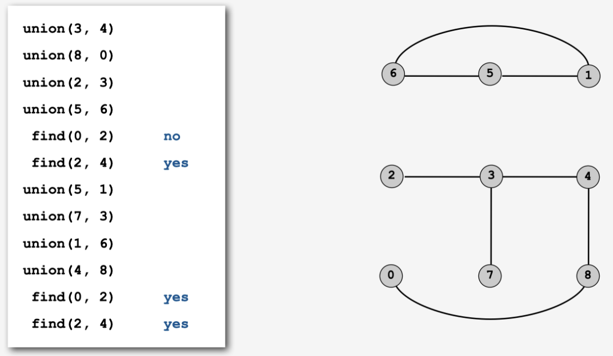

# 并查集
## 需求分析
假设现在有这样一个需求，如下图的每一个点代表一个村庄，每一条线就代表一条路，所以有些村庄之间有连接的路，有些村庄没有连接的路，但是有间接连接的路，根据上面的条件，能设计出一个数据结构，能快速执行下面2个操作：
1. 查询两个村庄之间是否有连接的路
2. 连接两个村庄

| ##container## |
|:--:|
||

如果你说用眼看啊, 那这个呢?

| ##container## |
|:--:|
||

## 并查集概念
**并查集(英文：Disjoint-set data structure，直译为不交集数据结构)** 是一种数据结构，用于处理一些**不交集(Disjoint sets，一系列没有重复元素的集合)** 的合并及查询问题。并查集支持如下操作:

- `查询(Find)`: 查询某个元素属于哪个集合，通常是返回集合内的一个“代表元素”。这个操作是为了判断两个元素是否在同一个集合之中。
- `合并(Union)`: 将两个集合合并为一个。
- `添加`: 添加一个新集合，其中有一个新元素。添加操作不如查询和合并操作重要，常常被忽略。

由于支持查询和合并这两种操作，并查集在英文中也被称为**联合-查找数据结构(Union-find data structure)** 或者**合并-查找集合(Merge-find set)**

| ##container## |
|:--:|
||

## 并查集的算法介绍
并查集有2种常见实现思路
- Quick Find
    - 查找效率: $O(1)$
    - 合并效率: $O(N)$
- Quick Union
    - 查找效率: $O(logN)$
    - 合并效率: $O(logN)$

## Quick Find的思路
- 核心是**将所有元素进行ID分组管理，每个元素对应一个ID号**
- 查找即`find`的时候，只需要返回这个元素对应的分组ID
- 合并即`Union(a,b)`时候，将是属于a分组的元素，**都改为b分组的ID号**

### QF代码实现

```C
#include <stdio.h>
#include <stdlib.h>

#define OK 1
#define ERROR 0
#define QF_MAX_SIZE 24

typedef char Element;

// 可以使用数组当然也可以使用链表
typedef struct QF
{
    Element data[QF_MAX_SIZE];      // 元素
    int old_index[QF_MAX_SIZE];     // 老大
    int len;                        // 有效长度
} QF;

QF *initQF(void);                           // 返回一个初始化后为空的 并查集
void addElement(QF *Q, Element e);          // 添加一个孤立的元素
Element QFFind(QF *Q, Element e);           // 查询 e 属于那个集合, 返回是 e 元素的老大
_Bool QFUnion(QF *Q, Element a, Element b); // 将两个元素合并到一个集合
void freeQF(QF *Q);                         // 免费它

void freeQF(QF *Q)
{
    free(Q);
}

_Bool QFUnion(QF *Q, Element a, Element b)
{
    // 将两个元素合并到一个集合
    // 定义 a --> b (将 a 合并到 b 中)
    int a_o_e = QFFind(Q, a), b_o_e = QFFind(Q, b);

    if (!a_o_e || !b_o_e)
        return ERROR;
    
    int b_o_e_index = -1;
    for (int i = 0; i < Q->len; ++i)
    {
        if (Q->data[i] == b_o_e)
        {
            b_o_e_index = i;
            break;
        }
    }

    for (int i = 0 ; i < Q->len; ++i)
    {
        if (Q->data[Q->old_index[i]] == a_o_e)
        {
            Q->old_index[i] = b_o_e_index;
        }
    }

    return OK;
}

Element QFFind(QF *Q, Element e)
{
    int i = 0;
    for (; i <= Q->len; ++i)
    {
        if (Q->data[i] == e)
            break;
    }

    if (i == Q->len)
        return ERROR;    // 找不到, 元素e

    return Q->data[Q->old_index[i]];
}

QF *initQF(void)
{
    QF *Q = (QF *)malloc(sizeof(QF));
    for (int i = 0; i < QF_MAX_SIZE; ++i)
    {
        Q->data[i] = '\0';
        Q->old_index[i] = i;
    }
    Q->len = 0;
    return Q;
}

void addElement(QF *Q, Element e)
{
    if (Q->len < QF_MAX_SIZE)
        Q->data[Q->len++] = e;
    else
        printf("add Error!\n");     // 可以写扩容 (懒)
    return;
}

void text(void)
{
    QF *QF = initQF();
    for (int i = 0; i < 6; ++i)
        addElement(QF, 'A' + i);
    
    QFUnion(QF, 'B', 'A');
    QFUnion(QF, 'C', 'A');

    QFUnion(QF, 'D', 'E');
    QFUnion(QF, 'F', 'E');

    printf("A 的老大是: %c\n", QFFind(QF, 'A'));
    printf("B 的老大是: %c\n", QFFind(QF, 'B'));
    printf("C 的老大是: %c\n", QFFind(QF, 'C'));
    printf("D 的老大是: %c\n", QFFind(QF, 'D'));
    printf("E 的老大是: %c\n", QFFind(QF, 'E'));
    printf("F 的老大是: %c\n", QFFind(QF, 'F'));

    freeQF(QF);
}

int main(void)
{
    // 1. Quick Find
    // 查找的时间复杂度 O(1)
    // 合并的时间复杂度 O(N)
    text();
    
    return 0;
}
```

## Quick Union的思路
将集合分为根结点和父节点的思想，所有节点保存他的父节点信息，当发现某个节点的父节点就是他自己的时候，这个节点就是根结点
- 查找即`find`操作就是找到这个元素的根结点，**判断两个元素的根结点是不是一致**，来判断是否连通。
- 合并即`Union(a，b)`的时候，不是合并a和b，而是**将a的根结点和b的根节点进行合并**

### 基于size的算法优化
在Union过程中，可能会出现不平衡的情况，甚至退化成为链表，Union(1,3)


- 将元素少的树, 嫁接到元素多的树.

### 基于rank的算法改进


- 矮的树, 嫁接到高的树

### 路径压缩
**核心思想**
- 在`find`时, 使路径上的所有节点都指向根节点, 从而降低树的高度
    - 指向父节点的父节点
    - 都指向根结点

使得第二次`find`时的时间复杂度为 $O(1)$.

### QU 代码实现

```C
#include <stdio.h>
#include <stdlib.h>

#define ARR_LEN_MAX 12
typedef char Element;

// 本质是树的线性存储结构
typedef struct
{
    char *data;         // 数据
    int len;            // 最大长度
    int n;              // 当前元素个数 (可以用作索引)
    int *father_index;  // 父索引
    int *node_size;     // 以当前结点为根的总的结点数, 默认是 1 (独立个体)
} QU;

QU *initQU(void);                           // 初始化并查集
void addQUNode(QU *Q, Element e);           // 在QU中创建孤立的结点
_Bool QUUnion(QU *Q, Element a, Element b); // 将两个元素所在集合合并到一个集合
_Bool QUFind(QU *Q, Element a, Element b);  // 查询 a与b 元素是不是在同一个集合
// 释放呢

QU *initQU(void)
{
    QU *Q = (QU *)malloc(sizeof(QU));
    if (Q == NULL)
    {
        printf("ERROR - malloc - QU\n");
        return NULL;
    }

    Q->len = ARR_LEN_MAX;
    Q->n = 0;

    Q->data = (Element *)malloc(sizeof(Element) * ARR_LEN_MAX);
    if (Q->data == NULL)
    {
        printf("ERROR - malloc - data\n");
        return NULL;
    }

    Q->father_index = (int *)malloc(sizeof(int) * ARR_LEN_MAX);
    if (Q->father_index == NULL)
    {
        printf("ERROR - malloc - f_i\n");
        return NULL;
    }

    Q->node_size = (int *)malloc(sizeof(int) * ARR_LEN_MAX);
    if (Q->node_size == NULL)
    {
        printf("ERROR - malloc - n_s\n");
        return NULL;
    }

    return Q;
}

static _Bool addLenQU(QU *Q)
{
    // 加长数组
    Element *data_a = Q->data;
    int *index_a = Q->father_index;
    int *size_a = Q->node_size;

    Q->len += ARR_LEN_MAX;  // 这个可以自己改 (*2什么的)

    Q->data = (Element *)malloc(sizeof(Element) * Q->len);
    if (Q->data == NULL)
    {
        printf("ERROR - malloc - data\n");
        return 1;
    }

    Q->father_index = (int *)malloc(sizeof(int) * Q->len);
    if (Q->father_index == NULL)
    {
        printf("ERROR - malloc - f_i\n");
        return 1;
    }

    Q->node_size = (int *)malloc(sizeof(int) * Q->len);
    if (Q->node_size == NULL)
    {
        printf("ERROR - malloc - n_s\n");
        return 1;
    }

    for (int i = 0; i < Q->n; ++i)
    {
        Q->data[i] = data_a[i];
        Q->father_index[i] = index_a[i];
        Q->node_size[i] = size_a[i];
    }

    free(data_a);
    free(index_a);
    free(size_a);

    return 0;
}

void addQUNode(QU *Q, Element e)
{
    if (Q->n == Q->len)
    {
        // 长度过长, 需要修改
        if (addLenQU(Q))
        {
            printf("ERROR: Add Node\n");
            return;
        }
    }

    Q->data[Q->n] = e;
    Q->father_index[Q->n] = Q->n;
    Q->node_size[Q->n] = 1;
    ++Q->n;
}

#define _LujinYaSuo_    // 删除或者注释这里就可以使用下面 普通算法
#ifndef _LujinYaSuo_
// 普通算法 (size)
static int getQUNodeIndex(QU *Q, Element e)
{
    // 寻找结点e的祖先结点的索引, 如果找不到则返回-1
    for (int i = 0; i < Q->n; ++i)
    {
        if (Q->data[i] == e)
        {
            while (Q->father_index[i] != i)
            {
                i = Q->father_index[i];
            }

            return i;
        }
    }
    return -1;
}
#else
// 路径压缩: 使得树的高度变小, 如果在合并集合的时候, 单独来进行压缩, 显然也是会浪费一些时间的
// 但如果在查找祖先结点的路上, 顺便把结点给存储起来, 等找到了祖先结点,, 再依次将他们的父结点改为祖先结点不就完美了吗
// 那么下次就可以生效了!
// 当然, 路上遇到的结点也是需要存储起来的, 毕竟找祖先的路「一方通行」
// 所以, 可以使用一个东西存储, 因为对顺序没有什么要求, 所以理论上任何东西都可以拿来存储, 栈/队列...
// 这里使用栈来进行演示

// 因为这个栈是专门为了这个函数定制的, 所以可以不用那么标准(?), 这个就是临时栈
// (由于路上会遇到多少个结点我们不知道, 所以使用链式结构存储)

typedef struct _QU_stack_node
{
    int data_index;         // 记录结点的索引就可以了 (我的意思是, 当前的i, 然后是父亲结点i...)
    struct _QU_stack_node *next;
} _QU_stack_node;

typedef struct
{
    _QU_stack_node *top;    // NULL 就是ok了嘛
} _QU_stack;

static _Bool _pushQUS(_QU_stack *S, int index)
{
    _QU_stack_node *node = (_QU_stack_node *)malloc(sizeof(_QU_stack_node));
    if (!node)
    {
        printf("ERROR - malloc - Snode\n");
        return 0;
    }
    node->data_index = index;
    node->next = S->top;
    S->top = node;
    return 1;
}

static _Bool _popQUS(_QU_stack *S, int *index)
{
    if (S->top == NULL)
        return 0;
    _QU_stack_node *tmp = S->top;
    *index = tmp->data_index;
    S->top = tmp->next;
    free(tmp);
    return 1;
}

static int getQUNodeIndex(QU *Q, Element e)
{
    // 创建一个临时栈用于路径压缩
    _QU_stack *S = (_QU_stack *)malloc(sizeof(_QU_stack));
    if (S == NULL)
    {
        printf("ERROR - malloc - S\n");
        return -1;
    }
    S->top = NULL;

    // 寻找结点e的祖先结点的索引, 如果找不到则返回-1
    for (int i = 0; i < Q->n; ++i)
    {
        if (Q->data[i] == e)
        {
            while (Q->father_index[i] != i)
            {
                _pushQUS(S, i);
                i = Q->father_index[i];
            }

            int index;
            while (_popQUS(S, &index))
            {
                Q->father_index[index] = i;
            }

            return i;
        }
    }
    return -1;
}

#endif

_Bool QUFind(QU *Q, Element a, Element b)
{
    int aRoot_index = getQUNodeIndex(Q, a);
    if (aRoot_index == -1)
    {
        printf("没有找到元素 %c 于并查集中!\n", a);
        return 0;
    }

    int bRoot_index = getQUNodeIndex(Q, b);
    if (bRoot_index == -1)
    {
        printf("没有找到元素 %c 于并查集中!\n", b);
        return 0;
    }

    return aRoot_index == bRoot_index;
}

_Bool QUUnion(QU *Q, Element a, Element b)
{
    // 返回值为 0 是执行失败, 反之成功 (1)
    // 合并元素: 选择将 a, b 中 结点数(node_size)最小的合并到结点数大的去, 如果结点数相同则 a-->b (a合并到b去)
    // 1. 找到a, b的索引
    int aRoot_index = getQUNodeIndex(Q, a);
    if (aRoot_index == -1)
    {
        printf("没有找到元素 %c 于并查集中!\n", a);
        return 0;
    }

    int bRoot_index = getQUNodeIndex(Q, b);
    if (bRoot_index == -1)
    {
        printf("没有找到元素 %c 于并查集中!\n", b);
        return 0;
    }

    if (aRoot_index == bRoot_index)
    {
        printf("不能合并一个相同的元素!\n");
        return 0;
    }

    if (Q->node_size[aRoot_index] > Q->father_index[bRoot_index])
    {
        // B --> A
        Q->father_index[bRoot_index] = aRoot_index;
        Q->node_size[aRoot_index] += Q->node_size[bRoot_index];
    }
    else
    {
        // A --> B
        Q->father_index[aRoot_index] = bRoot_index;
        Q->node_size[bRoot_index] += Q->node_size[aRoot_index];
    }
    return 1;
}

void text_01(void)
{
    QU *Q = initQU();
    for (int i = 0 ; i < 6; ++i)
    {
        addQUNode(Q, 'A' + i);
    }

    QUUnion(Q, 'A', 'B');
    QUUnion(Q, 'B', 'C');
    printf("A与B %s\n", QUFind(Q, 'A', 'B') ? "在同一个集合" : "不在同一个集合");
    printf("A与C %s\n", QUFind(Q, 'A', 'C') ? "在同一个集合" : "不在同一个集合");
    printf("B与C %s\n", QUFind(Q, 'B', 'C') ? "在同一个集合" : "不在同一个集合");
    printf("D与E %s\n", QUFind(Q, 'D', 'E') ? "在同一个集合" : "不在同一个集合");
    printf("A与D %s\n", QUFind(Q, 'A', 'D') ? "在同一个集合" : "不在同一个集合");
    putchar('\n');
    QUUnion(Q, 'D', 'E');
    printf("A与B %s\n", QUFind(Q, 'A', 'B') ? "在同一个集合" : "不在同一个集合");
    printf("A与C %s\n", QUFind(Q, 'A', 'C') ? "在同一个集合" : "不在同一个集合");
    printf("B与C %s\n", QUFind(Q, 'B', 'C') ? "在同一个集合" : "不在同一个集合");
    printf("D与E %s\n", QUFind(Q, 'D', 'E') ? "在同一个集合" : "不在同一个集合");
    printf("A与D %s\n", QUFind(Q, 'A', 'D') ? "在同一个集合" : "不在同一个集合");
}

int main(void)
{
    // 并查集的QU算法
    // 包含size计数法 与 路径压缩
    text_01();

    return 0;
}
```
