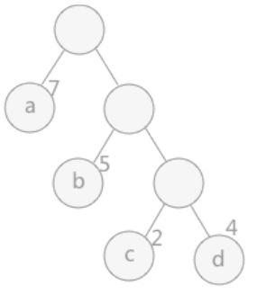
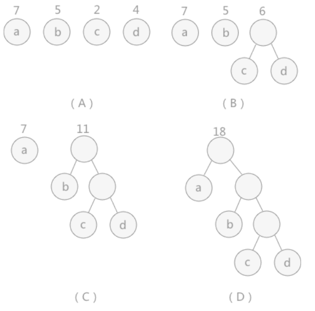

# 赫夫曼树
## 哈夫曼树相关的几个名词
- 路径
    - 在一棵树中，一个结点到另一个结点之间的通路，称为路径。
    - 从根结点到结点a之间的通路就是一条路径。
- 路径长度
    - 在一条路径中，每经过一个结点，路径长度都要加1。
    - 例如在一棵树中，规定根结点所在层数为1层，那么从根结点到第i层结点的路径长度为i－1。
    - *从根结点到结点c 的路径长度为 3。*
- 节点的权
    - 给每一个结点赋予一个新的数值，被称为这个结点的权。
    - *例如，结点 a 的权为 7，结点 b 的权为 5。*
- 节点的带权路径长度
    - 指的是从根结点到该结点之间的路径长度与该结点的权的乘积。
    - *例如，结点 b 的带权路径长度为 2 * 5 = 10。*
 
树的带权路径长度为树中所有叶子结点的带权路径长度之和。通常记作`WPL`.

*例如图中所示的这颗树的带权路径长度为:*

$WPL = 1 * 7 + 2 * 5 + 3 * (2 + 4)$




## 什么是赫夫曼树
当用n个结点（都做叶子结点且都有各自的权值）试图构建一棵树时，如果构建的这棵树的`带权路径长度`最小，称这棵树为`“最优二叉树”`，有时也叫`“赫夫曼树”`或者`“哈夫曼树”`。

## 构建赫夫曼树
对于给定的有各自权值的n个结点，构建哈夫曼树有一个行之有效的办法：
1. 在n个权值中选出两个最小的权值，对应的两个结点组成一个新的二叉树，且新二叉树的根结点的权值为左右孩子权值的和;
2. 在原有的 n 个权值中删除那两个最小的权值，同时将新的权值加入到 n-2 个权值的行列中，以此类推;
3. 重复1和2，直到所以的结点构建成了一棵二叉树为止，这棵树就是哈夫曼树。

| ##container## |
|:--:|
||

# 赫夫曼编码
## 什么是赫夫曼编码

在数据传送时，信息表现为0和1的二进制形式。为了提高传输的速度，可以采用变长的编码方式，寻找更优的编码方式。同时，必须要保证编码不存在二义性（任意字符编码都不是其它字符编码的前缀）。

哈夫曼编码就是符合上述要求的编码方式，采用自底向上的形式构造哈夫曼树。按照字符的概率分配码长，实现平均码长最短的编码。

## 赫夫曼编码为什么不会出现重复前缀?
- 例如: 有 100 绝对没有 1001 
    - 为什么呢? 因为如果有 100 说明 这个已经是叶结点了, 而1001的出现是需要 一个双亲结点 100 作为前置条件的, 而这个倆不会同时满足, 证毕

## 代码实现

```C
#include <stdio.h>
#include <stdlib.h>

#define OK 1        // 程序正常运行
#define ERROR 0     // 程序运行报错

typedef char ElemType;

typedef struct
{
    ElemType *data; // 数据
    int *weight;    // 权
    int *parent;    // 父结点 (线性存储需要的, 不然没有头指针, 找不到根开始, 需要一个条件 i == parent_index)
    int *left;      // 左子树
    int *right;     // 右子树
} HuffmanTree;

HuffmanTree *initHuffmanTree(int NodeNum);                                      // 创建一颗赫夫曼树
_Bool structureHuffmanTree(HuffmanTree *H, ElemType *e, int *w, int NodeNum);   // 构建赫夫曼树
char **getHuffmanCode(HuffmanTree *H, int NodeNum);                             // 生成赫夫曼编码
_Bool freeHuffmanTree(HuffmanTree **H);                                         // 释放赫夫曼树
_Bool freeHuffmanCode(char ***HC, int NodeNum);                                 // 释放赫夫曼编码

HuffmanTree *initHuffmanTree(int NodeNum)
{
    int n = 2 * NodeNum - 1;
    HuffmanTree *H = (HuffmanTree *)malloc(sizeof(HuffmanTree));
    if (!H)
    {
        MALLOC_ERROR:
        printf("Malloc ERROR!\n");
        return NULL;
    }

    H->data = (ElemType *)malloc(sizeof(ElemType) * n);
    if (!H->data)
        goto MALLOC_ERROR;
    
    H->parent = (int *)malloc(sizeof(int) * n);
    if (!H->parent)
        goto MALLOC_ERROR;

    H->left = (int *)malloc(sizeof(int) * n);
    if (!H->left)
        goto MALLOC_ERROR;

    H->right = (int *)malloc(sizeof(int) * n);
    if (!H->right)
        goto MALLOC_ERROR;
    
    H->weight = (int *)malloc(sizeof(int) * n);
    if (!H->weight)
        goto MALLOC_ERROR;
    
    return H;
}

// static void _bubble_sort(ElemType *e, int *w, int NodeNum)
// {
//     // 冒泡排序, 不要, 因为本来就是全遍历的...
//     _Bool tag = 1;
//     for (int i = 0; i < NodeNum; ++i)
//     {
//         tag = 1;
//         for (int j = i + 1; j < NodeNum; ++j)
//         {
//             if (w[i] > w[j])
//             {
//                 w[i] = w[i] ^ w[j];
//                 w[j] = w[i] ^ w[j];
//                 w[i] = w[i] ^ w[j];

//                 e[i] = e[i] ^ e[j];
//                 e[j] = e[i] ^ e[j];
//                 e[i] = e[i] ^ e[j];

//                 tag = 0;
//             }
//         }
//         if (tag)
//             break;
//     }
// }

_Bool structureHuffmanTree(HuffmanTree *H, ElemType *e, int *w, int NodeNum)
{
    // _bubble_sort(e, w, NodeNum);
    // for (int i = 0 ; i < NodeNum; ++i)
    //     printf("%d --- %c\n", w[i], e[i]);
    for (int i = 0; i < NodeNum; ++i)
    {
        H->data[i] = e[i];
        H->parent[i] = i;
        H->weight[i] = w[i];
        // -1 代表是叶结点
        H->left[i] = -1;
        H->right[i] = -1;
    }

    int n = 2 * NodeNum - 1;
    for (int i = NodeNum; i < n; ++i)
    {
        H->parent[i] = i;
    }

   
    
    int zero_node = n - NodeNum;
    int min_i = -1, min_2_i = -1;
    while (zero_node)
    {
        for (int i = 0; i < NodeNum; ++i) // 寻找两个权最小的结点
        {
            if (H->parent[i] == i && (min_i == -1 || H->weight[i] < H->weight[min_i]))
            {
                min_2_i = min_i;
                min_i = i;
            }

            if (H->parent[i] == i && (min_2_i == -1 || H->weight[i] < H->weight[min_2_i]) && min_i != i)
            {
                min_2_i = i;
            }
        }

        for (int i = NodeNum; i < n; ++i) // 寻找一个空的结点, 作为合并后的结点
        {
            // 找到合适人选
            ++NodeNum;
            H->parent[min_i] = i;
            H->parent[min_2_i] = i;
            H->data[i] = 1;
            H->left[i] = min_i;
            H->right[i] = min_2_i;
            H->weight[i] = H->weight[min_i] + H->weight[min_2_i];
            --zero_node;
            break;
        }
        min_i = -1, min_2_i = -1;
    }
}

char **getHuffmanCode(HuffmanTree *H, int NodeNum)
{
    char **str_arr = (char **)malloc(sizeof(char *) * NodeNum);
    for (int i = 0; i < NodeNum; ++i)
    {
        str_arr[i] = (char *)malloc(sizeof(char) * (NodeNum + 1));
        if (!str_arr[i])
        {
            printf("Malloc ERROR!\n");
            return NULL;
        }
    }

    // lz知道父节点az
    for (int i = 0; i < NodeNum; ++i)
    {
        int k = i, tmp = k;
        for (int j = 0; j < NodeNum + 1; ++j)
        {
            if (H->parent[k] != k)
            {
                tmp = k;
                k = H->parent[k];
                str_arr[i][j] = H->left[k] == tmp ? '0' : '1';
            }
            else
            {
                str_arr[i][j] = '\0';
            }
        }
    }

    return str_arr;
}

_Bool freeHuffmanTree(HuffmanTree **H)
{
    free(*H);
    *H = NULL;
    return OK;
}

_Bool freeHuffmanCode(char ***HC, int NodeNum)
{
    for (int i = 0; i < NodeNum; ++i)
    {
        free((*HC)[i]);
    }
    free(*HC);
    *HC = NULL;
    return 1;
}

void text(void);

void text(void)
{
    int w[] = {9,8,7,6,5,5};
    ElemType data[] = {'A', 'B', 'C', 'D', 'E', 'F'};
    int len = sizeof(w) / sizeof(w[0]);
    HuffmanTree *tree = initHuffmanTree(len);
    structureHuffmanTree(tree, data, w, len);

    // for (int i = 0; i < 2 * len - 1; ++i)
    //     printf("[%d] 结点%c: 父结点[%d], 左子树[%d], 右子树[%d], 权为[%d]\n", i, tree->data[i], tree->parent[i], tree->left[i], tree->right[i], tree->weight[i]);

    char **HuffmanCode = getHuffmanCode(tree, len);
    for (int i = 0; i < len; ++i)
        printf("%c --> %s\n", data[i], HuffmanCode[i]);

    freeHuffmanTree(&tree);
    freeHuffmanCode(&HuffmanCode, len);
}

int main(void)
{
    //  - 赫夫曼编码 - 线性存储 的 实现
    text();
    
    return 0;
}

```

