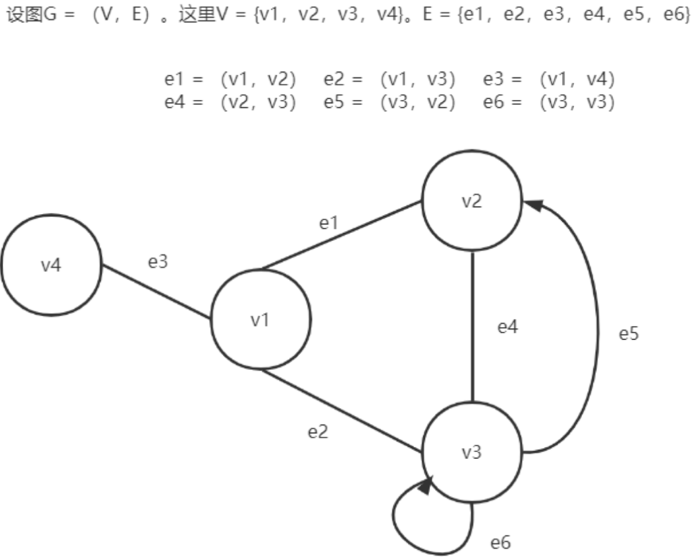
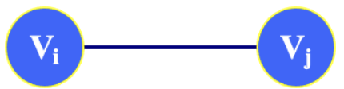
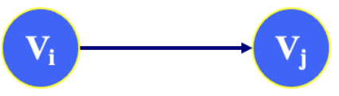
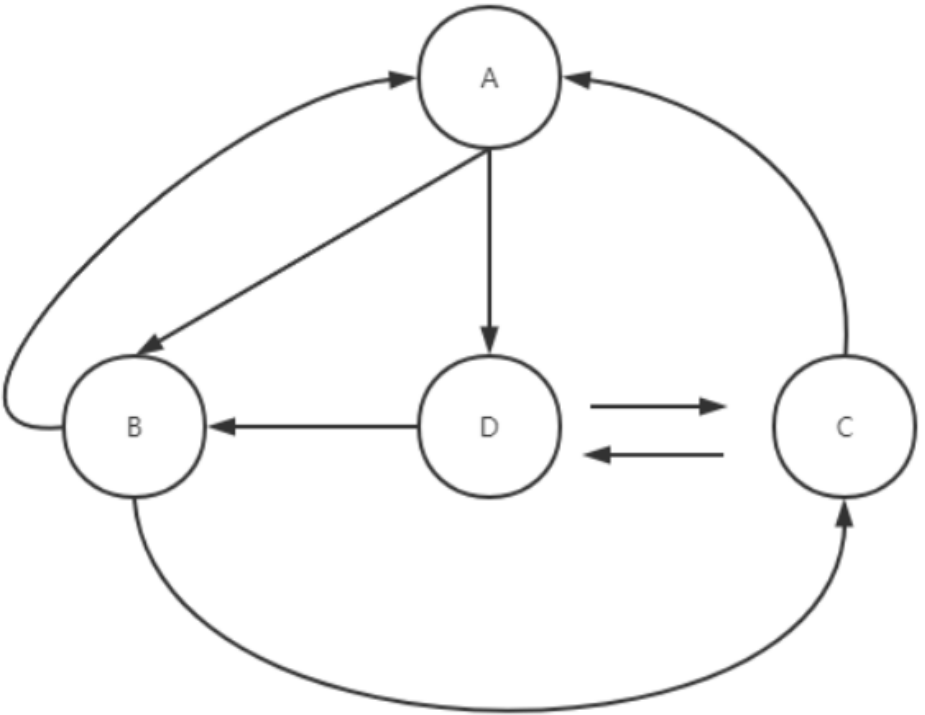
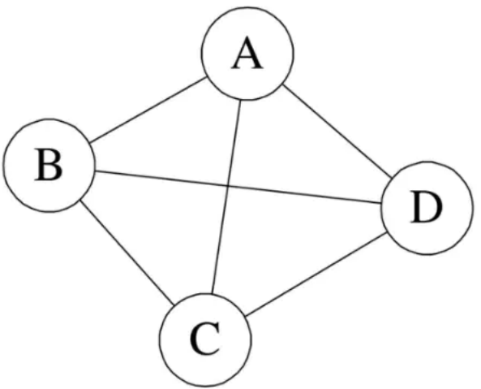
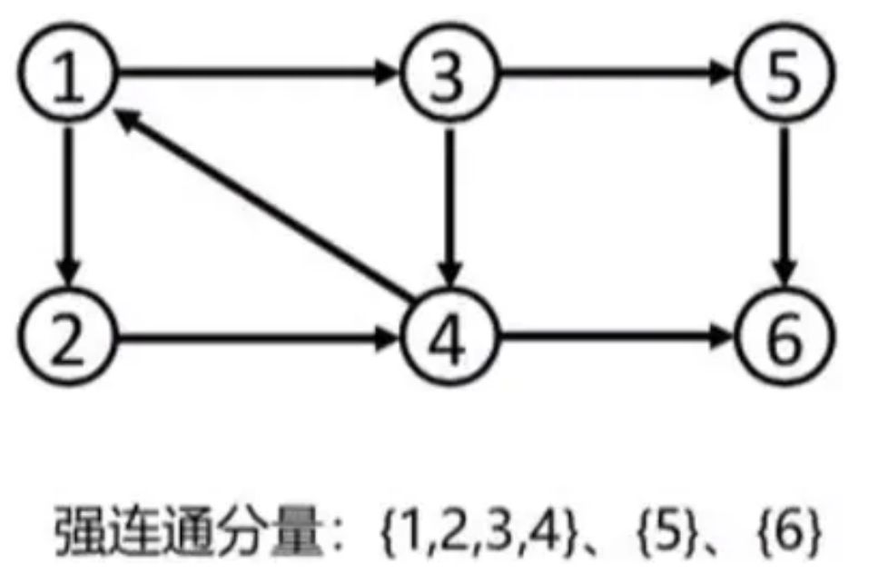

# 图的概念及重要术语
## 图的概述
- 在线性表中，每个元素之间只有一个直接前驱和一个直接后继。在树形结构中，数据元素之间是层次关系，并且每一层上的数据元素可能和下一层中多个元素相关，但只能和上一层中一个元素相关。但这仅仅都只是一对一，一对多的简单模型，如果要描述`多对多`的复杂关系就需要图数据结构了！

## 图的表示
- 图G是由两个集合`V`和`E`组成，记为`G = (V，E)`，其中`V`是顶点的有限非空集合，`E`是`V`中顶点偶对的有限集，这些顶点偶对称之为边（弧）。
- `V`是一个有限的的非空集合，我们也称之为顶点集合，其元素称之为顶点或者点。`v = {v1,v2,v3,v4,v5}`。我们用|V|来表示顶点的数目。
- `E`是由`V`中的点组成的无序对构成的集合的边集，其元素称之为边，且同一点对在E中可以重复出现多次（如果比标上边的重数的话，每一点对只要出现一次就行了）。用|E|表示边数。
- 图可以用图形表示，顶点集`V`中元素用平面上的一个黑点表示，边集E中元素用一条连接V中相应点对的任意形状的线表示。现实中，点集合代表事物或对象的全体，边集代表点之间的联系或者相互作用。即图是描述事物之间联系或相互作用状态的一个概念。

| ##container## |
|:--:|
||

## 图的基本术语
### 简单图
在图结构中，若不存在顶点到其自身的边，且同一条边不重复出现，则称这样的图为简单图。

### 无向图

在图G中，如果代表边的顶点偶对是无序的，则称G为无向图。

若关系 $<V_i，V_j>$ 无方向性，则称此时的图为无向图，关系用 $(V_i，V_j)$，称之为一条边(edge)

| ##container## |
|:--:|
||

### 有向图

设 $V_i$ 、 $V_j$, 为图中的两个顶点，若关系 $<V_i, V_j>$ 存在方向性，则称相应的图为有向图。

| ##container## |
|:--:|
||
|$V_i$ 为**弧尾**, $V_j$ 为**弧头**|

#### 有向无环图（Directed Acyclic Graph，简称DAG）
如果有一个有向图，从任一顶点出发无法经过若干条边回到该顶点，那么它就是一个有向无环图。

> - 在图G中，如果表示边的顶点偶对是有序的，则称G为有向图。一个图要么为无向图，要么为有向图。不存在部分有向或者部分无向的情况。
>
> - 混合图（Mixed Graph）表示的是边可能有向，可能无向。

## 完全图
如果图中的**每两个顶点之间，都存在一条边**，我们就称这个图为完全图。
- 完全有向图：有 $n(n-1)$ 条边
- 完全无向图：有 $n(n-1)/2$ 条边

## 端点, 邻接点
- 在一个无向图中，若存在一条边`(i，j)`，则称顶点`i`和顶点`j`为该边的两个端点。并称它们互为邻接点。

- 在一个有向图中，若存在一条边`<i，j>`，则称顶点`i`和顶点`j`为该边的两个端点。它们互为邻接点。此时，顶点`i`为起点。顶点`j`为终点。

## 顶点的度, 出度, 入度
顶点的度：在无向图中，顶点所具有的边的数目。

入度和出度：出度、入度使用于有向图。
- 出度 (Out-degree)
    - 一个顶点的出度为`x`，是指有`x`条边以该顶点为**起点**(以当前节点，出发的边的数量，就表
示出度值)
- 入度 (In-degree)
    - 一个顶点的入度为`x`，是指有`x`条边以该顶点为**终点**(以当前节点为重点的边，就表示入
度)

一个顶点的**入度和出度的和**称为该**顶点的度**。在一个具有`e`条边的图中, 度之和为`2e`。

## 子图
设有两个图`G=(V，E)`和`G'=(V'，E')`, 若:
- 顶点集的子集关系：`V'`是`V`的子集，即`V'⊆V`。
- 边集的子集和端点条件：`E'`是`E`的子集，且`G'`中的每条边的两个端点都在`V'`中，即对于每一条边`(u, v)∈E'`，必须有`u, v∈V'`。

则称`G'`是`G`的子图.

## 路径（顶点序列）和路径长度（边的数目）
- 在一个图`G=(V,E)`中，从顶点i到顶点j的一条路径是一个顶点序列 $(i,i_1,i_2，..,i_m,j)$ ，若此图G是无向图，则边 $(i, i_1),(i_1, i_2),..(i_m, j)$  属于 `E(G)`；若此图是有向图，则 $<i, i_1>,<i_1, i_2>，...<i_m,j>$ 属于`E(G)`。

- 路径长度是指一条路径上经过的边的数目。若一条路径上除开始点和结束点可以相同外，其余顶点均不相同，则称此路径为简单路径。

## 回路或环
- 如果一条路径上的开始点与结束点为同一个顶点，则称此路为回路或者为环。开始点和结束点相同的简单路径被称为简单回路或者简单环。

- 如果经过图中**各边**一次且恰好一次的环路，称之为欧拉环路，也就是其长度恰好等于图中边的总数，{C，A，B，A，D，C，D，B，C}就是一条欧拉环路。

- 如果是经过图中的**各顶点**一次且恰好一次的环路，称作哈密尔顿环路，其长度等于构成环路的边数。{C,A，D，B，C}就是一条哈密尔顿环路。

| ##container## |
|:--:|
||

## 连通、连通图和连通分量
- 如果顶点x和y之间存在可相互抵达的路径（直接或间接的路径），则称x和y是连通的。
- 如果图G中**任意两个顶点都连通**，则称G为**连通图**，否则称为非连通图。

| ##container## |
|:--:|
||

- 无向图G中的极大连通子图称为G的连通分量。

- 对于连通图只有一个极大连通子图，就是它本身（是唯一的）。

- 非连通图有多个极大连通子图。（非连通图的极大连通子图叫做连通分量，每个分量都是一个连通图）。之所以称为极大是因为如果此时加入一个不在图的点集中的点都会导致它不再连通。

- 至于极小连通子图，首先只有连通图才有极小连通子图这个概念。就像一个四边形，四个节点四条边，其实三条边就能连通了，所以四个节点三条边，就OK了，就是在能连通的前提下，把多余的边去掉。

## 强连通图和强连通分量
- 在有向图G中，若从顶点`i`到顶点`j`有路径，则称从顶点`i`到顶点`j`是连通的。

- 若图G中的任意两个顶点`i`和顶点`j`都连通，即从顶点`i`到顶点`j`和从顶点`j`到顶点`i`都存在路径，则称图G是强连通图。

- 有向图G中的**极大强连通子图**称为G的**强连通分量**。显然，强连通图只有一个强连通分量，即自身，非强连通图有多个强连通分量。

| ##container## |
|:--:|
||

## 稠密图、稀疏图
- 当一个图接近完全图的时候，称之为疏密图；相反，当一个图含有较少的边数，则称之为稀疏图。

- 一般对于这个边的个数，说法比较多，通常认为边小于 $nlogn$ (n是顶点的个数) 的图称之为稀疏图，反之称为稠密图。

## 权和网
图中的每一条边都可以附有一个对应的数，这种与边相关的数称为权。权可以表示从一个顶点到另一个顶点的距离或者花费的代价。边上带有权的图称为带权图，也称之为网。

也叫有权图 (Weighted Graph)

权值不仅仅可以是整数，还可以是小数，负数。根据情况而定，甚至还可以是自定义对象。

## 连通图的生成树
所谓连通图的生成树是一个极小的连通子图，它含有图中全部的n个结点，但是只有构成树的n-1条边。