# 图的存储
图在内存中存储方式有很多种，最经典的包括邻接矩阵、邻接表、逆邻接表和十字链表。
> 图的存储结构相比较线性表与树来说就复杂很多。
>
> 回顾一下上面提到的，对于线性表来说，是一对一的关系，所以用数组或者链表均可简单存放。树结构是一对多的关系，所以我们要将数组和链表的特性结合在一起才能更好的存放。

那么图，是多对多的情况，图上的任何一个顶点都可以被看作是第一个顶点，任一顶点的邻接点之间也不存在次序关系。

因为任意两个顶点之间都可能存在联系，因此无法以数据元素在内存中的物理位置来表示元素之间的关系（内存物理位置是线性的，图的元素关系是平面的）。

如果用多重链表来描述倒是可以做到，但是纯粹用多重链表导致的浪费是无法想像的（如果各个顶点的度数相差太大，就会造成巨大的浪费）。

## 邻接矩阵
图的邻接矩阵是用两个数组来表示，一个一维数组存储图中的顶点信息，一个二维数组（我们将这个数组称之为邻接矩阵）存储图中的边的信息。

### 无向图邻接矩阵
我们可以设置两个数组，顶点数组为vertex[4]={V0,V1,V2,V3}，边数组arc[4][4]为对称矩阵(0表示不存在顶点间的边，1表示顶点间存在边)。

#### 对称矩阵
所谓对称矩阵就是n阶矩阵的元素满足 $a[i][j]= a[j][i](0<=i,j<=n)$ 。即从矩阵的左上角到右下角的主对角线为轴，右上角的元与左下角相对应的元全都是相等的。

| ##container## |
|:--:|
|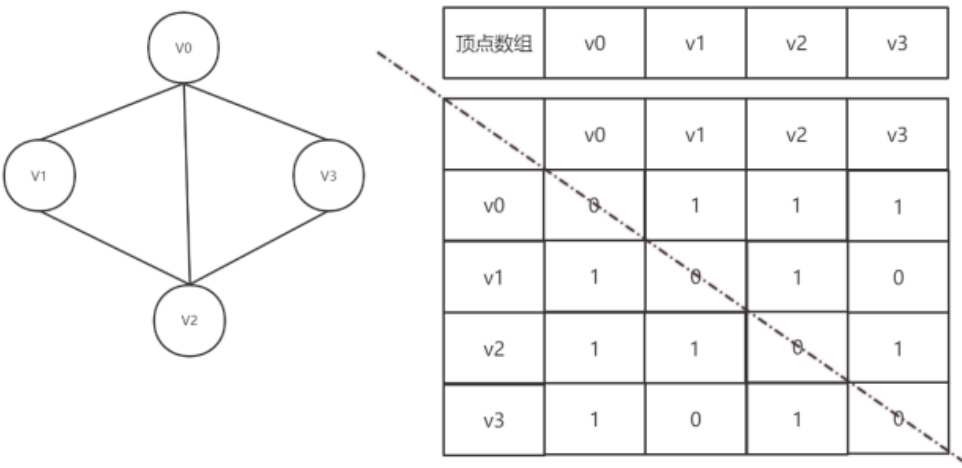|

有了这个二维数组组成的对称矩阵，我们就可以很容易地知道图中的信息：
- 判定任意两顶点是否有边无边；
- 可以轻松知道某个顶点的度，其实就是这个顶点Vi在邻接矩阵中第i行(或第i列)的元素之和；
- 求顶点Vi的所有邻接点就是将矩阵中第i行元素扫描一遍，arc[i][j]为1就是邻接点喽。

### 有向图邻接矩阵
无向图的边构成了一个对称矩阵，貌似浪费了一半的空间，那如果是有向图来存放，会不会把资源都利用得很好呢？

| ##container## |
|:--:|
|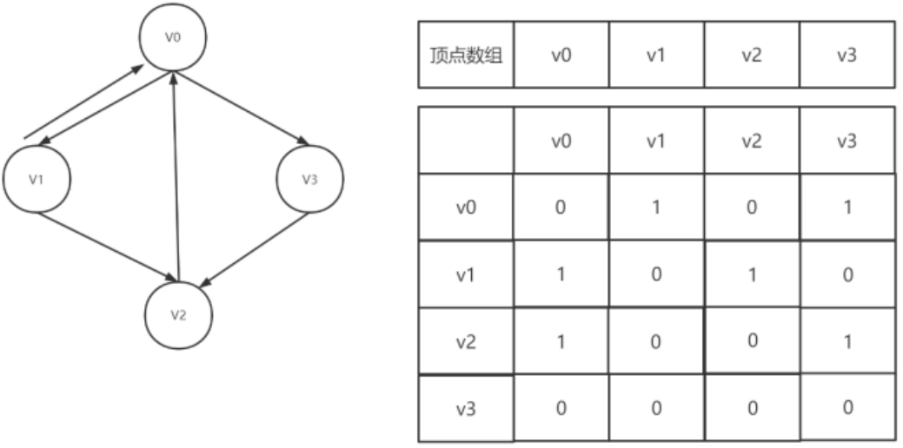|

可见顶点数组vertex[4]={V0,V1,V2,V3}，弧数组arc[4][4]也是一个矩阵，但因为是有向图，所以这个矩阵并不对称，例如由V0到V3有弧，得到arc[0][3]=1，而V3到v0没有弧，因此arc[3][0]=0。

另外有向图是有讲究的，要考虑入度和出度，顶点V1的入度为1，正好是第V1列的各数之和，顶点V1的出度为2，正好是第V1行的各数之和。

### 带权图的邻接矩阵
带权图中的每一条边上带有权值，邻接矩阵中的值则为权值，当两个顶点之间没有弧时，则用无穷大表示。

| ##container## |
|:--:|
|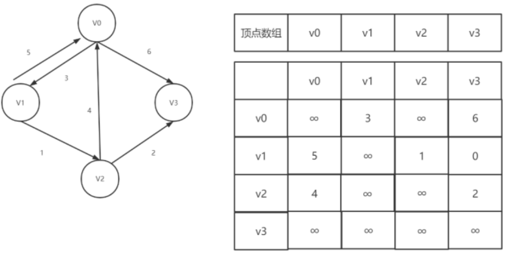|

这里“∞”表示一个计算机允许的、大于所有边上权值的值。

---

这个时候我们会发现一个问题，就是空间浪费问题。尤其是面对边数相对比较少的稀疏图来说，这种结构无疑是存在对存储空间的极大浪费。

因此我们可以考虑另外一种存储结构方式，例如把数组与链表结合在一起来存储，这种方式在图结构也适用，我们称为**邻接表(Adjacency List)**。

## 邻接表
邻接表的处理方法是这样：
- 图中顶点用一个一维数组存储，当然，顶点也可以用单链表来存储，不过数组可以较容易地读取顶点信息，更加方便。

- 图中每个顶点 $V_i$ 的所有邻接点构成一个线性表，由于邻接点的个数不确定，所以我们选择用单链表来存储。

| ##container## |
|:--:|
||

### 无向图邻接表

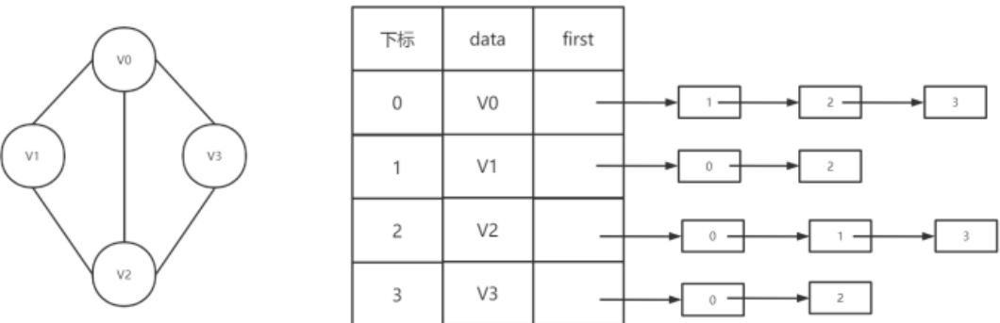

### 有向图邻接表
若是有向图，邻接表结构也是类似的，我们先来看下把顶点当弧尾建立的邻接表，这样很容易就可以得到**每个顶点的出度**:

| ##container## |
|:--:|
|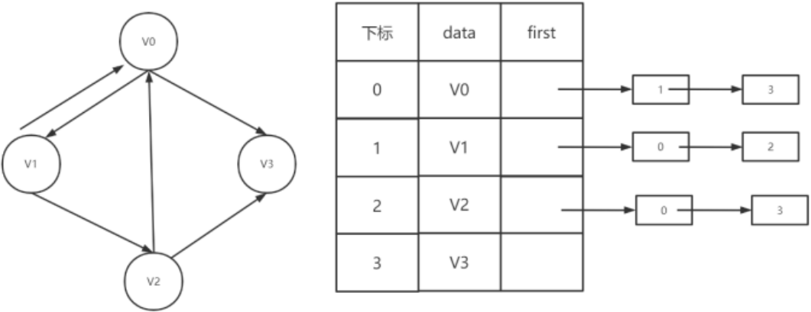|

但也有时为了<span style="color:red">便于确定顶点的入度或以顶点为弧头的弧</span>，我们可以建立一个<span style="color:red">有向图的逆邻接表</span>：


| ##container## |
|:--:|
|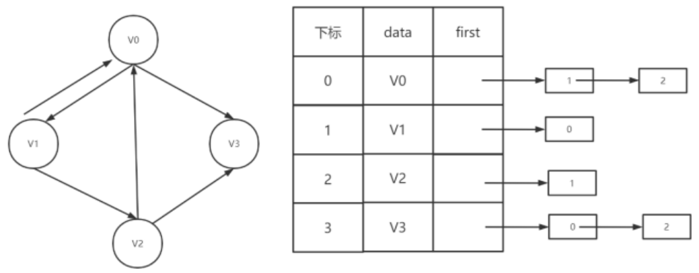|

### 带权网络的邻接表

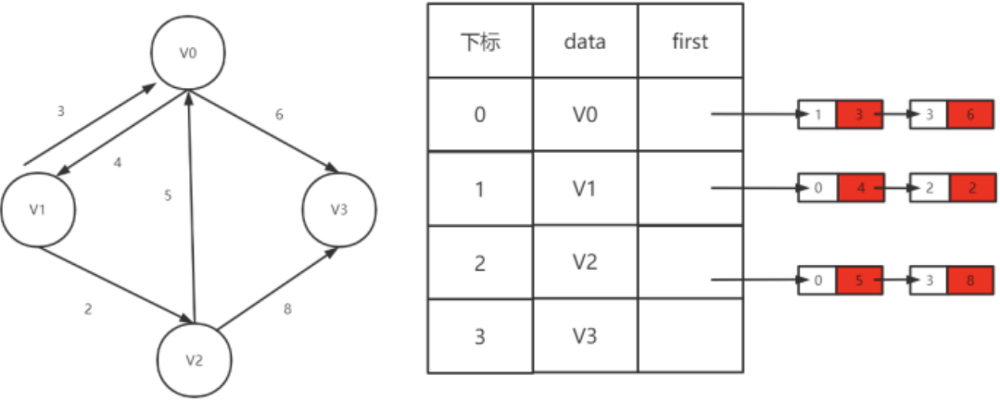

---

邻接表固然优秀，但也有不足，例如对有向图的处理上，有时候需要再建立一个逆邻接表~

这个时候，我们可以想一下，我们是否可以把邻接表和逆邻接表结合起来呢？

当然可以，这个就是十字链表。

## 十字链表表示
十字链表的好处就是因为把邻接表和逆邻接表整合在了一起，这样既容易找到以Vi为尾的弧，也容易找到以 $V_i$ 为头的弧，因而容易求得顶点的出度和入度。

十字链表除了结构复杂一点外，其实创建图算法的时间复杂度是和邻接表相同的，因此，在有向图的应用中，十字链表也是非常好的数据结构模型。

>| ##container## |
|:--:|
|数据结构|
||
||
|实例|
|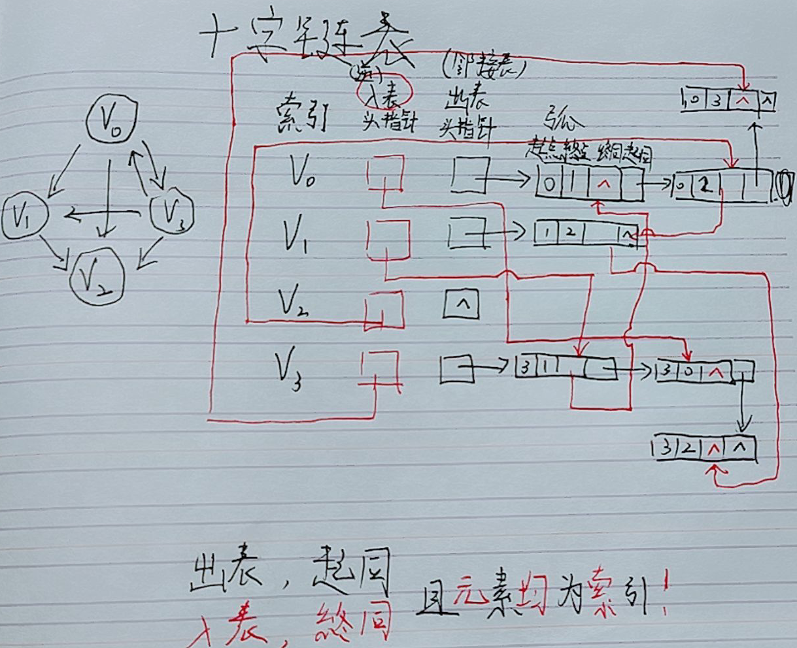|

这个时候，还有一个问题，如果使用邻接表存储结构，但是对边的操作比较频繁，怎么办？

如果我们在无向图的应用中，关注的重点是顶点的话，那么邻接表是不错的选择，但如果我们更关注的是边的操作，比如对已经访问过的边做标记，或者删除某一条边等操作，邻接表的确显得不那么方便了（下图中删除红色边）。

## 邻接多重表
邻接表对边的操作显然很不方便，因此，我们可以仿照十字链表的方式，对边表结构进行改装，重新定义的边表结构如下：

| ##container## |
|:--:|
||

其中`iVex`和`jVex`是与某条边依附的两个顶点在顶点表中的下标。

`iLink`指向依附顶点`iVex`的下一条边，`jLink`指向依附顶点`jVex`的下一条边。

| ##container## |
|:--:|
|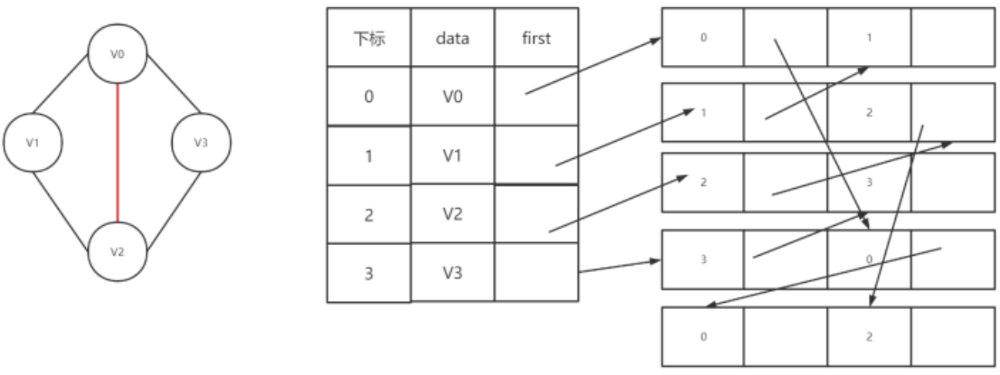|

## 边集数组
边集数组是由两个一维数组构成，一个是存储顶点的信息，另一个是存储边的信息，这个边数组每个数据元素由一条边的起点下标(begin)、终点下标(end)和权(weight)组成。

| ##container## |
|:--:|
|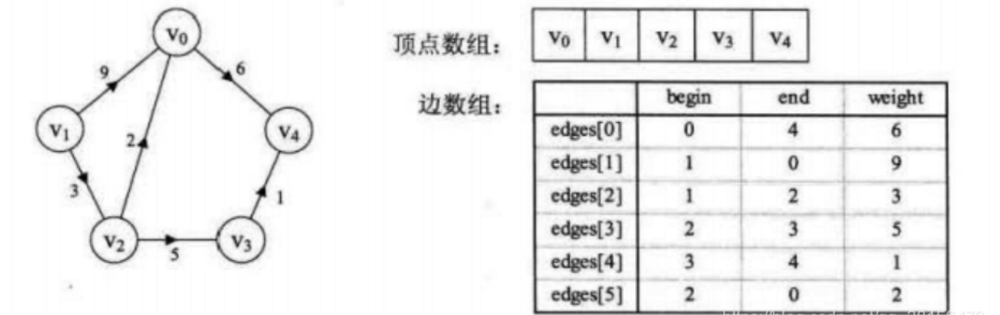|
性质：如上图所示，边集数组关注的是边的集合，在边集数组中要查找一个顶点的度需要扫描整个边数组，效率并不高。

因此它更适合对边依次进行处理的操作，而不适合对顶点相关的操作。

## 链式前向星

因为邻接表写得很麻烦, 但邻接矩阵又占用了 $O(N^2)$ 的空间复杂度, 对于 $N >= 10^5$ 的图, 一般是会爆内存的.

因此有了这个「链式前向星」的数据结构, 相当于 邻接表的静态链表的表示 (因为一般不会涉及删除(因为是竞赛中使用))

```C
#define MAX ((int)1e5 + 1)

typedef struct _edge
{
    int to;     // 连接的点
    int next;   // 下一个边
    int w;      // 权值
} Edge;

int n;              // 节点个数
Edge edge[MAX];     // edge[i] 存储第i条边的信息
int head[MAX];      // head[i] 存储以i为起点的所有边的起始位置
int edge_cnt = 1;   // edge_cnt 为 edge 的索引

void add_edge(int u, int v, int w)
{   // u --w--> v
    edge[edge_cnt].to = v;
    edge[edge_cnt].w = w;
    edge[edge_cnt].next = head[u];
    head[u] = edge_cnt++;
}

void print_edge(void)
{
    for (int i = 1; i <= n; ++i)
        for (int j = head[i]; j != 0; j = edge[j].next)
            printf("%d --%d--> %d\n", i, edge[j].w, edge[j].to);
}
```

| ##container## |
|:--:|
|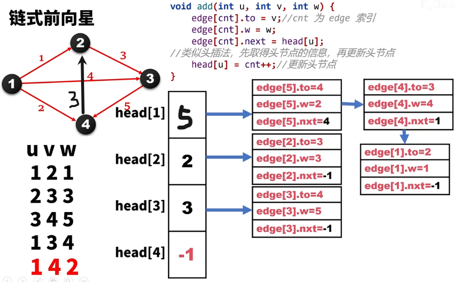|
