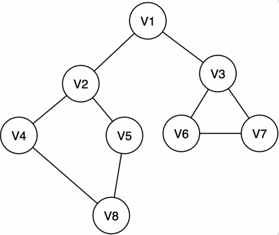

# 图的遍历
## 深度优先遍历 (DFS)
简称`深搜`或`DFS`

深度优先搜索的过程类似于树的先序遍历，首先从例子中体会深度优先搜索。例如上图是一个无向图，采用深度优先算法遍历这个图的过程为：

1. 首先任意找一个未被遍历过的顶点，例如从V1开始，由于V1率先访问过了，所以，需要标记V1的状态为访问过;

2. 然后遍历V1的邻接点，例如访问V2，并做标记，然后访问V2的邻接点，例如V4（做标记），然后V8，然后V5；

3. 当继续遍历V5的邻接点时，根据之前做的标记显示，所有邻接点都被访问过了。此时，从V5回退到V8，看V8 是否有未被访问过的邻接点，如果没有，继续回退到V4，V2，V1;

4. 通过查看V1，找到一个未被访问过的顶点V3，继续遍历，然后访问V3邻接点V6，然后V7；

5. 由于V7没有未被访问的邻接点，所有回退到V6，继续回退至V3，最后到达V1，发现没有未被访问的;

6. 最后一步需要判断是否所有顶点都被访问，如果还有没被访问的，以未被访问的顶点为第一个顶点，继续依照上边的方式进行遍历。

根据上边的过程，可以得到上图通过深度优先搜索获得的顶点的遍历次序为：
> V1 -> V2 -> V4 -> V8 -> V5 -> V3 -> V6 -> V7

所谓深度优先搜索，是从图中的一个顶点出发，每次遍历当前访问顶点的临界点，一直到访问的顶点没有未被访问过的临界点为止。

然后采用依次回退的方式，查看来的路上每一个顶点是否有其它未被访问的临界点。访问完成后，判断图中的顶点是否已经全部遍历完成，如果没有，以未访问的顶点为起始点，重复上述过程。

**深度优先搜索是一个不断回溯的过程**。

通常的, dfs需要用到栈, 代码上可以通过递归实现.

## 广度优先搜索
广度优先搜索类似于树的层次遍历。从图中的某一顶点出发，遍历每一个顶点时，依次遍历其所有的邻接点，然后再从这些邻接点出发，同样依次访问它们的邻接点。按照此过程，直到图中所有被访问过的顶点的邻接点都被访问到。

最后还需要做的操作就是查看图中是否存在尚未被访问的顶点，若有，则以该顶点为起始点，重复上述遍历的过程。

还拿上图的无向图为例，假设V1作为起始点，遍历其所有的邻接点V2 和V3，以V2为起始点，访问邻接点V4 和V5，以V3为起始点，访问邻接点V6、V7，以V4为起始点访问V8，以V5为起始点，由于V5 所有的起始点已经全部被访问，所有直接略过，V6 和V7也是如此。

以V1为起始点的遍历过程结束后，判断图中是否还有未被访问的点，由于图1中没有了，所以整个图遍历结束。遍历顶点的顺序为：

> V1 -> V2 -> v3 -> V4 -> V5 -> V6 -> V7 -> v8

通常的, bfs需要用到队列, 代码需要显式的使用一个队列.

## 代码

请见: [图的存储and遍历code](../004-图的存储and遍历code/index.md)