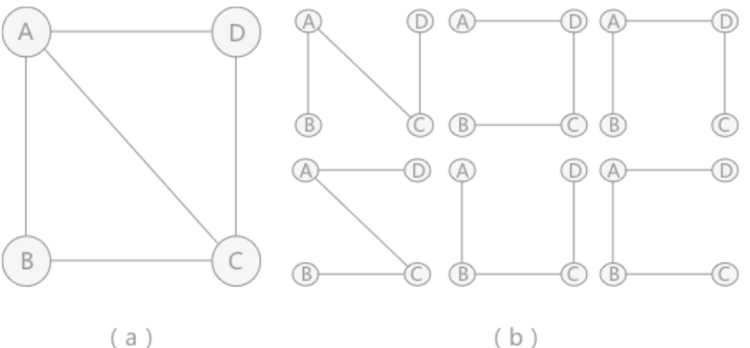
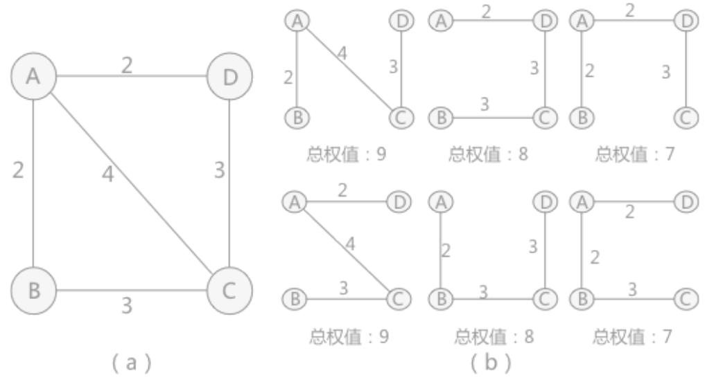

# 什么是最小生成树
## 生成树的定义
一个连通图的生成树是一个极小的连通子图，它包含图中全部的`n`个顶点，但只有构成一棵树的`n-1`条边。

| ##container## |
|:--:|
||

## 实际作用
连通图和它相对应的生成树，可以用于解决实际生活中的问题：假设A、B、C 和 D为 4 座城市，为了方便生产生活，要为这4 座城市建立通信。对于4个城市来讲，本着节约经费的原则，只需要建立3个通信线路即可，就如图（b）中的任意一种方式。

在具体选择采用（b）中哪一种方式时，需要综合考虑城市之间间隔的距离，建设通信线路的难度等各种因素，将这些因素综合起来用一个数值表示，当作这条线路的权值。

| ##container## |
|:--:|
||

综合所看，选择权值总和为7的两种方案最节约经费。

## 生成树的属性
- 一个连通图可以有多个生成树;
- 一个连通图的所有生成树都包含相同的顶点个数和边数;
- 生成树当中**不存在**环;
- 移除生成树中的任意一条边都会导致图的不连通，生成树的**边最少**特性;
- 在生成树中添加一条边会构成环。对于包含n个顶点的连通图，**生成树包含n个顶点和n-1条边**;
- 对于包含 $n$ 个顶点的无向完全图最多包含 $n^{n-2}$ 颗生成树。

## 最小生成树
所谓一个 带权图 的最小生成树，就是原图中边的权值最小的生成树，所谓最小是指边的权值之 和小于或者等于其它生成树的边的权值之和。

最小生成树的算法思想就是从顶点集或边集的角度来进行贪婪化。

### 相关算法
- Kruskal算法
    - [Kruskal算法](../002-Kruskal算法/index.md) 

- Prim算法
    - [Prim算法](../003-Prim算法/index.md)
 
## 总结
最小生成树的问题，简单得理解就是给定一个带有权值的连通图（连通网），从众多的生成树中筛选出权值总和最小的生成树，即为该图的最小生成树。

最经典的两个最小生成树算法：`Kruskal`算法与`Prim`算法。两者分别从不同的角度构造最小生成树，`Kruskal`算法从边的角度出发，使用贪心的方式选择出图中的最小生成树，而`Prim`算法从顶点的角度出发，逐步找各个顶点上最小权值的边来构建最小生成树的。

最小生成树问题应用广泛，最直接的应用就是网线架设（网络G表示n各城市之间的通信线路网线路(其中顶点表示城市，边表示两个城市之间的通信线路，边上的权值表示线路的长度或造价。可通过 求该网络的最小生成树达到求解通信线路或总代价最小的最佳方案。或者如果我们需要用最少的电线给所房子安装电路。）、道路铺设。还可以间接应用于纠错的LDPC码、Renyi 熵图像配准、学习用于实时脸部验证的显著特征、减少蛋白质氨基酸序列测序中的数据存储，在湍流（turbulent）中模拟粒子交互的局部性，以及用于以太网桥接的自动配置，以避免在网络中形成环路。除此之外，最小生成树在聚类算法中也是应用广泛。