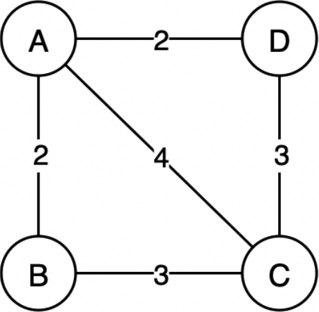
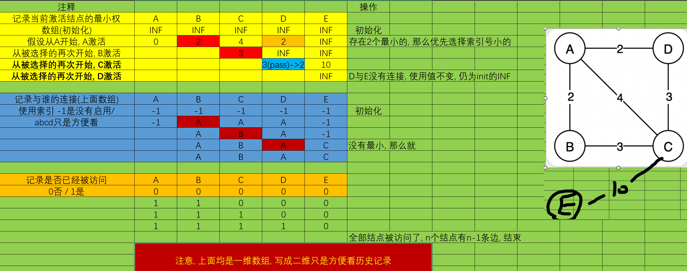

# Prim算法
## 算法描述
普里姆算法在找最小生成树时，将顶点分为两类:
- 一类是在查找的过程中已经包含在生成树中的顶点（假设为A类），
- 剩下的为另一类（假设为B类）。

1. 对于给定的连通网，**起始状态全部顶点都归为B类**。
2. 在找最小生成树时，选定任意一个顶点作为起始点，并将之从 B 类移至 A 类；
3. 然后找出 **B 类中到 A 类中的顶点之间权值最小的顶点**，将之从 B 类移至 A 类，
4. 如此重复，直到B类中没有顶点为止。所走过的顶点和边就是该连通图的最小生成树。

## 举例
### 文
| ##container## |
|:--:|
||

1. 假如从顶点A出发，顶点 B、C、D 到顶点 A 的权值分别为 2、4、2，所以，对于顶点 A 来说，顶点 B 和顶点 D 到 A 的权值最小，假设先找到的顶点 B;
2. 继续分析顶点 C 和 D，顶点 C 到 B 的权值为 3，到 A 的权值为 4；顶点 D 到 A 的权值为 2，到 B 的权值为无穷大（如果之间没有直接通路，设定权值为无穷大）。所以顶点 D 到 A 的权值最小;
3. 最后，只剩下顶点 C，到 A 的权值为 4，到 B 的权值和到 D 的权值一样大，为 3。所以该连通图有两个最小生成树;

### 图
具体到算法, 则需要记录:

```C
// 创建一个 Prim 算法 的记录数组
int *min_weight = (int *)malloc(sizeof(int) * G->add_index);    // 记录权的最小值
int *connect = (int *)malloc(sizeof(int) * G->add_index);       // 与谁的连接
_Bool *visit = (_Bool *)malloc(sizeof(_Bool) * G->add_index);   // 是否被访问
```

| ##container## |
|:--:|
||

## 代码
### 竞赛版

```C++
void prim_01(void)
{
    const int INF = 1e6;
    // 给出一个无向图，求出最小生成树，如果该图不连通，则输出 orz
    int n, m;
    scanf("%d %d", &n, &m);
    vector<vector<int>> G(n, vector<int>(n, INF));

    for (int i = 0, j, k, w; i < m; ++i) {
        scanf("%d %d %d", &j, &k, &w);
        // 考虑: 可能傻der会输入重复边
        G[j - 1][k - 1] = min(G[j - 1][k - 1], w);
        G[k - 1][j - 1] = min(G[k - 1][j - 1], w);
    }

    // prim 算法
    vector<bool> if_G(n, 1);    // 如果为 0 则是被选
    vector<int> G_fd(n, -1);    // 记录结点父节点 (不用输出该树, 则不需要这个)
    vector<int> G_Wmin(n, INF); // 记录最小权值

    G_Wmin[0] = 0;

    for (int i = 0, j, k; ;) {
        // 选择[0][j] 为第一个结点
        k = -1;
        for (j = 0; j < n; ++j) {
            // 遍历判断 没有被选 的 最小权值
            if (if_G[j]) {
                // 判断这个结点的权值是否比当前结点的小
                if (G[i][j] != INF && G[i][j] < G_Wmin[j]) {
                    // 有更小的权值: 更新一下
                    G_Wmin[j] = G[i][j];
                    G_fd[j] = i;
                }

                // 顺便在未被选的中选择最小的
                if (k == -1 || G_Wmin[k] > G_Wmin[j]) {
                    k = j;
                }
            }
        }

        if (k == -1)
            break;

        if_G[k] = 0;
        i = k;
    }

    int res = 0;
    for (auto& it : G_Wmin) {
        res += it;
    }

    if (res > INF)
        printf("orz");
    else
        printf("%d\n", res);
}
```


### 学习版
```C
#include <stdio.h>
#include <stdlib.h>

#define ARR_LEN_MAX 12
typedef int Element;

typedef struct
{
    char **show;    // 打印
    int **weight;   // 权
    int *tagArray;  // 用于遍历时候的标记
    int side_num;   // 边的个数
    int add_index;  // 结点数
    int number;     // 总大小
} AdjacencyMatrix;

AdjacencyMatrix *initAdjacencyMatrix(int n);                // 初始化AdjacencyMatrix
void addAdjacencyMatrix(AdjacencyMatrix *A, char *show);    // 添加元素
void connectAdjacencyMatrix(AdjacencyMatrix *A, char *show_1, char *show_2, int weight);    // 连接元素
void initTagArray(AdjacencyMatrix *A);                      // 重置遍历的标记数组 (-1)
void DFS(AdjacencyMatrix *A, int index);                    // 深度优先遍历
void BFS(AdjacencyMatrix *A);                               // 广度优先遍历
void freeAdjacencyMatrix(AdjacencyMatrix *A);               // 免费

AdjacencyMatrix *initAdjacencyMatrix(int n)
{
    AdjacencyMatrix *A = (AdjacencyMatrix *)malloc(sizeof(AdjacencyMatrix));
    if (!A)
    {
        MALLOC_ERROR:
        printf("Malloc ERROR!\n");
        return NULL;
    }

    A->show = (char **)malloc(sizeof(char *) * n);
    if (!A->show)
        goto MALLOC_ERROR;
    
    A->weight = (int **)malloc(sizeof(int *) * n);
    if (!A->weight)
        goto MALLOC_ERROR;

    for (int i = 0; i < n; ++i)
    {
        A->weight[i] = (int *)malloc(sizeof(int) * n);
        if (!A->weight[i])
            goto MALLOC_ERROR;
        for (int j = 0; j < n; ++j)
            A->weight[i][j] = 0;        // 这个是标记数_可改, 记0为未连接
    }
    
    A->side_num = 0;
    A->add_index = 0;
    A->number = n;
    A->tagArray = (int *)malloc(sizeof(int) * n);
    if (!A->tagArray)
        goto MALLOC_ERROR;
    initTagArray(A);
    return A;
}

void addAdjacencyMatrix(AdjacencyMatrix *A, char *show)
{
    if (A->add_index == A->number)
        return; // ERROR
    A->show[A->add_index++] = show;
}

void initTagArray(AdjacencyMatrix *A)
{
    for (int i = 0; i < A->number; ++i)
        A->tagArray[i] = -1;
}

void connectAdjacencyMatrix(AdjacencyMatrix *A, char *show_1, char *show_2, int weight)
{
    int s_1 = -1;
    for (int i = 0; i < A->number; ++i)
    {
        if (A->show[i] == show_1)
            s_1 = i;
    }

    if (s_1 == -1)
        return; // 找不到
    
    int s_2 = -1;
    for (int i = 0; i < A->number; ++i)
    {
        if (A->show[i] == show_2)
            s_2 = i;
    }

    if (s_2 == -1)
        return; // 找不到
    
    A->weight[s_1][s_2] = weight;
    A->weight[s_2][s_1] = weight;
    ++A->side_num;
}

// 注意遍历的是连通图
void DFS(AdjacencyMatrix *A, int index)
{
    printf("%s ", A->show[index]);
    A->tagArray[index] = 1;
    for (int i = 0; i < A->add_index; ++i)
    {
        if (A->weight[index][i] != 0 && A->tagArray[i] == -1)
        {
            DFS(A, i);
        }
    }
}

// 依旧是连通图
// 复杂过头了吧...
void BFS(AdjacencyMatrix *A)
{
    // 临时队列
    int queue[A->add_index];
    int q_h = 0;
    int q_t = 0;
    printf("%s ", A->show[0]);
    A->tagArray[0] = 1;
    for (int i = 0; i < A->add_index; ++i)
    {
        for (int j = 0; j < A->add_index; ++j)
        {
            if (A->weight[i][j] != 0 && A->tagArray[j] == -1)
            {
                A->tagArray[j] = 1;
                queue[q_t++] = j;
                q_t = q_t % A->add_index;
            }
        }

        if (q_h != q_t)
            break;
    }
    
    while (q_h != q_t)
    {
        printf("%s ", A->show[queue[q_h]]);
        for (int i = 0; i < A->add_index; ++i)
        {
            if (A->weight[queue[q_h]][i] != 0 && A->tagArray[i] == -1)
            {
                A->tagArray[q_t == 0 ? A->add_index - 1 : q_t - 1] = 1;
                queue[q_t++] = i;
                q_t = q_t % A->add_index;
            }
        }
        ++q_h;
        q_h = q_h % A->add_index;
    }
}

void freeAdjacencyMatrix(AdjacencyMatrix *A)
{
    free(A->show);
    for (int i = 0; i < A->number; ++i)
    {
        free(A->weight[i]);
    }
    free(A->weight);
    free(A->tagArray);
    free(A);
}

typedef struct
{
    int begin;  // 开始端点
    int end;    // 结束端点
    int weight; // 权
} Edge;

typedef struct
{
    int *vertex;    // 顶点集 (G的索引)
    Edge *side;     // 边集
    int side_len;   // 边集长度
    int vertex_len; // 顶点集长度
} EdgeSet;      // 边集数组

// prim
EdgeSet *prim(AdjacencyMatrix *G, int s_index);   // 给入一个 邻接矩阵, 返回一个最小生成树

// 获取权和
int getWeightSum(const AdjacencyMatrix *G,const EdgeSet *E)
{
    int res = 0;
    printf("最小生成树边为 %d\n", E->side_len);
    for (int i = 0; i < E->side_len; ++i)
    {
        //printf("%d--%d--%d\n", E->side[i].begin, E->side[i].weight, E->side[i].end);
        printf("%s--%d--%s\n", G->show[E->side[i].begin], E->side[i].weight, G->show[E->side[i].end]);
        res += E->side[i].weight;
    }
    return res;
}

EdgeSet *prim(AdjacencyMatrix *G, int s_index)
{
    // 创建 返回的边集数组
    EdgeSet *resES = (EdgeSet *)malloc(sizeof(EdgeSet));
    if (!resES)
    {
        ERROR:
        printf("malloc error!\n");
        return NULL;
    }

    resES->side = (Edge *)malloc(sizeof(Edge) * (G->add_index - 1));
    if (!resES->side)
        goto ERROR;

    resES->vertex = (int *)malloc(sizeof(int) * G->side_num);
    if (!resES->vertex)
        goto ERROR;


    for (int i = 0, k = 0; i < G->add_index; ++i)
    {
        resES->vertex[i] = i;
    }

    resES->side_len = G->add_index - 1; // dddd
    resES->vertex_len = G->add_index;

    // 创建一个 Prim 算法 的记录数组
    int *min_weight = (int *)malloc(sizeof(int) * G->add_index);    // 记录权的最小值
    int *connect = (int *)malloc(sizeof(int) * G->add_index);       // 与谁的连接
    _Bool *visit = (_Bool *)malloc(sizeof(_Bool) * G->add_index);   // 是否被访问
    
    for (int i = 0; i < G->add_index; ++i)
    {   // 初始化
        min_weight[i] = INT_MAX;
        connect[i] = -1;
        visit[i] = 0;
    }

    int index = s_index, // 当前访问的结点
        add_index = 0;   // 边集数组添加的索引
    visit[index] = 1;
    
    // 正式开始 在邻接矩阵里面访问就行了
    while (1)
    {
        int weight_min_node = -1;   // 记录当前循环中权值最小的结点的索引 下次循环就是
        for (int i = 0; i < G->add_index; ++i)
        {
            if (visit[i])   // 访问过的跳过
                continue;

            if (G->weight[index][i] != 0)   // 0是无效值
            {
                if (G->weight[index][i] < min_weight[i])
                {
                    min_weight[i] = G->weight[index][i];
                    connect[i] = index;
                }
            }

            if ((weight_min_node == -1 && min_weight[i] != INT_MAX) || min_weight[weight_min_node] > min_weight[i])
                weight_min_node = i;
        }

        if (weight_min_node == -1)
            break;

        visit[weight_min_node] = 1;
        resES->side[add_index].begin = weight_min_node;
        resES->side[add_index].end = connect[weight_min_node];
        resES->side[add_index].weight = min_weight[weight_min_node];
        ++add_index;
        // printf("index = %d ||%d -- %d -- %d\n", index ,weight_min_node, min_weight[weight_min_node], connect[weight_min_node]);
        index = weight_min_node;
    }

    // 释放资源
    free(connect);
    free(min_weight);
    free(visit);

    return resES;
}


void text(void)
{
    AdjacencyMatrix *A = initAdjacencyMatrix(6);
    addAdjacencyMatrix(A, "A");
    addAdjacencyMatrix(A, "B");
    addAdjacencyMatrix(A, "C");
    addAdjacencyMatrix(A, "D");
    addAdjacencyMatrix(A, "E");
    addAdjacencyMatrix(A, "F");
    connectAdjacencyMatrix(A, "E", "F", 5);
    connectAdjacencyMatrix(A, "E", "A", 2);
    connectAdjacencyMatrix(A, "E", "C", 4);
    connectAdjacencyMatrix(A, "E", "B", 10);
    connectAdjacencyMatrix(A, "A", "F", 3);
    connectAdjacencyMatrix(A, "D", "F", 4);
    connectAdjacencyMatrix(A, "D", "C", 1);
    connectAdjacencyMatrix(A, "B", "C", 3);
    connectAdjacencyMatrix(A, "B", "A", 7);

    DFS(A, 0);
    putchar('\n');
    EdgeSet *eSet = prim(A, 0);
    
    printf("\n最小生成树的权和是 %d\n", getWeightSum(A, eSet));

    // 释放pass
}

int main(void)
{
    //  - 最小生成树 - Prim算法 - 无向有权图
    // 寻找连通图的 权和最小 连通子图, 无环

    /*
    *   Prim 算法 -- 贪心算法
    * */
    text();
    getchar();
    return 0;
}
```
