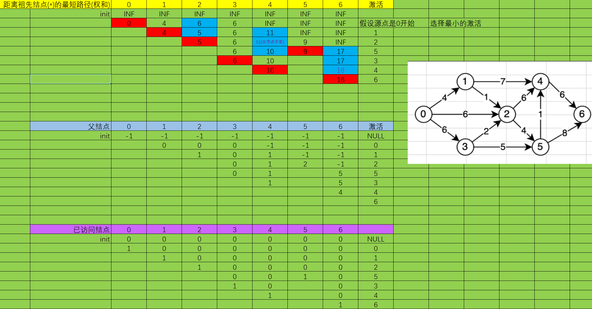
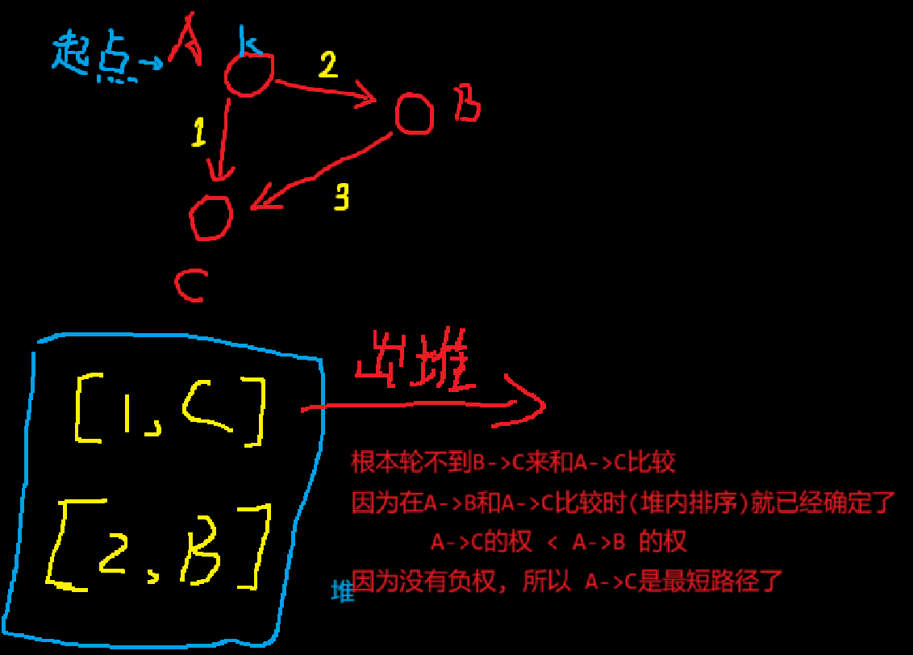

# Dijkstra算法
## 应用场景
在给定的 **`有向有权图`** 中, 输出**指定点**到其他点的最短**路径**.

- 对于无向图, 可以转化为 双向的有向图 即可...

- 需要注意的是, `Dijkstra`算法只适用于边权为正数的情况, 如果边权是负数情况, 则应该试用`Bellman-Ford`算法和`SPFA`算法。

## 算法描述

自定义点`A`, 得出图中所有点到`A`的最短路径 (单原点的最短路径)

迪杰斯特拉算法主要特点是从起始点开始，采用贪心算法的策略，每次遍历到始点距离最近且未访问过的顶点的邻接节点，直到扩展到终点为止。

- 可以看成:

    假设你用手拎起下图的 "0", 箭头指向可以看做是线, 权是线的长度,

    如果缓慢的拎起"0", 那么接下来最先离开地面的,就是最短路径(其他线还都是松弛的状态)继续上拎, 直到最好一个节点离开桌面, 那么"0"到这个结点的最短路径就是 之前的依次被拉起来的顺序

## 举例



同[Prim算法](../../005-最小生成树/003-Prim算法/index.md)需要:

```C
int *min_weight = (int *)malloc(sizeof(int) * G->add_index);    // 记录权的最小值
int *connect = (int *)malloc(sizeof(int) * G->add_index);       // 与谁的连接
_Bool *visit = (_Bool *)malloc(sizeof(_Bool) * G->add_index);   // 是否被访问
```

但是`min_weight`被重新定义成: 举例原点的最小权值, 而不是和父节点连接的权值了

所以更新的时候就有: *(节选核心逻辑)*

- 如果当前`G[i][j]`有连接 *(i -> j 的权为 G[i][j])*
    - 则判断 `min_weight[j] > G[i][j] +  min_weight[i]`
        - 若成立, 则需要更新: `min_weight[j] = G[i][j] +  min_weight[i]`, `parent[j] = i`

```C
int *min_weight = (int *)malloc(sizeof(int) * G->add_index);    // 记录权的最小值(距离原点)
int *parent = (int *)malloc(sizeof(int) * G->add_index);        // 与谁的连接(父节点)
_Bool *visit = (_Bool *)malloc(sizeof(_Bool) * G->add_index);   // 是否被访问
```

## 代码
### 竞赛版
#### 朴素版(适合稠密图) O(N^2) 时间复杂度
```C++
void djstr(void)
{
    const int INF = 2e9;
    int n, m, s;
    scanf("%d %d %d", &n, &m, &s);

    vector<vector<int>> G(n, vector<int>(n, INF));
    for (int i = 0, j, k, w; i < m; ++i) {
        scanf("%d %d %d", &j, &k, &w);
        G[j - 1][k - 1] = min(G[j - 1][k - 1], w);
    }

    vector<int> min_weight(n, INF);    // 距离原点最小权和
    vector<int> parent(n, -1);        // 父节点
    vector<bool> visit(n, 0);        // 是否已选择

    min_weight[s - 1] = 0;

    for (int i = s - 1, k; i != -1;) {
        visit[i] = 1;
        k = -1;

        for (int j = 0; j < n; ++j) {
            if (G[i][j] != INF && !visit[j]) {
                if (min_weight[j] > G[i][j] + min_weight[i]) {
                    min_weight[j] = G[i][j] + min_weight[i];
                    parent[j] = i;
                }

                if (k == -1 || min_weight[j] < min_weight[k])
                    k = j;
            }
        }

        i = k;
    }

    for (auto& it : min_weight)
        printf("%d ", it);
}
```

题目: [743. 网络延迟时间](https://leetcode.cn/problems/network-delay-time/)
```C++
class Solution {
public:
    int networkDelayTime(vector<vector<int>>& times, int n, int k) {
        const int myINF = 1e7;
        vector<vector<int>> G(n, vector<int>(n, myINF));
        for (auto& t : times) {
            G[t[0] - 1][t[1] - 1] = t[2];
        }
        // 迪加斯特拉算法
        vector<int> dis(n, myINF);
        vector<int> runEd(n);
        dis[k - 1] = 0;
        for (int i = k - 1, next; ;) {
            next = -1;
            for (int j = 0; j < n; ++j) {
                if (!runEd[j]) {
                    if (/*G[i][j] != myINF && 可有可无*/dis[j] > dis[i] + G[i][j]) {
                        dis[j] = dis[i] + G[i][j];
                    }

                    if (next == -1 || dis[next] > dis[j])
                        next = j;
                }
            }

            if (dis[i] == myINF)
                return -1;

            if (next == -1)
                break;
            
            runEd[i] = 1;
            i = next;
        }

        int res = 0;
        for (int i = 0; i < n; ++i)
            res = max(res, dis[i]);
        return res;
    }
};
```

#### 堆优化 O(NlogN) (适合稀疏图)
学习参考: [Dijkstra 单源最短路【力扣周赛 334】](https://www.bilibili.com/video/BV1wj411G7sH/)


```py
'''
1. Dijkstra

1. 设dis[x]表示从起点到x的最短路
设y->x
考虑所有 y，当我们更新 dis[x] 的时候，如果 dis[y] 已经算好了
那么dis[x]一定可以正确地算出来

2. 怎么保证算出来的一定是最短路？
数学归纳法(证明起点和其他任意时候的点, 都满足)
一开始只有一个起点st
dis[st] = 0 这是已经算好的
从 st 开始，把st的邻居的 dis[] 都更新一下（此时邻居不一定是算好的）

从没有算好的dis里面，取一个最小的
> 结论：这个取出来的一定是算好的
'''
```

为什么出堆的已经是最短路径? 以及为什么不能使用负权:
| ##container## |
|:--:|
||


$堆优化 Dijkstra（适用于稀疏图)$

寻找最小值的过程可以用一个最小堆来快速完成:
- 一开始把 $(dis[k], k)$ 二元组入堆。
- 当节点 $x$ 首次出堆时, $dis[x]$ 就是写法一中寻找的最小最短路。
- 更新 $dis[y]$ 时，把 $(dis[y], y)$ 二元组入堆。 $ \color{#70865E} //\ 堆的格式是 \{从指定起点\ k \ 到当前结点的最短路径,\ 结点索引号\}$

注意，如果一个节点 $x$ 在出堆前，其最短路长度 $dis[x]$ 被多次更新，那么堆中会有多个重复的 $x$ ，并且包含 $x$ 的二元组中的 $dis[x]$ 是互不相同的（因为我们只在找到更小的最短路时才会把二元组入堆)。

所以写法一中的 $done$ 数组可以省去，取而代之的是用出堆的最短路值（记作 $dx$ ）与当前的 $dis[x]$ 比较，如果 $dx > dis[x]$ 说明 $x$ 之前出堆过，我们已经更新了 $x$ 的邻居的最短路，所以这次就不用更新了，继续外层循环。

以下是`0x3f`大佬的代码: 对于 [743. 网络延迟时间](https://leetcode.cn/problems/network-delay-time/) 其中使用了STL的`优先队列`和`C++17`的[结构化绑定](../../../../../002-程序语言/001-C++/002-tmp丶C++丶memo/003-C++新特性/002-C++17常用新特性/005-结构化绑定/index.md)
```C++
class Solution {
public:
    int networkDelayTime(vector<vector<int>> &times, int n, int k) {
        vector<vector<pair<int, int>>> g(n); // 邻接表
        for (auto &t : times) {
            g[t[0] - 1].emplace_back(t[1] - 1, t[2]);
        } // 存储意思是 从 u 为起始点 <u -> g[u][0]> 权为 g[u][1]

        vector<int> dis(n, INT_MAX);
        dis[k - 1] = 0;
        priority_queue<pair<int, int>, vector<pair<int, int>>, greater<>> pq;
        pq.emplace(0, k - 1);
        while (!pq.empty()) {
            auto [dx, x] = pq.top();
            pq.pop();
            if (dx > dis[x]) { // x 之前出堆过
                continue;
            }
            for (auto &[y, d] : g[x]) {
                int new_dis = dx + d;
                if (new_dis < dis[y]) {
                    dis[y] = new_dis; // 更新 x 的邻居的最短路
                    pq.push({new_dis, y});
                }
            }
        }
        int mx = ranges::max(dis);
        return mx < INT_MAX ? mx : -1;
    }
};

// 作者：灵茶山艾府
// 链接：https://leetcode.cn/problems/network-delay-time/solutions/2668220/liang-chong-dijkstra-xie-fa-fu-ti-dan-py-ooe8/
// 来源：力扣（LeetCode）
// 著作权归作者所有。商业转载请联系作者获得授权，非商业转载请注明出处。
```


### 学习版

```C
#include <stdio.h>
#include <stdlib.h>

typedef struct
{
    char **show;
    int **weight;
    int *tagArray;  // 用于遍历时候的标记
    int add_index;
    int number;
} AdjacencyMatrix;

AdjacencyMatrix *initAdjacencyMatrix(int n);                // 初始化AdjacencyMatrix
void addAdjacencyMatrix(AdjacencyMatrix *A, char *show);    // 添加元素
void connectAdjacencyMatrix(AdjacencyMatrix *A, char *show_1, char *show_2, int weight);    // 连接元素
void initTagArray(AdjacencyMatrix *A);                      // 重置遍历的标记数组 (-1)
void DFS(AdjacencyMatrix *A, int index);                    // 深度优先遍历
void BFS(AdjacencyMatrix *A);                               // 广度优先遍历
void freeAdjacencyMatrix(AdjacencyMatrix *A);               // 免费

AdjacencyMatrix *initAdjacencyMatrix(int n)
{
    AdjacencyMatrix *A = (AdjacencyMatrix *)malloc(sizeof(AdjacencyMatrix));
    if (!A)
    {
        MALLOC_ERROR:
        printf("Malloc ERROR!\n");
        return NULL;
    }

    A->show = (char **)malloc(sizeof(char *) * n);
    if (!A->show)
        goto MALLOC_ERROR;
    
    A->weight = (int **)malloc(sizeof(int *) * n);
    if (!A->weight)
        goto MALLOC_ERROR;

    for (int i = 0; i < n; ++i)
    {
        A->weight[i] = (int *)malloc(sizeof(int) * n);
        if (!A->weight[i])
            goto MALLOC_ERROR;
        for (int j = 0; j < n; ++j)
            A->weight[i][j] = 0;        // 这个是标记数_可改, 记0为未连接
    }
    
    A->add_index = 0;
    A->number = n;
    A->tagArray = (int *)malloc(sizeof(int) * n);
    if (!A->tagArray)
        goto MALLOC_ERROR;
    initTagArray(A);
    return A;
}

void addAdjacencyMatrix(AdjacencyMatrix *A, char *show)
{
    if (A->add_index == A->number)
        return; // ERROR
    A->show[A->add_index++] = show;
}

void initTagArray(AdjacencyMatrix *A)
{
    for (int i = 0; i < A->number; ++i)
        A->tagArray[i] = -1;
}

void connectAdjacencyMatrix(AdjacencyMatrix *A, char *show_1, char *show_2, int weight)
{
    int s_1 = -1;
    for (int i = 0; i < A->number; ++i)
    {
        if (A->show[i] == show_1)
            s_1 = i;
    }

    if (s_1 == -1)
        return; // 找不到
    
    int s_2 = -1;
    for (int i = 0; i < A->number; ++i)
    {
        if (A->show[i] == show_2)
            s_2 = i;
    }

    if (s_2 == -1)
        return; // 找不到
    
    A->weight[s_1][s_2] = weight;
    //A->weight[s_2][s_1] = weight;
}

// 注意遍历的是连通图
void DFS(AdjacencyMatrix *A, int index)
{
    printf("%s ", A->show[index]);
    A->tagArray[index] = 1;
    for (int i = 0; i < A->add_index; ++i)
    {
        if (A->weight[index][i] != 0 && A->tagArray[i] == -1)
        {
            DFS(A, i);
        }
    }
}

// 依旧是连通图
// 复杂过头了吧...
void BFS(AdjacencyMatrix *A)
{
    // 临时队列
    int queue[A->add_index];
    int q_h = 0;
    int q_t = 0;
    printf("%s ", A->show[0]);
    A->tagArray[0] = 1;
    for (int i = 0; i < A->add_index; ++i)
    {
        for (int j = 0; j < A->add_index; ++j)
        {
            if (A->weight[i][j] != 0 && A->tagArray[j] == -1)
            {
                A->tagArray[j] = 1;
                queue[q_t++] = j;
                q_t = q_t % A->add_index;
            }
        }

        if (q_h != q_t)
            break;
    }
    
    while (q_h != q_t)
    {
        printf("%s ", A->show[queue[q_h]]);
        for (int i = 0; i < A->add_index; ++i)
        {
            if (A->weight[queue[q_h]][i] != 0 && A->tagArray[i] == -1)
            {
                A->tagArray[q_t == 0 ? A->add_index - 1 : q_t - 1] = 1;
                queue[q_t++] = i;
                q_t = q_t % A->add_index;
            }
        }
        ++q_h;
        q_h = q_h % A->add_index;
    }
}

void freeAdjacencyMatrix(AdjacencyMatrix *A)
{
    free(A->show);
    for (int i = 0; i < A->number; ++i)
    {
        free(A->weight[i]);
    }
    free(A->weight);
    free(A->tagArray);
    free(A);
}

typedef struct Dijkstra
{
    int *distance;          // 从原点到该点的权
    int *parentNodeIndex;   // 该点的父结点
    int num;                // 元素个数 / 长度
} Dijkstra;

// Dijkstra 返回一个Dijkstra结构体
Dijkstra *doDijkstra(AdjacencyMatrix *G, int s_index);
void putDijkstra(AdjacencyMatrix *G, Dijkstra* D);
void freeDijkstra(Dijkstra *);  // 免费

void putDijkstra(AdjacencyMatrix *G, Dijkstra* D)
{
    int kara = -1;
    for (int i = 0; i < D->num; ++i)
    {
        if (D->parentNodeIndex[i] == -1)
        {
            kara = i;
            break;
        }
    }

    for (int i = 0; i < D->num; ++i)
    {
        if (i != kara)
            printf("%s --%2d--> %s (父节点: %s)\n", G->show[kara], D->distance[i], G->show[i], G->show[D->parentNodeIndex[i]]);
    }
}

Dijkstra *doDijkstra(AdjacencyMatrix *G, int s_index)
{
    Dijkstra *D = (Dijkstra *)malloc(sizeof(Dijkstra));
    if (!D)
    {
        MALLOC_ERROR:
        printf("malloc error!\n");
        return NULL;
    }

    D->distance = (int *)malloc(sizeof(int) * G->add_index);
    if (!D->distance)
        goto MALLOC_ERROR;
    
    D->parentNodeIndex = (int *)malloc(sizeof(int) * G->add_index);
    if (!D->parentNodeIndex)
        goto MALLOC_ERROR;
    
    // 已访问数组
    _Bool *tag_visited = (_Bool *)malloc(sizeof(_Bool) * G->add_index);
    if (!tag_visited)
        goto MALLOC_ERROR;

    D->num = G->add_index;

    // init
    for (int i = 0; i < D->num; ++i)
    {
        D->distance[i] = INT_MAX;
        D->parentNodeIndex[i] = -1;
        tag_visited[i] = 0;
    }

    int index = s_index;    // 指定一个原结点, 表示需要计算所有结点到它的最短路径
    D->distance[s_index] = 0;
    // Dijkstra 启动!
    while (1)
    {
        tag_visited[index] = 1;
        int min_node_i = -1;
        //printf("\n%d:\n", index);
        for (int i = 0; i < D->num; ++i)
        {
            if (tag_visited[i])
                continue;

            if (G->weight[index][i] != 0) // 连接
            {
                if (D->distance[i] > D->distance[index] + G->weight[index][i])
                {
                    //printf("%d > %d + %d | [%s]: %s --> %s\n", D->distance[i], D->distance[index] , G->weight[index][i], G->show[i], D->parentNodeIndex[i] != -1 ? G->show[D->parentNodeIndex[i]] : "无父结点", G->show[index]);
                    D->distance[i] = D->distance[index] + G->weight[index][i];
                    D->parentNodeIndex[i] = index;
                }

                if (min_node_i == -1 || D->distance[min_node_i] > D->distance[i])
                        min_node_i = i;
            }
            else if ((min_node_i == -1 && D->distance[i] != INT_MAX) || D->distance[min_node_i] > D->distance[i])
                min_node_i = i;
        }

        if (min_node_i == -1)
            break;

        index = min_node_i;
    }

    free(tag_visited);
    return D;
}

int main(void)
{
    //  - 最短路径- Dijkstra算法
    // 运用于 有向图
    AdjacencyMatrix *A = initAdjacencyMatrix(7);
    addAdjacencyMatrix(A, "v0");
    addAdjacencyMatrix(A, "v1");
    addAdjacencyMatrix(A, "v2");
    addAdjacencyMatrix(A, "v3");
    addAdjacencyMatrix(A, "v4");
    addAdjacencyMatrix(A, "v5");
    addAdjacencyMatrix(A, "v6");

    connectAdjacencyMatrix(A, "v0", "v1", 4);
    connectAdjacencyMatrix(A, "v0", "v2", 6);
    connectAdjacencyMatrix(A, "v0", "v3", 6);

    connectAdjacencyMatrix(A, "v1", "v4", 7);
    connectAdjacencyMatrix(A, "v1", "v2", 1);

    connectAdjacencyMatrix(A, "v2", "v4", 6);
    connectAdjacencyMatrix(A, "v2", "v5", 4);

    connectAdjacencyMatrix(A, "v3", "v2", 2);
    connectAdjacencyMatrix(A, "v3", "v5", 5);

    connectAdjacencyMatrix(A, "v4", "v6", 6);

    connectAdjacencyMatrix(A, "v5", "v4", 1);
    connectAdjacencyMatrix(A, "v5", "v6", 8);

    Dijkstra* D = doDijkstra(A, 0);
    putDijkstra(A, D);
    getchar();
    return 0;
}
```
