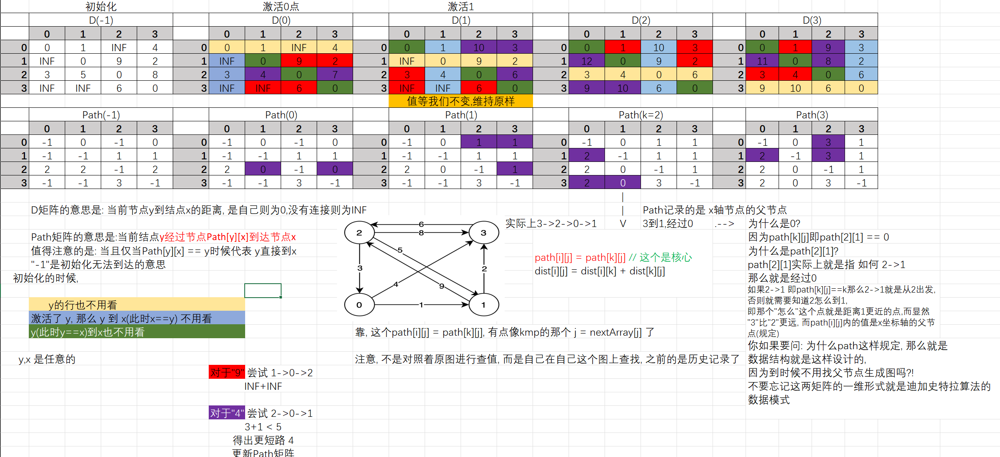

# floyd算法
## 介绍
**弗洛伊德(floyd)算法** 是解决`任意两点`间的最短路径的一种算法，可以正确处理有向图或有向图或负权（但不可存在负权回路)的最短路径问题，同时也被用于计算有向图的传递闭包。

~~(虽然求解多源点最短路径, 可以对每一个点做一次`Dijkstre`, 但是涉及到而外数据的初始化, 显然这个 $O(N^3)$ 的常数是大一点的 =-=, 故可以使用`floyd`算法)~~

## 算法核心

- 状态定义

$$
定义\ f(k,\ i,\ j) \ 为\ i \to j \ 之间可以通过 1,\ ...,\ k 顶点的最短路径
$$

- 初状态(初始化)
 
    $k = 0$, 即原图 $f(0,\ i,\ j)$

- 状态转移方程
$$
f(k,\ i,\ j) = min \begin{Bmatrix}
f(k - 1, \ i, \ j)  & {\color{Green} \ i \to j \ 不经过 k 点} ， \\\\
f(k - 1, \ i, \ k) + f(k - 1, \ k, \ j) & {\color{Green} \ i \to j \ 经过 k 点}
\end{Bmatrix}
$$

- [优化: 状态压缩]

    因为只用到了 $k\ 和\ k - 1$ 所以可以去掉一个维度

    又因为是动态规划, 所以要保证之前的状态全部计算出来, 这就是为什么 $k$ 是最外层循环的原因.

## 示例
| ##container## |
|:--:|
||

## 代码
### 竞赛版
[B3647 【模板】Floyd](https://www.luogu.com.cn/problem/B3647)

> 好像不能使用链式前向星来存储dp二维数组

如果需要返回的是图, 才需要`path`数组
```C++
const int INF = ((int)1e6);
int n, m;
scanf("%d %d", &n, &m);
vector<vector<int>> G(n + 1, vector<int>(n + 1, INF));

for (int i = 0, j, k, w; i < m; ++i) {
    scanf("%d %d %d", &j, &k, &w);
    G[j][k] = min(G[j][k], w);
    G[k][j] = G[j][k];
}

vector<vector<int>> dist(G.begin(), G.end());

for (int k = 1; k <= n; ++k)
    for (int i = 1; i <= n; ++i) {
        for (int j = 1; j <= n; ++j) {
            if (i == j || i == k || j == k)
                continue;

            dist[i][j] = min(dist[i][j], dist[i][k] + dist[k][j]);
        }
    }

for (int i = 1; i <= n; ++i) {
    for (int j = 1; j <= n; ++j) {
        printf("%d ", dist[i][j] == INF ? 0 : dist[i][j]);
    }
    printf("\n");
}
```

### 学习版

```C
#include <stdio.h>
#include <stdlib.h>

#define INF 1e6

typedef struct
{
    char **show;
    int **weight;
    int *tagArray;  // 用于遍历时候的标记
    int add_index;
    int number;
} AdjacencyMatrix;

AdjacencyMatrix *initAdjacencyMatrix(int n);                // 初始化AdjacencyMatrix
void addAdjacencyMatrix(AdjacencyMatrix *A, char *show);    // 添加元素
void connectAdjacencyMatrix(AdjacencyMatrix *A, char *show_1, char *show_2, int weight);    // 连接元素
void initTagArray(AdjacencyMatrix *A);                      // 重置遍历的标记数组 (-1)
void DFS(AdjacencyMatrix *A, int index);                    // 深度优先遍历
void BFS(AdjacencyMatrix *A);                               // 广度优先遍历
void freeAdjacencyMatrix(AdjacencyMatrix *A);               // 免费

void floyd(AdjacencyMatrix *A);                             // floyd算法

AdjacencyMatrix *initAdjacencyMatrix(int n)
{
    AdjacencyMatrix *A = (AdjacencyMatrix *)malloc(sizeof(AdjacencyMatrix));
    if (!A)
    {
        MALLOC_ERROR:
        printf("Malloc ERROR!\n");
        return NULL;
    }

    A->show = (char **)malloc(sizeof(char *) * n);
    if (!A->show)
        goto MALLOC_ERROR;
    
    A->weight = (int **)malloc(sizeof(int *) * n);
    if (!A->weight)
        goto MALLOC_ERROR;

    for (int i = 0; i < n; ++i)
    {
        A->weight[i] = (int *)malloc(sizeof(int) * n);
        if (!A->weight[i])
            goto MALLOC_ERROR;
        for (int j = 0; j < n; ++j)
            A->weight[i][j] = 0;        // 这个是标记数_可改, 记0为未连接
    }
    
    A->add_index = 0;
    A->number = n;
    A->tagArray = (int *)malloc(sizeof(int) * n);
    if (!A->tagArray)
        goto MALLOC_ERROR;
    initTagArray(A);
    return A;
}

void addAdjacencyMatrix(AdjacencyMatrix *A, char *show)
{
    if (A->add_index == A->number)
        return; // ERROR
    A->show[A->add_index++] = show;
}

void initTagArray(AdjacencyMatrix *A)
{
    for (int i = 0; i < A->number; ++i)
        A->tagArray[i] = -1;
}

void connectAdjacencyMatrix(AdjacencyMatrix *A, char *show_1, char *show_2, int weight)
{
    int s_1 = -1;
    for (int i = 0; i < A->number; ++i)
    {
        if (A->show[i] == show_1)
            s_1 = i;
    }

    if (s_1 == -1)
        return; // 找不到
    
    int s_2 = -1;
    for (int i = 0; i < A->number; ++i)
    {
        if (A->show[i] == show_2)
            s_2 = i;
    }

    if (s_2 == -1)
        return; // 找不到
    
    A->weight[s_1][s_2] = weight;
    // A->weight[s_2][s_1] = weight;
}

// 注意遍历的是连通图
void DFS(AdjacencyMatrix *A, int index)
{
    printf("%s ", A->show[index]);
    A->tagArray[index] = 1;
    for (int i = 0; i < A->add_index; ++i)
    {
        if (A->weight[index][i] != 0 && A->tagArray[i] == -1)
        {
            DFS(A, i);
        }
    }
}

// 依旧是连通图
// 复杂过头了吧...
void BFS(AdjacencyMatrix *A)
{
    // 临时队列
    int queue[A->add_index];
    int q_h = 0;
    int q_t = 0;
    printf("%s ", A->show[0]);
    A->tagArray[0] = 1;
    for (int i = 0; i < A->add_index; ++i)
    {
        for (int j = 0; j < A->add_index; ++j)
        {
            if (A->weight[i][j] != 0 && A->tagArray[j] == -1)
            {
                A->tagArray[j] = 1;
                queue[q_t++] = j;
                q_t = q_t % A->add_index;
            }
        }

        if (q_h != q_t)
            break;
    }
    
    while (q_h != q_t)
    {
        printf("%s ", A->show[queue[q_h]]);
        for (int i = 0; i < A->add_index; ++i)
        {
            if (A->weight[queue[q_h]][i] != 0 && A->tagArray[i] == -1)
            {
                A->tagArray[q_t == 0 ? A->add_index - 1 : q_t - 1] = 1;
                queue[q_t++] = i;
                q_t = q_t % A->add_index;
            }
        }
        ++q_h;
        q_h = q_h % A->add_index;
    }
}

void freeAdjacencyMatrix(AdjacencyMatrix *A)
{
    free(A->show);
    for (int i = 0; i < A->number; ++i)
    {
        free(A->weight[i]);
    }
    free(A->weight);
    free(A->tagArray);
    free(A);
}

static void errorPrint(const char *str)
{
    printf(str);
}

void floyd(AdjacencyMatrix *A)
{
    // 初始化
    int **dist = (int **)malloc(sizeof(int *) * A->number);
    if (!dist)
        return errorPrint("ERROR Malloc dist!\n");

    int **path = (int **)malloc(sizeof(int *) * A->number);
    if (!path)
        return errorPrint("ERROR Malloc path!\n");
    
    for (int i = 0; i < A->number; ++i)
    {
        dist[i] = (int *)malloc(sizeof(int) * A->number);
        if (!dist[i])
            return errorPrint("ERROR Malloc dist[i]!\n");

        path[i] = (int *)malloc(sizeof(int) * A->number);
        if (!path[i])
            return errorPrint("ERROR Malloc path[i]!\n");

        for (int j = 0; j < A->number; ++j)
        {
            if (i == j)
                dist[i][j] = 0;
            else
                dist[i][j] = INF;
            path[i][j] = -1;
        }
    }

    // 初状态
    for (int i = 0; i < A->number; ++i)
    {
        for (int j = 0; j < A->number; ++j)
        {
            if (A->weight[i][j])
            {
                dist[i][j] = A->weight[i][j];
                path[i][j] = i;
            }
        }
    }

    // *************** v算法核心v ***************

    for (int k = 0; k < A->number; ++k) // 动态规划, 每次切换节点
    {
        // 遍历图(邻接矩阵)
        for (int i = 0; i < A->number; ++i)
        {
            for (int j = 0; j < A->number; ++j)
            {
                // 一些忽略
                if (i == j || i == k || j == k)
                    continue;
                
                // 状态转移方程
                if (dist[i][k] < INF && dist[k][j] < INF &&
                dist[i][j] > dist[i][k] + dist[k][j])
                {
                    path[i][j] = path[k][j]; // 从 k 到达节点 j 的路径
                    dist[i][j] = dist[i][k] + dist[k][j];
                }
            }
        }

        printf("\n==================================\n");
        // 打印
        for (int i = 0; i < A->number; ++i)
        {
            for (int j = 0; j < A->number; ++j)
            {
                printf("%2d ", dist[i][j]);
            }
            putchar('\n');
        }
    }

    // 导出就不写了

    // *************** ^算法核心^ ***************

    // 释放
    for (int i = 0; i < A->number; ++i)
    {
        free(dist[i]);
        free(path[i]);
    }
    free(dist);
    free(path);
}

int main(void)
{
    //  - 动态规划 - 图 - 多原点最短路径 - floyd算法
    AdjacencyMatrix *A = initAdjacencyMatrix(4);
    addAdjacencyMatrix(A, "v0");
    addAdjacencyMatrix(A, "v1");
    addAdjacencyMatrix(A, "v2");
    addAdjacencyMatrix(A, "v3");
    connectAdjacencyMatrix(A, "v0", "v1", 1);
    connectAdjacencyMatrix(A, "v0", "v3", 4);
    connectAdjacencyMatrix(A, "v1", "v2", 9);
    connectAdjacencyMatrix(A, "v1", "v3", 2);
    connectAdjacencyMatrix(A, "v2", "v0", 3);
    connectAdjacencyMatrix(A, "v2", "v1", 5);
    connectAdjacencyMatrix(A, "v2", "v3", 8);
    connectAdjacencyMatrix(A, "v3", "v2", 6);
    // ************* 开始floyd算法 *************
    floyd(A);

    freeAdjacencyMatrix(A);
    getchar();
    return 0;
}
```

<div style="margin-top: 80px;">

---
</div>

## 进阶: 动态加边图
例题: [2642. 设计可以求最短路径的图类](https://leetcode.cn/problems/design-graph-with-shortest-path-calculator/description/)

- `addEdge(int[] edge)`向边集中添加一条边，其中`edge = [from, to, edgeCost]`。数据保证添加这条边之前对应的两个节点之间没有有向边。

向图中添加一条边，如何维护 $f$ 数组？

最暴力的做法是，每次添加一条边，就用 $O(n^3)$ 时间全部重算一遍。有没有更快的做法呢？

### 解决

对于 $addEdge$，记 $x=from$, $y=to$ 。如果 $edgeCost \geq f[x][y]$  ，则无法更新任何点对的最短路。否则枚举所有 $f[i][j]$ ，尝试看看能否更新成更小，即从 $i$ 到 $j$ 的如下路径 $$i---x-y---j$$

是否更短，写成式子就是 $$f[i][j]=\min (f[i][j], f[i][x]+\text { edgeCost }+f[y][j])$$


**注意:** 当 $i=x$ 或 $j=y$ 时，我们需要用到 $f[i][i]$ 这样的值，所以初始化的时候， $f[i][i]$ 要置为 $0$ 。

对于 $shortestPath$，返回 $f[start][end]$ 即可。

#### 答疑
**问:** 在 $addEdge$ 中，上式 $f[i][j]$ 的计算依赖于 $f[i][x]$ 的值，如果先计算 $f[i][j]$ ，再计算 $f[i][x]$ ，我们还需要重新计算 $f[i][j]$ 吗?

**答:** 没有必要，每个 $f[i][j]$ 只需要计算一次。如果 $f[i][x]$ 因为 $x-y$ 这条边变小，说明从 $i$ 到 $x$ 的最短路包含 $x-y$ 这条边。那么对于 $f[i][j]$ ，最短路不可能是 $i---x-y--j$ ，这意味着最短路会经过 $x-y$ 这条边两次。所以重新计算 $f[i][j]$ 是不可能让 $f[i][j]$ 变小的。

代码:

```C++
class Graph {
    const int INF = INT_MAX / 3;
    vector<vector<int>> f;
public:
    Graph(int n, vector<vector<int>> &edges) : f(n, vector<int>(n, INF)) {
        for (int i = 0; i < n; i++) {
            f[i][i] = 0;
        }
        for (auto &e : edges) {
            f[e[0]][e[1]] = e[2]; // 添加一条边（题目保证没有重边和自环）
        }
        for (int k = 0; k < n; k++) {
            for (int i = 0; i < n; i++) {
                if (f[i][k] == INF) continue;
                for (int j = 0; j < n; j++) {
                    f[i][j] = min(f[i][j], f[i][k] + f[k][j]);
                }
            }
        }
    }

    void addEdge(vector<int> e) {
        int x = e[0], y = e[1], w = e[2], n = f.size();
        if (w >= f[x][y]) { // 无需更新
            return;
        }
        for (int i = 0; i < n; i++) {
            for (int j = 0; j < n; j++) {
                f[i][j] = min(f[i][j], f[i][x] + w + f[y][j]);
            }
        }
    }

    int shortestPath(int start, int end) {
        int ans = f[start][end];
        return ans < INF ? ans : -1;
    }
};

// 作者：灵茶山艾府
// 链接：https://leetcode.cn/problems/design-graph-with-shortest-path-calculator/solutions/2229013/dijkstra-suan-fa-mo-ban-pythonjavacgo-by-unmv/
// 来源：力扣（LeetCode）
// 著作权归作者所有。商业转载请联系作者获得授权，非商业转载请注明出处。
```
