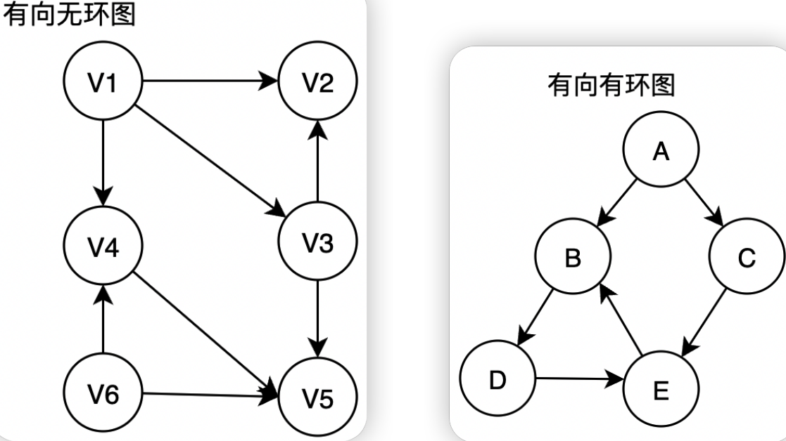

# 拓扑排序
## 一、基本概念
### 1.什么是有向无环图
顾名思义

### 2.什么是活动
所有的工程或者某种流程都可以分为若干个小的工程或者阶段，我们称这些小的工程或阶段为“活动”。打个比方，如何把一只大象装到冰箱里，很简单，分三步。第一，打开冰箱门；第二，将大象装进去；第三，关上冰箱门。这三步中的每一步便是一个“活动”

### 3.什么是AOV网
<span style="margin-left: 30px;">在一个表示工程的有向图中，用顶点表示活动，用弧表示活动之间的优先关系的有向图称为**顶点表示活动的网(Activity OnVertex Network)**，简称`AOV`网。

<span style="margin-left: 30px;">日常生活中，一项大的工程可以看作是由若干个子工程组成的集合，这些子工程之间必定存在一定的先后顺序，即某些子工程必须在其他的一些子工程完成后才能开始。

<span style="margin-left: 30px;">AOV网中的弧表示活动之间存在的某种制约关系，比如上面说到将大象装入冰箱，必须先打开冰箱门，才能将大象装进去，大象装进去才能关上冰箱门，从而完成我们的任务。还有一个经典的例子那就是选课，通常我们是学了C语言程序设计，才能学习数据结构，这里的制约关系就是课程之间的优先关系。

### 4.什么是拓扑序列
<span style="margin-left: 30px;">设 $G=(V,E)$ 是一个具有 $n$ 个顶点的有向图, $V$ 中的顶点序列 $V_1,V_2,V_3...V_n$ 满足若从顶点 $V_i$ 到 $V_j$ 有一条路径，则在顶点序列中顶点 $V_i$ 必在顶点 $V_j$ 之前。则我们称这样的顶点序列为一个**拓扑序列**。

### 5.什么是拓扑排序
<span style="margin-left: 30px;">所谓的拓扑排序，其实就是对一个`有向无环图`构造`拓扑序列`的**过程**。

<span style="margin-left: 30px;">例如，一个项目包括A、B、C、D四个子部分来完成，并且A依赖于B和D，C依赖于D。现在要制定一个计划，写出A、B、C、D的执行顺序。这时，就可以利用到拓扑排序，它就是用来确定事物发生的顺序的。

<span style="margin-left: 30px;">在拓扑排序中，如果存在一条从顶点A到顶点B的路径，那么在排序结果中B出现在A的后面。

## 二、算法思想
拓扑排序的算法步骤很简单，就是两步：
- (1）在图中选择一个没有前驱的顶点V;
- (2）从图中删除顶点√和所有以该顶点为尾的弧。

重复上述两步，直至全部顶点均已输出，或者当前图不存在无前驱的顶点为止，后一种情况说明有向图中存在环

面试时，判断一个有向图中是否存在环：
- Kruskal算法思想
    - 使用一个并查集, 初始时候所有结点的并查集标记为自己, 然后顺着边依次进行合并, 并且合并之前判断是否属于同一个集合, 如果属于说明该图有环.
- 拓扑排序思想
    - 在有向图中选择一个没有前驱的顶点并输出;发现当前图不存在无前驱的顶点，但拓扑序列中并未输出所有的顶点，所以剩下的顶点构成了环，也证明了该有向图存在环。

| ##container## |
|:--:|
||

## 三、算法实现
我们采用邻接表作为有向图的存储结构，并且在头结点中增加一个存放顶点入度的数组(indegree）。入度为零的顶点即为没有前驱的顶点，删除顶点及以它为尾的弧的操作，则可换以弧头顶点的入度减1来实现。

### 代码
#### 对于无向图
可以参考它的代码, 依旧需要记录`度`的数组!

[310. 最小高度树](../../../../007-刷题日志/002-力扣/003-未分类题解/006-最小高度树/index.md), 或者 [[蓝桥杯 2017 国 B] 发现环](../../../../007-刷题日志/004-蓝桥杯/005-老题/001-【蓝桥杯国B】发现环/index.md)(有~~证明~~为什么可以这样写(有向图只需要把 du[i] == 1 改为 == 0 以及 邻接表和 du 定义为入度数组即可))

#### 竞赛版

[B3644 【模板】拓扑排序 / 家谱树](https://www.luogu.com.cn/problem/B3644) / [T397291 【模板】拓扑排序（加强版）](https://www.luogu.com.cn/problem/T397291)
```C++
void demo_002(void)
{
    typedef struct {
        int to;
        int next;
    } E;
    int n;
    scanf("%d", &n);            // n 的顶点, m 条边
    vector<E> e(1, { 0, 0});    // 边
    vector<int> p(n + 1);        // 顶点 - 头结点
    vector<int> r(n + 1);        // 入度
    for (int i = 1, j = 1, v; i <= n; ++i) {
        for (; ;) {
            scanf("%d", &v);
            if (!v)
                break;
            e.push_back({ 0, 0 });
            e[j].to = v;
            e[j].next = p[i];
            p[i] = j++;
            ++r[v]; // 入度+1
        }
    }

    // 拓扑排序
    queue<int> que; // 临时队列
    
    for (int i = 1; i <= n; ++i)
        if (!r[i]) {
            que.push(i);
            printf("%d ", i);
        }
    
    while (que.size())
    {
        int x = que.front();
        que.pop();

        for (int j = p[x]; j; j = e[j].next) {
            --r[e[j].to];
            if (!r[e[j].to]) {
                que.push(e[j].to);
                printf("%d ", e[j].to);
            }
        }
    }
    
    return;
}
```


#### 学习版

```C
#include <stdio.h>
#include <stdlib.h>

typedef struct _AdjacencyListNode
{
    int index;
    struct _AdjacencyListNode *next;    // 有权也可再加
} AdjacencyListNode;

typedef struct
{
    char **show;                // data 可以搞个唯一识别码
    AdjacencyListNode **list;

    /* 用于快速插入 */
    int n;
    int add_index;

    /* 用于遍历 */
    _Bool *tag_arr;
} AdjacencyList;

AdjacencyList *initAdjacencyList(int n);                    // 初始化邻接表
void addAdjacencyListNode(AdjacencyList *A, char *show);    // 添加元素
_Bool connectAdjacencyListNode(AdjacencyList *A, char *show_1, char *show_2/*, int 权*/);   // 连接结点
void DFS(AdjacencyList *A, int index);                      // 深度优先遍历
void BFS(AdjacencyList *A, int index);                      // 广度优先遍历
void initTagArr(AdjacencyList *A);
void freeAdjacencyList(AdjacencyList *A);

void initTagArr(AdjacencyList *A)
{
    for (int i = 0; i < A->n; ++i)
    {
        A->tag_arr[i] = 0;
    }
}

AdjacencyList *initAdjacencyList(int n)
{
    AdjacencyList* A = (AdjacencyList *)malloc(sizeof(AdjacencyList));
    if (!A)
    {
        MALLOC_ERROR:
        printf("MALLOC ERROR!\n");
        return NULL;
    }
    A->show = (char **)malloc(sizeof(char *) * n);
    if (!A->show)
        goto MALLOC_ERROR;
    
    A->list = (AdjacencyListNode **)malloc(sizeof(AdjacencyListNode *) * n);
    if (!A->list)
        goto MALLOC_ERROR;
    
    A->tag_arr = (_Bool *)malloc(sizeof(_Bool) * n);
    if (!A->tag_arr)
        goto MALLOC_ERROR;
    A->n = n;
    initTagArr(A);
    for (int i = 0; i < n; ++i)
    {
        A->list[i] = NULL;
    }
    A->add_index = 0;
    return A;
}

void addAdjacencyListNode(AdjacencyList *A, char *show)
{
    if (A->add_index == A->n)
        return; // 满
    
    A->show[A->add_index++] = show;
}

// 定义为 show_1 --> show_2 (有向图)
_Bool connectAdjacencyListNode(AdjacencyList *A, char *show_1, char *show_2/*, int 权*/)
{
    int i_1 = -1;
    for (int i = 0; i < A->add_index; ++i)
    {
        if (A->show[i] == show_1)
        {
            i_1 = i;
            break;
        }
    }

    if (i_1 == -1)
        return 0;   // 没找到
    
    int i_2 = -1;
    for (int i = 0; i < A->add_index; ++i)
    {
        if (A->show[i] == show_2)
        {
            i_2 = i;
            break;
        }
    }

    if (i_2 == -1)
        return 0;   // 没找到
    
    AdjacencyListNode *p = (AdjacencyListNode *)malloc(sizeof(AdjacencyListNode));
    if (!p)
        return 0; // malloc error!
    
    p->index = i_2;
    p->next = A->list[i_1];
    A->list[i_1] = p;
    return 1;
}

void DFS(AdjacencyList *A, int index)
{
    printf("%s ", A->show[index]);
    A->tag_arr[index] = 1;
    AdjacencyListNode *p = A->list[index];
    while (p)
    {
        if (!A->tag_arr[p->index])
            DFS(A, p->index);
        p = p->next;
    }
}

// 只能遍历连通图, 不连通需要再加个for!
void BFS(AdjacencyList *A, int index)
{
    // 临时队列
    int queue[A->add_index + 1];
    int q_h = 0, q_t = 0;
    queue[q_t++] = index;
    A->tag_arr[index] = 1;
    while (q_t != q_h)
    {
        printf("%s ", A->show[queue[q_h]]);
        AdjacencyListNode *p = A->list[queue[q_h]];
        while (p)
        {
            if (!A->tag_arr[p->index])
            {
                queue[q_t] = p->index;
                A->tag_arr[p->index] = 1;
                q_t = (q_t + 1) % (A->add_index + 1);
            }
            p = p->next;
        }
        q_h = (q_h + 1) % (A->add_index + 1);
    }
}

void freeAdjacencyList(AdjacencyList *A)
{
    for (int i = 0; i < A->add_index; ++i)
    {
        AdjacencyListNode *p = A->list[i];
        AdjacencyListNode *tmp = NULL;
        while (p)
        {
            tmp = p;
            p = p->next;
            free(tmp);
        }
    }

    free(A->tag_arr);
    free(A->show);
    free(A->list);
    free(A);
}

int *topologicalSort(AdjacencyList *A); // 传入邻接表, 返回拓扑排序的结果, 返回元素是索引


int *topologicalSort(AdjacencyList *A)
{
    // 构建一个返回数组
    int *resArr = (int *)malloc(sizeof(int) * A->add_index);
    if (!resArr)
        goto ERROR;

    // 构建一个数组, 通过一次邻接表的遍历, 得到对于元素的入度
    int *penetration = (int *)malloc(sizeof(int) * A->add_index);   // 入度数组
    if (!penetration)
    {
        ERROR:
        printf("malloc error!\n");
        return NULL;
    }

    // 初始化入度数组
    for (int i = 0; i < A->add_index; ++i)
        penetration[i] = 0;

    AdjacencyListNode *tmp = NULL;
    // 遍历邻接表
    for (int i = 0; i < A->add_index; ++i)
    {
        tmp = A->list[i];
        
        while (tmp)
        {
            ++penetration[tmp->index];
            tmp = tmp->next;
        }
    }
    
    // 构建一个临时队列, 以缓存数据

    // 结点
    typedef struct _queue_node
    {
        int index;
        struct _queue_node *next;   // 下一个结点
        struct _queue_node *mae;    // 父结点
    } _queue_node;

    // 队列表头
    typedef struct _queue
    {
        int num;            // 队列元素数量
        _queue_node *head;  // 队头指针(此处入队)
        _queue_node *tail;  // 队尾指针(此处出队)
    } _queue;

    _queue Q;
    Q.num = 0;
    Q.head = Q.tail = NULL;
    int resArr_index = 0;
    int v_num = A->add_index;   // 结点数
    do
    {
        for (int i = 0; i < A->add_index; ++i)
        {
            // 入度为零
            if (penetration[i] == 0)
            {
                penetration[i] = -1;    // 标记为已处理
                // // 将其出度删除
                // (放这里没问题, 只是我像明显一点)
                // tmp = A->list[i];
                // while (tmp)
                // {
                //     --penetration[tmp->index];
                //     tmp = tmp->next;
                // }

                // 入队
                _queue_node *p = (_queue_node *)malloc(sizeof(_queue_node));
                if (!p)
                    goto ERROR;
                ++Q.num;

                // 此处是对尾指针删除的优化, 让尾指针指向尾的前一个元素 [错误]
                /*
                 *  情况如下:   一个节点 head -> A -> NULL
                 *             尾指针->NULL (释放为释放head, head->NULL)
                 *
                 *  2个结点:    head -> B -> A-> NULL
                 *             尾指针-> B (也就是p)
                 * 
                 *  2+个结点    我不变动
                 * 
                 *  错误的想法, 如果删除了尾结点, 那么尾指针也是要变动的!!!
                 *  所以要么双向指针要么费空间, 要么遍历!
                 * */
                // if (Q.num == 2)
                // {
                //     Q.tail = p;
                // }
                if (Q.head)
                    Q.head->mae = p;
                p->index = i;
                p->next = Q.head;
                Q.head = p;
                p->mae = NULL;
                if (!Q.tail)
                    Q.tail = p;
            }
        }


        // 退出条件
        if (!Q.tail && (Q.num == 0 && v_num > 0))
        {
            printf("有环!!!\n");
            break;
        }
        else
            --v_num;

        // 出队处理, 比如输出
        printf("%s ", A->show[Q.tail->index]);
        resArr[resArr_index++] = Q.tail->index;

        // 将其出度删除
        tmp = A->list[Q.tail->index];
        while (tmp)
        {
            --penetration[tmp->index];
            tmp = tmp->next;
        }

        // 出队
        _queue_node *cache = Q.tail;
        if (Q.tail && Q.tail->mae)
        {
            Q.tail = Q.tail->mae;
            Q.tail->next = NULL;
        }
        else
            Q.tail = NULL;

        if (cache == Q.head)
            Q.head = NULL;
        free(cache);
        --Q.num;

        // 理论上要再加个判断做退出条件, 因为现在只能保证通过有向无环图, 有环会死循环
        // 添加一个变量, 在开头记录一下v_num值, 再和结尾匹对一下就行了
    } while (Q.num || v_num);

    free(penetration);
    return resArr;
}


int main(void)
{
    //  - 拓扑排序算法 - 有向无环图
    AdjacencyList *A = initAdjacencyList(7);
    addAdjacencyListNode(A, "v0");
    addAdjacencyListNode(A, "v1");
    addAdjacencyListNode(A, "v2");
    addAdjacencyListNode(A, "v3");
    addAdjacencyListNode(A, "v4");
    addAdjacencyListNode(A, "v5");
    addAdjacencyListNode(A, "v6");

    connectAdjacencyListNode(A, "v0", "v1");
    connectAdjacencyListNode(A, "v0", "v2");
    connectAdjacencyListNode(A, "v0", "v3");
    connectAdjacencyListNode(A, "v1", "v2");
    connectAdjacencyListNode(A, "v1", "v4");
    connectAdjacencyListNode(A, "v2", "v4");
    connectAdjacencyListNode(A, "v3", "v5");
    connectAdjacencyListNode(A, "v2", "v5");
    connectAdjacencyListNode(A, "v5", "v4");
    connectAdjacencyListNode(A, "v5", "v6");

    int *arr = topologicalSort(A);
    freeAdjacencyList(A);
    free(arr);
    getchar();
    return 0;
}
```
