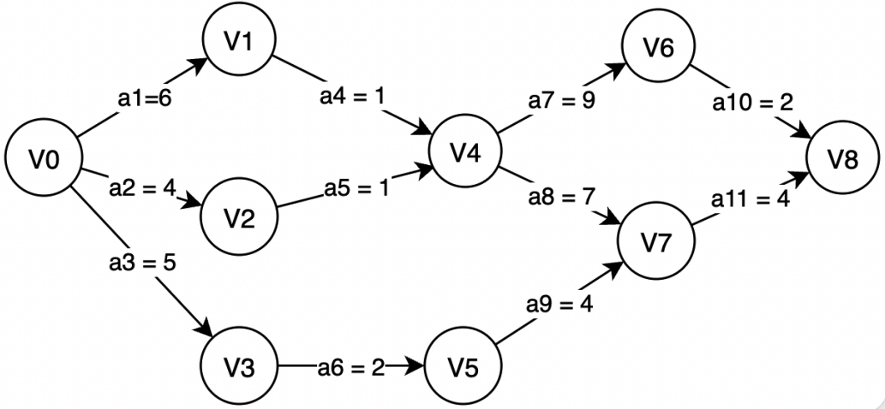
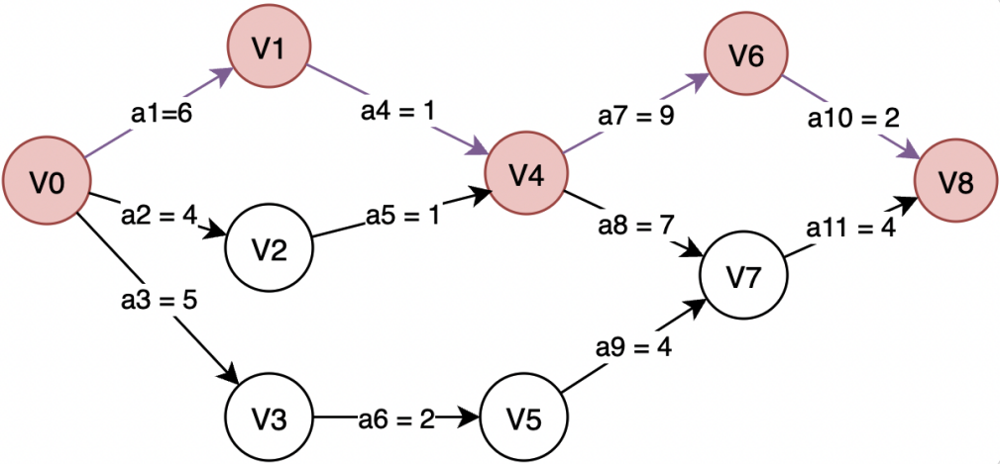
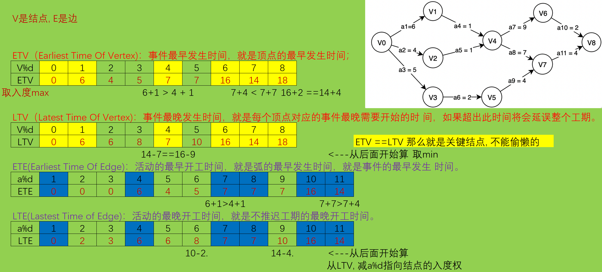

# 关键路径
## 一、基本概念
### 1.什么是AOE网
<span style="margin-left: 30px;">**AOE网(ActivityOnEdg)** 即边表示活动的网，是与AOV网（顶点表示活动）相对应的一个概念。而拓扑排序恰恰就是在AOV网上进行的，这是拓扑排序与关键路径最直观的联系。AOE网是一个带权的有向无环图，其中顶点表示事件（Event），弧表示活动，权表示活动持续的时间。下面的就是一个AOE网：

| ##container## |
|:--:|
||

<span style="margin-left: 30px;">其中v0，V1，V2...V8表示事件，a1...a11表示活动，活动的取值表示完成该活动所需要的时间，如a1=6表示完成活动a1所需要的时间为6天。此外，每一事件Vi表示在它之前的活动已经完成，在它之后的活动可以开始，如V4表示活动a4和a5已经完成，活动a7和a8可以开始了。

### 2.AOE网的源点和汇点
<span style="margin-left: 30px;">由于一个工程中只有一个开始点和一个完成点，故将AOE网中**入度为零的点称为源点**，将**出度为零的点称为汇点**。

<span style="margin-left: 30px;">打个比方，我们现在有一个工程，就是将大象装进冰箱，那么源点就相当于我们现在接到这样一个任务，而汇点则表示我们完成了这个任务。那么我们之前所讲的打开冰箱门，将大象装进去，关上冰箱门就属于活动本身（即a1....a11所表示的信息），打开冰箱门所需要的时间就是活动所需要的时间，而完成某一个活动所到达的顶点就表示一个事件（冰箱门打开）。上图中的顶点V0表示源点，V8表示汇点。

### 3.什么是关键路径
<span style="margin-left: 30px;">唐僧师徒从长安出发去西天取经，佛祖规定只有四人一起到达西天方能取得真经。假如师徒四人分别从长安出发，走不同的路去西天：孙悟空一个筋斗云十万八千里，一盏茶的功夫就到了；八戒和沙和尚稍慢点也就一天左右的时间；而唐僧最慢需要14年左右。徒弟到达后是要等着师傅的。那么用时最长的唐僧所走的路，就是取经任务中的关键路径。其他人走的路径属于非关键路径。

<span style="margin-left: 30px;">由于AOE网中的有些活动是可以并行进行的（如活动a1、a2和a3就是可以并行进行的），所以完成工程的最短时间是从源点到汇点的最长路径的长度。路径长度最长的路径就叫做关键路径（Critical Path）。如下图中红色顶点和有向边构成的就是一条关键路径，关键路径的长度就是完成活动a1、a4和a9、a10所需要的时间总和，即为 6+1+9+2=18。

| ##container## |
|:--:|
||

### 4.什么是ETV
<span style="margin-left: 30px;">**ETV(Earliest Time Of Vertex)**：事件最早发生时间，就是顶点的最早发生时间；

<span style="margin-left: 30px;">事件V1的最早发生时间表示从源点V0出发到达顶点V1经过的路径上的权值之和，从源点V0出发到达顶点V1只经过了权值为6的边，则V1的最早发生时间为6，表示在活动a1完成之后，事件V1才可以开始；

<span style="margin-left: 30px;">同理，事件V5要发生（即最早发生）需要活动a3和活动a6完成之后才可以，故事件V5的最早发生时间为5+2=7。其他顶点（事件）的最早发生时间同理可的。需要说明，事件的最早发生时间一定是从源点到该顶点进行计算的。

### 5.什么是LTV
<span style="margin-left: 30px;">**LTV(Latest Time OfVertex)**：事件最晚发生时间，就是每个顶点对应的事件最晚需要开始的时间，如果超出此时间将会延误整个工期。

<span style="margin-left: 30px;">前面在谈关键路径的概念时给出了一条上图中的关键路径，该关键路径（V0，V1，V4，V6,V8）的长度为18，为什么要提这个长度呢，因为要计算某一个事件的最晚发生时间，我们需要从汇点V8进行倒推。计算顶点V1的最晚发生时间为例，已知关键路径的长度为18，事件V1到汇点V8所需要的时间为 1+9+2=12，则事件V1的最晚发生时间为18-12=6，这时候我们发现，这和事件V2的最早发生时间不是一样吗？的确如此，对于关键路径上的顶点都满足最早发生时间etv 等于最晚发生时间Itv 的情况，这也是我们识别关键活动的关键所在。

<span style="margin-left: 30px;">再来计算一下事件V5的最晚发生时间，事件V5到汇点V8所需要的时间为4+4=8，则事件V5的最晚发生时间为 18－8=10；相当于说活动a6完成之后，大可以休息3天，再去完成活动a9也不会影响整个工期。

### 6.什么是ETE
<span style="margin-left: 30px;">**ETE(Earliest Time Of Edge)**：活动的最早开工时间，就是弧的最早发生时间，就是事件的最早发生时间。

<span style="margin-left: 30px;">活动a4要最早开工时间为事件V1的最早发生时间6；同理，活动a9的最早开工时间为事件v5的最早发生时间7。显然活动的最早开工时间就是活动发生前的事件的最早开始时间。

### 7.什么是LTE
<span style="margin-left: 30px;">**LTE(Lastest Time of Edge)**：活动的最晚开工时间，就是不推迟工期的最晚开工时间。

<span style="margin-left: 30px;">活动的最晚开工时间则是基于事件的最晚发生时间。比如活动a4的最晚开工时间为事件V4的最晚发生时间减去完成活动a4所需时间，即7－1=6；活动a9的最晚开工时间为事件V7的最晚发生时间减去完成活动a9所需时间，即 14－4=10;

<span style="margin-left: 30px;">从上面也就可以看出只要知道了每一个事件（顶点）的ETV和LTV，就可以推断出对应的ETE和LTE．此外还需要注意，关键路径是活动的集合，而不是事件的集合，所以当我们求得ETV和LTV 之后，还需要计算 ETE 和LTE。

## 二、关键路径算法
<span style="margin-left: 30px;">求关键路径的过程事实上最重要的就是上面提到的四个概念，ETV、LTV、ETE 和LTE，求得了ETE与LTE之后只需要判断两者是否相等，如果相等则为关键路径中的一条边，则输出。

| ##container## |
|:--:|
||


## 三、代码
### 竞赛版

### 学习版

```C
#include <stdio.h>
#include <stdlib.h>

typedef struct _AdjacencyListNode
{
    int index;
    int w;
    struct _AdjacencyListNode *next;    // 有权也可再加
} AdjacencyListNode;

typedef struct
{
    char **show;                // data 可以搞个唯一识别码
    AdjacencyListNode **list;

    /* 用于快速插入 */
    int n;
    int add_index;
    int e_num;

    /* 用于遍历 */
    _Bool *tag_arr;
} AdjacencyList;

AdjacencyList *initAdjacencyList(int n);                    // 初始化邻接表
void addAdjacencyListNode(AdjacencyList *A, char *show);    // 添加元素
_Bool connectAdjacencyListNode(AdjacencyList *A, char *show_1, char *show_2, int w);   // 连接结点
void DFS(AdjacencyList *A, int index);                      // 深度优先遍历
void BFS(AdjacencyList *A, int index);                      // 广度优先遍历
void initTagArr(AdjacencyList *A);
void freeAdjacencyList(AdjacencyList *A);

void initTagArr(AdjacencyList *A)
{
    for (int i = 0; i < A->n; ++i)
    {
        A->tag_arr[i] = 0;
    }
}

AdjacencyList *initAdjacencyList(int n)
{
    AdjacencyList* A = (AdjacencyList *)malloc(sizeof(AdjacencyList));
    if (!A)
    {
        MALLOC_ERROR:
        printf("MALLOC ERROR!\n");
        return NULL;
    }
    A->show = (char **)malloc(sizeof(char *) * n);
    if (!A->show)
        goto MALLOC_ERROR;
    
    A->list = (AdjacencyListNode **)malloc(sizeof(AdjacencyListNode *) * n);
    if (!A->list)
        goto MALLOC_ERROR;
    
    A->tag_arr = (_Bool *)malloc(sizeof(_Bool) * n);
    if (!A->tag_arr)
        goto MALLOC_ERROR;
    A->n = n;
    initTagArr(A);
    for (int i = 0; i < n; ++i)
    {
        A->list[i] = NULL;
    }
    A->add_index = 0;
    A->e_num = 0;
    return A;
}

void addAdjacencyListNode(AdjacencyList *A, char *show)
{
    if (A->add_index == A->n)
        return; // 满
    
    A->show[A->add_index++] = show;
}

// 定义为 show_1 --> show_2 (有向图)
_Bool connectAdjacencyListNode(AdjacencyList *A, char *show_1, char *show_2, int w)
{
    int i_1 = -1;
    for (int i = 0; i < A->add_index; ++i)
    {
        if (A->show[i] == show_1)
        {
            i_1 = i;
            break;
        }
    }

    if (i_1 == -1)
        return 0;   // 没找到
    
    int i_2 = -1;
    for (int i = 0; i < A->add_index; ++i)
    {
        if (A->show[i] == show_2)
        {
            i_2 = i;
            break;
        }
    }

    if (i_2 == -1)
        return 0;   // 没找到
    
    AdjacencyListNode *p = (AdjacencyListNode *)malloc(sizeof(AdjacencyListNode));
    if (!p)
        return 0; // malloc error!
    
    ++A->e_num;
    p->w = w;
    p->index = i_2;
    p->next = A->list[i_1];
    A->list[i_1] = p;
    return 1;
}

void DFS(AdjacencyList *A, int index)
{
    printf("%s ", A->show[index]);
    A->tag_arr[index] = 1;
    AdjacencyListNode *p = A->list[index];
    while (p)
    {
        if (!A->tag_arr[p->index])
            DFS(A, p->index);
        p = p->next;
    }
}

// 只能遍历连通图, 不连通需要再加个for!
void BFS(AdjacencyList *A, int index)
{
    // 临时队列
    int queue[A->add_index + 1];
    int q_h = 0, q_t = 0;
    queue[q_t++] = index;
    A->tag_arr[index] = 1;
    while (q_t != q_h)
    {
        printf("%s ", A->show[queue[q_h]]);
        AdjacencyListNode *p = A->list[queue[q_h]];
        while (p)
        {
            if (!A->tag_arr[p->index])
            {
                queue[q_t] = p->index;
                A->tag_arr[p->index] = 1;
                q_t = (q_t + 1) % (A->add_index + 1);
            }
            p = p->next;
        }
        q_h = (q_h + 1) % (A->add_index + 1);
    }
}

void freeAdjacencyList(AdjacencyList *A)
{
    for (int i = 0; i < A->add_index; ++i)
    {
        AdjacencyListNode *p = A->list[i];
        AdjacencyListNode *tmp = NULL;
        while (p)
        {
            tmp = p;
            p = p->next;
            free(tmp);
        }
    }

    free(A->tag_arr);
    free(A->show);
    free(A->list);
    free(A);
}

void criticalPath(AdjacencyList *A);    // 输出关键路径

// 传入邻接表
void criticalPath(AdjacencyList *A)
{
    // ETV、LTV、ETE 和 LTE，
    // 求得了ETE与LTE之后只需要判断两者是否相等，如果相等则为关键路径中的⼀条边，则输出。
    int *ETV = (int *)malloc(sizeof(int) * A->add_index);
    if (!ETV)
    {
        ERROR:
        printf("malloc error!\n");
        return;
    }
    int *LTV = (int *)malloc(sizeof(int) * A->add_index);
    if (!LTV)
        goto ERROR;

    int *ETE = (int *)malloc(sizeof(int) * A->e_num);
    if (!ETE)
        goto ERROR;

    int *LTE = (int *)malloc(sizeof(int) * A->e_num);
    if (!LTE)
        goto ERROR;

    // 构建一个数组, 通过一次邻接表的遍历, 得到对于元素的入度
    int *penetration = (int *)malloc(sizeof(int) * A->add_index);   // 入度数组
    if (!penetration)
        goto ERROR;

    // 临时队列<线性>
    int *queue = (int *)malloc(sizeof(int) * A->add_index);
    if (!queue)
        goto ERROR;

    int queue_head = 0, queue_tail = 0;

    int ETE_index = 0;
    AdjacencyListNode *tmp = NULL;
    // 初始化入度数组以及EELLVV
    for (int i = 0; i < A->add_index; ++i)
    {
        penetration[i] = 0;
        ETV[i] = 0;
        LTV[i] = 0;
        ETE[i] = 0;
        LTE[i] = 0;
    }

    for (int i = A->add_index; i < A->e_num; ++i)
    {
        ETE[i] = 0;
        LTE[i] = 0;
    }

    // 遍历邻接表
    for (int i = 0; i < A->add_index; ++i)
    {
        tmp = A->list[i];
        
        while (tmp)
        {
            ++penetration[tmp->index];
            tmp = tmp->next;
        }
    }

    // 正式开始
    for (int i = 0; i < A->add_index; ++i)
    {
        if (penetration[i] == 0)
        {
            // 寻找源点
            // 只有一个入度为0的点(单源点)
            penetration[i] = -1;    // 记得要这个!!!
            queue[queue_tail] = i;
            queue_tail = (queue_tail + 1) % A->add_index;
            // ETV[ETV_index++] = 0; // 因为初始化为0所以可以省略
            break;
        }
    }

    // 关键路径 - 拓扑排序
    while (queue_head != queue_tail)
    {
        // 出队
        int index = queue[queue_head];
        
        // 删除
        tmp = A->list[queue_head];
        // printf("出队: %s [H:%d, T:%d]\n", A->show[queue_head], queue_head, queue_tail);
        queue_head = (queue_head + 1) % A->add_index;
        while (tmp)
        {
            --penetration[tmp->index];
            // ETV
            if (ETV[tmp->index] < ETV[index] + tmp->w) // max
            {
                // printf("[-->%s]%d < [%s]%d + [--[w]:%d-->%s]\n", A->show[tmp->index],ETV[tmp->index], A->show[index],ETV[index], tmp->w, A->show[tmp->index]);
                ETV[tmp->index] = ETV[index] + tmp->w;
            }

            // ETE
            // 因为边只会出现一次于循环中, 所以采用zero开始计数
            ETE[ETE_index++] = ETV[index];

            tmp = tmp->next;
        }

        for (int i = 0; i < A->add_index; ++i)
        {
            if (penetration[i] == 0)    // 入度为0
            {
                penetration[i] = -1;    // 标记为已处理
                // 入队
                queue[queue_tail] = i;
                // printf("入队: %s [H:%d, T:%d]\n", A->show[i], queue_head, queue_tail);
                queue_tail = (queue_tail + 1) % A->add_index;
            }
        }
    }

    // LTV
    for (int i = A->add_index - 1, j = A->e_num - 1; i >= 0; --i)
    {
        int min = INT_MAX;
        tmp = A->list[i];
        while(tmp)
        {
            if (LTV[tmp->index] - tmp->w < min)
                min = LTV[tmp->index] - tmp->w;
            // LTE
            // 从LTV取 j 的边指向的入度权 <这里很巧妙, 需要细细体会, 感觉不能描述 的喵~>
            // 就是 j 必须会在 LTV处理好后使用
            // LTE数组的索引是被规定的, 并且每次使用都是 i 结点的出度边,
            // 并且因为这个边只会出现一次, 所以--j切换下一个位置
            // 值得注意的是: 这个 j 会跳过LTV最后一个(LTV[i] = ETV[i];)因为这个条件下tmp==NULL, 但LTE索引位置不变(因为是在tmp!=NULL下才会计算的)
            LTE[j] = LTV[tmp->index] - tmp->w;
            tmp = tmp->next;
            --j;
        }

        if (min == INT_MAX)
            LTV[i] = ETV[i];
        else
            LTV[i] = min;
    }

    // 暂时输出:
    printf("ETV: ");
    for (int i = 0; i < A->add_index; ++i)
    {
        printf("%2d ", ETV[i]);
    }
    printf("\n");

    printf("LTV: ");
    for (int i = 0; i < A->add_index; ++i)
    {
        printf("%2d ", LTV[i]);
    }
    printf("\n");

    printf("ETE: ");
    for (int i = 0; i < A->e_num; ++i)
    {
        printf("%2d ", ETE[i]);
    }
    printf("\n");

    printf("LET: ");
    for (int i = 0; i < A->e_num; ++i)
    {
        printf("%2d ", LTE[i]);
    }
    printf("\n");

    // 如果不用这些数组:
    free(queue);
    free(ETV);
    free(LTV);
    free(ETE);
    free(LTE);
}

int main(void)
{
    //  - 关键路径 - 有向有权图并且只有一个入度为0的点(单源点)
    // 邻接表
    AdjacencyList *A = initAdjacencyList(9);
    addAdjacencyListNode(A, "v0");
    addAdjacencyListNode(A, "v1");
    addAdjacencyListNode(A, "v2");
    addAdjacencyListNode(A, "v3");
    addAdjacencyListNode(A, "v4");
    addAdjacencyListNode(A, "v5");
    addAdjacencyListNode(A, "v6");
    addAdjacencyListNode(A, "v7");
    addAdjacencyListNode(A, "v8");

    connectAdjacencyListNode(A, "v0", "v1", 6);
    connectAdjacencyListNode(A, "v0", "v2", 4);
    connectAdjacencyListNode(A, "v0", "v3", 5);

    connectAdjacencyListNode(A, "v1", "v4", 1);

    connectAdjacencyListNode(A, "v2", "v4", 1);

    connectAdjacencyListNode(A, "v3", "v5", 2);

    connectAdjacencyListNode(A, "v4", "v6", 9);
    connectAdjacencyListNode(A, "v4", "v7", 7);

    connectAdjacencyListNode(A, "v5", "v7", 4);

    connectAdjacencyListNode(A, "v6", "v8", 2);
    
    connectAdjacencyListNode(A, "v7", "v8", 4);

    criticalPath(A);
    getchar();
    return 0;
}
```