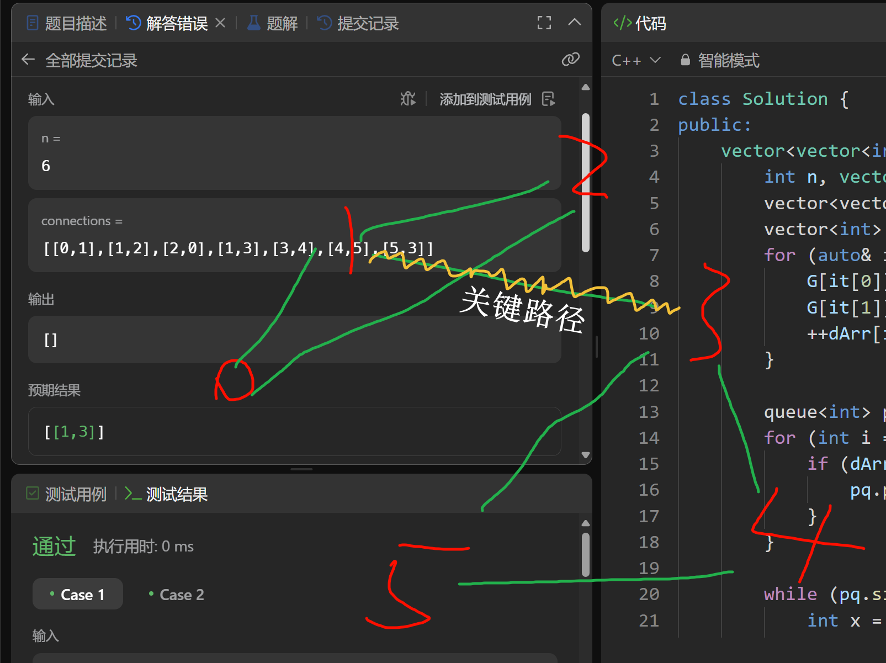
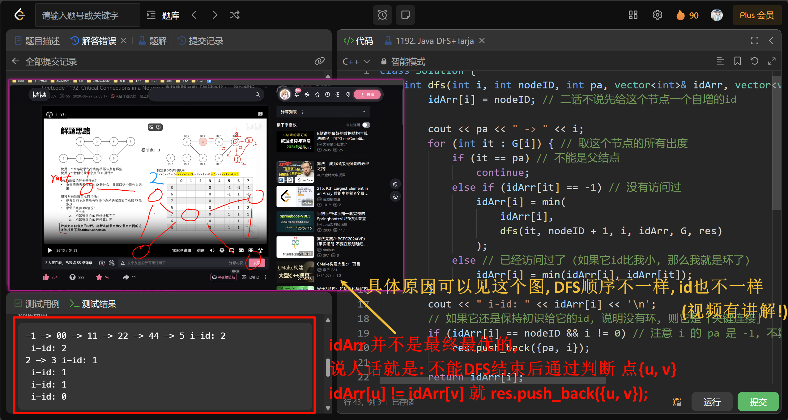
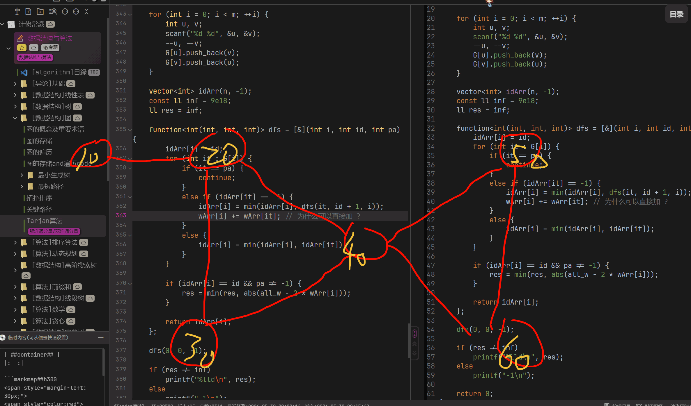

# Tarjan
## 学习链接
- [Leetcode 1192. Critical Connections in a Network 查找集群内的「关键连接」- 终结解析+Java代码](https://www.bilibili.com/video/BV15t4y197eq/) (哔哩哔哩视频)

- [CSDN-tarjan算法总结 (强连通分量+缩点+割点)，看这一篇就够了~](https://blog.csdn.net/csyifanZhang/article/details/105370924)

- [oi-wiki 强连通分量](https://oi-wiki.org/graph/scc/)

<div style="margin-top: 80px;">

---
</div>

## 前置概念
By GPT-4o
### 双连通分量(Biconnected Components)
双连通分量是指在无向图中，如果删除任意一个节点，图依然是连通的。关键边(桥)和关键点(割点)是用于判断图的双连通分量的重要元素。

#### 实现方法
- Tarjan算法是求解双连通分量的经典算法，需要两个数组(dfn和low)来记录每个节点的时间戳和最低可到达时间戳。

- 通过比较dfn和low数组的值，来判断某条边是否为桥(即关键边)。

<div style="margin-top: 80px;">

---
</div>

### 强连通分量(Strongly Connected Components，SCC)
强连通分量是指在有向图中，每一对节点互相可达。Kosaraju算法和Tarjan算法是求解强连通分量的经典方法。

#### 实现方法
- Kosaraju算法使用两次DFS。

- Tarjan算法使用一个DFS，通过栈和low数组来判断节点的强连通性。

<div style="margin-top: 80px;">

---
</div>

## $Tarjan$ 算法介绍

$Tarjan$ 算法可以在线性时间内求出无向图的割点与桥, 再进一步的求出双联通分量.

> ### 例题: [1192. 查找集群内的关键连接](https://leetcode.cn/problems/critical-connections-in-a-network/)
> <span style="color:#f8615c">`困难(2058)`</span>
>
> 力扣数据中心有 $n$ 台服务器，分别按从 $0$ 到 $n-1$ 的方式进行了编号。它们之间以 服务器到服务器 的形式相互连接组成了一个内部集群，连接是无向的。用`connections`表示集群网络，`connections[i] = [a, b]`表示服务器 $a$ 和 $b$ 之间形成连接。任何服务器都可以直接或者间接地通过网络到达任何其他服务器。
>
> **关键连接** 是在该集群中的重要连接，假如我们将它移除，便会导致某些服务器无法访问其他服务器。
>
> 请你以任意顺序返回该集群内的所有 **关键连接** 。
>
> > 示例:
> >
> > 
> >
> > 输入: n = 4, connections = [[0,1],[1,2],[2,0],[1,3]]
> >
> > 输出: [[1,3]]
> >
> > 解释: [[3,1]] 也是正确的。

#### 错误解法

首先我们肯定明白: 在环上的点, 都不是 **关键连接**, 那么剩下的就都是 **关键连接**.

那我们把环找出来, 然后直接找到那些不在环上的点的边不就是关键路径了吗?

判断环一两种方法 1. [拓扑排序](../007-拓扑排序/index.md), 2. [Kruskal算法](../005-最小生成树/002-Kruskal算法/index.md)的思想, 也就是[并查集](../../004-【数据结构】树/007-并查集/index.md).

我比较熟悉前者, 就写了这个:
```C++
class Solution {
public:
    vector<vector<int>> criticalConnections(int n, vector<vector<int>>& connections) {
        // =-=-=-= 邻接表 + 度统计 =-=-=-=
        vector<vector<int>> G(n);
        vector<int> dArr(n);
        for (auto& it : connections) {
            G[it[0]].push_back(it[1]);
            G[it[1]].push_back(it[0]);
            ++dArr[it[0]], ++dArr[it[1]];
        }

        // =-=-=-= 拓扑排序 =-=-=-=
        queue<int> pq;
        for (int i = 0; i < n; ++i) {
            if (dArr[i] == 1) {
                pq.push(i);
            }
        }

        while (pq.size()) {
            int x = pq.front();
            pq.pop();

            for (int it : G[x]) {
                if (--dArr[it] == 1) {
                    pq.push(it);
                }
            }
        }

        // =-=-=-= 记录环上的点 =-=-=-=
        unordered_set<int> hash;
        for (int i = 0; i < n; ++i) {
            if (dArr[i] > 1) {
                hash.insert(i);
            }
        }

        // =-=-=-= 如果两个点都不在环上, 那么是关键连接 =-=-=-=
        vector<vector<int>> res;
        for (auto& it : connections) {
            if (hash.count(it[0]) && hash.count(it[1]))
                continue;
            res.push_back(it);
        }

        return res;
    }
};
```

然后`16/17`WA:

| ##container## |
|:--:|
||

然后就只能屁颠屁颠的看题解了(根本想不到qwq...), 然后就发现了这个是`Tarjan算法求桥板子题`

#### $Tarjan$ 求桥

请先看上边的视频! ~~有空再补充笔记~~

| ##container## |
|:--:|
||


```C++
class Solution {
    int dfs(int i, int nodeID, int pa, vector<int>& idArr, vector<vector<int>>& G, vector<vector<int>>& res) {
        idArr[i] = nodeID; // 二话不说先给这个节点一个自增的id

        for (int it : G[i]) { // 取这个节点的所有出度
            if (it == pa) // 不能是父结点
                continue;
            else if (idArr[it] == -1) // 没有访问过
                idArr[i] = min(
                    idArr[i], 
                    dfs(it, nodeID + 1, i, idArr, G, res)
                );
            else // 已经访问过了 (如果它id比我小, 那么我就是环了)
                idArr[i] = min(idArr[i], idArr[it]);
        }

        // 如果它还是保持初识给它的id, 说明没有环(!), 则它是「关键连接」
        if (idArr[i] == nodeID && i != 0) // 注意 i 的 pa 是 -1, 不算 (改为 pa != -1 更好)
            res.push_back({pa, i});

        return idArr[i];
    }
public:
    vector<vector<int>> criticalConnections(int n, vector<vector<int>>& connections) {
        vector<vector<int>> G(n);
        for (auto& it : connections) {
            G[it[0]].push_back(it[1]);
            G[it[1]].push_back(it[0]);
        }

        // 创建一个数组，存放每个节点的id
        vector<int> idArr(n, -1);

        // 选取一个点作为根节点，dfs向下递归，过程中识别出哪个边是「关键连接」
        vector<vector<int>> res;
        dfs(0, 0, -1, idArr, G, res); // 假设根节点有一个编号是 -1 父节点

        return res;
    }
};

/*
6
[[0,1],[1,2],[3,1],[2,4],[4,5],[5,2],[2,3]]
*/
```

另一种写法(就是没有写在返回值嘛~)
```C++
class Solution {
    int num = 0;
    // dfn[u]为遍历到u时已遍历的节点数，初始化为空，赋值后不再改变
    // low[u]为u追溯到根节点时的根节点的dfn值，所谓根节点，即图中的环的第一个节点，
    // 如0-1-2-0根节点为0，low[0]=low[1]=low[2]=dfn[0]=1;
    vector<int> dfn, low;  // 节点的时间戳和追溯值
   
    // 答案，即关键连接的边，即如果去掉该边则此图不连通 
    vector<vector<int>> res; // 答案
    
    // 邻接表，即图的邻接矩阵adj[i]中存放与i相邻的元素
    vector<vector<int>> adj; // 邻接表
    
    void tarjan(int u, int fa) { // fa 为 u 的父节点
    // tarjan算法，即遍历图的每一条边，将环的边去掉(low值相等)
    // 返回不能组成环的边，即关键边，关键连接
        dfn[u] = low[u] = ++num;
        // 该循环依次将数组adj[u]中的元素赋值给v,即遍历与u相邻的元素
        for (int v : adj[u]) {
            // 跳过u的父元素
            if (v == fa)
                continue;
            // dfn[v]为0表示该元素还未被遍历到,此时执行 
            if (!dfn[v]) {
                // 继续往下遍历
                tarjan(v, u);
                low[u] = min(low[u], low[v]);
                // 当low没变时，表示对应边为关键边
                if (dfn[u] < low[v])
                    res.push_back({u, v});
            } else {
                // 更新low[u],头尾相连的情况 
                low[u] = min(low[u], dfn[v]);
            }
        }
    }

public:
    vector<vector<int>> criticalConnections(int n, vector<vector<int>>& connections) {
        dfn.resize(n); // 初始化一下工具人数组们
        low.resize(n);
        adj.resize(n);
        // 邻接表存图
        for (auto edge : connections) { // 邻接表存图
            adj[edge[0]].push_back(edge[1]);
            adj[edge[1]].push_back(edge[0]);
        }
        // Tarjan 更新以 0 为根的搜索树。-1 表示根节点无父节点
        tarjan(0, -1);
        return res;
    }
};
```

### 迁移: 求缩点の点权

#### [蓝桥杯 2023 国 B] 删边问题

##### 题目描述

给定一个包含 $N$ 个结点 $M$ 条边的无向图 G，结点编号 $1 \cdots N$。其中每个结点都有一个点权 $W_i$。

你可以从 $M$ 条边中任选恰好一条边删除，如果剩下的图恰好包含 $2$ 个连通分量，就称这是一种合法的删除方案。

对于一种合法的删除方案，我们假设 $2$ 个连通分量包含的点的权值之和分别为 $X$ 和 $Y$，请你找出一种使得 $X$ 与 $Y$ 的差值最小的方案。输出 $X$ 与 $Y$ 的差值。

##### 输入格式

第一行包含两个整数 $N$ 和 $M$。

第二行包含 $N$ 个整数, $W_1, W_2, \cdots, W_N$。

以下 $M$ 行每行包含 $2$ 个整数 $U$ 和 $V$，代表结点 $U$ 和 $V$ 之间有一条边。

##### 输出格式

一个整数代表最小的差值。如果不存在合法的删除方案，输出 $-1$。

##### 样例 #1

###### 样例输入 #1

```
4 4
10 20 30 40
1 2
2 1
2 3
4 3
```

###### 样例输出 #1

```
20
```

##### 提示

###### 样例说明

由于 $1$ 和 $2$ 之间实际有 $2$ 条边，所以合法的删除方案有 $2$ 种，分别是删除 $(2, 3)$ 之间的边和删除 $(3, 4)$ 之间的边。

删除 $(2, 3)$ 之间的边，剩下的图包含 $2$ 个连通分量: $\{1,2\}$ 和 $\{3,4\}$ ，点权和分别是 $30、70$，差为 $40$。

删除 $(3, 4)$ 之间的边，剩下的图包含 $2$ 个连通分量: $\{1,2,3\}$ 和 $\{4\}$，点权和分别是 $60、40$，差为 $20$。

##### 评测用例规模与约定

 - 对于 $20\%$ 的数据, $1 \le N, M \le 10000$。
 - 对于另外 $20\%$ 的数据, 每个结点的度数不超过 $2$。
 - 对于 $100\%$ 的数据, $1 \le N, M \le 200000$，$0 \le W_i \le 10^9$，$1 \le U, V \le N$。
 
第十四届蓝桥杯大赛软件赛决赛 C/C++ 大学 B 组 F 题

#### 题解

我们可以先用 $Tarjan$ 算法将环缩成一个点，之后将会的到一棵树。

然后用 $dfs$ 统计树每个节点的子节点和。

然后枚举每一个点，设总分数为 $a$，节点分数为 $b$，$ans$ 等于每个点的 $|a-(b\times2)|$，取最小值。

最后输出 $ans$ 即可，如果不存在输出 -1。


> [!TIP]
> 最难思考的实际上是怎么搞这个权!!

```C++
#include <cstdio>
#include <vector>
#include <functional>

using namespace std;

using ll = long long;

int main() {
    int n, m;
    scanf("%d %d", &n, &m);
    vector<ll> wArr(n);
    vector<vector<int>> G(n);
    ll all_w = 0;
    for (int i = 0; i < n; ++i) {
        scanf("%lld", &wArr[i]);
        all_w += (ll) wArr[i]; 
    }
    
    for (int i = 0; i < m; ++i) {
        int u, v;
        scanf("%d %d", &u, &v);
        --u, --v;
        G[u].push_back(v);
        G[v].push_back(u);
    }
    
    vector<int> idArr(n, -1);
    const ll inf = 9e18;
    ll res = inf;
    
    function<int(int, int, int)> dfs = [&](int i, int id, int pa) {
        idArr[i] = id;
        for (int it : G[i]) {
            if (it == pa) {
                continue;
            }
            else if (idArr[it] == -1) {
                idArr[i] = min(idArr[i], dfs(it, id + 1, i));
                wArr[i] += wArr[it]; // 为什么可以直接加 ?
            }
            else {
                idArr[i] = min(idArr[i], idArr[it]);
            }
        }
        
        if (idArr[i] == id && pa != -1) {
            res = min(res, abs(all_w - 2 * wArr[i]));
        }
        
        return idArr[i];
    };
    
    dfs(0, 0, -1);
    
    if (res != inf)
        printf("%lld\n", res);
    else
        printf("-1\n");
     
    return 0;
}

/* 测试用例最好造: 沙漏图 + 一个点
6 7
5 1 1 1 1 10
1 2
2 3
3 4
4 2
3 5
5 6
6 3
输出 7 */
```

下面是 $wArr$ 的特殊情况模拟过程: (我们可以得知, $Tarjan$ 算法最好是在 $dfs$ 进行某些处理: 比如点权/边权之和等. 并且我们`缩点`后只会使用`id`最小的点(即便是dfs位置不定的情况下))

| ##container## |
|:--:|
||