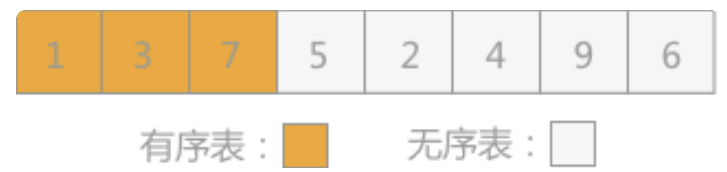
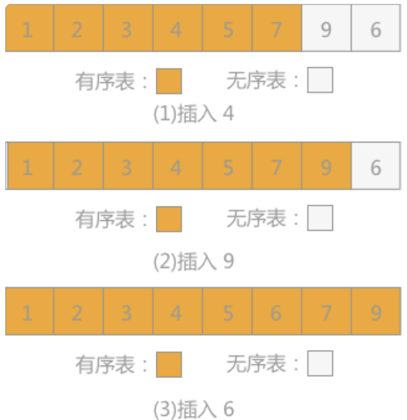

# 插入排序
<span style="color:red">插入排序算法</span>是所有排序方法中最简单的一种算法，其主要的实现思想是将数据按照一定的顺序一个一个的插入到有序的表中，最终得到的序列就是已经排序好的数据。

| ##container## |
|:--:|
||

## 1. 直接插入排序
<span style="color:red">直接插入排序</span>是插入排序算法中的一种，采用的方法是：在添加新的记录时，使用顺序查找的方式找到其要插入的位置，然后将新记录插入。

**直接插入排序(Straight Insertion Sort)** 的基本思想是:
- 把n个待排序的元素看成为一个有序表和一个无序表。
- 开始时有序表中只包含1个元素，无序表中包含有n-1个元素，排序过程中每次从无序表中取出第一个元素，将它插入到有序表中的适当位置，使之成为新的有序表，重复n-1次可完成排序过程。

> 插入排序算法还包括折半插入排序、2-路插入排序和希尔排序等

例如采用直接插入排序算法将无序表{3,1,7,5,2,4,9,6}进行升序排序的过程为：
- 首先考虑记录3，由于插入排序刚开始，有序表中没有任何记录，所以3 可以直接添加到有序表中，则有序表和无序表可以如图1所示：

| ##container## |
|:--:|


- 向有序表中插入记录1时，同有序表中记录 3 进行比较，1<3，所以插入到记录 3 的左侧，如图所示：

| ##container## |
|:--:|


- 向有序表插入记录7时，同有序表中记录3 进行比较，3<7，所以插入到记录 3 的右侧，如图所示：

| ##container## |
|:--:|


- 向有序表插入记录 2 时，同有序表中记录 7进行比较，2<7，再同 5，3，1分别进行比较，最终确定 2 位于1和 3 中间，如图所示：

| ##container## |
|:--:|


- 照此规律，依次将无序表中的记录 4，9 和 6插入到有序表中，如图所示:

| ##container## |
|:--:|


直接插入排序：将待排序的数组，分成两个序列，前面的序列保持有序，依次选择后面的元素，往前面插入。(就地排序、稳定排序)

在STL中，当排序元素数量小于某个阈值（通常是16或者8）时，`sort()`函数会使用插入排序而不是快速排序。这是因为插入排序的常数项比较小，对于小规模数据，插入排序更加高效。

## 2. 折半插入排序
上述算法在查找插入位置时，采用的是顺序查找的方式，而在查找表中数据本身有序的前提下，可以使用折半查找来代替顺序查找，这种排序的算法就是折半插入排序算法。

- 但是交换的时候(将牌往后移)还是 $O(n)$, 所以治标不治本.

## 3. 2-路插入排序
<span style="color:red">2-路插入排序算法</span>是在折半插入排序的基础上对其进行改进，减少其在排序过程中移动记录的次数从而提高效率。

具体实现思路为：另外设置一个同存储记录的数组大小相同的数组d，将无序表中第一个记录添加进 d[O]的位置上，然后从无序表中第二个记录开始，同 d[O] 作比较：如果该值比 d[0]大，则添加到其右侧；反之添加到其左侧。

> 在这里的数组d可以理解成一个环状数组。

| ##container## |
|:--:|
|<br>
|

## 3. 希尔排序
<span style="color:red">希尔排序</span>，又称“缩小增量排序”，也是插入排序的一种，但是同前面几种排序算法比较来看，希尔排序在时间效率上有很大的改进。

在使用直接插入排序算法时，如果表中的记录只有个别的是无序的，多数保持有序，这种情况下算法的效率也会比较高；除此之外，如果需要排序的记录总量很少，该算法的效率同样会很高。希尔排序就是从这两点出发对算法进行改进得到的排序算法。

> 希尔排序的具体实现思路是：先将整个记录表分割成若干部分，分别进行直接插入排序，然后再对整个记录表进行一次直接插入排序。

比如8 9 1 7 2 3 5 4 6 0 

例如无序表{49，38，65，97，76，13，27，49，55，4}进行希尔排序的过程为：

| ##container## |
|:--:|
||

希尔排序的过程中，对于分割的每个子表，其各自包含的记录在原表中并不是相互挨着的，而是相互之间相隔着某个固定的常数。例如上例中第一次排序时子表中的记录分割的常量为 5，第二次排序时为 3。

通过此种方式，对于关键字的值较小的记录，其前移的过程不是一步一步的，而是跳跃性的前移，并且在最后一次对整表进行插入排序时减少了比较和排序的次数。

# 代码实现
## 直接插入排序

```C
#include <stdio.h>
#include <time.h>
#include <stdlib.h>
#include <string.h>

typedef struct _Data
{
    int id;     // 唯一id
    void *data; // 内容
} Data;

typedef struct
{
    Data *arr;
    int len;
} Pending;      // 表头

Pending *getDisorderPendingList(int n, int min, int max); // 生成长度为n的无序数组

void insertSortDirectly(Pending *P);    // 直接插入排序

void putPending(const Pending *P);      // 打印内容

/**
 * @brief 生成长度为n的无序数组, 其值在[min, max)内
 * @param n 生成数组的长度
 * @param min 随机数的最小值(包含)
 * @param max 随机数的最大值(不包含)
 * @return <Pending*> 一个表头
 * */
Pending *getDisorderPendingList(int n, int min, int max)
{
    Pending *res = (Pending *)malloc(sizeof(Pending));
    if (!res)
    {
        ERROR:
        printf("malloc error!\n");
        return NULL;
    }

    res->arr = (Data *)malloc(sizeof(Data) * n);
    if (!res->arr)
        goto ERROR;
    res->len = n;

    for (int i = 0; i < n; ++i)
    {
        // 1 - 100
        res->arr[i].id = (rand() % (max - min)) + min;
    }

    return res;
}

void putPending(const Pending *P)
{
    printf("[info]: ");
    for (int i = 0; i < P->len; ++i)
    {
        printf("%d ", P->arr[i].id);
    }
    putchar('\n');
}

/**
 * @brief 直接插入排序
 * @param P 表头
 * @return 无
 * */
void insertSortDirectly(Pending *P)
{
    // 假设索引0的内容已经是有序的
    for (int i = 1; i < P->len; ++i)
    {
        // 在无序内容的最前面, 拿起一张牌 i
        // 显然此时 i - 1的内容必定是有序的, 因为插入之后有序内容长度会变, 需要移位
        // 故可以像是拿着i, 然后依次对i - 1, i - 2, ..., j匹对, (j >= 0)
        // 如果 [i] < [j] 那么需要交换他们, 给[i]腾出位置, 然后继续匹对
        // 如果 [i] >= [j] || j == -1, 那么就brack;
        for (int j = i - 1, k = i; j >= 0 && P->arr[k].id < P->arr[j].id; --j)
        {
            // 交换, 不只是数值, 还有内容
            Data tmp = P->arr[k];
            memcpy(&P->arr[k], &P->arr[j], sizeof(Data));
            memcpy(&P->arr[j], &tmp, sizeof(Data));
            k = j;  // 值得注意的是, 交换后这个k的匹对元素位置就变了
        }
    }
}

int main(void)
{
    //  - 排序 - 插入排序 - 直接插入排序
    srand((unsigned)time(NULL));
    Pending *P = getDisorderPendingList(8, 0, 100);

    putPending(P);

    insertSortDirectly(P);

    putPending(P);
    getchar();
    return 0;
}
```

## 2-路插入排序

```C
#include <stdio.h>
#include <stdlib.h>

void insert(int arr[], int temp[], int n)
{
    int i, first, final, k;
    first = final = 0; //分别记录temp数组中最大值和最小值的位置
    temp[0] = arr[0];
    for (i = 1; i < n; i++)
    {
        // 待插入元素比最小的元素小
        if (arr[i] < temp[first])
        {
            first = (first - 1 + n) % n;
            temp[first] = arr[i];
        }
        // 待插入元素比最大元素大
        else if (arr[i] > temp[final])
        {
            final = (final + 1 + n) % n;
            temp[final] = arr[i];
        }
        // 插入元素比最小大，比最大小
        else
        {
            k = (final + 1 + n) % n;
            //当插入值比当前值小时，需要移动当前值的位置
            while (temp[((k - 1) + n) % n] > arr[i])
            {
                temp[(k + n) % n] = temp[(k - 1 + n) % n];
                k = (k - 1 + n) % n;
            }
            //插入该值
            temp[(k + n) % n] = arr[i];
            //因为最大值的位置改变，所以需要实时更新final的位置
            final = (final + 1 + n) % n;
        }
    }
    // 将排序记录复制到原来的顺序表里
    for (k = 0; k < n; k++)
    {
        arr[k] = temp[(first + k) % n];
    }
}

int main()
{
    int a[8] = {3, 1, 7, 5, 2, 4, 9, 6};
    int temp[8];
    insert(a, temp, 8);
    for (int i = 0; i < 8; i++)
    {
        printf("%d ", a[i]);
    }
    getchar();
    return 0;
}
```

## 希尔排序

```C
#include <stdio.h>
#include <stdlib.h>
#include <time.h>
#include <string.h>

typedef struct _Data
{
    int id;     // 唯一id
    void *data; // 内容
} Data;

typedef struct
{
    Data *arr;
    int len;
} Pending; // 表头

Pending *getDisorderPendingList(int n, int min, int max); // 生成长度为n的无序数组
Pending *copyPendingList(Pending *P);                     // 拷贝

void ShellSort(Pending *P); // 希尔排序

void putPending(const Pending *P); // 打印内容

/**
 * @brief 生成长度为n的无序数组, 其值在[min, max)内
 * @param n 生成数组的长度
 * @param min 随机数的最小值(包含)
 * @param max 随机数的最大值(不包含)
 * @return <Pending*> 一个表头
 * */
Pending *getDisorderPendingList(int n, int min, int max)
{
    Pending *res = (Pending *)malloc(sizeof(Pending));
    if (!res)
    {
    ERROR:
        printf("malloc error!\n");
        return NULL;
    }

    res->arr = (Data *)malloc(sizeof(Data) * n);
    if (!res->arr)
        goto ERROR;
    res->len = n;

    for (int i = 0; i < n; ++i)
    {
        // 1 - 100
        res->arr[i].id = (rand() % (max - min)) + min;
    }

    return res;
}

Pending *copyPendingList(Pending *P)
{
    Pending *res = (Pending *)malloc(sizeof(Pending));
    if (!res)
    {
    ERROR:
        printf("malloc error!\n");
        return NULL;
    }

    res->arr = (Data *)malloc(sizeof(Data) * P->len);
    if (!res->arr)
        goto ERROR;
    res->len = P->len;

    for (int i = 0; i < P->len; ++i)
    {
        res->arr[i].id = P->arr[i].id;
    }

    return res;
}

void putPending(const Pending *P)
{
    printf("[info]: ");
    for (int i = 0; i < P->len; ++i)
    {
        printf("%d ", P->arr[i].id);
    }
    putchar('\n');
}

/**
 * @brief 直接插入排序
 * @param P 表头
 * @return 无
 * */
void insertSortDirectly(Pending *P)
{
    // 假设索引0的内容已经是有序的
    for (int i = 1; i < P->len; ++i)
    {
        // 在无序内容的最前面, 拿起一张牌 i
        // 显然此时 i - 1的内容必定是有序的, 因为插入之后有序内容长度会变, 需要移位
        // 故可以像是拿着i, 然后依次对i - 1, i - 2, ..., j匹对, (j >= 0)
        // 如果 [i] < [j] 那么需要交换他们, 给[i]腾出位置, 然后继续匹对
        // 如果 [i] >= [j] || j == -1, 那么就brack;
        for (int j = i - 1, k = i; j >= 0 && P->arr[k].id < P->arr[j].id; --j)
        {
            // 交换, 不只是数值, 还有内容
            Data tmp = P->arr[k];
            memcpy(&P->arr[k], &P->arr[j], sizeof(Data));
            memcpy(&P->arr[j], &tmp, sizeof(Data));
            k = j;  // 值得注意的是, 交换后这个k的匹对元素位置就变了
        }
    }
}

/**
 * @brief 希尔排序
 * @param P 表头
 * @return 无
 * */
void ShellSort(Pending *P)
{
    // 排序增量 sortIncrement
    for (int sortIncrement = P->len >> 1; sortIncrement > 0; sortIncrement >>= 1) // 缩小
    {
        for (int i = sortIncrement; i < P->len; i += sortIncrement)
        {
            for (int j = i - sortIncrement, k = i; j >= sortIncrement && P->arr[k].id < P->arr[j].id; j -= sortIncrement)
            {
                // 交换, 不只是数值, 还有内容
                Data tmp = P->arr[k];
                memcpy(&P->arr[k], &P->arr[j], sizeof(Data));
                memcpy(&P->arr[j], &tmp, sizeof(Data));
                k = j; // 值得注意的是, 交换后这个k的匹对元素位置就变了
            }
        }
    }

    // 时间复杂度约为: O(N^1.5) ?
}


int main(void)
{
    //  - 插入排序 - 希尔排序
    srand((unsigned)time(NULL));
    Pending *P = getDisorderPendingList(100000, 0, 2147483647);

    Pending *P_2 = copyPendingList(P);
    // putPending(P);
    // putPending(P_2);
    clock_t start = clock();
    ShellSort(P);
    clock_t end = clock();
    printf("%s cost time: %fs.\n", "希尔排序: ", (double) (end - start) / CLOCKS_PER_SEC);

    start = clock();
    insertSortDirectly(P_2);
    end = clock();
    printf("%s cost time: %fs.\n", "直接插入排序: ", (double) (end - start) / CLOCKS_PER_SEC);

    // putPending(P);
    getchar();
    return 0;
}
```
