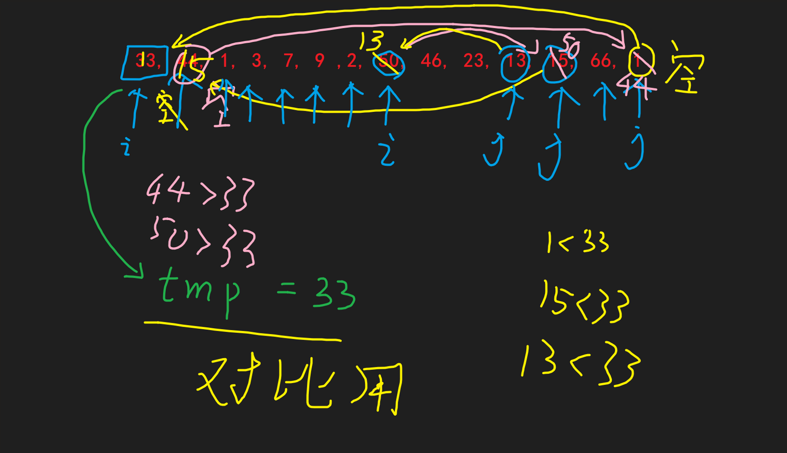
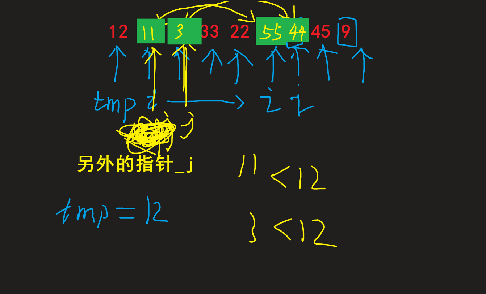

# 交换排序
## 对比: 插入排序

- 插入排序的交换是和前一个元素匹对

    i 与 i - 1

- 交换排序的匹对是和后一个元素比

    i 与 i + 1

## 1. 冒泡排序
起泡排序，别名“冒泡排序”，该算法的核心思想是将无序表中的所有记录，通过两两比较关键字，得出升序序列或者降序序列。

例如，对无序表{49，38，65，97，76，13，27，49}进行升序排序的具体实现过程如图 所示:

| ##container## |
|:--:|
|<br>|

通过一趟趟的比较，一个个的“最大值”被找到并移动到相应位置，直到检测到表中数据已经有序，或者比较次数等同于表中含有记录的个数，排序结束，这就是起泡排序。


```C
// 未经优化的版本

// 放到前面
void _bubbleSort_v1(Pending *P)
{
    for (int i = 0; i < P->len; ++i)
    {
        for (int j = i + 1; j < P->len; ++j)
        {
            if (P->arr[i].id > P->arr[j].id)
            {
                HXswap(&P->arr[i], &P->arr[j]);
            }
        }
    }
}

// 放到后面
void bubbleSort_v1(Pending *P)
{
    for (int i = 0; i < P->len - 1; ++i)
    {
        for (int j = 0; j < P->len - i - 1; ++j)
        {
            if (P->arr[j].id > P->arr[j + 1].id)
            {
                HXswap(&P->arr[j], &P->arr[j + 1]);
            }
        }
    }
}
```

### 关于冒泡的优化
基本的冒泡排序的实现方式，就是两个for循环，持续比较和交换。这种实现方式有一个明显的弊端，就是不论数组是否有序，两层for循环都要执行一遍，而我们是希望数组有序的时候，仅进行一轮判断，或者一轮都不进行（当然不判断，排序算法是不能知道数组是否有序的）。

#### 一次优化：
这里我们增加了一个标识数组是否有序，当冒泡排序过程中没有交换操作时，swapped=false，也意味着数组有序；否则数组无序继续进行冒泡排序。不要小看这个变量奥，因为有这个变量，当数组有序的时候，冒泡排序的时间复杂度将降至 $0$ (因为其只需要执行一遍内层的for循环就可以结束冒泡排序)，没有这个变量，数组有序仍需要 $O(n^2)$ 的时间复杂度。

```C
void _bubbleSort_v2(Pending *P)
{
    for (int i = 0; i < P->len; ++i)
    {
        _Bool flag = 1; // 假设已经有序

        for (int j = i + 1; j < P->len; ++j)
        {
            if (P->arr[i].id > P->arr[j].id)
            {
                HXswap(&P->arr[i], &P->arr[j]);
                flag = 0;   // 仍然无序
            }
        }

        if (flag)
            break;      // 有序就跳出了
    }
}

void bubbleSort_v2(Pending *P)
{
    for (int i = 0; i < P->len - 1; ++i)
    {
        _Bool flag = 1; // 假设已经有序
        for (int j = 0; j < P->len - i - 1; ++j)
        {
            if (P->arr[j].id > P->arr[j + 1].id)
            {
                HXswap(&P->arr[j], &P->arr[j + 1]);
                flag = 0;
            }
        }

        if (flag)
            break;
    }
}
```

#### 二次优化：
是否能够确定出已经有序部分和无序部分的边界呢？

```C
void bubbleSort_v3(Pending *P)
{
    // 确定有序和无序的边界
    // 就是交换不一定一直交换, 如果后面已经有序了呢? 就不用遍历到后面判断了
    int new_boundary = 0;
    int n = P->len;
    do
    {
        new_boundary = 0;
        for (int i = 0; i < n - 1; ++i)
        {
            if (P->arr[i].id > P->arr[i + 1].id)
            {
                HXswap(&P->arr[i], &P->arr[i + 1]);
                new_boundary = i + 1;   
                        // 为什么是 i + 1, 因为 i 和 i + 1 交换了, 而如果后面没有交换了
                        // 只能说明 [i + 1, n] 是有序的, 至少 i - 1 与 i 的关系是未知的
                        // 再说, i + 1才是实际交换的边界, i 在 i + 1 内呢
            }
        }

        n = new_boundary;
    } while (new_boundary);
    // 这种已经把V2包含在内了
}
```

## 2. 快速排序
快速排序算法是在起泡排序的基础上进行改进的一种算法，其实现的基本思想是：通过一次排序将整个无序表分成相互独立的两部分，其中一部分中的数据都比另一部分中包含的数据的值小，然后继续沿用此方法分别对两部分进行同样的操作，直到每一个小部分不可再分，所得到的整个序列就成为了有序序列。

简而述之: <b style="color:red">选择一个元素, 使得左边的元素永远比它小, 右边的元素永远比它大</b>

### 双边循环法

| ##container## |
|:--:|
|任选一个数作为基准(为了编程方便可以选择第一个数(`tmp = 33`)), 选择后该位置视作空位, <br><br>对于空位: 我们的`i`或`j`指针遇到空位就要停下来, 等待补齐方可继续移动|
||
|就比如下图: 原`i`处是空位, 则动`j`指针, 先匹对`arr[j]`和`tmp`的大小关系, 发现`j`位置元素小于`tmp`, 故交换到`i`的空位处, 此时`j`位置变为空位, 并且`i`指针需要向前移动一位(因为这个位置已经保证是符合条件(小于`tmp`)的了)|
||
|往下就是同上了|
|<br><br><br><br><br>|
|当`i == j`时, 代表匹对结束, 此时`ij`的位置还是空位, 现在只需要把`tmp`赋值到`ij`位置处即可, 至此一轮结束: 保证`ij`左边元素 <=(<) `tmp` <(<=) `ij`右边元素|
||

需要注意的就是 大于小于取等的边界问题<sup>[1]请见下面代码注释</sup>

```C
#include <stdio.h>
#include <stdlib.h>
#include <time.h>
#include <string.h>

typedef struct _Data
{
    int id;     // 唯一id
    void *data; // 内容
} Data;

typedef struct
{
    Data *arr;
    int len;
} Pending; // 表头

Pending *getDisorderPendingList(int n, int min, int max); // 生成长度为n的无序数组
Pending *copyPendingList(Pending *P);                     // 拷贝
void putPending(const Pending *P);                        // 打印内容
void HXswap(Data *a, Data *b);                            // 交换

/**
 * @brief 生成长度为n的无序数组, 其值在[min, max)内
 * @param n 生成数组的长度
 * @param min 随机数的最小值(包含)
 * @param max 随机数的最大值(不包含)
 * @return <Pending*> 一个表头
 * */
Pending *getDisorderPendingList(int n, int min, int max)
{
    Pending *res = (Pending *)malloc(sizeof(Pending));
    if (!res)
    {
    ERROR:
        printf("malloc error!\n");
        return NULL;
    }

    res->arr = (Data *)malloc(sizeof(Data) * n);
    if (!res->arr)
        goto ERROR;
    res->len = n;

    for (int i = 0; i < n; ++i)
    {
        // 1 - 100
        res->arr[i].id = (rand() % (max - min)) + min;
    }

    return res;
}

Pending *copyPendingList(Pending *P)
{
    Pending *res = (Pending *)malloc(sizeof(Pending));
    if (!res)
    {
    ERROR:
        printf("malloc error!\n");
        return NULL;
    }

    res->arr = (Data *)malloc(sizeof(Data) * P->len);
    if (!res->arr)
        goto ERROR;
    res->len = P->len;

    for (int i = 0; i < P->len; ++i)
    {
        res->arr[i].id = P->arr[i].id;
    }

    return res;
}

void putPending(const Pending *P)
{
    printf("[info]: ");
    for (int i = 0; i < P->len; ++i)
    {
        printf("%d ", P->arr[i].id);
    }
    putchar('\n');
}

void HXswap(Data *a, Data *b)
{
    // a b --> b a
    Data tmp = *a;
    memcpy(a, b, sizeof(Data));
    memcpy(b, &tmp, sizeof(Data));
}

void quickSort(Pending *P); // 快速排序

static void _quickSort(Pending *P, int l, int r)// 快速排序子递归
{
    if (l >= r) // 不要忘记退出条件
        return;

    Data tmp = P->arr[l];       // 随机选择一个作为基准
    int i = l;
    int j = r;
    _Bool firing = 0;           // 为 1 则 1 走, 为 0 则 j 走
    while (i != j)
    {
        if (firing)
        {
            if (P->arr[i].id > tmp.id) // [1] 我是上面, 看下面的[1]
            {
                HXswap(&P->arr[i], &P->arr[j]);
                --j;
                firing = !firing;
            }
            else
                ++i;
        }
        else
        {
            if (P->arr[j].id <= tmp.id) // [1] 边界指的是这里的和上面的等号
            {
                HXswap(&P->arr[i], &P->arr[j]);
                ++i;
                firing = !firing;
            }
            else
                --j;
        }
    }
    
    P->arr[j] = tmp;
    // 继续排序
    // 值得注意的是, 现在 tmp 位置的左边一定比 tmp小, tmp 右边一定比 tmp大, 所以tmp的位置已经确定了
    // 所以 需要 j - 1 与 j + 1
    _quickSort(P, l, j - 1);
    _quickSort(P, j + 1, r);
}

void quickSort(Pending *P)
{
    _quickSort(P, 0, P->len - 1);
}

int main(void)
{
    //  - 交换排序 - 快速排序 - 双边循环法
    srand((unsigned)time(NULL));
    Pending *P = getDisorderPendingList(10, 0, 100);

    putPending(P);

    quickSort(P);

    putPending(P);
    getchar();
    return 0;
}
```

### 单边循环法
| ##container## |
|:--:|
|选择一个基准数`tmp`(比如12), 现在需要使得`tmp`满足之前说讲的大小关系; 然后从`i`开始匹对|
||
|发现比`tmp`小的, 则和`++j`后 `j`(一开始初始化`j`于`tmp`位置) 的位置进行交换, 同时 (比如下2图)|
|<br>|
|对于为什么可以进行这样交换, 以及这样交换的好处:<br>1. 为什么: 因为原本不动的元素就满足 其大于`tmp`, 故交换后仍满足大于`tmp`这个条件(因为`j`永远指向大于`tmp`区间元素第一个元素)<br>2. 好处: 可以避免频繁移动`tmp`的位置 来确保时刻满足条件情况的时间浪费, 取而代之的是待所有结果出来后再进行`tmp`和`j`位置进行交换(如最后两图)|
|<br><br><br><br>|

```C
#include <stdio.h>
#include <stdlib.h>
#include <time.h>
#include <string.h>

typedef struct _Data
{
    int id;     // 唯一id
    void *data; // 内容
} Data;

typedef struct
{
    Data *arr;
    int len;
} Pending; // 表头

Pending *getDisorderPendingList(int n, int min, int max); // 生成长度为n的无序数组
Pending *copyPendingList(Pending *P);                     // 拷贝
void putPending(const Pending *P);                        // 打印内容
void HXswap(Data *a, Data *b);                            // 交换

/**
 * @brief 生成长度为n的无序数组, 其值在[min, max)内
 * @param n 生成数组的长度
 * @param min 随机数的最小值(包含)
 * @param max 随机数的最大值(不包含)
 * @return <Pending*> 一个表头
 * */
Pending *getDisorderPendingList(int n, int min, int max)
{
    Pending *res = (Pending *)malloc(sizeof(Pending));
    if (!res)
    {
    ERROR:
        printf("malloc error!\n");
        return NULL;
    }

    res->arr = (Data *)malloc(sizeof(Data) * n);
    if (!res->arr)
        goto ERROR;
    res->len = n;

    for (int i = 0; i < n; ++i)
    {
        // 1 - 100
        res->arr[i].id = (rand() % (max - min)) + min;
    }

    return res;
}

Pending *copyPendingList(Pending *P)
{
    Pending *res = (Pending *)malloc(sizeof(Pending));
    if (!res)
    {
    ERROR:
        printf("malloc error!\n");
        return NULL;
    }

    res->arr = (Data *)malloc(sizeof(Data) * P->len);
    if (!res->arr)
        goto ERROR;
    res->len = P->len;

    for (int i = 0; i < P->len; ++i)
    {
        res->arr[i].id = P->arr[i].id;
    }

    return res;
}

void putPending(const Pending *P)
{
    printf("[info]: ");
    for (int i = 0; i < P->len; ++i)
    {
        printf("%d ", P->arr[i].id);
    }
    putchar('\n');
}

void HXswap(Data *a, Data *b)
{
    // a b --> b a
    Data tmp = *a;
    memcpy(a, b, sizeof(Data));
    memcpy(b, &tmp, sizeof(Data));
}

void quickSort(Pending *P); // 快速排序

static void _quickSort(Pending *P, int l, int r)// 快速排序子递归
{
    if (l >= r) // 不要忘记退出条件
        return;

    Data tmp = P->arr[l];       // 随机选择一个作为基准
    int j = l;
    for (int i = l + 1; i <= r; ++i)
    {
        if (P->arr[i].id < P->arr[l].id)
        {
            ++j;
            HXswap(&P->arr[j], &P->arr[i]);
        }
    }

    HXswap(&P->arr[l], &P->arr[j]);

    // 继续排序
    // 值得注意的是, 现在 tmp 位置的左边一定比 tmp小, tmp 右边一定比 tmp大, 所以tmp的位置已经确定了
    // 所以 需要 j - 1 与 j + 1
    _quickSort(P, l, j - 1);
    _quickSort(P, j + 1, r);
}

void quickSort(Pending *P)
{
    _quickSort(P, 0, P->len - 1);
}

int main(void)
{
    //  - 交换排序 - 快速排序 - 单边循环法
    srand((unsigned)time(NULL));
    Pending *P = getDisorderPendingList(8, 0, 100);

    putPending(P);

    quickSort(P);

    putPending(P);
    getchar();
    return 0;
}
```