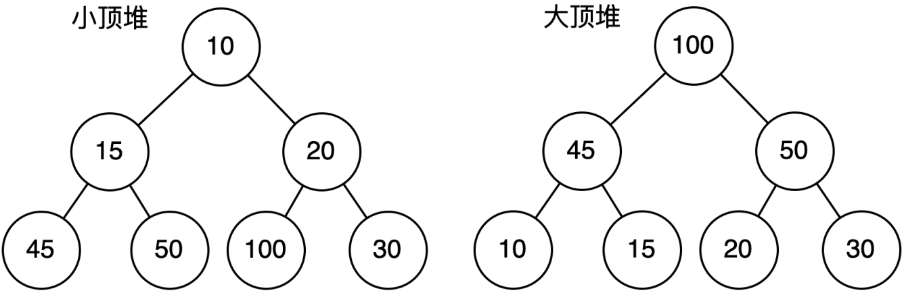

# 堆排序
## 1．堆的概念
**堆(Heap)** 是一类<span style="color:yellow">基于完全二叉树的特殊数据结构</span>。

通常将堆分为两种类型:
1. 大顶堆（Max Heap）:
    - 在大顶堆中，根节点的值必须大于他的孩子节点的值，对于二叉树中所有子树都满足此规律;

2. 小顶堆（Min Heap）:
    - 在小顶堆中，根节点的值必须小于他的孩子节点的值，对于二叉树中所有子树都满足此规律;

<span style="margin-left: 30px;">小顶堆就是以任意一个结点作为根，其左右孩子都要大于等于该节点的值，所以整颗树的根结点一定是树中值最小的节点，而大顶堆正好特性相反。

| ##container## |
|:--:|
||

## 2. 二叉堆
### 2.1 二叉堆的属性
二叉堆是满足下面属性的一颗二叉树：
1. 二叉堆必定是一颗完全二叉树。二叉堆的此属性也决定了他们适合存储在数组当中。
2. 二叉堆要么是小顶堆，要么是大顶堆。
   - 小顶二叉堆中的根结点的值是整棵树中的最小值，而且二叉树中的所有顶点及其子树均满足这一特性。
   - 大顶堆与小顶堆类似，大顶堆的根节点的值是整棵树中的最大值，而且二叉树中所有结点的值也均大于等于其子树结点。

*由于小顶堆和大顶堆除了在顶点的大小关系上不一致，两者均是一颗全完二叉树，下面的所有讲解，都以小顶堆为例进行说明，会了小顶堆，大顶堆你自己都能写出来。*

### 2.2 二叉堆的存储
可以申请 $n+1$ 个空间，从 $1$ 索引开始存储，满足 $[\frac{i}{2}, i, 2i, 2i+1]$ 的父、自己、左孩、右孩的索引关系。

## 3.小顶堆的常见操作
### 3.1初始化小顶堆
初始化顺序表，以 $n+1$ 个数进行初始化

### 3.2 插入节点
当二叉堆插入节点时，插入位置是完全二叉树的最后一个位置。然后开始上移操作

### 3.3 获取/移除最小元素
二叉堆删除节点的过程和插入节点的过程正好相反，所删除的是处于堆顶的节点。

这时，为了继续维持完全二叉树的结构，我们把堆的最后一个节点临时补到原本堆顶的位置。

### 代码

如果C++的话, 可以使用STL的 优先级队列`priority_queue` 或者 原生(指`#include <algorithm>`后对存储在数组或vector中的元素进行堆操作的函数)的`heap`

```C
#include <stdio.h>
#include <stdlib.h>
#include <time.h>
#include <string.h>

typedef int Element;

// 小根堆结构体 注意索引从1开始
typedef struct {
    int *data;  // 数据
    int size;   // 最大长度 
    int len;    // 当前长度
} BinaryHeap;

BinaryHeap *createHeap(int n);                  // 开辟一个大小为n的堆
void heapInsert(BinaryHeap *heap, Element e);   // 往堆中插入一个元素
Element getHeapTop(BinaryHeap *heap);           // 获取堆顶元素
void delHeapTop(BinaryHeap *heap);              // 删除堆顶元素
void heapPrint(BinaryHeap *heap);               // 打印

BinaryHeap *createHeap(int n) {
    BinaryHeap *heap = (BinaryHeap *)malloc(sizeof(BinaryHeap));
    heap->data = (int *)malloc(sizeof(int) * (n + 1));
    if (!heap->data) {
        printf("malloc failed\n");
        return NULL;
    }

    heap->size = n;
    heap->len = 0;
    return heap;
}

void swapFun(int *a, int *b) {
    *a ^= *b;
    *b ^= *a;
    *a ^= *b;
}

void heapInsert(BinaryHeap *heap, Element e) {
    // 插入: 插入到尾部, 然后上浮
    // [i/2, i, 2i, 2i + 1]
    if (heap->len == heap->size)
        return;

    heap->data[++heap->len] = e;
    int i = heap->len;
    while (i && heap->data[i] < heap->data[i >> 1]) {
        swapFun(&heap->data[i], &heap->data[i >> 1]);
        i >>= 1;
    }
}

Element getHeapTop(BinaryHeap *heap) {
    return heap->data[1];
}

void delHeapTop(BinaryHeap *heap) {
    // 取堆顶, 与堆尾交换
    int j = 1;
    swapFun(&heap->data[j], &heap->data[heap->len]);
    --heap->len; // 更新长度(保证不会访问到它)

    // 进行下沉: 与更小的子结点进行交换 (如果与次小的交换 那不 还是不满足堆?! 笨~)
    // 此处主要是要讨论是否有右结点(防止越界才写怎么多if的)
    int k = j << 1; 
    while (k <= heap->len) {
        if (k + 1 <= heap->len) {
            if (heap->data[k] < heap->data[k + 1]) {
                if (heap->data[j] > heap->data[j << 1]) {
                    swapFun(&heap->data[j], &heap->data[k]);
                    j <<= 1;
                } else
                    break;
            } else {
                if (heap->data[j] > heap->data[k + 1]) {
                    swapFun(&heap->data[j], &heap->data[k + 1]);
                    j = k + 1;
                } else
                    break;
            }
        } else {
            if (heap->data[j] > heap->data[k]) {
                swapFun(&heap->data[j], &heap->data[k]);
                j <<= 1;
            } else
                break;
        }

        k = j << 1;
    }
}

/** 输出
 * 1. 将堆顶元素和堆尾元素交换。
 * 2. 将堆的大小减一（len--），即排除了已经取出的堆顶元素。
 * 3. 对新的堆顶元素进行下沉操作，使其找到正确的位置。
 * 4. 重复步骤 1-3，直到堆的大小为 1，即所有元素都已经取出并放入有序的输出序列中。
 */
void heapPrint(BinaryHeap *heap) {
    // 拷贝一份用于输出
    BinaryHeap *heapCopy = (BinaryHeap *)malloc(sizeof(BinaryHeap));
    heapCopy->data = (int *)malloc(sizeof(int) * (heap->len + 1));
    for (int i = 1; i <= heap->len; ++i) {
        heapCopy->data[i] = heap->data[i];
    }
    heapCopy->len = heapCopy->size = heap->len;

    // 进行输出
    for (int i = 1; i <= heapCopy->size; ++i) { // i 只用于计数
        printf("%d%c", getHeapTop(heapCopy), i == heapCopy->size ? '\n' : ' ');
        delHeapTop(heapCopy);
    }

    free(heapCopy->data);
    free(heapCopy);
}

int main(void) {
    // 复习写堆排序
    srand(time(NULL));
    int n = 17;
    int a = 10, b = 100;

    BinaryHeap *h = createHeap(n);

    for (int i = 0; i < n; ++i)
        heapInsert(h, (rand() % (b - a + 1)) + a);
    
    heapPrint(h);

    // free堆, 你自己写
    getchar();
    return 0;
}
```
