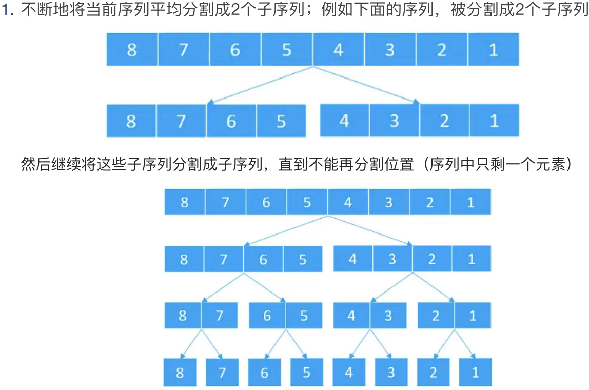
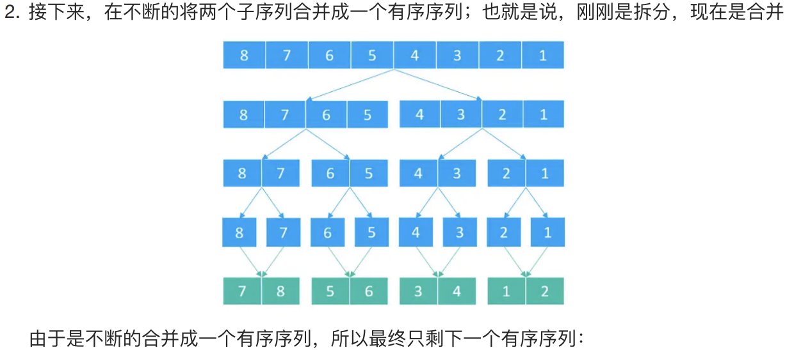
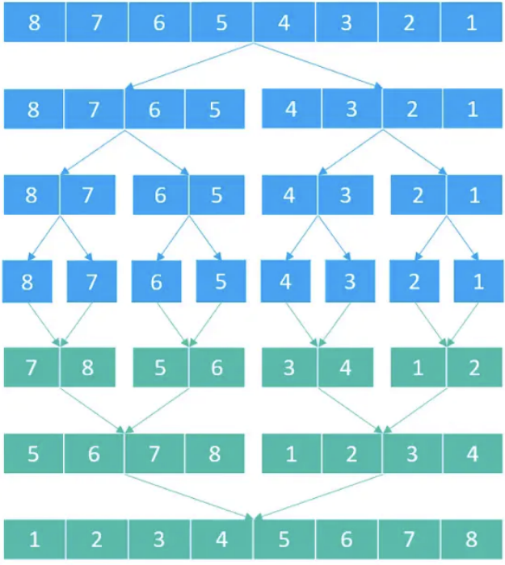
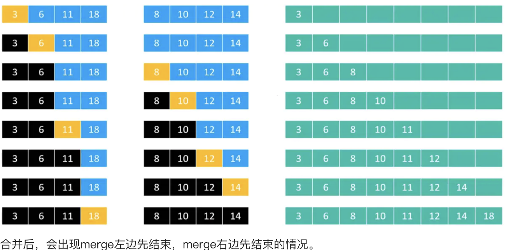

# 归并排序
## 概述
归并排序，其排序的实现思想是先将所有的记录完全分开，然后两两合并，在合并的过程中将其排好序，最终能够得到一个完整的有序表。

## 执行流程

| ##container## |
|:--:|
|<br><br>|

## 分割的过程
由于在分割时，都是将一个有序序列分割为2个两个子序列，并且该操作是重复执行的，所以肯定会使用到递归。由于是从中间进行分割，所以需要计算出中间的位置。所以实现流程是

1. 计算拆分的中间位置
2. 分别继续对左边序列和右边序列进行拆分

## 合并的过程
在`merge`时，肯定会得到2个有序的数组。所以要做的事情就是将这两个有序的数组合并为一个有序的数组。现有两个有序的数组，然后根据这两个有序的数组合并为一个。

现在要将这两个有序序列合并为一个更大的有序序列，所以可以先比较两个序列的头元素，谁的值比较小，就先放入大序列中，利用两个索引，分别记录两个序列中待比较值的下标。然后将值小的序列下标右移一个单位，继续比较。最终将两个有序数组合并为一个的流程图如下：

| ##container## |
|:--:|
||

## 代码实现

注意: 不一定长度是 (len & 1 == 0)(偶数)

```C
#include <stdio.h>
#include <stdlib.h>
#include <time.h>

typedef int Element;

typedef struct 
{
    Element *arr;
    int len;
} List;

List *initList(int n, int min, int max);

// 归并排序
void mergeSort(List *L);

List *initList(int n, int min, int max)
{
    List *res = (List *)malloc(sizeof(List));
    if (!res)
    {
    ERROR:
        printf("malloc error!\n");
        return NULL;
    }

    res->arr = (Element *)malloc(sizeof(Element) * n);
    if (!res->arr)
        goto ERROR;
    res->len = n;

    for (int i = 0; i < n; ++i)
    {
        // 1 - 100
        res->arr[i] = (rand() % (max - min)) + min;
    }

    return res;
}

static void _putdemo(Element *arr, int l, int r)
{
    printf("[info]: ");
    for (int i = l; i <= r; ++i)
        printf("%d ", arr[i]);
    putchar('\n');
}

// l, r都是有效索引
static void _mergeSort(Element *arr, int l, int r)
{
    // int ll = l, rr = r;
    if (l == r)
        return;

    // _putdemo(arr, l, r);

    // 二分
    _mergeSort(arr, l, (r - l) / 2 + l);

    _mergeSort(arr, (r - l) / 2 + l + 1, r);

    // 对比交换
    int len_l = ((r - l) / 2) + 1;
    int len_r = len_l - ((r - l + 1) % 2);
    // 拷贝一次
    Element *arr_l = (Element *)malloc(sizeof(Element) * len_l);    // ((r - l) / 2) + 1 是真正的长度
    Element *arr_r = (Element *)malloc(sizeof(Element) * len_r);
    for (int i = 0; i < len_l; ++i)
    {
        arr_l[i] = arr[l + i];
    }

    for (int i = 0; i < len_r; ++i)
    {
        arr_r[i] = arr[(r - l) / 2 + l + 1 + i];
    }

    int i = 0;
    int j = 0;
    while (i < len_l && j < len_r)
    {
        if (arr_l[i] < arr_r[j])
        {
            arr[l++] = arr_l[i++];
        }
        else
        {
            arr[l++] = arr_r[j++];
        }
    }

    // dsb, 是会出现左边或者右边先结束的情况, 说白了就是都要判断!!!
    while (l <= r)
    {
        arr[l++] = i < len_l ? arr_l[i++] : arr_r[j++];
    }

    // _putdemo(arr, ll, rr);
}

void mergeSort(List *L)
{
    _mergeSort(L->arr, 0, L->len - 1);
}

int main(void)
{
    //  - 归并排序
    srand((unsigned)time(NULL));
    List *L = initList(13, 0, 100);
    for (int i = 0; i < L->len; ++i)
    {
        L->arr[i] = L->len - i;
        printf("%d ", L->arr[i]);
    }
    putchar('\n');

    mergeSort(L);

    for (int i = 0; i < L->len; ++i)
    {
        printf("%d ", L->arr[i]);
    }

    getchar();
    return 0;    
}
```
